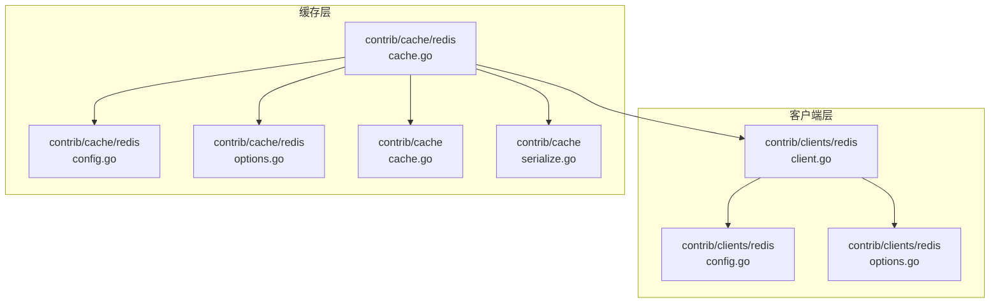
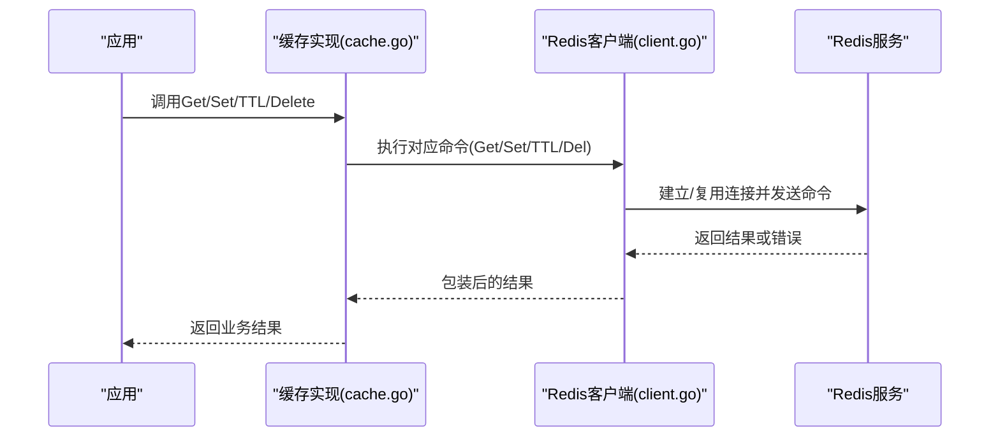
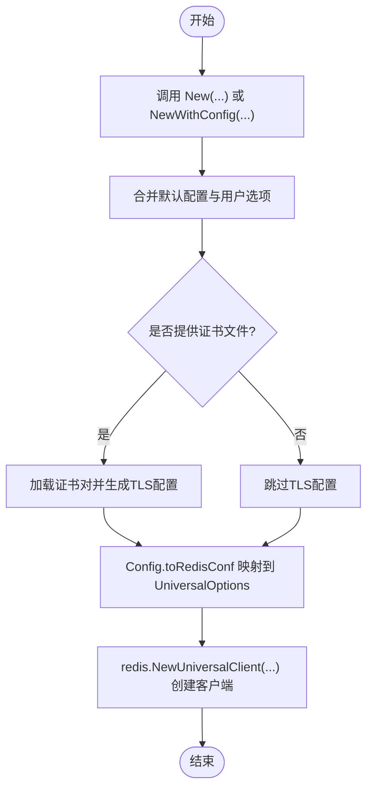
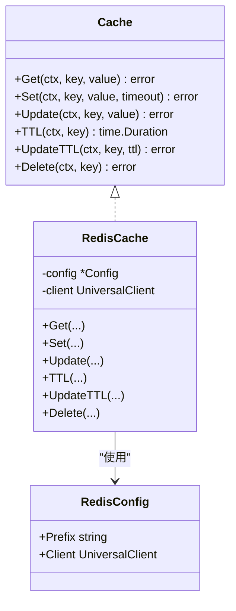
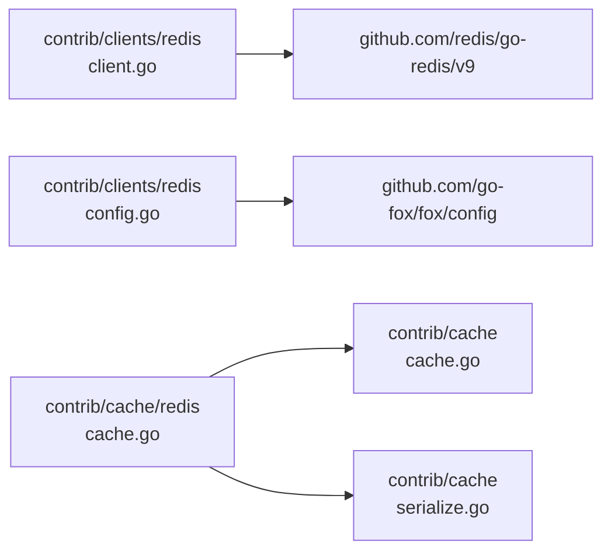

# Redis客户端集成

<cite>
**本文引用的文件**
- [contrib/clients/redis/client.go](file://contrib/clients/redis/client.go)
- [contrib/clients/redis/config.go](file://contrib/clients/redis/config.go)
- [contrib/clients/redis/options.go](file://contrib/clients/redis/options.go)
- [contrib/cache/redis/cache.go](file://contrib/cache/redis/cache.go)
- [contrib/cache/redis/config.go](file://contrib/cache/redis/config.go)
- [contrib/cache/redis/options.go](file://contrib/cache/redis/options.go)
- [contrib/cache/cache.go](file://contrib/cache/cache.go)
- [contrib/cache/serialize.go](file://contrib/cache/serialize.go)
- [contrib/clients/redis/go.mod](file://contrib/clients/redis/go.mod)
- [contrib/cache/redis/cache_test.go](file://contrib/cache/redis/cache_test.go)
</cite>

## 目录
1. [简介](#简介)
2. [项目结构](#项目结构)
3. [核心组件](#核心组件)
4. [架构总览](#架构总览)
5. [详细组件分析](#详细组件分析)
6. [依赖关系分析](#依赖关系分析)
7. [性能考量](#性能考量)
8. [故障排查指南](#故障排查指南)
9. [结论](#结论)
10. [附录：使用示例与最佳实践](#附录使用示例与最佳实践)

## 简介
本文件面向Go Fox框架中的Redis客户端集成，系统性阐述其架构设计、配置体系、连接与命令执行流程、连接池管理、性能优化策略、错误处理与故障恢复机制，并提供在单机、集群、哨兵等不同部署形态下的配置要点与使用建议。该集成以第三方go-redis v9为基础，通过统一的配置对象与选项函数，屏蔽底层差异，向上提供一致的客户端与缓存抽象。

## 项目结构
Redis客户端与缓存模块位于contrib子目录中，采用按职责分层的设计：
- 客户端层：提供通用Redis客户端封装，支持单机、集群、哨兵模式
- 缓存层：基于Redis客户端实现统一的缓存接口，提供键空间前缀、序列化等能力
- 配置与选项：集中定义配置项与可组合的选项函数，便于灵活装配

图表来源
- [contrib/clients/redis/client.go](file://contrib/clients/redis/client.go#L32-L60)
- [contrib/clients/redis/config.go](file://contrib/clients/redis/config.go#L37-L94)
- [contrib/clients/redis/options.go](file://contrib/clients/redis/options.go#L37-L38)
- [contrib/cache/redis/cache.go](file://contrib/cache/redis/cache.go#L38-L66)
- [contrib/cache/redis/config.go](file://contrib/cache/redis/config.go#L33-L42)
- [contrib/cache/redis/options.go](file://contrib/cache/redis/options.go#L28-L43)
- [contrib/cache/cache.go](file://contrib/cache/cache.go#L39-L47)
- [contrib/cache/serialize.go](file://contrib/cache/serialize.go#L44-L47)

章节来源
- [contrib/clients/redis/client.go](file://contrib/clients/redis/client.go#L32-L60)
- [contrib/clients/redis/config.go](file://contrib/clients/redis/config.go#L37-L94)
- [contrib/clients/redis/options.go](file://contrib/clients/redis/options.go#L37-L38)
- [contrib/cache/redis/cache.go](file://contrib/cache/redis/cache.go#L38-L66)
- [contrib/cache/redis/config.go](file://contrib/cache/redis/config.go#L33-L42)
- [contrib/cache/redis/options.go](file://contrib/cache/redis/options.go#L28-L43)
- [contrib/cache/cache.go](file://contrib/cache/cache.go#L39-L47)
- [contrib/cache/serialize.go](file://contrib/cache/serialize.go#L44-L47)

## 核心组件
- 客户端类型别名：对外暴露统一的客户端接口，内部委托给go-redis的UniversalClient
- 配置对象：集中承载连接地址、认证、超时、连接池、TLS、集群/哨兵等参数
- 选项函数：以函数式参数方式对配置进行增量修改，支持链式调用
- 缓存实现：基于Redis客户端实现统一缓存接口，内置键前缀与默认JSON序列化

章节来源
- [contrib/clients/redis/client.go](file://contrib/clients/redis/client.go#L32-L33)
- [contrib/clients/redis/config.go](file://contrib/clients/redis/config.go#L37-L94)
- [contrib/clients/redis/options.go](file://contrib/clients/redis/options.go#L37-L38)
- [contrib/cache/redis/cache.go](file://contrib/cache/redis/cache.go#L38-L66)

## 架构总览
下图展示从应用到Redis的典型调用路径：应用通过缓存接口访问，缓存实现委托Redis客户端执行命令；客户端根据配置选择单机、集群或哨兵模式，并通过连接池复用TCP连接。

图表来源
- [contrib/cache/redis/cache.go](file://contrib/cache/redis/cache.go#L68-L110)
- [contrib/clients/redis/client.go](file://contrib/clients/redis/client.go#L36-L42)

## 详细组件分析

### 客户端创建与配置
- 客户端创建
  - New：接收可变选项，合并默认配置后创建客户端
  - NewWithConfig：直接基于传入配置创建，必要时加载证书文件生成TLS配置
- 配置映射
  - Config.toRedisConf：将内部配置转换为go-redis的UniversalOptions，自动适配单机/集群/哨兵模式
- 选项函数
  - 提供地址、用户名/密码、协议、数据库、重试、超时、连接池、TLS、集群路由、哨兵主名等选项

图表来源
- [contrib/clients/redis/client.go](file://contrib/clients/redis/client.go#L36-L60)
- [contrib/clients/redis/config.go](file://contrib/clients/redis/config.go#L120-L179)
- [contrib/clients/redis/options.go](file://contrib/clients/redis/options.go#L40-L260)

章节来源
- [contrib/clients/redis/client.go](file://contrib/clients/redis/client.go#L36-L60)
- [contrib/clients/redis/config.go](file://contrib/clients/redis/config.go#L120-L179)
- [contrib/clients/redis/options.go](file://contrib/clients/redis/options.go#L40-L260)

### 连接池与超时控制
- 连接池参数
  - 池大小、空闲连接数、最大活跃连接、连接最大空闲时间、连接最大生命周期、FIFO模式
- 超时参数
  - 拨号超时、读取超时、写入超时、上下文超时开关
- 重试策略
  - 最大重试次数、最小/最大回退时间

这些参数直接影响连接复用效率、资源占用与网络抖动下的稳定性。

章节来源
- [contrib/clients/redis/config.go](file://contrib/clients/redis/config.go#L67-L73)
- [contrib/clients/redis/config.go](file://contrib/clients/redis/config.go#L59-L62)
- [contrib/clients/redis/config.go](file://contrib/clients/redis/config.go#L55-L57)

### 认证与TLS
- 认证
  - 支持用户名/密码与Sentinel用户名/密码
- TLS
  - 支持外部TLS配置注入与证书/密钥文件加载
  - 当提供证书文件时自动构建TLS配置

章节来源
- [contrib/clients/redis/config.go](file://contrib/clients/redis/config.go#L50-L53)
- [contrib/clients/redis/config.go](file://contrib/clients/redis/config.go#L75-L78)
- [contrib/clients/redis/client.go](file://contrib/clients/redis/client.go#L50-L58)

### 集群与哨兵模式
- 集群模式
  - 地址列表作为多节点入口，启用路由策略（按延迟/随机）
  - 支持只读转发、最大重定向次数
- 哨兵模式
  - 通过主名标识目标主节点，结合哨兵用户名/密码完成发现与切换

章节来源
- [contrib/clients/redis/config.go](file://contrib/clients/redis/config.go#L80-L85)
- [contrib/clients/redis/config.go](file://contrib/clients/redis/config.go#L87-L90)
- [contrib/clients/redis/options.go](file://contrib/clients/redis/options.go#L226-L238)
- [contrib/clients/redis/options.go](file://contrib/clients/redis/options.go#L240-L245)

### 缓存接口与实现
- 接口
  - 提供Get、Set、Update、TTL、UpdateTTL、Delete等方法
- 实现
  - 内部持有Redis客户端与配置（含键前缀）
  - 使用默认JSON序列化器进行对象编解码
  - 对不存在键返回“未找到”语义，避免上层误判

图表来源
- [contrib/cache/cache.go](file://contrib/cache/cache.go#L39-L47)
- [contrib/cache/redis/cache.go](file://contrib/cache/redis/cache.go#L38-L66)
- [contrib/cache/redis/config.go](file://contrib/cache/redis/config.go#L33-L37)

章节来源
- [contrib/cache/cache.go](file://contrib/cache/cache.go#L39-L47)
- [contrib/cache/redis/cache.go](file://contrib/cache/redis/cache.go#L38-L66)
- [contrib/cache/redis/config.go](file://contrib/cache/redis/config.go#L33-L37)

### 序列化与键前缀
- 默认序列化器
  - 使用JSON编解码，确保跨语言兼容与易读性
- 键前缀
  - 可选的命名空间前缀，避免键冲突

章节来源
- [contrib/cache/serialize.go](file://contrib/cache/serialize.go#L44-L47)
- [contrib/cache/redis/cache.go](file://contrib/cache/redis/cache.go#L157-L162)
- [contrib/cache/redis/config.go](file://contrib/cache/redis/config.go#L33-L37)

## 依赖关系分析
- 外部依赖
  - go-redis v9：提供统一客户端与命令执行能力
- 内部依赖
  - 配置模块：提供Duration类型与配置扫描能力
  - 缓存模块：提供统一接口与默认JSON编解码

图表来源
- [contrib/clients/redis/go.mod](file://contrib/clients/redis/go.mod#L6-L8)
- [contrib/clients/redis/config.go](file://contrib/clients/redis/config.go#L34-L35)
- [contrib/cache/redis/cache.go](file://contrib/cache/redis/cache.go#L31-L33)
- [contrib/cache/serialize.go](file://contrib/cache/serialize.go#L35-L36)

章节来源
- [contrib/clients/redis/go.mod](file://contrib/clients/redis/go.mod#L6-L8)
- [contrib/clients/redis/config.go](file://contrib/clients/redis/config.go#L34-L35)
- [contrib/cache/redis/cache.go](file://contrib/cache/redis/cache.go#L31-L33)
- [contrib/cache/serialize.go](file://contrib/cache/serialize.go#L35-L36)

## 性能考量
- 连接复用
  - 合理设置连接池大小与空闲连接数，避免频繁建连/断连
  - 控制连接最大空闲时间与生命周期，平衡内存占用与连接健康
- 批量与流水线
  - 将多个命令放入流水线执行，减少RTT
  - 对热点数据采用批量读写，降低网络开销
- 异步处理
  - 利用上下文超时与非阻塞I/O，避免请求堆积
- 路由与就近
  - 在集群模式下启用按延迟路由，提升跨地域访问性能
- 序列化成本
  - 对大对象优先考虑二进制序列化方案，减少CPU与带宽消耗

## 故障排查指南
- 连接断开与重连
  - 检查拨号超时与网络策略，确认TLS配置正确
  - 观察最大重试次数与回退策略，避免雪崩
- 命令失败
  - 分类处理“未找到”与业务错误，避免误判
  - 对幂等命令可安全重试，非幂等需谨慎
- 连接池耗尽
  - 提升池大小或缩短超时，定位慢查询与泄漏
- 集群/哨兵切换
  - 校验主名与哨兵地址，确保路由策略符合预期

章节来源
- [contrib/cache/redis/cache.go](file://contrib/cache/redis/cache.go#L68-L78)
- [contrib/clients/redis/config.go](file://contrib/clients/redis/config.go#L55-L57)
- [contrib/clients/redis/config.go](file://contrib/clients/redis/config.go#L59-L62)

## 结论
该Redis客户端集成为应用提供了统一、可配置且高性能的访问层：通过选项函数与配置对象，开发者可在单机、集群、哨兵等多种部署形态间无缝切换；配合连接池、重试与路由策略，满足高并发与低延迟场景；缓存实现进一步抽象了键空间与序列化细节，便于快速落地业务缓存需求。

## 附录：使用示例与最佳实践
- 单机模式
  - 设置地址与认证参数，按需开启TLS
  - 合理配置连接池与超时，观察延迟分布
- 集群模式
  - 提供多个节点地址，启用按延迟路由
  - 控制最大重定向次数，避免环路
- 哨兵模式
  - 指定主名与哨兵地址，配置哨兵认证
  - 关注主从切换期间的可用性与一致性
- 缓存使用
  - 为不同业务域设置键前缀，避免冲突
  - 对复杂对象使用默认JSON序列化，注意字段可见性
  - 对热点键设置合理TTL，避免缓存击穿

章节来源
- [contrib/cache/redis/cache_test.go](file://contrib/cache/redis/cache_test.go#L33-L67)
- [contrib/cache/redis/cache.go](file://contrib/cache/redis/cache.go#L157-L162)
- [contrib/cache/redis/config.go](file://contrib/cache/redis/config.go#L33-L37)