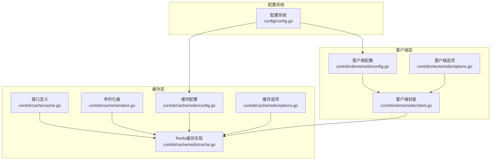
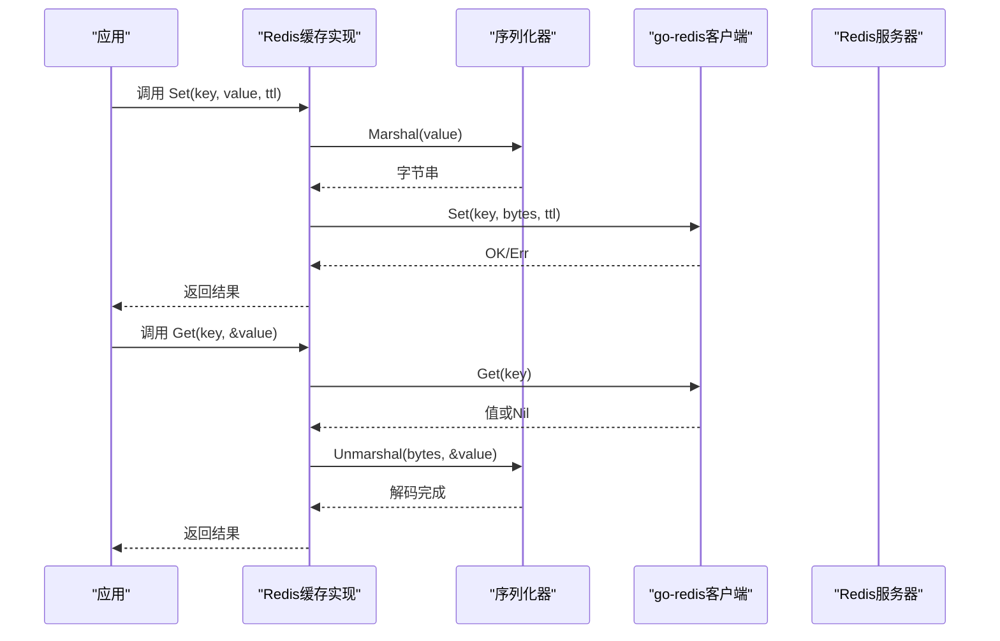
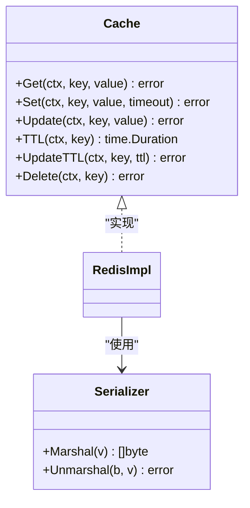
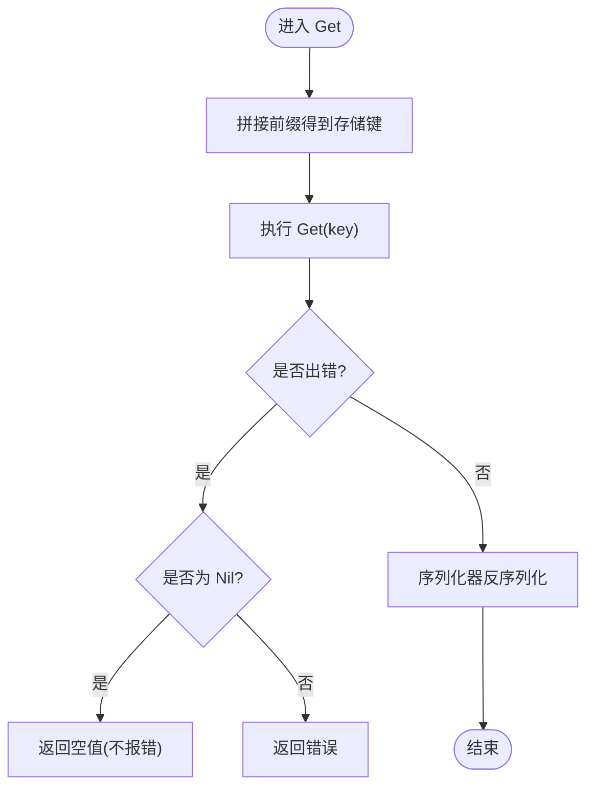
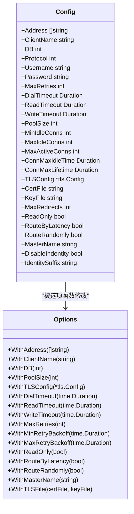
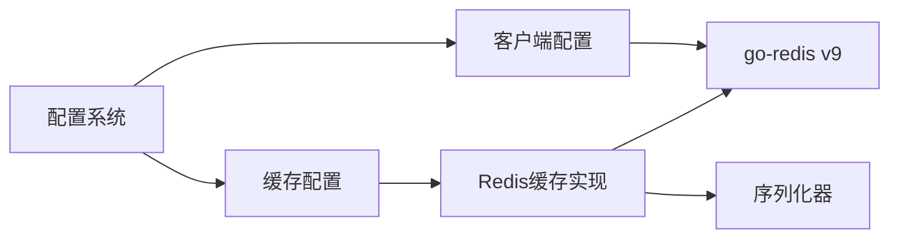

# Redis缓存实现

<cite>
**本文引用的文件**
- [contrib/cache/redis/cache.go](file://contrib/cache/redis/cache.go)
- [contrib/cache/redis/config.go](file://contrib/cache/redis/config.go)
- [contrib/cache/redis/options.go](file://contrib/cache/redis/options.go)
- [contrib/cache/cache.go](file://contrib/cache/cache.go)
- [contrib/cache/serialize.go](file://contrib/cache/serialize.go)
- [contrib/clients/redis/client.go](file://contrib/clients/redis/client.go)
- [contrib/clients/redis/config.go](file://contrib/clients/redis/config.go)
- [contrib/clients/redis/options.go](file://contrib/clients/redis/options.go)
- [contrib/cache/redis/cache_test.go](file://contrib/cache/redis/cache_test.go)
- [contrib/cache/serialize_test.go](file://contrib/cache/serialize_test.go)
- [config/config_test.go](file://config/config_test.go)
</cite>

## 目录
1. [简介](#简介)
2. [项目结构](#项目结构)
3. [核心组件](#核心组件)
4. [架构总览](#架构总览)
5. [详细组件分析](#详细组件分析)
6. [依赖关系分析](#依赖关系分析)
7. [性能考量](#性能考量)
8. [故障处理与监控](#故障处理与监控)
9. [使用示例与最佳实践](#使用示例与最佳实践)
10. [结论](#结论)

## 简介
本文件面向Go Fox框架中的Redis缓存实现，系统性梳理其连接管理、命令执行、连接池优化、配置项、性能优化策略、使用场景与最佳实践，并提供故障处理与监控建议。读者可据此高效部署与使用Redis缓存。

## 项目结构
Redis缓存相关代码主要分布在以下模块：
- 缓存接口与序列化：定义统一缓存接口、默认序列化器
- Redis缓存实现：基于go-redis v9封装的Cache实现
- Redis客户端：通用客户端封装，支持单机、哨兵、集群模式
- 配置与选项：集中式配置扫描、默认值与选项函数
- 测试：基本功能与序列化行为验证

图表来源
- [contrib/cache/cache.go](file://contrib/cache/cache.go#L39-L47)
- [contrib/cache/serialize.go](file://contrib/cache/serialize.go#L49-L47)
- [contrib/cache/redis/cache.go](file://contrib/cache/redis/cache.go#L38-L66)
- [contrib/cache/redis/config.go](file://contrib/cache/redis/config.go#L33-L47)
- [contrib/cache/redis/options.go](file://contrib/cache/redis/options.go#L28-L43)
- [contrib/clients/redis/client.go](file://contrib/clients/redis/client.go#L32-L60)
- [contrib/clients/redis/config.go](file://contrib/clients/redis/config.go#L37-L94)
- [contrib/clients/redis/options.go](file://contrib/clients/redis/options.go#L37-L261)

章节来源
- [contrib/cache/cache.go](file://contrib/cache/cache.go#L39-L47)
- [contrib/cache/redis/cache.go](file://contrib/cache/redis/cache.go#L38-L66)
- [contrib/clients/redis/client.go](file://contrib/clients/redis/client.go#L32-L60)

## 核心组件
- 缓存接口：统一的Get/Set/TTL/Update/Delete等方法，便于替换实现
- Redis缓存实现：对go-redis v9的轻量封装，负责键空间前缀、序列化/反序列化、错误处理
- 客户端封装：提供通用配置与选项，支持单机、哨兵、集群模式
- 序列化器：内置基础类型快速序列化，复杂对象走默认编解码器
- 配置系统：通过配置键扫描加载Redis配置（用户名、密码、地址、连接池等）

章节来源
- [contrib/cache/cache.go](file://contrib/cache/cache.go#L39-L47)
- [contrib/cache/redis/cache.go](file://contrib/cache/redis/cache.go#L68-L162)
- [contrib/cache/serialize.go](file://contrib/cache/serialize.go#L49-L273)
- [contrib/clients/redis/config.go](file://contrib/clients/redis/config.go#L37-L94)

## 架构总览
Redis缓存在Go Fox中采用“接口抽象 + go-redis v9客户端”的分层设计：
- 接口层：定义缓存能力边界
- 实现层：负责键空间前缀、序列化、错误映射
- 客户端层：负责连接建立、连接池、重试、超时、TLS、集群/哨兵路由等
- 配置层：集中扫描配置键，生成运行时配置

图表来源
- [contrib/cache/redis/cache.go](file://contrib/cache/redis/cache.go#L68-L87)
- [contrib/cache/serialize.go](file://contrib/cache/serialize.go#L52-L127)
- [contrib/clients/redis/client.go](file://contrib/clients/redis/client.go#L36-L60)

## 详细组件分析

### 缓存接口与序列化
- 接口定义：提供Get/Set/TTL/Update/Delete等方法，统一上层调用
- 默认序列化器：内置基础类型快速路径，复杂对象使用默认编解码器
- 错误处理：针对redis.Nil进行特殊处理，避免上抛空值错误

图表来源
- [contrib/cache/cache.go](file://contrib/cache/cache.go#L39-L47)
- [contrib/cache/serialize.go](file://contrib/cache/serialize.go#L49-L273)
- [contrib/cache/redis/cache.go](file://contrib/cache/redis/cache.go#L38-L42)

章节来源
- [contrib/cache/cache.go](file://contrib/cache/cache.go#L39-L47)
- [contrib/cache/serialize.go](file://contrib/cache/serialize.go#L49-L273)

### Redis缓存实现
- 键空间前缀：所有键均带前缀，避免命名冲突
- 命令执行：直接委托给go-redis客户端的对应方法
- TTL更新：先查询TTL再Set保持过期时间一致
- 错误处理：区分Nil与其它错误；序列化失败直接返回

图表来源
- [contrib/cache/redis/cache.go](file://contrib/cache/redis/cache.go#L68-L78)

章节来源
- [contrib/cache/redis/cache.go](file://contrib/cache/redis/cache.go#L68-L162)

### 客户端封装与配置
- 客户端类型别名：直接使用go-redis的UniversalClient
- 配置项覆盖：支持地址、用户名/密码、协议、数据库、TLS、连接池、重试、超时、只读、路由等
- 选项函数：提供WithAddress、WithClientName、WithDB、WithPoolSize、WithTLSConfig等
- 默认值：提供合理默认，如地址、客户端名、数据库、连接池大小、重试次数、超时等

图表来源
- [contrib/clients/redis/config.go](file://contrib/clients/redis/config.go#L37-L94)
- [contrib/clients/redis/options.go](file://contrib/clients/redis/options.go#L37-L261)

章节来源
- [contrib/clients/redis/config.go](file://contrib/clients/redis/config.go#L37-L203)
- [contrib/clients/redis/options.go](file://contrib/clients/redis/options.go#L37-L261)

### 缓存配置与扫描
- 缓存配置：包含键前缀与go-redis客户端实例
- 配置扫描：支持RawConfig与ScanConfig按键扫描配置
- 默认配置：提供默认值，确保未显式配置时仍可用

章节来源
- [contrib/cache/redis/config.go](file://contrib/cache/redis/config.go#L33-L65)
- [contrib/cache/redis/options.go](file://contrib/cache/redis/options.go#L28-L43)

## 依赖关系分析
- 缓存实现依赖go-redis v9客户端
- 缓存实现依赖统一序列化器
- 客户端封装依赖go-redis v9
- 配置系统用于扫描配置键并填充客户端与缓存配置

图表来源
- [contrib/cache/redis/cache.go](file://contrib/cache/redis/cache.go#L31-L41)
- [contrib/cache/serialize.go](file://contrib/cache/serialize.go#L35-L36)
- [contrib/clients/redis/config.go](file://contrib/clients/redis/config.go#L26-L32)
- [contrib/cache/redis/config.go](file://contrib/cache/redis/config.go#L26-L30)

章节来源
- [contrib/cache/redis/cache.go](file://contrib/cache/redis/cache.go#L31-L41)
- [contrib/clients/redis/config.go](file://contrib/clients/redis/config.go#L26-L32)

## 性能考量
- 连接复用与连接池
  - 合理设置PoolSize、MinIdleConns、MaxIdleConns、MaxActiveConns
  - 控制连接生命周期：ConnMaxIdleTime、ConnMaxLifetime
  - 按需启用PoolFIFO提升公平性
- 超时与重试
  - DialTimeout、ReadTimeout、WriteTimeout控制网络超时
  - MaxRetries、MinRetryBackoff、MaxRetryBackoff控制重试策略
  - ContextTimeoutEnabled影响上下文超时传播
- 集群与路由
  - 集群模式下可启用ReadOnly、MaxRedirects
  - RouteByLatency、RouteRandomly优化节点选择
- 批量与管道
  - 本实现未内置批量/管道封装，可在上层结合go-redis v9的Pipeline/Multi/Batch能力实现
- 键空间设计
  - 使用前缀隔离业务域，避免键冲突
  - 合理设置TTL，避免无限增长
- 序列化开销
  - 基础类型快速路径减少序列化成本
  - 复杂对象走默认编解码器，注意体积与CPU消耗

章节来源
- [contrib/clients/redis/config.go](file://contrib/clients/redis/config.go#L55-L73)
- [contrib/clients/redis/options.go](file://contrib/clients/redis/options.go#L118-L171)
- [contrib/cache/redis/cache.go](file://contrib/cache/redis/cache.go#L157-L162)
- [contrib/cache/serialize.go](file://contrib/cache/serialize.go#L52-L127)

## 故障处理与监控
- 连接异常
  - 通过MaxRetries与重试退避降低瞬时抖动
  - DialTimeout、ReadTimeout、WriteTimeout避免长时间阻塞
  - TLS配置与证书文件校验，确保安全连接
- 命令失败
  - 对redis.Nil进行特殊处理，避免误判
  - 上层捕获错误后进行降级或重试
- 性能降级
  - 动态调整连接池大小与超时
  - 在高延迟场景启用只读从库（集群）
- 监控建议
  - 监控连接池指标：活跃连接数、空闲连接数、等待队列长度
  - 监控命令耗时分布与错误率
  - 监控TTL命中与过期清理情况

章节来源
- [contrib/cache/redis/cache.go](file://contrib/cache/redis/cache.go#L70-L76)
- [contrib/clients/redis/config.go](file://contrib/clients/redis/config.go#L55-L73)
- [contrib/clients/redis/options.go](file://contrib/clients/redis/options.go#L118-L171)

## 使用示例与最佳实践

### 快速开始
- 创建Redis客户端
  - 使用默认配置或通过选项函数定制
  - 支持单机、哨兵、集群模式（取决于配置）
- 创建缓存实例
  - 传入客户端与键前缀
  - 可通过配置系统扫描键加载配置

章节来源
- [contrib/clients/redis/client.go](file://contrib/clients/redis/client.go#L36-L60)
- [contrib/cache/redis/cache.go](file://contrib/cache/redis/cache.go#L44-L66)
- [contrib/cache/redis/config.go](file://contrib/cache/redis/config.go#L49-L65)

### 键空间设计与过期策略
- 建议为不同业务域设置独立前缀，避免键冲突
- 对热点数据设置合理的TTL，防止内存膨胀
- 对于需要持久化的数据，谨慎设置过期时间或使用无过期策略

章节来源
- [contrib/cache/redis/cache.go](file://contrib/cache/redis/cache.go#L157-L162)

### 序列化与数据类型
- 基础类型（字符串、整型、浮点、布尔、时间）走快速路径
- 复杂对象使用默认编解码器，注意体积与兼容性

章节来源
- [contrib/cache/serialize.go](file://contrib/cache/serialize.go#L52-L127)

### 配置扫描与动态加载
- 通过配置系统扫描键，自动填充客户端与缓存配置
- 支持多格式配置源（JSON/TOML等），便于集成

章节来源
- [contrib/clients/redis/config.go](file://contrib/clients/redis/config.go#L186-L202)
- [contrib/cache/redis/config.go](file://contrib/cache/redis/config.go#L49-L65)
- [config/config_test.go](file://config/config_test.go#L87-L104)

### 测试参考
- 缓存基本功能测试：Set/Get/对象序列化
- 序列化器单元测试：基础类型编解码正确性

章节来源
- [contrib/cache/redis/cache_test.go](file://contrib/cache/redis/cache_test.go#L33-L67)
- [contrib/cache/serialize_test.go](file://contrib/cache/serialize_test.go#L8-L70)

## 结论
Go Fox的Redis缓存实现以简洁的接口与go-redis v9为核心，提供了连接池、超时、重试、TLS、集群/哨兵等关键能力。通过键前缀、默认序列化器与配置扫描，开发者可以快速搭建稳定高效的缓存层。建议在生产环境中结合连接池参数、超时与重试策略、只读从库与路由策略，以及完善的监控告警体系，持续优化性能与稳定性。