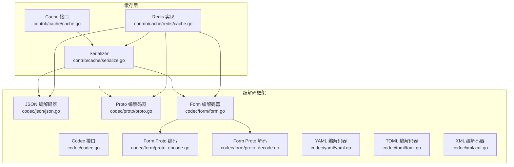
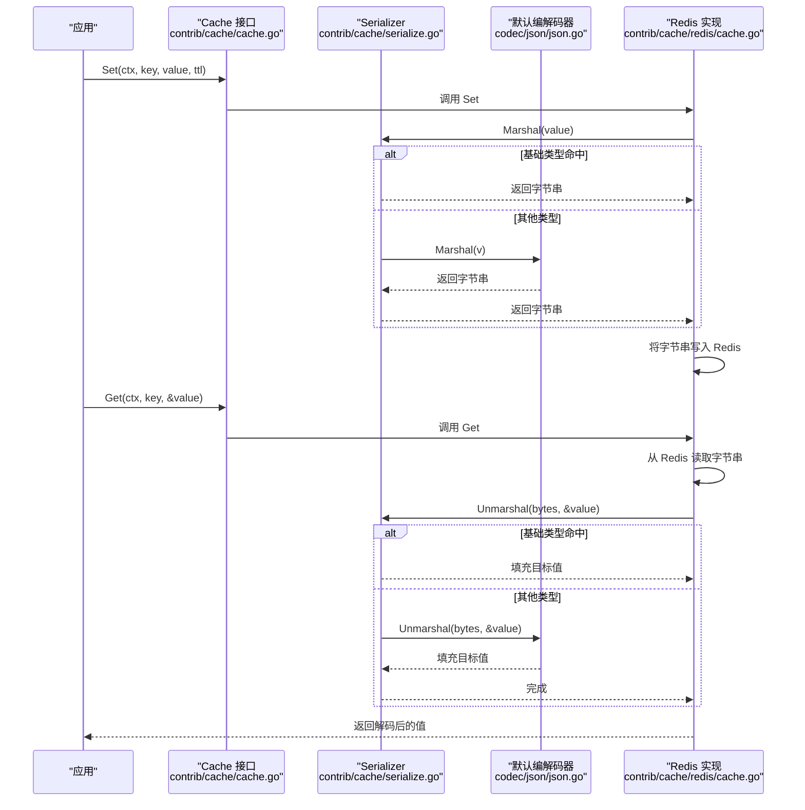
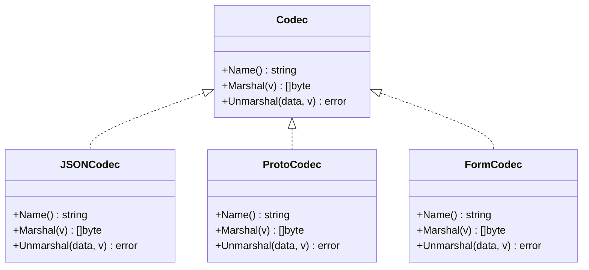
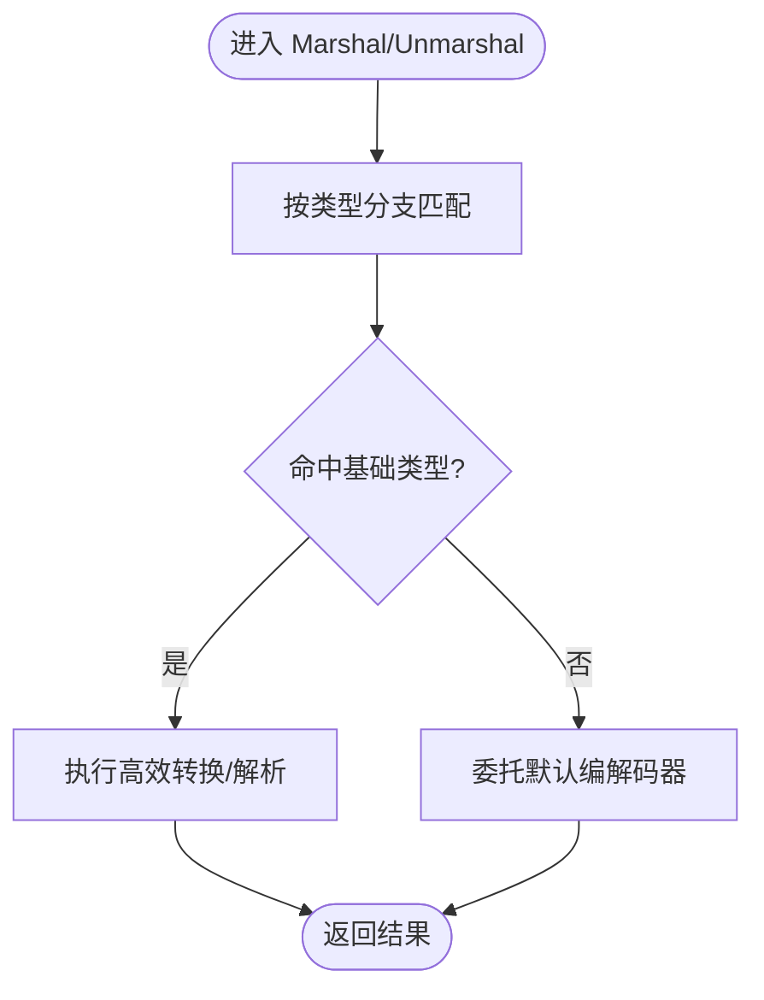
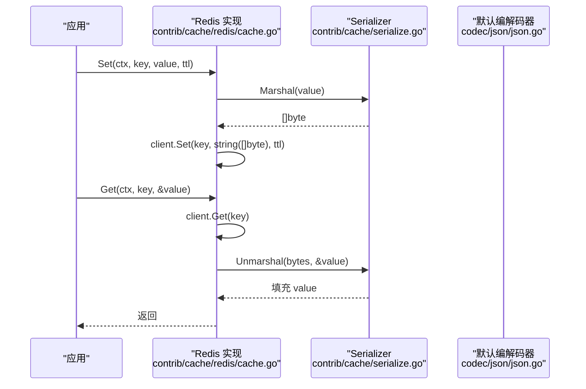
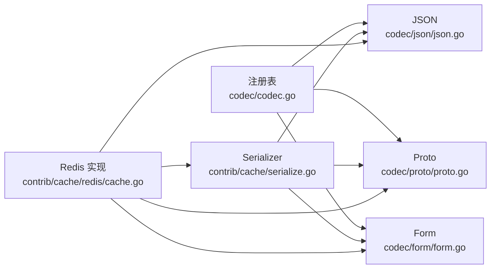

# 序列化机制

<cite>
**本文引用的文件**
- [contrib/cache/serialize.go](file://contrib/cache/serialize.go)
- [contrib/cache/serialize_test.go](file://contrib/cache/serialize_test.go)
- [contrib/cache/cache.go](file://contrib/cache/cache.go)
- [contrib/cache/redis/cache.go](file://contrib/cache/redis/cache.go)
- [codec/codec.go](file://codec/codec.go)
- [codec/json/json.go](file://codec/json/json.go)
- [codec/proto/proto.go](file://codec/proto/proto.go)
- [codec/form/form.go](file://codec/form/form.go)
- [codec/form/proto_encode.go](file://codec/form/proto_encode.go)
- [codec/form/proto_decode.go](file://codec/form/proto_decode.go)
- [codec/yaml/yaml.go](file://codec/yaml/yaml.go)
- [codec/toml/toml.go](file://codec/toml/toml.go)
- [codec/xml/xml.go](file://codec/xml/xml.go)
- [contrib/cache/redis/cache_test.go](file://contrib/cache/redis/cache_test.go)
</cite>

## 目录
1. [简介](#简介)
2. [项目结构](#项目结构)
3. [核心组件](#核心组件)
4. [架构总览](#架构总览)
5. [详细组件分析](#详细组件分析)
6. [依赖关系分析](#依赖关系分析)
7. [性能考量](#性能考量)
8. [故障排查指南](#故障排查指南)
9. [结论](#结论)
10. [附录](#附录)

## 简介
本文件系统性梳理 Go Fox 的缓存序列化机制，围绕以下目标展开：
- 深入解释缓存数据的序列化与反序列化流程，涵盖数据编码、类型转换、格式兼容等核心技术。
- 详解序列化器的实现原理：接口设计、编解码流程、错误处理与边界条件。
- 阐述不同数据类型的序列化策略：基础类型、复杂对象、数组/映射等。
- 提供性能优化建议：压缩、缓存策略、内存管理等。
- 给出扩展开发指南：自定义序列化器、特殊类型处理、版本兼容性。
- 结合现有测试用例与集成场景，辅助理解与优化缓存序列化性能。

## 项目结构
本节聚焦与序列化直接相关的核心模块与文件组织：
- 缓存接口与默认序列化器：contrib/cache/cache.go、contrib/cache/serialize.go
- Redis 实现：contrib/cache/redis/cache.go
- 编解码器框架与多种实现：codec/codec.go、codec/json/json.go、codec/proto/proto.go、codec/form/form.go、codec/form/proto_encode.go、codec/form/proto_decode.go、codec/yaml/yaml.go、codec/toml/toml.go、codec/xml/xml.go
- 测试：contrib/cache/serialize_test.go、contrib/cache/redis/cache_test.go

图表来源
- [contrib/cache/cache.go](file://contrib/cache/cache.go#L39-L47)
- [contrib/cache/serialize.go](file://contrib/cache/serialize.go#L49-L127)
- [contrib/cache/redis/cache.go](file://contrib/cache/redis/cache.go#L68-L87)
- [codec/codec.go](file://codec/codec.go#L33-L38)
- [codec/json/json.go](file://codec/json/json.go#L63-L103)
- [codec/proto/proto.go](file://codec/proto/proto.go#L45-L61)
- [codec/form/form.go](file://codec/form/form.go#L35-L91)
- [codec/form/proto_encode.go](file://codec/form/proto_encode.go#L16-L147)
- [codec/form/proto_decode.go](file://codec/form/proto_decode.go#L27-L331)

章节来源
- [contrib/cache/cache.go](file://contrib/cache/cache.go#L39-L47)
- [contrib/cache/serialize.go](file://contrib/cache/serialize.go#L49-L127)
- [contrib/cache/redis/cache.go](file://contrib/cache/redis/cache.go#L68-L87)
- [codec/codec.go](file://codec/codec.go#L33-L38)

## 核心组件
- 编解码器接口与注册中心
  - 接口定义：Name()、Marshal(v)、Unmarshal(data, v)。
  - 注册与获取：通过注册表按名称加载具体编解码器。
- JSON 编解码器
  - 支持标准类型、proto.Message、以及实现了 json.Marshaler/json.Unmarshaler 的类型。
- Proto 编解码器
  - 基于 google.golang.org/protobuf/proto 的二进制编解码。
- Form 编解码器（含 Proto 扩展）
  - 支持 x-www-form-urlencoded 的编码/解码；对 proto.Message 提供专用 EncodeValues/DecodeValues。
- 缓存序列化器
  - 针对 Redis 缓存场景，优先对常见基础类型进行高效字节转换；其余类型委托给默认编解码器（默认为 JSON）。
- 缓存接口与 Redis 实现
  - Cache 接口统一抽象；Redis 实现负责调用序列化器进行持久化与读取。

章节来源
- [codec/codec.go](file://codec/codec.go#L33-L38)
- [codec/codec.go](file://codec/codec.go#L52-L60)
- [codec/json/json.go](file://codec/json/json.go#L63-L103)
- [codec/proto/proto.go](file://codec/proto/proto.go#L45-L61)
- [codec/form/form.go](file://codec/form/form.go#L35-L91)
- [codec/form/proto_encode.go](file://codec/form/proto_encode.go#L16-L147)
- [codec/form/proto_decode.go](file://codec/form/proto_decode.go#L27-L331)
- [contrib/cache/serialize.go](file://contrib/cache/serialize.go#L49-L127)
- [contrib/cache/cache.go](file://contrib/cache/cache.go#L39-L47)
- [contrib/cache/redis/cache.go](file://contrib/cache/redis/cache.go#L68-L87)

## 架构总览
下图展示从应用到缓存再到存储的整体序列化路径，以及编解码器的选择逻辑。

图表来源
- [contrib/cache/cache.go](file://contrib/cache/cache.go#L39-L47)
- [contrib/cache/serialize.go](file://contrib/cache/serialize.go#L52-L127)
- [codec/json/json.go](file://codec/json/json.go#L71-L103)
- [contrib/cache/redis/cache.go](file://contrib/cache/redis/cache.go#L68-L87)

## 详细组件分析

### 编解码器接口与注册中心
- 接口职责
  - Name：返回编解码器标识名。
  - Marshal：将任意值编码为字节流。
  - Unmarshal：将字节流解码到目标变量。
- 注册与获取
  - RegisterCodec：注册编解码器实例，内部以小写名称作为键。
  - GetCodec：按名称获取已注册编解码器，未找到则返回空。

图表来源
- [codec/codec.go](file://codec/codec.go#L33-L38)
- [codec/json/json.go](file://codec/json/json.go#L63-L103)
- [codec/proto/proto.go](file://codec/proto/proto.go#L45-L61)
- [codec/form/form.go](file://codec/form/form.go#L35-L91)

章节来源
- [codec/codec.go](file://codec/codec.go#L33-L38)
- [codec/codec.go](file://codec/codec.go#L52-L60)

### JSON 编解码器
- 特性
  - 对实现了 json.Marshaler/json.Unmarshaler 的类型优先使用其自定义方法。
  - 对 proto.Message 使用 protojson 的可配置选项进行编解码。
  - 其余类型使用标准库 json 编解码。
- 适用场景
  - 通用对象序列化，支持复杂结构与 proto 类型。

章节来源
- [codec/json/json.go](file://codec/json/json.go#L63-L103)

### Proto 编解码器
- 特性
  - 严格基于 proto.Message 的二进制编解码，适合高性能与跨语言互操作。
- 适用场景
  - RPC/消息传输、强类型协议对象。

章节来源
- [codec/proto/proto.go](file://codec/proto/proto.go#L45-L61)

### Form 编解码器（含 Proto 扩展）
- 特性
  - 支持 x-www-form-urlencoded 的编码/解码。
  - 对 proto.Message 提供 EncodeValues/DecodeValues，覆盖列表、映射、时间戳、持续时间、包装类型、字段掩码等常用类型。
- 适用场景
  - Web 表单解析与回填，以及与 proto 的无缝对接。

章节来源
- [codec/form/form.go](file://codec/form/form.go#L35-L91)
- [codec/form/proto_encode.go](file://codec/form/proto_encode.go#L16-L147)
- [codec/form/proto_decode.go](file://codec/form/proto_decode.go#L27-L331)

### 缓存序列化器（Serializer）
- 设计要点
  - 面向 Redis 缓存的定制化序列化器，默认使用 JSON 作为“兜底”编解码器。
  - 对常见基础类型（字符串、[]byte、整数、浮点、布尔、时间、时长、IP 等）采用零拷贝或高效转换，减少分配与拷贝。
  - 对未知类型委托给默认编解码器（默认为 JSON）。
- 关键流程
  - Marshal：按类型分支处理，命中则直接转换；否则委托默认编解码器。
  - Unmarshal：按指针类型分支处理，命中则解析；否则委托默认编解码器。
- 错误处理
  - 对输入/输出参数进行必要校验（如指针检查），并在解析失败时返回错误。
- 内存与性能
  - 使用 unsafe 进行字节串与字符串之间的转换，避免额外分配；注意类型安全与生命周期。
  - 对数值解析使用标准库的高精度解析函数，保证精度与稳定性。

图表来源
- [contrib/cache/serialize.go](file://contrib/cache/serialize.go#L52-L127)
- [contrib/cache/serialize.go](file://contrib/cache/serialize.go#L129-L241)

章节来源
- [contrib/cache/serialize.go](file://contrib/cache/serialize.go#L49-L127)
- [contrib/cache/serialize.go](file://contrib/cache/serialize.go#L129-L241)
- [contrib/cache/serialize.go](file://contrib/cache/serialize.go#L259-L272)

### 缓存接口与 Redis 实现
- Cache 接口
  - 定义 Get/Set/Update/TTL/UpdateTTL/Delete 等缓存操作。
- Redis 实现
  - Set：先经序列化器 Marshal，再写入 Redis。
  - Get：从 Redis 读取后经序列化器 Unmarshal 到目标变量。
  - Update：读取当前 TTL 并复用设置新值。
  - UpdateTTL/Delete：封装底层客户端操作。
  - Key 前缀：支持可选前缀拼接，便于多环境隔离。

图表来源
- [contrib/cache/cache.go](file://contrib/cache/cache.go#L39-L47)
- [contrib/cache/redis/cache.go](file://contrib/cache/redis/cache.go#L68-L87)
- [contrib/cache/serialize.go](file://contrib/cache/serialize.go#L52-L127)
- [codec/json/json.go](file://codec/json/json.go#L71-L103)

章节来源
- [contrib/cache/cache.go](file://contrib/cache/cache.go#L39-L47)
- [contrib/cache/redis/cache.go](file://contrib/cache/redis/cache.go#L68-L110)

## 依赖关系分析
- 编解码器注册与选择
  - 各编解码器在初始化阶段注册到全局注册表；序列化器通过名称获取默认编解码器。
- 序列化器与编解码器的关系
  - Serializer 是缓存层的适配器，既可直接处理基础类型，也可委托给 JSON/Proto/Form 等编解码器。
- Redis 实现与序列化器
  - Redis 实现仅依赖 Cache 接口与默认序列化器；通过组合 Serializer 完成编解码。

图表来源
- [codec/codec.go](file://codec/codec.go#L52-L60)
- [codec/json/json.go](file://codec/json/json.go#L57-L61)
- [codec/proto/proto.go](file://codec/proto/proto.go#L39-L43)
- [codec/form/form.go](file://codec/form/form.go#L29-L33)
- [contrib/cache/serialize.go](file://contrib/cache/serialize.go#L39-L42)
- [contrib/cache/redis/cache.go](file://contrib/cache/redis/cache.go#L68-L87)

章节来源
- [codec/codec.go](file://codec/codec.go#L52-L60)
- [contrib/cache/serialize.go](file://contrib/cache/serialize.go#L39-L42)
- [contrib/cache/redis/cache.go](file://contrib/cache/redis/cache.go#L68-L87)

## 性能考量
- 字节串与字符串转换
  - 使用 unsafe 进行零拷贝转换，减少内存分配；需确保生命周期与类型安全。
- 基础类型直通
  - 对整数、浮点、布尔、时间等类型采用高效的字符串/数值转换，避免通用编解码开销。
- 默认编解码器选择
  - 默认使用 JSON 编解码器；对于需要更高性能的场景，可在应用层替换默认编解码器或直接使用 Proto 编解码器。
- Redis 存储形态
  - 当前实现将字节串转换为字符串写入 Redis；若对象较大，可考虑在上层引入压缩（如 Gzip/Zstd）后再写入，以降低网络与存储开销。
- 内存管理
  - 避免不必要的中间缓冲区复制；尽量复用已分配的缓冲区。
- 建议
  - 对热点对象优先采用 Proto 编解码器，以获得更小体积与更快速度。
  - 在上层增加压缩开关与策略（如按对象大小阈值启用压缩），并结合 TTL 与缓存更新策略，提升整体吞吐。

## 故障排查指南
- 常见错误与定位
  - 输入/输出参数非法：如 Unmarshal 需要指针类型，否则会报错；应确保传入的是目标类型的指针。
  - 基础类型解析失败：如整数/浮点/布尔解析错误，检查数据来源与格式一致性。
  - 未知类型回退：当类型不在基础类型分支时，将委托默认编解码器；若默认编解码器不支持该类型，可能出现解析失败。
- 单元测试与集成测试
  - 序列化单元测试：验证基础类型（如 int、string）的编解码正确性。
  - Redis 集成测试：验证对象的序列化与反序列化在 Redis 中的端到端行为。
- 建议的诊断步骤
  - 明确目标类型是否属于基础类型分支；若不属于，确认默认编解码器是否正确注册与可用。
  - 对于复杂对象，优先尝试 Proto 编解码器，以排除 JSON 兼容性问题。
  - 若出现解析异常，打印原始字节串与目标类型，核对字段与格式。

章节来源
- [contrib/cache/serialize.go](file://contrib/cache/serialize.go#L129-L133)
- [contrib/cache/serialize.go](file://contrib/cache/serialize.go#L243-L257)
- [contrib/cache/serialize_test.go](file://contrib/cache/serialize_test.go#L8-L54)
- [contrib/cache/redis/cache_test.go](file://contrib/cache/redis/cache_test.go#L33-L67)

## 结论
Go Fox 的缓存序列化机制通过“基础类型直通 + 默认编解码器兜底”的策略，在保证兼容性的同时显著提升了常见场景下的性能。Serializer 作为适配层，既满足了 Redis 缓存的高效需求，又保留了与多种编解码器的扩展能力。结合 Proto/JSON/Form 等编解码器，开发者可以在不同场景下灵活选择最优方案，并通过压缩、缓存策略与内存优化进一步提升整体性能。

## 附录

### 数据类型序列化策略速览
- 基础类型（命中直通）
  - 字符串、字节切片、整数（含有符号/无符号）、浮点、布尔、时间、时长、IP 等。
- 复杂对象与数组/映射
  - 通过默认编解码器（默认 JSON）进行通用编解码；对 proto.Message 使用 protojson 选项。
- 特殊类型（Form 编解码器）
  - 支持列表、映射、时间戳、持续时间、包装类型、字段掩码等，覆盖常见 Web 场景。

章节来源
- [contrib/cache/serialize.go](file://contrib/cache/serialize.go#L57-L126)
- [codec/json/json.go](file://codec/json/json.go#L71-L103)
- [codec/form/proto_encode.go](file://codec/form/proto_encode.go#L32-L97)
- [codec/form/proto_decode.go](file://codec/form/proto_decode.go#L157-L234)

### 扩展开发指南
- 自定义编解码器
  - 实现 Codec 接口并注册到注册表；在应用层将默认编解码器替换为自定义实现。
- 特殊类型处理
  - 在 Serializer 的类型分支中新增处理逻辑，或在自定义编解码器中针对特定类型进行优化。
- 版本兼容性
  - 对于对象演进，建议在编解码器层面提供向后兼容策略（如忽略未知字段、默认值填充等）。

章节来源
- [codec/codec.go](file://codec/codec.go#L40-L60)
- [contrib/cache/serialize.go](file://contrib/cache/serialize.go#L57-L126)

### 测试与基准建议
- 现有测试
  - 序列化单元测试：覆盖基础类型编解码正确性。
  - Redis 集成测试：覆盖对象的端到端读写。
- 基准测试建议
  - 针对不同数据类型与对象规模，分别测量 Marshal/Unmarshal 的耗时与内存分配。
  - 对比 JSON 与 Proto 编解码器在体积与速度上的差异。
  - 引入压缩策略的对比实验，评估压缩/解压成本与收益。

章节来源
- [contrib/cache/serialize_test.go](file://contrib/cache/serialize_test.go#L8-L54)
- [contrib/cache/redis/cache_test.go](file://contrib/cache/redis/cache_test.go#L33-L67)