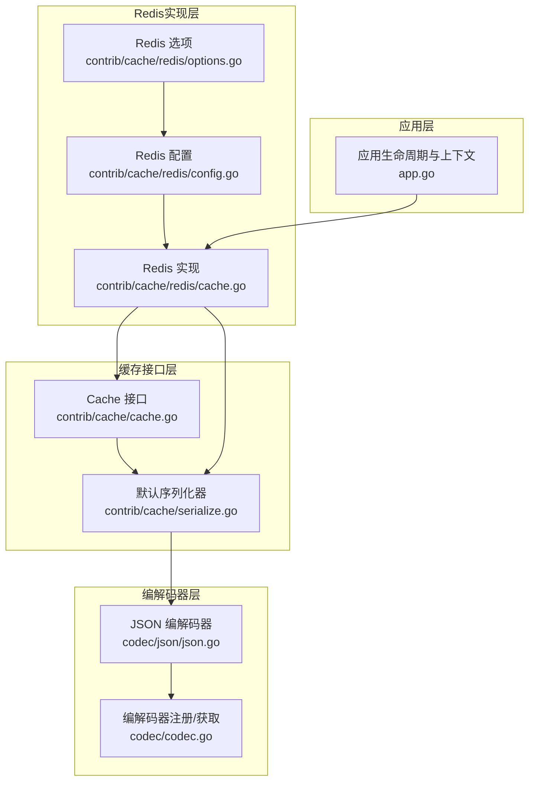
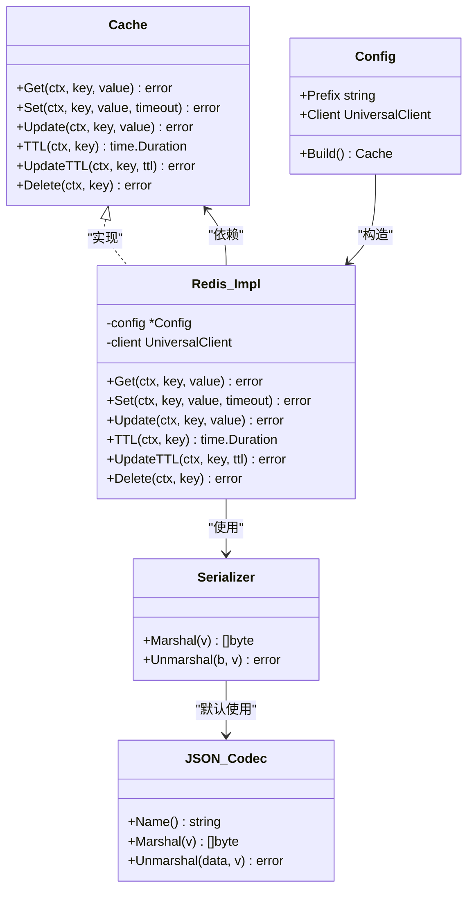
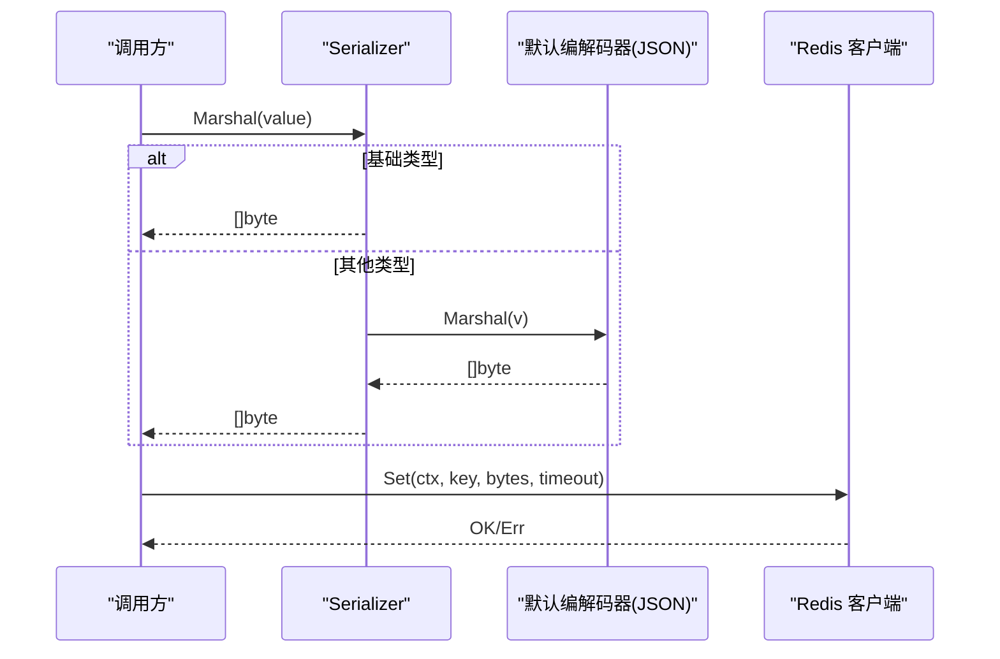
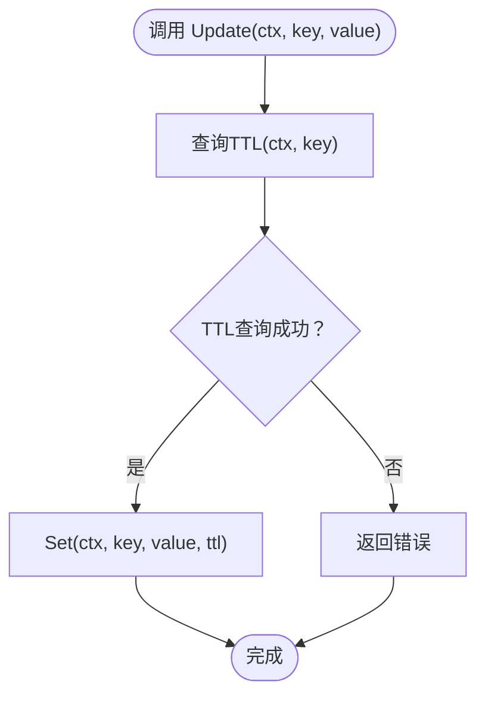
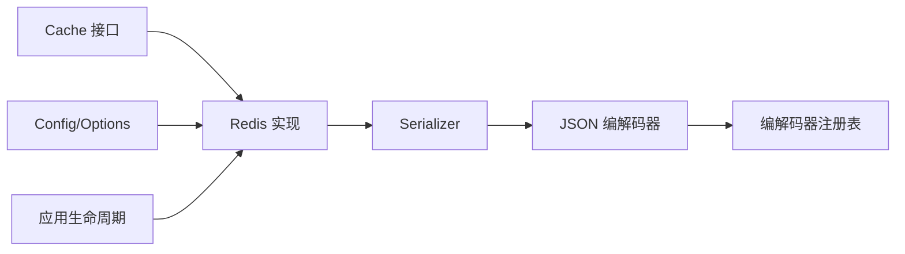

# 缓存接口设计

<cite>
**本文引用的文件列表**
- [contrib/cache/cache.go](file://contrib/cache/cache.go)
- [contrib/cache/serialize.go](file://contrib/cache/serialize.go)
- [contrib/cache/redis/cache.go](file://contrib/cache/redis/cache.go)
- [contrib/cache/redis/config.go](file://contrib/cache/redis/config.go)
- [contrib/cache/redis/options.go](file://contrib/cache/redis/options.go)
- [contrib/cache/redis/cache_test.go](file://contrib/cache/redis/cache_test.go)
- [codec/json/json.go](file://codec/json/json.go)
- [codec/codec.go](file://codec/codec.go)
- [app.go](file://app.go)
</cite>

## 目录
1. [简介](#简介)
2. [项目结构](#项目结构)
3. [核心组件](#核心组件)
4. [架构总览](#架构总览)
5. [详细组件分析](#详细组件分析)
6. [依赖关系分析](#依赖关系分析)
7. [性能考量](#性能考量)
8. [故障排查指南](#故障排查指南)
9. [结论](#结论)
10. [附录](#附录)

## 简介
本文件面向Go Fox缓存接口设计，系统性阐述Cache接口的设计理念与架构原理，覆盖Get、Set、Update、TTL、Delete等核心方法的功能定义与使用场景；详解上下文支持、超时控制、错误处理等技术细节；说明默认序列化器的配置与使用（JSON编解码器选择与数据序列化机制）；并结合微服务架构背景，讨论缓存接口在性能优化、数据一致性、缓存穿透防护等方面的考虑与最佳实践。

## 项目结构
围绕缓存接口设计的相关模块主要分布在以下路径：
- 接口与默认序列化：contrib/cache/cache.go、contrib/cache/serialize.go
- Redis实现：contrib/cache/redis/cache.go、contrib/cache/redis/config.go、contrib/cache/redis/options.go
- JSON编解码器：codec/json/json.go
- 通用编解码器注册：codec/codec.go
- 应用生命周期与上下文：app.go

图表来源
- [contrib/cache/cache.go](file://contrib/cache/cache.go#L39-L47)
- [contrib/cache/serialize.go](file://contrib/cache/serialize.go#L39-L47)
- [contrib/cache/redis/cache.go](file://contrib/cache/redis/cache.go#L38-L66)
- [contrib/cache/redis/config.go](file://contrib/cache/redis/config.go#L33-L47)
- [contrib/cache/redis/options.go](file://contrib/cache/redis/options.go#L28-L43)
- [codec/json/json.go](file://codec/json/json.go#L37-L61)
- [codec/codec.go](file://codec/codec.go#L33-L60)
- [app.go](file://app.go#L24-L78)

章节来源
- [contrib/cache/cache.go](file://contrib/cache/cache.go#L39-L47)
- [contrib/cache/serialize.go](file://contrib/cache/serialize.go#L39-L47)
- [contrib/cache/redis/cache.go](file://contrib/cache/redis/cache.go#L38-L66)
- [contrib/cache/redis/config.go](file://contrib/cache/redis/config.go#L33-L47)
- [contrib/cache/redis/options.go](file://contrib/cache/redis/options.go#L28-L43)
- [codec/json/json.go](file://codec/json/json.go#L37-L61)
- [codec/codec.go](file://codec/codec.go#L33-L60)
- [app.go](file://app.go#L24-L78)

## 核心组件
- Cache接口：定义统一的缓存操作契约，包含Get、Set、Update、TTL、UpdateTTL、Delete等方法，均支持context与超时控制。
- 默认序列化器：通过codec注册表获取JSON编解码器作为默认序列化器，用于对象的二进制存储与还原。
- Redis实现：基于go-redis v9实现Cache接口，提供键前缀、TTL查询与更新、删除等能力。
- 配置与选项：支持通过配置扫描、选项函数等方式注入Redis客户端与键前缀。

章节来源
- [contrib/cache/cache.go](file://contrib/cache/cache.go#L39-L47)
- [contrib/cache/serialize.go](file://contrib/cache/serialize.go#L39-L47)
- [contrib/cache/redis/cache.go](file://contrib/cache/redis/cache.go#L38-L66)
- [contrib/cache/redis/config.go](file://contrib/cache/redis/config.go#L33-L47)
- [contrib/cache/redis/options.go](file://contrib/cache/redis/options.go#L28-L43)
- [codec/json/json.go](file://codec/json/json.go#L37-L61)
- [codec/codec.go](file://codec/codec.go#L33-L60)

## 架构总览
下图展示缓存接口在系统中的位置与交互关系，以及默认序列化器如何通过编解码器注册表选择JSON编解码器。

图表来源
- [contrib/cache/cache.go](file://contrib/cache/cache.go#L39-L47)
- [contrib/cache/serialize.go](file://contrib/cache/serialize.go#L49-L50)
- [codec/json/json.go](file://codec/json/json.go#L63-L103)
- [contrib/cache/redis/cache.go](file://contrib/cache/redis/cache.go#L38-L66)
- [contrib/cache/redis/config.go](file://contrib/cache/redis/config.go#L33-L47)

## 详细组件分析

### Cache接口设计与方法语义
- Get(ctx, key, value): 从缓存读取指定键的数据，反序列化到value中。value必须是指针类型；未命中返回nil（不视为错误），便于上层区分“不存在”与“读取失败”。
- Set(ctx, key, value, timeout): 将value序列化后写入缓存，设置过期时间。timeout为0表示不过期。
- Update(ctx, key, value): 在保持原TTL的前提下更新值，常用于热数据的值变更但保留生存时间。
- TTL(ctx, key): 查询键剩余生存时间。
- UpdateTTL(ctx, key, ttl): 更新键的过期时间。
- Delete(ctx, key): 删除键。

上下文与超时控制：所有方法均接收context，可传递取消信号或超时控制；具体行为由底层实现决定（如Redis客户端的ctx传播）。

错误处理策略：
- 未命中：Get返回nil，表示无数据；调用方应据此判断是否需要回源或降级。
- 序列化/反序列化错误：返回对应错误，提示上层检查数据类型与指针合法性。
- 客户端错误：透传底层错误（如网络异常、连接失败）。

章节来源
- [contrib/cache/cache.go](file://contrib/cache/cache.go#L39-L47)

### 默认序列化器与JSON编解码器
- 默认序列化器：通过codec.GetCodec(json.Name)获取JSON编解码器作为默认序列化器，确保对象与基础类型的统一编码/解码。
- Serializer：针对基础类型（字符串、整数、浮点、布尔、时间等）进行快速编码/解码；其他类型委托给默认编解码器（JSON）。
- JSON编解码器：注册到codec注册表，支持标准JSON与Protobuf Message的特殊处理（protojson）。

图表来源
- [contrib/cache/serialize.go](file://contrib/cache/serialize.go#L52-L127)
- [codec/json/json.go](file://codec/json/json.go#L71-L103)
- [codec/codec.go](file://codec/codec.go#L40-L60)

章节来源
- [contrib/cache/serialize.go](file://contrib/cache/serialize.go#L39-L47)
- [codec/json/json.go](file://codec/json/json.go#L37-L61)
- [codec/codec.go](file://codec/codec.go#L33-L60)

### Redis实现与配置
- 实现类：impl，持有Config与redis.UniversalClient，实现Cache接口。
- 键命名：支持前缀（Prefix），生成“prefix:key”的存储键，便于多环境隔离与多实例区分。
- 方法实现要点：
  - Get：若键不存在返回nil（不报错），否则反序列化到value。
  - Set：序列化后写入，支持timeout=0不过期。
  - Update：先查TTL，再以相同TTL写入新值。
  - TTL/UpdateTTL/Delete：直接调用客户端对应命令。
- 配置与选项：
  - Config：包含Prefix与Client字段，提供Build()工厂方法。
  - Options：WithClient、WithPrefix两个常用选项。
  - ScanConfig/RawConfig：从配置中心扫描Redis缓存配置。

图表来源
- [contrib/cache/redis/cache.go](file://contrib/cache/redis/cache.go#L89-L95)
- [contrib/cache/redis/cache.go](file://contrib/cache/redis/cache.go#L97-L105)

章节来源
- [contrib/cache/redis/cache.go](file://contrib/cache/redis/cache.go#L38-L66)
- [contrib/cache/redis/cache.go](file://contrib/cache/redis/cache.go#L68-L110)
- [contrib/cache/redis/config.go](file://contrib/cache/redis/config.go#L33-L65)
- [contrib/cache/redis/options.go](file://contrib/cache/redis/options.go#L28-L43)

### 测试用例与使用示例
- 单元测试覆盖了字符串与对象的读写流程，验证键前缀、上下文、超时等关键路径。
- 示例展示了如何通过WithClient与WithPrefix组合创建缓存实例，并进行基本的Set/Get操作。

章节来源
- [contrib/cache/redis/cache_test.go](file://contrib/cache/redis/cache_test.go#L33-L67)

## 依赖关系分析
- 接口与实现解耦：Cache接口独立于Redis实现，便于替换不同后端（如内存、本地文件等）。
- 序列化器与编解码器：通过codec注册表实现编解码器的动态选择，默认使用JSON编解码器。
- 配置驱动：Redis实现通过Config与选项函数注入客户端与前缀，支持从配置中心扫描加载。

图表来源
- [contrib/cache/cache.go](file://contrib/cache/cache.go#L39-L47)
- [contrib/cache/redis/cache.go](file://contrib/cache/redis/cache.go#L38-L66)
- [contrib/cache/serialize.go](file://contrib/cache/serialize.go#L39-L47)
- [codec/json/json.go](file://codec/json/json.go#L37-L61)
- [codec/codec.go](file://codec/codec.go#L33-L60)
- [contrib/cache/redis/config.go](file://contrib/cache/redis/config.go#L33-L47)
- [contrib/cache/redis/options.go](file://contrib/cache/redis/options.go#L28-L43)
- [app.go](file://app.go#L24-L78)

章节来源
- [contrib/cache/cache.go](file://contrib/cache/cache.go#L39-L47)
- [contrib/cache/redis/cache.go](file://contrib/cache/redis/cache.go#L38-L66)
- [contrib/cache/serialize.go](file://contrib/cache/serialize.go#L39-L47)
- [codec/json/json.go](file://codec/json/json.go#L37-L61)
- [codec/codec.go](file://codec/codec.go#L33-L60)
- [contrib/cache/redis/config.go](file://contrib/cache/redis/config.go#L33-L47)
- [contrib/cache/redis/options.go](file://contrib/cache/redis/options.go#L28-L43)
- [app.go](file://app.go#L24-L78)

## 性能考量
- 序列化成本：Serializer对基础类型采用快速路径，避免不必要的反射与JSON开销；复杂对象走默认编解码器，建议尽量使用简单结构体或已知的基础类型以降低序列化/反序列化成本。
- 键前缀与键空间：合理使用Prefix可避免键冲突与跨实例污染，同时有利于运维层面的资源隔离。
- TTL策略：Update方法在保持TTL的同时更新值，有助于减少频繁Set带来的过期重设开销；对于热点数据，优先使用Update而非重复Set。
- 超时与上下文：所有操作接受context，建议在高并发场景下为每个请求设置合理的超时，防止阻塞影响整体吞吐。
- 并发安全：Redis客户端在多goroutine下可安全复用，注意避免在业务逻辑中共享未初始化的客户端实例。

[本节为通用性能建议，无需特定文件引用]

## 故障排查指南
- 未命中返回nil：Get返回nil不代表错误，需区分“不存在”与“读取失败”。可通过上层逻辑或额外标志位进行区分。
- 指针校验：反序列化要求value为指针类型，否则会返回错误。请确保传入的是指向目标类型的指针。
- 序列化失败：当对象无法被默认编解码器处理时，会返回错误。建议检查对象字段类型是否为编解码器支持的类型。
- 客户端错误：网络异常、连接失败等错误会透传至调用方。建议在上层增加重试与熔断策略。
- TTL异常：TTL查询失败通常意味着键不存在或客户端错误，需结合日志定位。

章节来源
- [contrib/cache/redis/cache.go](file://contrib/cache/redis/cache.go#L68-L78)
- [contrib/cache/serialize.go](file://contrib/cache/serialize.go#L129-L140)
- [contrib/cache/serialize.go](file://contrib/cache/serialize.go#L243-L257)

## 结论
Go Fox缓存接口通过清晰的契约与默认序列化器，提供了统一且高效的缓存访问能力。Redis实现以最小的抽象成本覆盖常用操作，并通过配置与选项灵活适配不同部署场景。在微服务架构中，该接口可显著提升读取性能、降低后端压力，并通过TTL与Update等方法维持数据一致性与时效性。建议在实际使用中遵循最佳实践，关注序列化成本、键前缀策略与上下文超时控制，以获得更稳健的性能表现。

[本节为总结性内容，无需特定文件引用]

## 附录

### 微服务架构中的价值与考虑
- 性能优化：缓存可显著降低数据库与下游服务的压力，提高响应速度；建议对热点数据设置合适的TTL与更新策略。
- 数据一致性：通过Update保持TTL不变，减少因频繁Set导致的过期抖动；对强一致场景，建议结合分布式锁或事件驱动更新。
- 缓存穿透防护：可通过布隆过滤器或空值缓存（短TTL）降低未命中带来的后端压力；在Get返回nil时，上层应有兜底策略（如回源查询并写入缓存）。
- 可观测性：建议在关键路径埋点（序列化耗时、TTL查询、Set/Get成功率），并结合日志与指标监控异常。

[本节为概念性内容，无需特定文件引用]