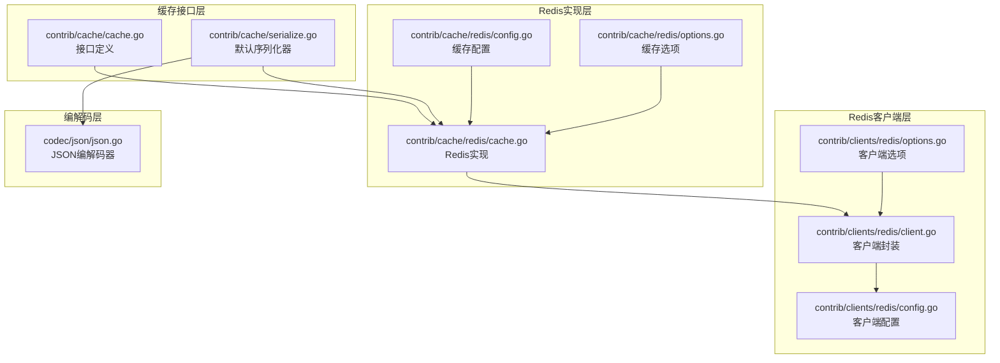
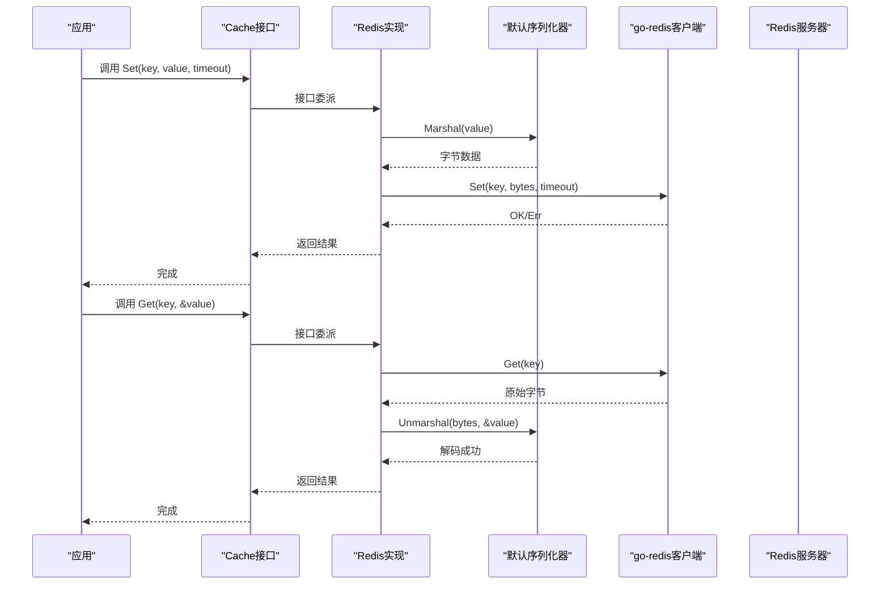
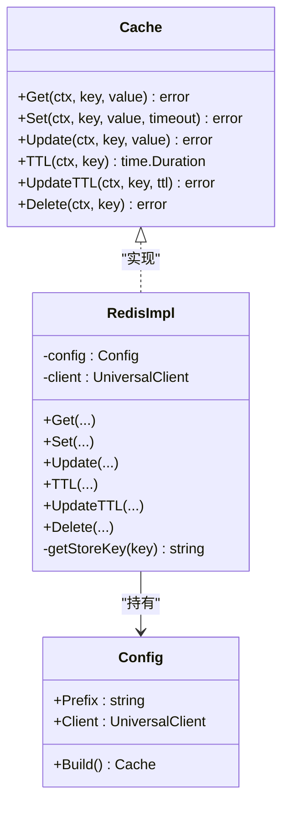
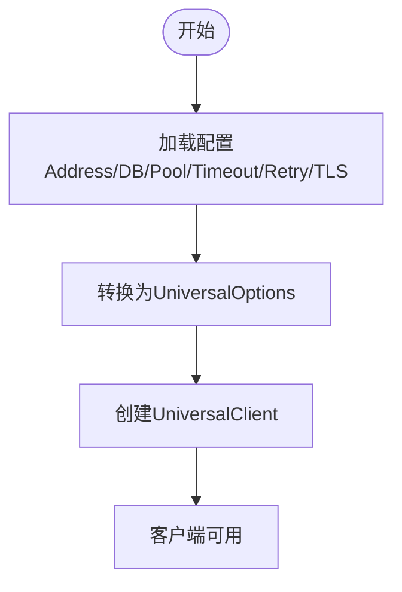
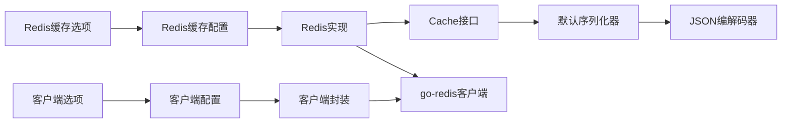

# 缓存插件

<cite>
**本文引用的文件列表**
- [contrib/cache/cache.go](file://contrib/cache/cache.go)
- [contrib/cache/serialize.go](file://contrib/cache/serialize.go)
- [contrib/cache/redis/cache.go](file://contrib/cache/redis/cache.go)
- [contrib/cache/redis/config.go](file://contrib/cache/redis/config.go)
- [contrib/cache/redis/options.go](file://contrib/cache/redis/options.go)
- [contrib/cache/redis/cache_test.go](file://contrib/cache/redis/cache_test.go)
- [contrib/clients/redis/client.go](file://contrib/clients/redis/client.go)
- [contrib/clients/redis/config.go](file://contrib/clients/redis/config.go)
- [contrib/clients/redis/options.go](file://contrib/clients/redis/options.go)
- [codec/json/json.go](file://codec/json/json.go)
</cite>

## 目录
1. [简介](#简介)
2. [项目结构](#项目结构)
3. [核心组件](#核心组件)
4. [架构总览](#架构总览)
5. [组件详解](#组件详解)
6. [依赖关系分析](#依赖关系分析)
7. [性能与优化](#性能与优化)
8. [故障排查指南](#故障排查指南)
9. [结论](#结论)
10. [附录：使用示例与最佳实践](#附录使用示例与最佳实践)

## 简介
本文件面向Go Fox缓存插件，系统性阐述其整体架构、设计原则与实现细节，重点覆盖：
- 缓存接口定义与实现策略
- Redis缓存集成方案（连接配置、命令执行、连接池管理）
- 缓存序列化机制（数据编码解码、类型转换、性能优化）
- 使用方法与配置项（缓存策略、过期时间、键空间管理）
- 扩展开发指南（自定义缓存后端、序列化器、连接管理器）
- 实际使用示例与性能优化建议

## 项目结构
缓存插件位于contrib/cache目录，Redis实现位于contrib/cache/redis；Redis客户端位于contrib/clients/redis；默认序列化基于codec/json。

图表来源
- [contrib/cache/cache.go](file://contrib/cache/cache.go#L39-L47)
- [contrib/cache/serialize.go](file://contrib/cache/serialize.go#L49-L127)
- [contrib/cache/redis/cache.go](file://contrib/cache/redis/cache.go#L38-L66)
- [contrib/cache/redis/config.go](file://contrib/cache/redis/config.go#L33-L47)
- [contrib/cache/redis/options.go](file://contrib/cache/redis/options.go#L28-L43)
- [contrib/clients/redis/client.go](file://contrib/clients/redis/client.go#L32-L60)
- [contrib/clients/redis/config.go](file://contrib/clients/redis/config.go#L37-L94)
- [contrib/clients/redis/options.go](file://contrib/clients/redis/options.go#L37-L261)
- [codec/json/json.go](file://codec/json/json.go#L63-L103)

章节来源
- [contrib/cache/cache.go](file://contrib/cache/cache.go#L39-L47)
- [contrib/cache/redis/cache.go](file://contrib/cache/redis/cache.go#L38-L66)
- [contrib/clients/redis/client.go](file://contrib/clients/redis/client.go#L32-L60)
- [codec/json/json.go](file://codec/json/json.go#L63-L103)

## 核心组件
- 缓存接口：统一的Get/Set/TTL/Update/UpdateTTL/Delete能力，支持任意可序列化的值。
- 默认序列化器：内置对基础类型的快速路径，其余类型委托给JSON编解码器。
- Redis实现：基于go-redis/v9，提供键前缀、TTL管理、更新保持TTL等特性。
- 客户端封装：提供丰富的连接配置与连接池参数，支持TLS、Sentinel、Cluster等模式。
- 配置扫描：支持从配置中心按键扫描并构建缓存或客户端实例。

章节来源
- [contrib/cache/cache.go](file://contrib/cache/cache.go#L39-L47)
- [contrib/cache/serialize.go](file://contrib/cache/serialize.go#L49-L127)
- [contrib/cache/redis/cache.go](file://contrib/cache/redis/cache.go#L38-L66)
- [contrib/cache/redis/config.go](file://contrib/cache/redis/config.go#L33-L47)
- [contrib/clients/redis/config.go](file://contrib/clients/redis/config.go#L37-L94)

## 架构总览
缓存插件采用“接口抽象 + 具体实现 + 序列化 + 客户端”的分层设计。默认序列化器优先处理常见基础类型，降低开销；复杂对象通过JSON编解码器进行通用序列化。Redis实现负责键空间管理（前缀）、TTL控制与命令执行，并通过go-redis客户端完成底层通信。

图表来源
- [contrib/cache/cache.go](file://contrib/cache/cache.go#L40-L47)
- [contrib/cache/redis/cache.go](file://contrib/cache/redis/cache.go#L80-L110)
- [contrib/cache/serialize.go](file://contrib/cache/serialize.go#L52-L127)
- [codec/json/json.go](file://codec/json/json.go#L71-L103)

## 组件详解

### 缓存接口与默认序列化
- 接口职责：提供统一的缓存操作契约，支持任意类型值的读写、TTL查询与更新、删除。
- 默认序列化器：
  - 快速路径：对字符串、[]byte、整型、浮点、布尔、时间等基础类型直接转换，避免额外分配。
  - 通用路径：对复杂对象委托JSON编解码器，确保兼容proto消息与标准结构体。
  - 指针校验：反序列化要求目标必须是指针类型，防止误用。

章节来源
- [contrib/cache/cache.go](file://contrib/cache/cache.go#L39-L47)
- [contrib/cache/serialize.go](file://contrib/cache/serialize.go#L49-L127)
- [codec/json/json.go](file://codec/json/json.go#L63-L103)

### Redis缓存实现
- 键空间管理：支持键前缀，所有存储键会自动拼接“前缀:键”，便于多环境隔离与多租户。
- 命令执行：封装Get/Set/TTL/Update/UpdateTTL/Delete，内部调用go-redis客户端。
- TTL策略：Update在获取当前TTL后复用到新写入，保证“更新即续期”。
- 错误处理：对不存在键返回空值而非错误，便于上层判断。

图表来源
- [contrib/cache/cache.go](file://contrib/cache/cache.go#L39-L47)
- [contrib/cache/redis/cache.go](file://contrib/cache/redis/cache.go#L38-L66)
- [contrib/cache/redis/config.go](file://contrib/cache/redis/config.go#L33-L47)

章节来源
- [contrib/cache/redis/cache.go](file://contrib/cache/redis/cache.go#L38-L66)
- [contrib/cache/redis/cache.go](file://contrib/cache/redis/cache.go#L68-L110)
- [contrib/cache/redis/cache.go](file://contrib/cache/redis/cache.go#L157-L162)

### Redis客户端与连接配置
- 客户端封装：提供New/NewWithConfig，内部将配置转换为go-redis的UniversalOptions并创建UniversalClient。
- 连接池参数：支持PoolSize、MinIdleConns、MaxIdleConns、MaxActiveConns、PoolTimeout、ConnMaxIdleTime、ConnMaxLifetime等。
- 超时与重试：DialTimeout、ReadTimeout、WriteTimeout、MaxRetries、MinRetryBackoff、MaxRetryBackoff。
- 认证与安全：Username/Password、SentinelUsername/SentinelPassword、TLS配置（含证书文件加载）。
- 集群与哨兵：支持Cluster、Sentinel模式，以及路由策略（按延迟/随机）。
- 配置扫描：支持从配置中心按键扫描构建客户端实例。

图表来源
- [contrib/clients/redis/config.go](file://contrib/clients/redis/config.go#L120-L179)
- [contrib/clients/redis/client.go](file://contrib/clients/redis/client.go#L44-L60)

章节来源
- [contrib/clients/redis/config.go](file://contrib/clients/redis/config.go#L37-L94)
- [contrib/clients/redis/config.go](file://contrib/clients/redis/config.go#L96-L118)
- [contrib/clients/redis/config.go](file://contrib/clients/redis/config.go#L120-L179)
- [contrib/clients/redis/client.go](file://contrib/clients/redis/client.go#L32-L60)
- [contrib/clients/redis/options.go](file://contrib/clients/redis/options.go#L37-L261)

### 缓存配置与选项
- 缓存配置：包含Prefix与Client字段，提供Build方法直接产出Cache实例；支持RawConfig/ScanConfig从配置中心扫描。
- 缓存选项：WithClient/WithPrefix用于动态装配配置。

章节来源
- [contrib/cache/redis/config.go](file://contrib/cache/redis/config.go#L33-L47)
- [contrib/cache/redis/config.go](file://contrib/cache/redis/config.go#L39-L65)
- [contrib/cache/redis/options.go](file://contrib/cache/redis/options.go#L28-L43)

### 序列化流程与性能要点
- 类型分支：对常见基础类型走快速路径，减少反射与分配。
- 复杂对象：委托JSON编解码器，兼顾通用性与兼容性。
- 指针约束：反序列化要求目标为指针，避免拷贝与不可写问题。
- 性能优化建议：
  - 尽量使用基础类型作为缓存值，减少序列化成本。
  - 对频繁读写的热点对象，考虑预分配内存与复用结构体。
  - 合理设置TTL，避免过期风暴导致的抖动。

章节来源
- [contrib/cache/serialize.go](file://contrib/cache/serialize.go#L52-L127)
- [contrib/cache/serialize.go](file://contrib/cache/serialize.go#L129-L241)
- [codec/json/json.go](file://codec/json/json.go#L71-L103)

## 依赖关系分析
- 缓存接口依赖编解码器注册表，以获取默认JSON编解码器。
- Redis实现依赖go-redis客户端，负责实际网络交互。
- 客户端封装依赖go-redis的UniversalOptions，统一单机/集群/哨兵等拓扑。
- 配置扫描依赖全局配置系统，支持从配置中心按键读取。

图表来源
- [contrib/cache/cache.go](file://contrib/cache/cache.go#L30-L37)
- [contrib/cache/serialize.go](file://contrib/cache/serialize.go#L39-L42)
- [contrib/cache/redis/cache.go](file://contrib/cache/redis/cache.go#L31-L42)
- [contrib/cache/redis/config.go](file://contrib/cache/redis/config.go#L26-L31)
- [contrib/clients/redis/client.go](file://contrib/clients/redis/client.go#L26-L30)
- [contrib/clients/redis/config.go](file://contrib/clients/redis/config.go#L26-L35)

章节来源
- [contrib/cache/cache.go](file://contrib/cache/cache.go#L30-L37)
- [contrib/cache/redis/cache.go](file://contrib/cache/redis/cache.go#L31-L42)
- [contrib/clients/redis/client.go](file://contrib/clients/redis/client.go#L26-L30)

## 性能与优化
- 序列化成本控制：优先使用基础类型；复杂对象尽量复用结构体，避免频繁分配。
- 连接池调优：根据QPS与RT估算PoolSize与MaxActiveConns；合理设置MinIdleConns与ConnMaxIdleTime，平衡资源占用与冷启动延迟。
- 超时与重试：适度增加MaxRetries与Backoff，提升弱网环境稳定性；同时避免过长超时影响请求响应。
- TTL策略：对热数据设置较长TTL，冷数据短TTL；Update保持TTL可避免频繁重建。
- 键空间管理：使用前缀隔离不同环境/租户，避免键冲突与误删。

[本节为通用指导，无需特定文件来源]

## 故障排查指南
- 读取为空：Redis实现对不存在键返回空值，需在上层区分“未命中”与“空值”。
- 反序列化失败：确认目标类型为指针；检查序列化类型与反序列化类型是否一致。
- 连接异常：检查地址、认证、TLS证书路径与权限；核对连接池参数与服务器最大连接数。
- TTL异常：确认TTL单位与业务期望一致；注意Update会复用当前TTL。

章节来源
- [contrib/cache/redis/cache.go](file://contrib/cache/redis/cache.go#L68-L78)
- [contrib/cache/serialize.go](file://contrib/cache/serialize.go#L129-L133)
- [contrib/clients/redis/config.go](file://contrib/clients/redis/config.go#L37-L94)

## 结论
Go Fox缓存插件以清晰的接口抽象与可替换实现为核心，结合高效的序列化与成熟的Redis客户端，提供了稳定、易用且高性能的缓存能力。通过合理的配置与TTL策略，可在多环境下获得良好的吞吐与延迟表现。

[本节为总结，无需特定文件来源]

## 附录：使用示例与最佳实践

### 使用示例
- 基础用法（字符串与对象）
  - 创建Redis客户端并注入缓存实现，设置键前缀，进行Set/Get操作。
  - 示例参考：[contrib/cache/redis/cache_test.go](file://contrib/cache/redis/cache_test.go#L33-L67)

- 配置扫描
  - 通过配置键application.cache.redis.{name}扫描缓存配置，构建Cache实例。
  - 参考：[contrib/cache/redis/config.go](file://contrib/cache/redis/config.go#L58-L65)

- 客户端配置
  - 通过配置键application.clients.redis.{name}扫描客户端配置，构建UniversalClient。
  - 参考：[contrib/clients/redis/config.go](file://contrib/clients/redis/config.go#L195-L202)

### 配置项一览
- 缓存配置（application.cache.redis.{name}）
  - prefix：键前缀
  - client：go-redis客户端实例
  - 参考：[contrib/cache/redis/config.go](file://contrib/cache/redis/config.go#L33-L47)

- 客户端配置（application.clients.redis.{name}）
  - address：节点地址列表
  - client_name：客户端名称
  - db：数据库索引
  - 协议与认证：protocol、username、password、sentinel_*等
  - 超时与重试：dial_timeout、read_timeout、write_timeout、max_retries、min/max_retry_backoff
  - 连接池：pool_size、pool_timeout、min_idle_conns、max_idle_conns、max_active_conns、conn_max_idle_time、conn_max_lifetime
  - TLS：tls_config、cert_file、key_file
  - 集群/哨兵：max_redirects、read_only、route_by_latency、route_randomly、master_name
  - 参考：[contrib/clients/redis/config.go](file://contrib/clients/redis/config.go#L37-L94)

### 扩展开发指南
- 自定义缓存后端
  - 实现Cache接口，完成Get/Set/TTL/Update/UpdateTTL/Delete。
  - 参考接口定义：[contrib/cache/cache.go](file://contrib/cache/cache.go#L39-L47)
  - 可参考Redis实现：[contrib/cache/redis/cache.go](file://contrib/cache/redis/cache.go#L38-L66)

- 自定义序列化器
  - 实现Marshal/Unmarshal逻辑，优先处理常用基础类型，复杂类型委托默认JSON编解码器。
  - 参考默认实现：[contrib/cache/serialize.go](file://contrib/cache/serialize.go#L49-L127)
  - JSON编解码器注册：[codec/json/json.go](file://codec/json/json.go#L57-L61)

- 自定义连接管理器
  - 基于go-redis的UniversalOptions构建UniversalClient，按需扩展认证、TLS、连接池与拓扑。
  - 参考客户端封装：[contrib/clients/redis/client.go](file://contrib/clients/redis/client.go#L32-L60)
  - 参考配置映射：[contrib/clients/redis/config.go](file://contrib/clients/redis/config.go#L120-L179)

### 最佳实践
- 键空间管理：始终使用前缀隔离环境与租户，避免键冲突。
- TTL策略：热数据长TTL，冷数据短TTL；Update保持TTL，避免频繁重建。
- 连接池：根据QPS与RT调整PoolSize与MaxActiveConns，关注MinIdleConns与ConnMaxLifetime。
- 超时与重试：适度放宽重试与回退，避免过长超时影响响应。
- 序列化：优先基础类型；复杂对象尽量复用结构体，减少分配。

章节来源
- [contrib/cache/redis/cache_test.go](file://contrib/cache/redis/cache_test.go#L33-L67)
- [contrib/cache/redis/config.go](file://contrib/cache/redis/config.go#L58-L65)
- [contrib/clients/redis/config.go](file://contrib/clients/redis/config.go#L195-L202)
- [contrib/cache/cache.go](file://contrib/cache/cache.go#L39-L47)
- [contrib/cache/redis/cache.go](file://contrib/cache/redis/cache.go#L38-L66)
- [contrib/cache/serialize.go](file://contrib/cache/serialize.go#L49-L127)
- [codec/json/json.go](file://codec/json/json.go#L57-L61)
- [contrib/clients/redis/client.go](file://contrib/clients/redis/client.go#L32-L60)
- [contrib/clients/redis/config.go](file://contrib/clients/redis/config.go#L120-L179)