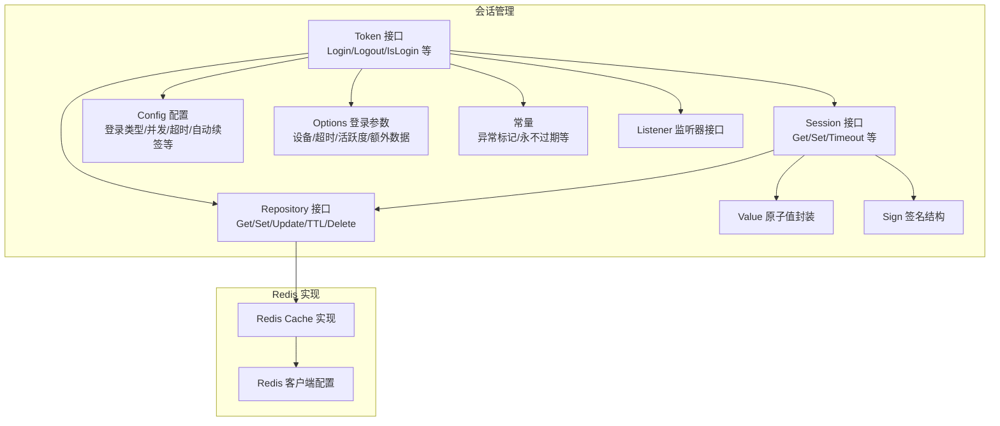
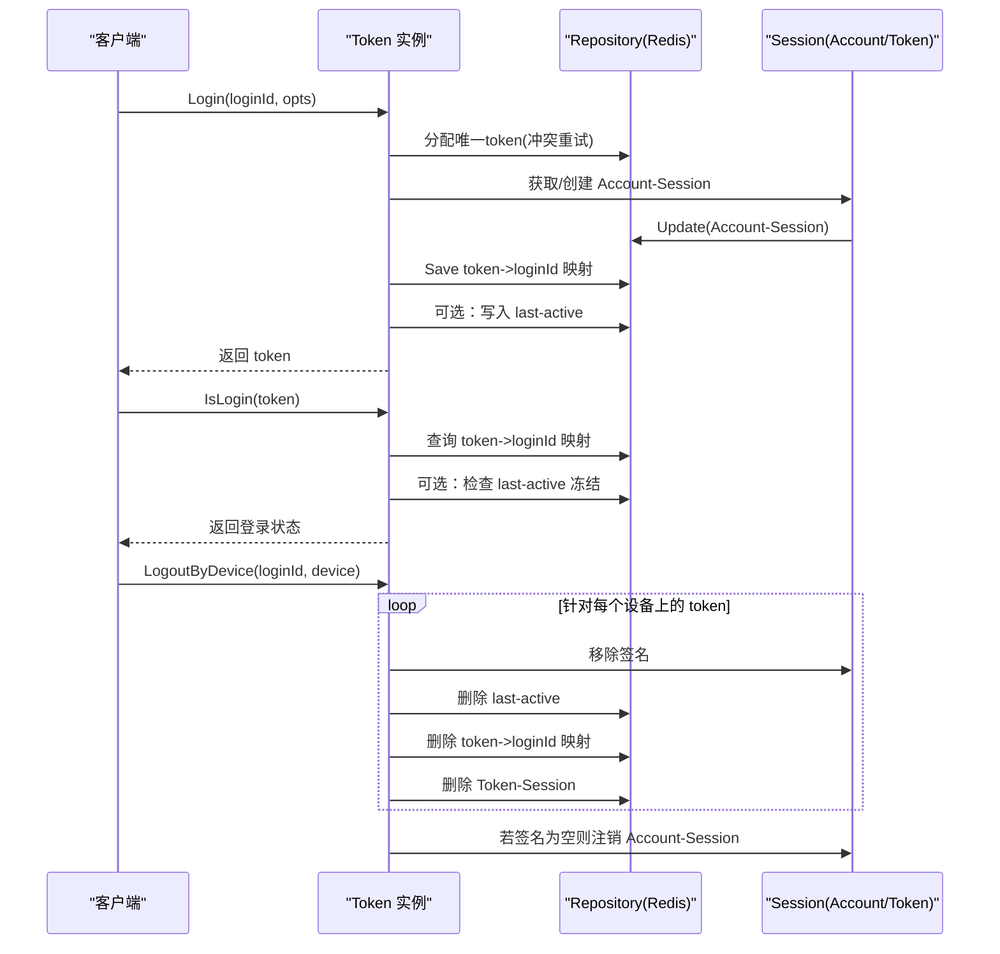
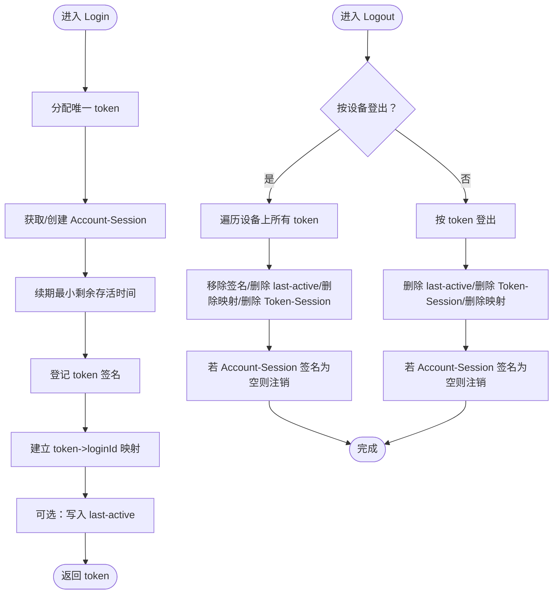
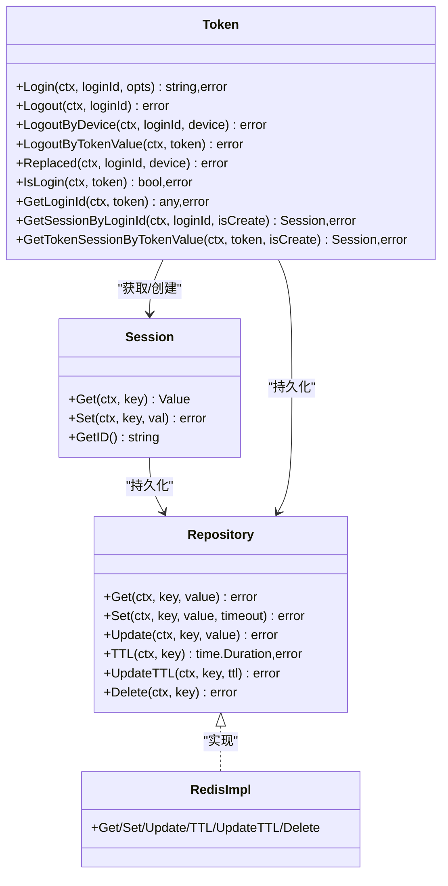

# 会话管理

<cite>
**本文引用的文件**
- [session.go](file://contrib/auth/token/session.go)
- [token.go](file://contrib/auth/token/token.go)
- [repository.go](file://contrib/auth/token/repository.go)
- [config.go](file://contrib/auth/token/config.go)
- [options.go](file://contrib/auth/token/options.go)
- [constant.go](file://contrib/auth/token/constant.go)
- [value.go](file://contrib/auth/token/value.go)
- [sign.go](file://contrib/auth/token/sign.go)
- [listener.go](file://contrib/auth/token/listener.go)
- [cache.go](file://contrib/cache/redis/cache.go)
- [config.go](file://contrib/cache/redis/config.go)
- [config.go](file://contrib/clients/redis/config.go)
- [options.go](file://contrib/clients/redis/options.go)
- [session_test.go](file://contrib/auth/token/session_test.go)
</cite>

## 目录
1. [简介](#简介)
2. [项目结构](#项目结构)
3. [核心组件](#核心组件)
4. [架构总览](#架构总览)
5. [详细组件分析](#详细组件分析)
6. [依赖关系分析](#依赖关系分析)
7. [性能考量](#性能考量)
8. [故障排查指南](#故障排查指南)
9. [结论](#结论)
10. [附录](#附录)

## 简介
本文件面向 Go Fox 会话管理模块，系统性阐述 Account-Session 与 Token-Session 的区别与关系，详解两类会话的存储结构、生命周期管理、创建/更新/销毁流程，以及基于 Redis 的存储实现与优化策略。文档同时覆盖登录状态检查、会话过期处理、活跃度检测、事件监听、使用示例与性能优化建议，帮助开发者快速理解并正确使用会话管理能力。

## 项目结构
会话管理位于 contrib/auth/token 目录，围绕 Token 接口、Session 接口与 Repository 接口展开；Redis 缓存实现位于 contrib/cache/redis，Redis 客户端配置位于 contrib/clients/redis。

图表来源
- [token.go](file://contrib/auth/token/token.go#L15-L116)
- [session.go](file://contrib/auth/token/session.go#L47-L64)
- [repository.go](file://contrib/auth/token/repository.go#L31-L39)
- [config.go](file://contrib/auth/token/config.go#L10-L29)
- [options.go](file://contrib/auth/token/options.go#L217-L337)
- [value.go](file://contrib/auth/token/value.go#L91-L105)
- [sign.go](file://contrib/auth/token/sign.go#L3-L11)
- [constant.go](file://contrib/auth/token/constant.go#L26-L46)
- [listener.go](file://contrib/auth/token/listener.go#L26-L58)
- [cache.go](file://contrib/cache/redis/cache.go#L38-L42)
- [config.go](file://contrib/cache/redis/config.go#L33-L47)
- [config.go](file://contrib/clients/redis/config.go#L142-L179)

章节来源
- [token.go](file://contrib/auth/token/token.go#L1-L120)
- [session.go](file://contrib/auth/token/session.go#L1-L60)
- [repository.go](file://contrib/auth/token/repository.go#L1-L40)
- [config.go](file://contrib/auth/token/config.go#L1-L82)
- [options.go](file://contrib/auth/token/options.go#L1-L120)
- [cache.go](file://contrib/cache/redis/cache.go#L1-L60)
- [config.go](file://contrib/cache/redis/config.go#L1-L47)
- [config.go](file://contrib/clients/redis/config.go#L142-L179)

## 核心组件
- Token 接口：提供登录、登出、状态查询、会话获取、封禁等能力。
- Session 接口：提供会话数据读取/写入、超时管理、令牌签名维护等。
- Repository 接口：抽象底层存储，统一 Get/Set/Update/TTL/Delete 操作。
- Config/Options：会话行为配置与登录参数。
- Redis 实现：基于 go-redis 的 Cache 实现，提供序列化、前缀、TTL 等能力。
- 常量与监听器：异常标记、永不过期常量、事件发布。

章节来源
- [token.go](file://contrib/auth/token/token.go#L15-L116)
- [session.go](file://contrib/auth/token/session.go#L47-L64)
- [repository.go](file://contrib/auth/token/repository.go#L31-L39)
- [config.go](file://contrib/auth/token/config.go#L10-L29)
- [options.go](file://contrib/auth/token/options.go#L217-L337)
- [constant.go](file://contrib/auth/token/constant.go#L26-L46)
- [listener.go](file://contrib/auth/token/listener.go#L26-L58)
- [cache.go](file://contrib/cache/redis/cache.go#L38-L42)

## 架构总览
会话管理采用“Token 管理 + Session 存储 + Repository 抽象”的分层设计：
- Token 层负责业务逻辑：登录、登出、状态检查、活跃度冻结、封禁等。
- Session 层负责会话数据与生命周期：数据读写、超时更新、令牌签名列表维护。
- Repository 层负责持久化：统一的 CRUD 与 TTL 操作。
- Redis 实现提供高性能缓存与过期控制，支持序列化与键前缀。

图表来源
- [token.go](file://contrib/auth/token/token.go#L144-L207)
- [token.go](file://contrib/auth/token/token.go#L218-L265)
- [session.go](file://contrib/auth/token/session.go#L142-L180)
- [repository.go](file://contrib/auth/token/repository.go#L31-L39)
- [cache.go](file://contrib/cache/redis/cache.go#L68-L110)

## 详细组件分析

### Account-Session 与 Token-Session 的区别与关系
- Account-Session：以登录账号为维度的会话容器，记录该账号的所有登录设备与令牌签名列表，用于多设备/多令牌的统一管理与批量登出。
- Token-Session：以单个 token 值为维度的会话容器，用于快速定位 token 对应的登录信息与活跃度控制。
- 关系：两者通过 token 值相互关联。登录时创建/续期 Account-Session 并在其签名列表中登记 token；登出时可按 token 或设备维度清理对应数据；活跃度冻结时可按 token 检查 last-active。

章节来源
- [token.go](file://contrib/auth/token/token.go#L77-L91)
- [token.go](file://contrib/auth/token/token.go#L92-L99)
- [session.go](file://contrib/auth/token/session.go#L54-L64)
- [sign.go](file://contrib/auth/token/sign.go#L3-L11)

### 会话存储结构
- Session 结构包含：会话 ID、会话类型（Account/Token/Custom）、登录类型、登录账号/令牌值、签名列表、创建时间、仓库引用。
- Value 接口提供原子读取封装，支持布尔/整数/字符串/浮点/持续时间/切片/映射/字节等类型转换。
- Sign/SignList 用于记录每个 token 的设备与额外信息，便于按设备维度登出与统计。

章节来源
- [session.go](file://contrib/auth/token/session.go#L54-L64)
- [value.go](file://contrib/auth/token/value.go#L91-L105)
- [sign.go](file://contrib/auth/token/sign.go#L3-L11)

### 生命周期管理
- 创建：Login 流程分配唯一 token，获取/创建 Account-Session，续期最小剩余存活时间，登记 token 签名，建立 token->loginId 映射，可选写入 last-active。
- 更新：Session.Set 写入数据并调用仓库 Update；updateMinTimeout 仅在当前剩余存活时间小于目标时延长 TTL；GetTimeout 读取剩余存活时间。
- 销毁：Logout/LogoutByDevice/LogoutByTokenValue 分别按账号/设备/令牌维度清理；Replaced 标记被顶下线；若 Account-Session 签名为空则注销该会话。

图表来源
- [token.go](file://contrib/auth/token/token.go#L144-L207)
- [token.go](file://contrib/auth/token/token.go#L218-L326)
- [session.go](file://contrib/auth/token/session.go#L86-L140)
- [session.go](file://contrib/auth/token/session.go#L256-L266)

章节来源
- [token.go](file://contrib/auth/token/token.go#L144-L207)
- [token.go](file://contrib/auth/token/token.go#L218-L326)
- [session.go](file://contrib/auth/token/session.go#L86-L140)
- [session.go](file://contrib/auth/token/session.go#L256-L266)

### 登录状态检查与活跃度检测
- IsLogin：通过 token 查询 token->loginId 映射，若映射存在且非异常标记则视为登录。
- GetLoginId：在 IsLogin 基础上进一步检查 token 是否过期/被顶下线/被踢/冻结；若开启动态活跃度且 AutoRenew，则自动续签 last-active。
- checkActiveTimeout/getTokenActiveTimeoutByToken：基于 last-active 计算剩余活跃有效期，超过阈值则冻结。

章节来源
- [token.go](file://contrib/auth/token/token.go#L361-L447)
- [token.go](file://contrib/auth/token/token.go#L725-L790)
- [value.go](file://contrib/auth/token/value.go#L14-L81)

### 会话数据持久化与缓存策略
- Repository 接口统一抽象：Get/Set/Update/TTL/Delete。
- Redis 实现：提供序列化、键前缀、TTL 更新、删除等操作；支持 Update 时保持原 TTL。
- 配置：Redis 客户端支持连接池、超时、TLS、只读路由等参数；Cache 支持前缀与通用序列化。

章节来源
- [repository.go](file://contrib/auth/token/repository.go#L31-L39)
- [cache.go](file://contrib/cache/redis/cache.go#L68-L110)
- [config.go](file://contrib/cache/redis/config.go#L33-L47)
- [config.go](file://contrib/clients/redis/config.go#L142-L179)
- [options.go](file://contrib/clients/redis/options.go#L201-L260)

### 事件监听与扩展
- Listener 接口：登录/登出/被顶下线/封禁事件回调。
- ListenerManager：集中注册与派发事件，便于接入日志、审计、通知等。

章节来源
- [listener.go](file://contrib/auth/token/listener.go#L26-L58)

### 使用示例（路径指引）
以下为常见操作的调用路径，便于快速定位实现位置：
- 获取 Account-Session：[GetSessionByLoginId](file://contrib/auth/token/token.go#L77-L84)
- 获取 Token-Session：[GetTokenSessionByTokenValue](file://contrib/auth/token/token.go#L92-L99)
- 登录：[Login](file://contrib/auth/token/token.go#L144-L207)
- 按设备登出：[LogoutByDevice](file://contrib/auth/token/token.go#L218-L265)
- 按 token 登出：[LogoutByTokenValue](file://contrib/auth/token/token.go#L267-L326)
- 顶人下线：[Replaced](file://contrib/auth/token/token.go#L328-L359)
- 检查登录状态：[IsLogin/GetLoginId](file://contrib/auth/token/token.go#L361-L447)
- 设置会话数据：[Session.Set](file://contrib/auth/token/session.go#L81-L84)
- 读取会话数据：[Session.Get](file://contrib/auth/token/session.go#L70-L80)
- 更新超时：[Session.updateTimeout/GetTimeout](file://contrib/auth/token/session.go#L118-L140)

章节来源
- [token.go](file://contrib/auth/token/token.go#L77-L99)
- [token.go](file://contrib/auth/token/token.go#L144-L359)
- [session.go](file://contrib/auth/token/session.go#L70-L140)

## 依赖关系分析
- Token 依赖 Config/Options/Repository/Listener/常量。
- Session 依赖 Repository 与 Value/Sign。
- Redis Cache 实现依赖 go-redis UniversalClient，提供 TTL/Expire/Del/Set/Get 等操作。
- Redis 客户端配置支持连接池、超时、TLS、只读/延迟路由等高级特性。

图表来源
- [token.go](file://contrib/auth/token/token.go#L15-L116)
- [session.go](file://contrib/auth/token/session.go#L47-L64)
- [repository.go](file://contrib/auth/token/repository.go#L31-L39)
- [cache.go](file://contrib/cache/redis/cache.go#L38-L42)

章节来源
- [token.go](file://contrib/auth/token/token.go#L15-L116)
- [session.go](file://contrib/auth/token/session.go#L47-L64)
- [repository.go](file://contrib/auth/token/repository.go#L31-L39)
- [cache.go](file://contrib/cache/redis/cache.go#L38-L42)

## 性能考量
- Redis 连接池与超时：合理设置连接池大小、空闲连接数、最大活跃连接数、连接最大空闲/生命周期，降低抖动与阻塞。
- 序列化与键前缀：统一序列化策略减少解析成本；键前缀隔离命名空间，避免冲突。
- TTL 策略：Update 时保留原 TTL，避免频繁重建；按需使用 AutoRenew 减少频繁写入。
- 活跃度检测：开启 DynamicActiveTimeout 可减少查询频次，但需权衡内存占用与一致性。
- 并发与共享：IsConcurrent/IsShare 控制多设备登录与共享 token，避免重复创建与查询。

章节来源
- [config.go](file://contrib/clients/redis/config.go#L142-L179)
- [options.go](file://contrib/auth/token/options.go#L65-L123)
- [cache.go](file://contrib/cache/redis/cache.go#L68-L110)
- [token.go](file://contrib/auth/token/token.go#L144-L207)

## 故障排查指南
- 无效 token/过期/被顶下线/被踢/冻结：通过异常标记与错误构造函数识别，结合日志定位问题。
- 登录后无法查询：确认 token->loginId 映射是否存在，last-active 是否被冻结。
- 多设备登录异常：检查 IsConcurrent/IsShare 与 MaxLoginCount 配置，确认签名列表是否正确维护。
- Redis 连接失败：检查客户端配置（连接池/超时/TLS/只读/延迟路由），确认网络与权限。
- TTL 不生效：确认 UpdateTTL 调用路径与键前缀，避免误删或覆盖。

章节来源
- [constant.go](file://contrib/auth/token/constant.go#L26-L46)
- [token.go](file://contrib/auth/token/token.go#L405-L447)
- [token.go](file://contrib/auth/token/token.go#L618-L672)
- [config.go](file://contrib/clients/redis/config.go#L142-L179)
- [cache.go](file://contrib/cache/redis/cache.go#L68-L110)

## 结论
Go Fox 会话管理通过清晰的分层设计与灵活的配置选项，提供了完善的 Account-Session 与 Token-Session 管理能力。依托 Redis 的高效存储与 TTL 控制，结合活跃度检测与事件监听，能够满足高并发场景下的登录态管理需求。建议在生产环境中合理配置 Redis 参数与会话策略，关注异常标记与日志输出，确保系统的稳定性与可观测性。

## 附录
- 测试参考：会话签名添加的单元测试，可用于理解签名列表的维护逻辑。
  
章节来源
- [session_test.go](file://contrib/auth/token/session_test.go#L8-L61)