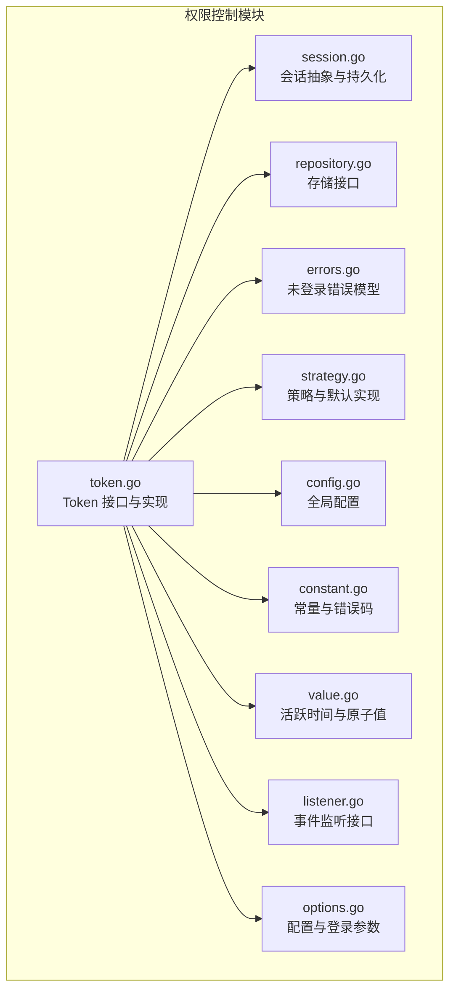
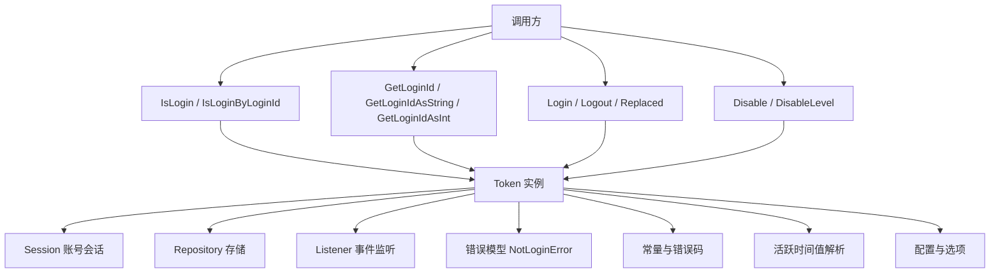
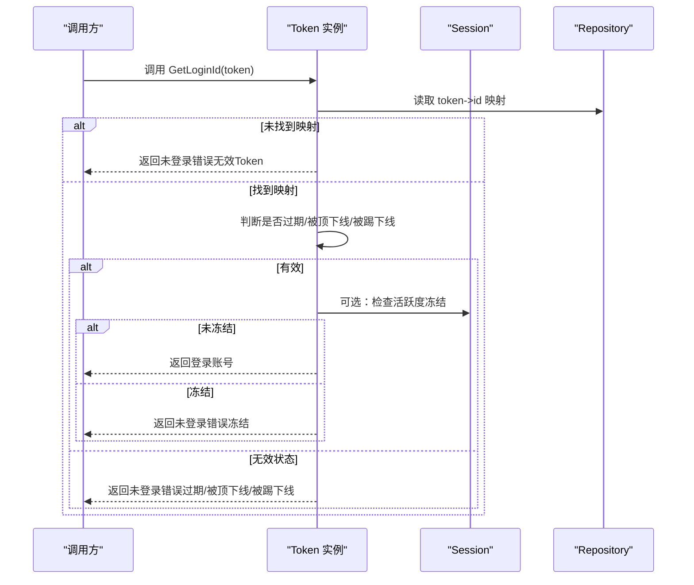
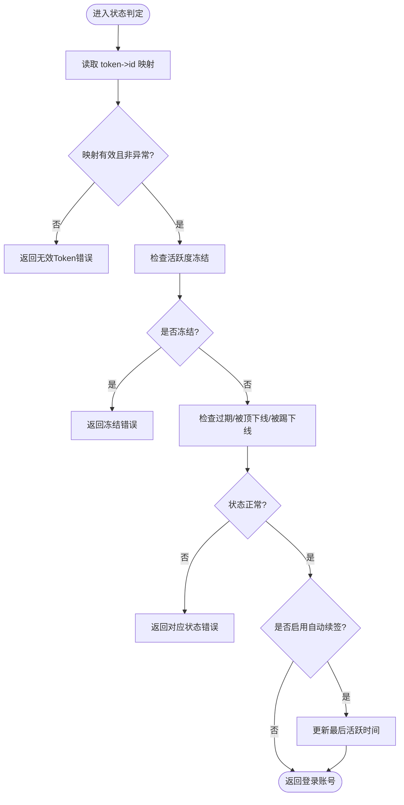
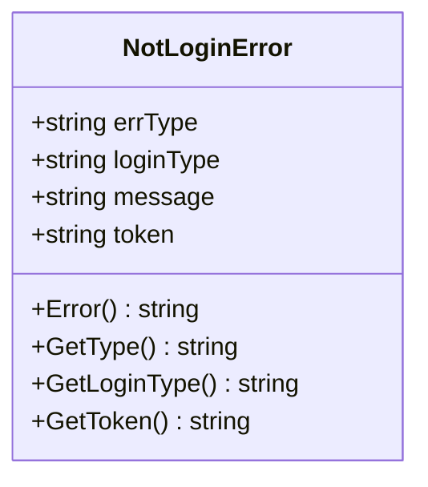
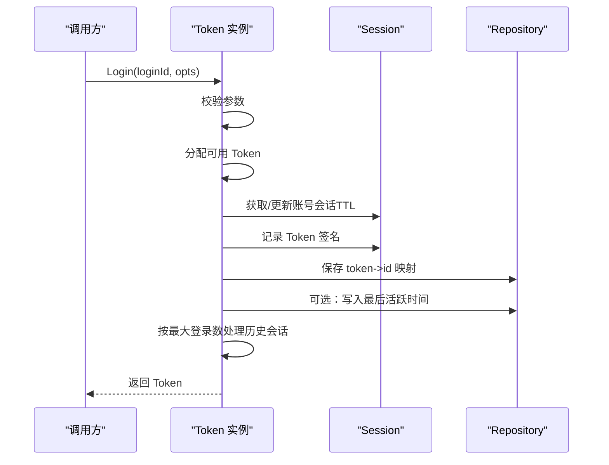
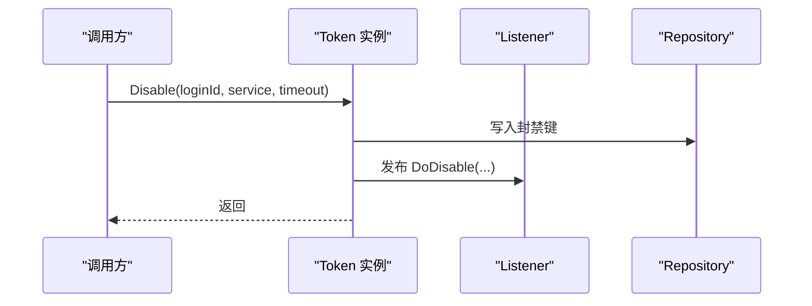
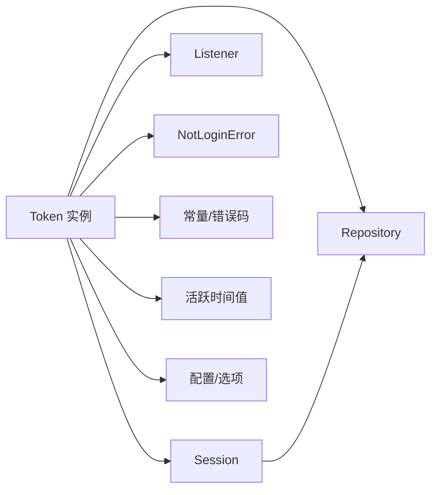

# 权限控制

<cite>
**本文引用的文件**
- [contrib/auth/token/token.go](file://contrib/auth/token/token.go)
- [contrib/auth/token/session.go](file://contrib/auth/token/session.go)
- [contrib/auth/token/repository.go](file://contrib/auth/token/repository.go)
- [contrib/auth/token/errors.go](file://contrib/auth/token/errors.go)
- [contrib/auth/token/strategy.go](file://contrib/auth/token/strategy.go)
- [contrib/auth/token/config.go](file://contrib/auth/token/config.go)
- [contrib/auth/token/constant.go](file://contrib/auth/token/constant.go)
- [contrib/auth/token/value.go](file://contrib/auth/token/value.go)
- [contrib/auth/token/listener.go](file://contrib/auth/token/listener.go)
- [contrib/auth/token/options.go](file://contrib/auth/token/options.go)
</cite>

## 目录
1. [简介](#简介)
2. [项目结构](#项目结构)
3. [核心组件](#核心组件)
4. [架构总览](#架构总览)
5. [详细组件分析](#详细组件分析)
6. [依赖关系分析](#依赖关系分析)
7. [性能考量](#性能考量)
8. [故障排查指南](#故障排查指南)
9. [结论](#结论)
10. [附录](#附录)

## 简介
本文件面向 Go Fox 权限控制模块，系统性阐述基于 Token 的权限验证与管理机制，覆盖以下关键主题：
- 权限验证入口与流程：IsLogin、IsLoginByLoginId 等方法的职责与调用路径
- 权限状态判定逻辑：Token 有效性、过期、被顶下线、被踢下线、活跃度冻结等
- 错误处理策略：针对无效 Token、过期、被顶下线、被踢下线、冻结等场景的统一错误模型
- 可扩展能力：如何基于 Token 信息实现自定义权限验证逻辑
- 使用示例：权限检查、验证、降级等典型场景
- 安全与最佳实践：配置建议、安全边界与运维要点

## 项目结构
权限控制位于 contrib/auth/token 子模块，围绕 Token 生命周期与会话管理构建，核心文件职责如下：
- token.go：Token 接口与实现，包含登录、登出、顶人下线、状态查询、封禁等
- session.go：会话抽象与持久化接口，维护账号与 Token 的关联及签名列表
- repository.go：底层存储接口，抽象键值读写、TTL、删除等
- errors.go：未登录错误模型，统一错误类型与消息
- strategy.go：默认 Token 生成策略、会话创建策略、唯一性保障策略
- config.go：全局配置与默认参数，含登录并发、活跃度、自动续签等
- constant.go：错误码与常量定义
- value.go：活跃时间值解析与原子值封装
- listener.go：事件监听接口，支持登录、登出、顶下线、封禁事件
- options.go：配置选项与登录参数

**图表来源**
- [contrib/auth/token/token.go](file://contrib/auth/token/token.go#L1-L120)
- [contrib/auth/token/session.go](file://contrib/auth/token/session.go#L1-L65)
- [contrib/auth/token/repository.go](file://contrib/auth/token/repository.go#L31-L40)
- [contrib/auth/token/errors.go](file://contrib/auth/token/errors.go#L26-L94)
- [contrib/auth/token/strategy.go](file://contrib/auth/token/strategy.go#L12-L72)
- [contrib/auth/token/config.go](file://contrib/auth/token/config.go#L9-L82)
- [contrib/auth/token/constant.go](file://contrib/auth/token/constant.go#L26-L53)
- [contrib/auth/token/value.go](file://contrib/auth/token/value.go#L14-L168)
- [contrib/auth/token/listener.go](file://contrib/auth/token/listener.go#L26-L59)
- [contrib/auth/token/options.go](file://contrib/auth/token/options.go#L42-L338)

**章节来源**
- [contrib/auth/token/token.go](file://contrib/auth/token/token.go#L1-L120)
- [contrib/auth/token/session.go](file://contrib/auth/token/session.go#L1-L65)
- [contrib/auth/token/repository.go](file://contrib/auth/token/repository.go#L31-L40)
- [contrib/auth/token/errors.go](file://contrib/auth/token/errors.go#L26-L94)
- [contrib/auth/token/strategy.go](file://contrib/auth/token/strategy.go#L12-L72)
- [contrib/auth/token/config.go](file://contrib/auth/token/config.go#L9-L82)
- [contrib/auth/token/constant.go](file://contrib/auth/token/constant.go#L26-L53)
- [contrib/auth/token/value.go](file://contrib/auth/token/value.go#L14-L168)
- [contrib/auth/token/listener.go](file://contrib/auth/token/listener.go#L26-L59)
- [contrib/auth/token/options.go](file://contrib/auth/token/options.go#L42-L338)

## 核心组件
- Token 接口与实现：提供登录、登出、顶人下线、按 Token/账号查询登录状态、获取登录账号、封禁等功能
- Session 抽象：维护账号会话、Token 签名列表、TTL、数据挂载等
- Repository 接口：抽象键值存储，支持 Get/Set/TTL/Update/Delete 等
- 错误模型：统一的未登录错误类型，携带错误类型、登录类型、Token 值与消息
- 策略：默认 Token 生成、会话创建、唯一性保障策略
- 配置：登录类型、Token 名称、并发策略、活跃度、自动续签、最大尝试次数、最大登录数、样式等
- 常量与错误码：定义无效、过期、被顶下线、被踢下线、冻结等错误码与消息
- 值工具：活跃时间值解析、原子值封装
- 监听器：登录、登出、顶下线、封禁事件回调
- 选项：配置项与登录参数，支持动态覆盖全局配置

**章节来源**
- [contrib/auth/token/token.go](file://contrib/auth/token/token.go#L15-L121)
- [contrib/auth/token/session.go](file://contrib/auth/token/session.go#L47-L84)
- [contrib/auth/token/repository.go](file://contrib/auth/token/repository.go#L31-L40)
- [contrib/auth/token/errors.go](file://contrib/auth/token/errors.go#L26-L94)
- [contrib/auth/token/strategy.go](file://contrib/auth/token/strategy.go#L12-L72)
- [contrib/auth/token/config.go](file://contrib/auth/token/config.go#L9-L82)
- [contrib/auth/token/constant.go](file://contrib/auth/token/constant.go#L26-L53)
- [contrib/auth/token/value.go](file://contrib/auth/token/value.go#L14-L168)
- [contrib/auth/token/listener.go](file://contrib/auth/token/listener.go#L26-L59)
- [contrib/auth/token/options.go](file://contrib/auth/token/options.go#L42-L338)

## 架构总览
权限控制以 Token 为中心，围绕“登录—会话—状态—封禁—事件”形成闭环。登录时生成 Token 并建立账号会话，后续通过 Token 查询登录状态、获取登录账号；若开启活跃度冻结，系统会在访问时检查最后活跃时间并按需冻结；封禁通过服务维度与等级实现精细化控制；事件监听器贯穿生命周期。

**图表来源**
- [contrib/auth/token/token.go](file://contrib/auth/token/token.go#L51-L121)
- [contrib/auth/token/session.go](file://contrib/auth/token/session.go#L47-L84)
- [contrib/auth/token/repository.go](file://contrib/auth/token/repository.go#L31-L40)
- [contrib/auth/token/errors.go](file://contrib/auth/token/errors.go#L26-L94)
- [contrib/auth/token/constant.go](file://contrib/auth/token/constant.go#L26-L53)
- [contrib/auth/token/value.go](file://contrib/auth/token/value.go#L14-L81)
- [contrib/auth/token/listener.go](file://contrib/auth/token/listener.go#L26-L59)
- [contrib/auth/token/options.go](file://contrib/auth/token/options.go#L42-L338)

## 详细组件分析

### 权限验证入口与流程
- IsLogin：根据 Token 查询是否存在合法映射，若存在则视为已登录
- IsLoginByLoginId：根据账号 ID 查询是否存在任何 Token，用于判断账号是否在线
- GetLoginId：综合判断 Token 有效性、过期、被顶下线、被踢下线、活跃度冻结等，返回登录账号或抛出对应错误
- GetLoginIdAsString/GetLoginIdAsInt：便捷获取账号字符串或整型 ID

**图表来源**
- [contrib/auth/token/token.go](file://contrib/auth/token/token.go#L361-L447)
- [contrib/auth/token/token.go](file://contrib/auth/token/token.go#L405-L465)
- [contrib/auth/token/token.go](file://contrib/auth/token/token.go#L586-L616)
- [contrib/auth/token/token.go](file://contrib/auth/token/token.go#L770-L790)
- [contrib/auth/token/constant.go](file://contrib/auth/token/constant.go#L26-L37)

**章节来源**
- [contrib/auth/token/token.go](file://contrib/auth/token/token.go#L51-L63)
- [contrib/auth/token/token.go](file://contrib/auth/token/token.go#L361-L447)
- [contrib/auth/token/token.go](file://contrib/auth/token/token.go#L405-L465)
- [contrib/auth/token/token.go](file://contrib/auth/token/token.go#L586-L616)
- [contrib/auth/token/token.go](file://contrib/auth/token/token.go#L770-L790)
- [contrib/auth/token/constant.go](file://contrib/auth/token/constant.go#L26-L37)

### 权限状态判定逻辑
- Token 有效性检查：通过存储层读取 token->id 映射，若为空或为异常标记值则视为无效
- 账号封禁状态检查：通过封禁键空间判断服务与等级，结合超时控制生效范围
- 活跃度冻结检查：若开启动态/静态活跃度，系统记录并校验最后活跃时间，超过阈值则冻结
- 自动续签：若启用自动续签，在检查通过后更新最后活跃时间为当前时间

**图表来源**
- [contrib/auth/token/token.go](file://contrib/auth/token/token.go#L586-L616)
- [contrib/auth/token/token.go](file://contrib/auth/token/token.go#L725-L790)
- [contrib/auth/token/token.go](file://contrib/auth/token/token.go#L434-L445)
- [contrib/auth/token/constant.go](file://contrib/auth/token/constant.go#L26-L37)

**章节来源**
- [contrib/auth/token/token.go](file://contrib/auth/token/token.go#L586-L616)
- [contrib/auth/token/token.go](file://contrib/auth/token/token.go#L725-L790)
- [contrib/auth/token/token.go](file://contrib/auth/token/token.go#L434-L445)
- [contrib/auth/token/constant.go](file://contrib/auth/token/constant.go#L26-L37)

### 错误处理与错误模型
- 未登录错误：统一由 NotLoginError 表达，包含错误类型、登录类型、Token 值与消息
- 错误类型：无效 Token、过期、被顶下线、被踢下线、冻结
- 使用建议：在业务层捕获错误并通过错误类型区分处理分支，避免将错误消息直接透传至前端

**图表来源**
- [contrib/auth/token/errors.go](file://contrib/auth/token/errors.go#L26-L94)

**章节来源**
- [contrib/auth/token/errors.go](file://contrib/auth/token/errors.go#L26-L94)
- [contrib/auth/token/constant.go](file://contrib/auth/token/constant.go#L26-L37)

### 登录与会话管理
- 登录流程：参数校验、分配可用 Token、更新账号会话 TTL、记录 Token 签名、保存映射、可选写入最后活跃时间、发布登录事件、按最大登录数处理历史会话
- 顶人下线：按账号与设备类型清除历史 Token，标记为被顶下线并发布事件
- 登出：支持按账号、按设备、按 Token 值登出，清理映射、活跃时间、会话对象，并在必要时注销账号会话
- 会话：维护签名列表、TTL、数据挂载，支持按设备筛选 Token 值列表

**图表来源**
- [contrib/auth/token/token.go](file://contrib/auth/token/token.go#L144-L207)
- [contrib/auth/token/token.go](file://contrib/auth/token/token.go#L209-L265)
- [contrib/auth/token/token.go](file://contrib/auth/token/token.go#L328-L359)
- [contrib/auth/token/session.go](file://contrib/auth/token/session.go#L86-L140)

**章节来源**
- [contrib/auth/token/token.go](file://contrib/auth/token/token.go#L144-L207)
- [contrib/auth/token/token.go](file://contrib/auth/token/token.go#L209-L265)
- [contrib/auth/token/token.go](file://contrib/auth/token/token.go#L328-L359)
- [contrib/auth/token/session.go](file://contrib/auth/token/session.go#L86-L140)

### 封禁与事件监听
- 封禁：支持按账号、服务、等级与超时进行封禁，发布封禁事件
- 事件：登录、登出、顶下线、封禁均有监听器回调，便于外部扩展审计、通知等

**图表来源**
- [contrib/auth/token/token.go](file://contrib/auth/token/token.go#L467-L506)
- [contrib/auth/token/listener.go](file://contrib/auth/token/listener.go#L50-L58)

**章节来源**
- [contrib/auth/token/token.go](file://contrib/auth/token/token.go#L467-L506)
- [contrib/auth/token/listener.go](file://contrib/auth/token/listener.go#L50-L58)

### 扩展机制与自定义权限验证
- 基于 Token 信息：在 GetLoginId 成功后，可读取账号 ID、设备、附加数据等，结合业务规则实现自定义权限验证
- 策略扩展：通过 WithCreateTokenFunction、WithGenerateUniqueToken、WithCreateSessionFunction 替换默认策略
- 存储扩展：通过 WithRepository 注入自定义 Repository 实现多活、分片、加密等需求
- 监听扩展：通过 WithAppendListener/WithSetListener 注入自定义监听器，实现审计、告警、统计等

**章节来源**
- [contrib/auth/token/options.go](file://contrib/auth/token/options.go#L145-L213)
- [contrib/auth/token/strategy.go](file://contrib/auth/token/strategy.go#L24-L72)
- [contrib/auth/token/config.go](file://contrib/auth/token/config.go#L21-L27)
- [contrib/auth/token/listener.go](file://contrib/auth/token/listener.go#L26-L59)

### 完整使用示例（步骤说明）
- 权限检查：调用 IsLogin/IsLoginByLoginId 判断 Token/账号是否在线
- 权限验证：调用 GetLoginId 获取登录账号，捕获 NotLoginError 并按错误类型处理
- 权限降级：在冻结/过期/被顶下线等场景返回降级策略（如匿名、提示重新登录）
- 登录与登出：Login/Logout/Replaced 完成登录生命周期管理
- 封禁：Disable/DisableLevel 实施账号封禁

**章节来源**
- [contrib/auth/token/token.go](file://contrib/auth/token/token.go#L51-L63)
- [contrib/auth/token/token.go](file://contrib/auth/token/token.go#L361-L447)
- [contrib/auth/token/token.go](file://contrib/auth/token/token.go#L467-L506)

## 依赖关系分析
- Token 实现依赖 Session、Repository、Listener、错误模型、常量、值工具与配置/选项
- Session 依赖 Repository 进行持久化
- 策略与配置共同决定 Token 生成与会话行为
- 监听器作为横切关注点，贯穿登录、登出、顶下线、封禁等事件

**图表来源**
- [contrib/auth/token/token.go](file://contrib/auth/token/token.go#L15-L121)
- [contrib/auth/token/session.go](file://contrib/auth/token/session.go#L47-L84)
- [contrib/auth/token/repository.go](file://contrib/auth/token/repository.go#L31-L40)
- [contrib/auth/token/errors.go](file://contrib/auth/token/errors.go#L26-L94)
- [contrib/auth/token/constant.go](file://contrib/auth/token/constant.go#L26-L53)
- [contrib/auth/token/value.go](file://contrib/auth/token/value.go#L14-L81)
- [contrib/auth/token/listener.go](file://contrib/auth/token/listener.go#L26-L59)
- [contrib/auth/token/options.go](file://contrib/auth/token/options.go#L42-L338)

**章节来源**
- [contrib/auth/token/token.go](file://contrib/auth/token/token.go#L15-L121)
- [contrib/auth/token/session.go](file://contrib/auth/token/session.go#L47-L84)
- [contrib/auth/token/repository.go](file://contrib/auth/token/repository.go#L31-L40)
- [contrib/auth/token/errors.go](file://contrib/auth/token/errors.go#L26-L94)
- [contrib/auth/token/constant.go](file://contrib/auth/token/constant.go#L26-L53)
- [contrib/auth/token/value.go](file://contrib/auth/token/value.go#L14-L81)
- [contrib/auth/token/listener.go](file://contrib/auth/token/listener.go#L26-L59)
- [contrib/auth/token/options.go](file://contrib/auth/token/options.go#L42-L338)

## 性能考量
- 唯一性保障：默认策略通过多次尝试生成唯一 Token，可通过 MaxTryCount 控制成本
- 活跃度检查：开启动态活跃度会增加存储读取次数，建议按需启用 AutoRenew 降低频繁检查成本
- 并发与共享：IsConcurrent 与 IsShare 影响 Token 复用与历史会话处理，合理配置可减少存储与网络压力
- 最大登录数：MaxLoginCount 与自动顶下线策略在高并发场景下需评估清理开销

[本节为通用指导，无需特定文件引用]

## 故障排查指南
- 无效 Token：确认 Token 是否存在于映射表，检查是否被顶下线或封禁
- 过期 Token：检查全局 Timeout 与登录时 timeout，确认是否触发过期
- 被顶下线/被踢下线：检查 Replaced/DisableLevel 是否生效，查看事件监听日志
- 冻结 Token：检查 ActiveTimeout/DynamicActiveTimeout 与最后活跃时间，确认是否超过阈值
- 存储异常：核对 Repository 实现与连接配置，确保 Get/Set/TTL/Delete 正常

**章节来源**
- [contrib/auth/token/token.go](file://contrib/auth/token/token.go#L405-L465)
- [contrib/auth/token/token.go](file://contrib/auth/token/token.go#L725-L790)
- [contrib/auth/token/errors.go](file://contrib/auth/token/errors.go#L26-L94)
- [contrib/auth/token/constant.go](file://contrib/auth/token/constant.go#L26-L37)

## 结论
Go Fox 权限控制模块以 Token 为核心，结合会话、存储、事件与配置，提供了完整的登录、状态判定、封禁与扩展能力。通过统一的错误模型与灵活的策略/选项，可在保证安全的前提下满足多样化的业务需求。建议在生产环境中合理配置并发、活跃度与自动续签，并结合监听器实现完善的审计与告警。

[本节为总结，无需特定文件引用]

## 附录
- 关键 API 速览
  - 登录/登出/顶人下线：Login、Logout、LogoutByDevice、LogoutByTokenValue、Replaced
  - 状态查询：IsLogin、IsLoginByLoginId、GetLoginId、GetLoginIdAsString、GetLoginIdAsInt
  - 封禁：Disable、DisableLevel
  - 会话：GetSessionByLoginId、GetSessionByLoginIdDefault、GetTokenSessionByTokenValue
- 配置要点
  - LoginType、TokenName、IsConcurrent、IsShare、Timeout、ActiveTimeout、DynamicActiveTimeout、AutoRenew、MaxTryCount、MaxLoginCount、Style
- 错误类型
  - 无效 Token、过期、被顶下线、被踢下线、冻结

**章节来源**
- [contrib/auth/token/token.go](file://contrib/auth/token/token.go#L15-L121)
- [contrib/auth/token/config.go](file://contrib/auth/token/config.go#L9-L82)
- [contrib/auth/token/constant.go](file://contrib/auth/token/constant.go#L26-L37)