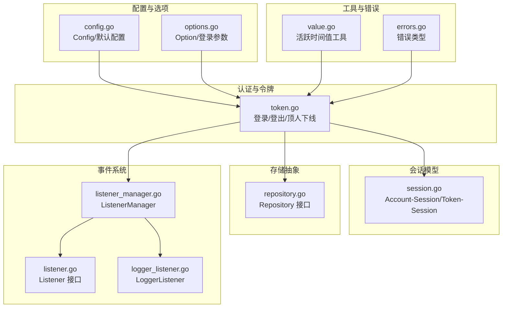
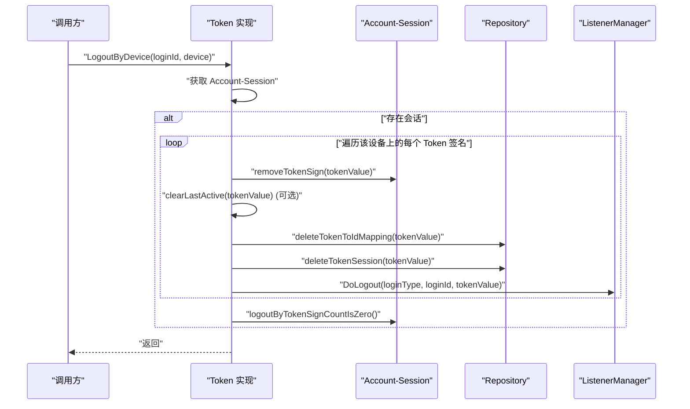
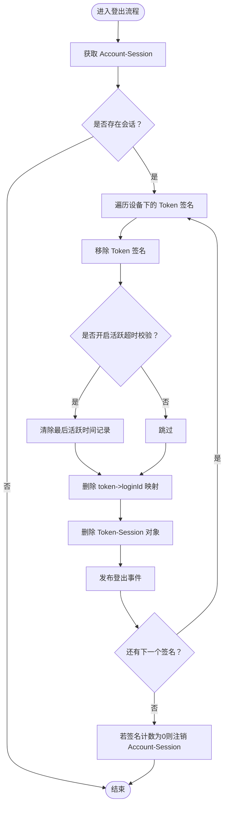
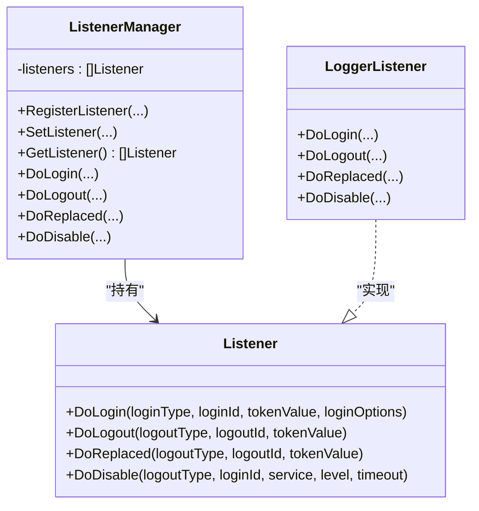
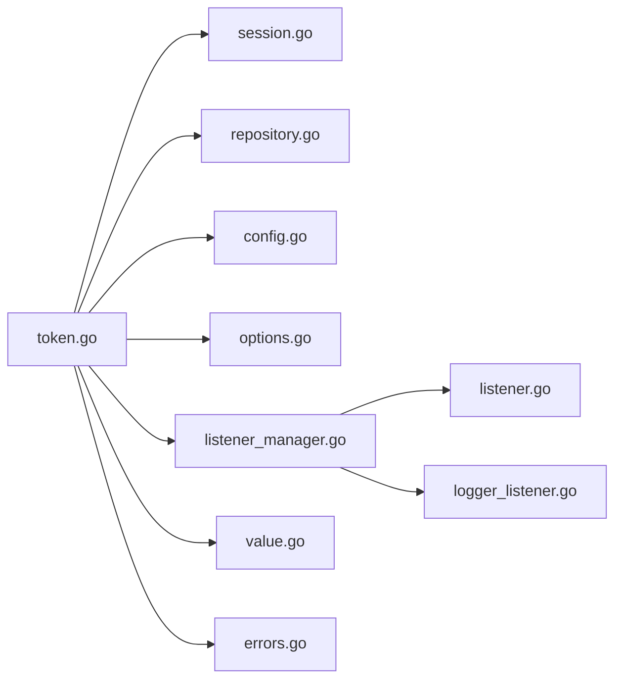

# 登出操作

<cite>
**本文引用的文件**
- [token.go](file://contrib/auth/token/token.go)
- [session.go](file://contrib/auth/token/session.go)
- [repository.go](file://contrib/auth/token/repository.go)
- [config.go](file://contrib/auth/token/config.go)
- [options.go](file://contrib/auth/token/options.go)
- [listener.go](file://contrib/auth/token/listener.go)
- [listener_manager.go](file://contrib/auth/token/listener_manager.go)
- [logger_listener.go](file://contrib/auth/token/logger_listener.go)
- [errors.go](file://contrib/auth/token/errors.go)
- [value.go](file://contrib/auth/token/value.go)
</cite>

## 目录
1. [简介](#简介)
2. [项目结构](#项目结构)
3. [核心组件](#核心组件)
4. [架构总览](#架构总览)
5. [详细组件分析](#详细组件分析)
6. [依赖关系分析](#依赖关系分析)
7. [性能考量](#性能考量)
8. [故障排查指南](#故障排查指南)
9. [结论](#结论)
10. [附录](#附录)

## 简介
本文件聚焦于 Go Fox 中的“登出”能力，系统性梳理 Logout 系列方法的实现机制与数据清理流程，涵盖：
- 按账号登出、按设备登出、按 Token 值登出等不同登出方式及其适用场景
- 登出过程中的数据清理步骤：Token 映射关系删除、会话数据清理、活跃度时间清除
- 登出事件的发布机制与事件监听器通知链路
- 特殊登出场景：顶人下线、强制登出、最大登录数限制触发的批量登出
- 使用示例与错误处理建议

## 项目结构
围绕“登出”的关键模块分布如下：
- 认证与令牌：token.go 提供登录与登出的核心逻辑
- 会话模型：session.go 定义会话结构与签名管理
- 存储抽象：repository.go 定义统一的 KV 存储接口
- 配置与选项：config.go、options.go 提供运行时配置与构建参数
- 事件系统：listener.go、listener_manager.go、logger_listener.go 提供事件发布与监听
- 值工具：value.go 提供活跃时间等值的序列化与解析
- 错误类型：errors.go 提供未登录等错误类型

图表来源
- [token.go](file://contrib/auth/token/token.go#L15-L50)
- [session.go](file://contrib/auth/token/session.go#L47-L64)
- [repository.go](file://contrib/auth/token/repository.go#L31-L39)
- [config.go](file://contrib/auth/token/config.go#L10-L29)
- [options.go](file://contrib/auth/token/options.go#L42-L213)
- [listener.go](file://contrib/auth/token/listener.go#L26-L58)
- [listener_manager.go](file://contrib/auth/token/listener_manager.go#L26-L117)
- [logger_listener.go](file://contrib/auth/token/logger_listener.go#L18-L61)
- [value.go](file://contrib/auth/token/value.go#L14-L81)
- [errors.go](file://contrib/auth/token/errors.go#L26-L93)

章节来源
- [token.go](file://contrib/auth/token/token.go#L15-L50)
- [session.go](file://contrib/auth/token/session.go#L47-L64)
- [repository.go](file://contrib/auth/token/repository.go#L31-L39)
- [config.go](file://contrib/auth/token/config.go#L10-L29)
- [options.go](file://contrib/auth/token/options.go#L42-L213)
- [listener.go](file://contrib/auth/token/listener.go#L26-L58)
- [listener_manager.go](file://contrib/auth/token/listener_manager.go#L26-L117)
- [logger_listener.go](file://contrib/auth/token/logger_listener.go#L18-L61)
- [value.go](file://contrib/auth/token/value.go#L14-L81)
- [errors.go](file://contrib/auth/token/errors.go#L26-L93)

## 核心组件
- Token 接口与实现：提供 Login、Logout、LogoutByDevice、LogoutByTokenValue、Replaced 等方法
- Session 抽象：维护 Account-Session 与 Token-Session，管理 Token 签名列表与 TTL
- Repository 接口：抽象存储层，支持 Get/Set/Update/Delete/TTL/UpdateTTL
- 配置与选项：控制登录类型、Token 名称、并发策略、最大登录数、活跃超时等
- 事件系统：Listener 接口与 ListenerManager，支持注册多个监听器并异步发布事件
- 值工具：活跃时间值的序列化与解析，支持动态活跃超时
- 错误类型：未登录等错误封装

章节来源
- [token.go](file://contrib/auth/token/token.go#L15-L50)
- [session.go](file://contrib/auth/token/session.go#L47-L64)
- [repository.go](file://contrib/auth/token/repository.go#L31-L39)
- [config.go](file://contrib/auth/token/config.go#L10-L29)
- [options.go](file://contrib/auth/token/options.go#L42-L213)
- [listener.go](file://contrib/auth/token/listener.go#L26-L58)
- [listener_manager.go](file://contrib/auth/token/listener_manager.go#L26-L117)
- [logger_listener.go](file://contrib/auth/token/logger_listener.go#L18-L61)
- [value.go](file://contrib/auth/token/value.go#L14-L81)
- [errors.go](file://contrib/auth/token/errors.go#L26-L93)

## 架构总览
以下序列图展示 LogoutByDevice 的典型调用链，体现数据清理与事件发布的主干流程。

图表来源
- [token.go](file://contrib/auth/token/token.go#L218-L265)
- [session.go](file://contrib/auth/token/session.go#L243-L266)
- [listener_manager.go](file://contrib/auth/token/listener_manager.go#L81-L91)

章节来源
- [token.go](file://contrib/auth/token/token.go#L218-L265)
- [session.go](file://contrib/auth/token/session.go#L243-L266)
- [listener_manager.go](file://contrib/auth/token/listener_manager.go#L81-L91)

## 详细组件分析

### Logout 系列方法与使用场景
- Logout(loginId): 以账号维度发起登出，等价于按设备登出且设备为空
- LogoutByDevice(loginId, device): 按账号与设备维度登出，适用于多设备场景
- LogoutByTokenValue(tokenValue): 按具体 Token 值登出，适用于单点登出或跨账号场景
- Replaced(loginId, device): 顶人下线，常用于管理员强制下线或并发策略冲突时的替换

使用场景建议：
- 主动登出：用户主动点击“退出”，使用 Logout 或 LogoutByDevice
- 条件登出：基于业务规则（如风控、审计）使用 LogoutByTokenValue
- 顶人下线：管理员或系统策略触发 Replaced，确保新登录生效
- 批量登出：通过 MaxLoginCount 触发的批量清理，或在业务侧逐个调用 LogoutByTokenValue

章节来源
- [token.go](file://contrib/auth/token/token.go#L25-L50)
- [token.go](file://contrib/auth/token/token.go#L209-L216)
- [token.go](file://contrib/auth/token/token.go#L218-L265)
- [token.go](file://contrib/auth/token/token.go#L267-L326)
- [token.go](file://contrib/auth/token/token.go#L328-L360)

### 数据清理流程详解
登出的核心步骤包括：
1) 从 Account-Session 移除 Token 签名
2) 可选：清除最后活跃时间记录
3) 删除 token -> loginId 映射
4) 删除 Token-Session 对象
5) 发布登出事件
6) 若会话中无剩余签名，注销 Account-Session

图表来源
- [token.go](file://contrib/auth/token/token.go#L224-L265)
- [token.go](file://contrib/auth/token/token.go#L267-L326)
- [session.go](file://contrib/auth/token/session.go#L243-L266)

章节来源
- [token.go](file://contrib/auth/token/token.go#L224-L265)
- [token.go](file://contrib/auth/token/token.go#L267-L326)
- [session.go](file://contrib/auth/token/session.go#L243-L266)

### 事件发布机制
- Listener 接口定义 DoLogin、DoLogout、DoReplaced、DoDisable 四类事件
- ListenerManager 统一管理监听器集合，DoLogout 会异步调用每个监听器的 DoLogout
- 默认 LoggerListener 会在 DoLogout 时输出日志，便于可观测性

图表来源
- [listener.go](file://contrib/auth/token/listener.go#L26-L58)
- [listener_manager.go](file://contrib/auth/token/listener_manager.go#L26-L117)
- [logger_listener.go](file://contrib/auth/token/logger_listener.go#L18-L61)

章节来源
- [listener.go](file://contrib/auth/token/listener.go#L26-L58)
- [listener_manager.go](file://contrib/auth/token/listener_manager.go#L26-L117)
- [logger_listener.go](file://contrib/auth/token/logger_listener.go#L18-L61)

### 特殊登出场景
- 顶人下线（Replaced）：当新登录或策略冲突时，移除指定账号在某设备上的所有 Token 签名并清理相关数据，随后发布 DoReplaced 事件
- 强制登出（LogoutByTokenValue）：根据具体 Token 值执行登出，清理映射与会话，发布 DoLogout 事件
- 批量登出（MaxLoginCount）：当同一账号的登录数超过上限时，按登录时间顺序批量注销最早的会话，清理映射与会话，发布 DoLogout 事件

章节来源
- [token.go](file://contrib/auth/token/token.go#L328-L360)
- [token.go](file://contrib/auth/token/token.go#L267-L326)
- [token.go](file://contrib/auth/token/token.go#L618-L672)

### 使用示例（路径指引）
- 主动登出（按账号）：调用 Logout
  - 示例路径：[Logout 方法](file://contrib/auth/token/token.go#L209-L216)
- 主动登出（按设备）：调用 LogoutByDevice
  - 示例路径：[LogoutByDevice 方法](file://contrib/auth/token/token.go#L218-L265)
- 单点登出（按 Token 值）：调用 LogoutByTokenValue
  - 示例路径：[LogoutByTokenValue 方法](file://contrib/auth/token/token.go#L267-L326)
- 顶人下线：调用 Replaced
  - 示例路径：[Replaced 方法](file://contrib/auth/token/token.go#L328-L360)
- 批量登出（最大登录数）：由 MaxLoginCount 触发
  - 示例路径：[logoutByMaxLoginCount 方法](file://contrib/auth/token/token.go#L618-L672)

章节来源
- [token.go](file://contrib/auth/token/token.go#L209-L216)
- [token.go](file://contrib/auth/token/token.go#L218-L265)
- [token.go](file://contrib/auth/token/token.go#L267-L326)
- [token.go](file://contrib/auth/token/token.go#L328-L360)
- [token.go](file://contrib/auth/token/token.go#L618-L672)

## 依赖关系分析
- Token 实现依赖 Session 与 Repository，负责会话签名管理与存储操作
- 配置与选项影响登录行为与登出策略（并发、共享、最大登录数、活跃超时）
- 事件系统通过 ListenerManager 解耦发布与订阅，支持扩展监听器
- 值工具与错误类型为活跃时间与错误处理提供支撑

图表来源
- [token.go](file://contrib/auth/token/token.go#L15-L50)
- [session.go](file://contrib/auth/token/session.go#L47-L64)
- [repository.go](file://contrib/auth/token/repository.go#L31-L39)
- [config.go](file://contrib/auth/token/config.go#L10-L29)
- [options.go](file://contrib/auth/token/options.go#L42-L213)
- [listener.go](file://contrib/auth/token/listener.go#L26-L58)
- [listener_manager.go](file://contrib/auth/token/listener_manager.go#L26-L117)
- [logger_listener.go](file://contrib/auth/token/logger_listener.go#L18-L61)
- [value.go](file://contrib/auth/token/value.go#L14-L81)
- [errors.go](file://contrib/auth/token/errors.go#L26-L93)

章节来源
- [token.go](file://contrib/auth/token/token.go#L15-L50)
- [session.go](file://contrib/auth/token/session.go#L47-L64)
- [repository.go](file://contrib/auth/token/repository.go#L31-L39)
- [config.go](file://contrib/auth/token/config.go#L10-L29)
- [options.go](file://contrib/auth/token/options.go#L42-L213)
- [listener.go](file://contrib/auth/token/listener.go#L26-L58)
- [listener_manager.go](file://contrib/auth/token/listener_manager.go#L26-L117)
- [logger_listener.go](file://contrib/auth/token/logger_listener.go#L18-L61)
- [value.go](file://contrib/auth/token/value.go#L14-L81)
- [errors.go](file://contrib/auth/token/errors.go#L26-L93)

## 性能考量
- 异步事件发布：ListenerManager 在 DoLogout 中采用 goroutine 并发调用监听器，避免阻塞主流程
- 活跃超时可选：仅在开启动态活跃超时或相关配置时才执行清理，减少不必要的存储访问
- 批量清理：MaxLoginCount 一次性清理多余会话，降低后续查询成本
- 存储接口抽象：通过 Repository 接口屏蔽底层实现差异，便于选择高性能存储（如 Redis）

章节来源
- [listener_manager.go](file://contrib/auth/token/listener_manager.go#L75-L91)
- [token.go](file://contrib/auth/token/token.go#L618-L672)
- [repository.go](file://contrib/auth/token/repository.go#L31-L39)

## 故障排查指南
常见问题与处理建议：
- 登出后仍可访问：确认是否正确调用了 LogoutByTokenValue 或 LogoutByDevice；检查是否遗漏了活跃超时清理步骤
- 事件未触发：检查 ListenerManager 是否已注册监听器；确认 DoLogout 调用链是否正常
- 会话未清理：核对 Account-Session 的签名计数是否为 0，否则不会触发 Account-Session 注销
- 并发冲突导致重复登出：使用 Replaced 或 MaxLoginCount 控制并发与登录数
- 错误类型：未登录错误可通过 errors 包提供的类型进行识别与处理

章节来源
- [token.go](file://contrib/auth/token/token.go#L218-L265)
- [token.go](file://contrib/auth/token/token.go#L267-L326)
- [listener_manager.go](file://contrib/auth/token/listener_manager.go#L81-L91)
- [session.go](file://contrib/auth/token/session.go#L243-L266)
- [errors.go](file://contrib/auth/token/errors.go#L26-L93)

## 结论
Go Fox 的登出体系以 Token 为核心，结合 Session 与 Repository 提供了灵活而健壮的登出能力。通过 Logout、LogoutByDevice、LogoutByTokenValue、Replaced 以及 MaxLoginCount 等机制，能够覆盖从用户主动登出到系统强制登出的多种场景。配合事件发布与监听器扩展，登出状态变化可被其他组件感知，形成完整的可观测与可扩展体系。

## 附录
- 配置要点：登录类型、Token 名称、并发策略、最大登录数、活跃超时、自动续签等
- 选项扩展：通过 Option 与 LoginOptions 自定义登录与登出行为
- 值工具：活跃时间值的序列化与解析，支持动态活跃超时
- 错误类型：未登录等错误封装，便于上层统一处理

章节来源
- [config.go](file://contrib/auth/token/config.go#L10-L29)
- [options.go](file://contrib/auth/token/options.go#L42-L213)
- [value.go](file://contrib/auth/token/value.go#L14-L81)
- [errors.go](file://contrib/auth/token/errors.go#L26-L93)