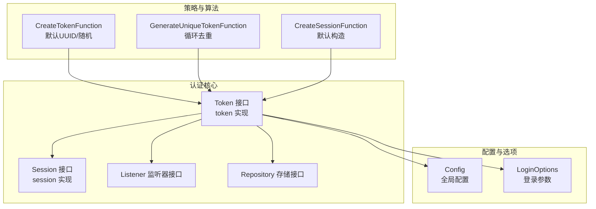
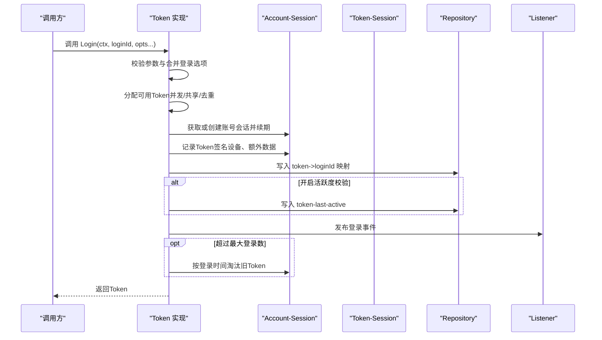
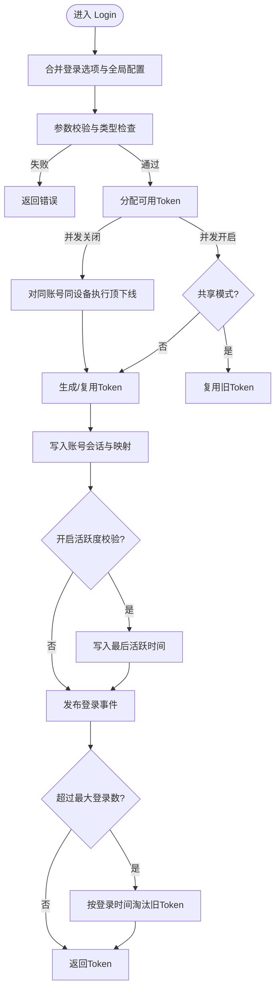
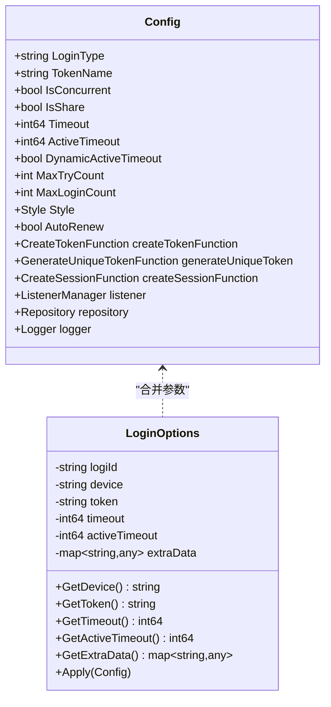
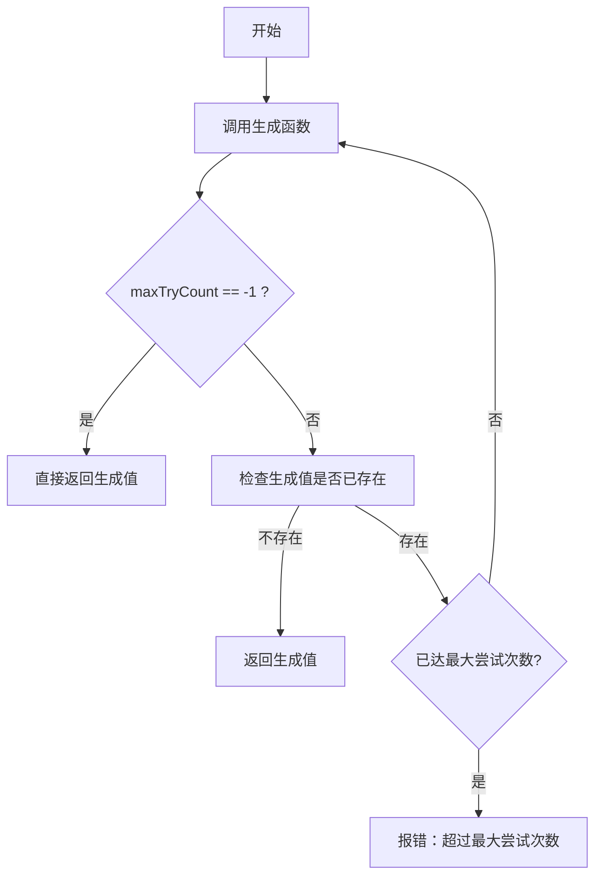
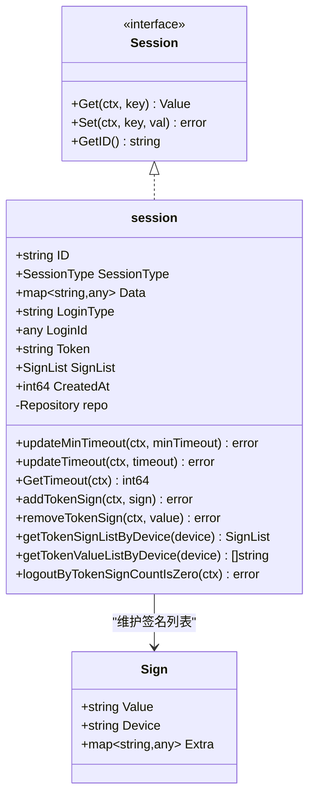
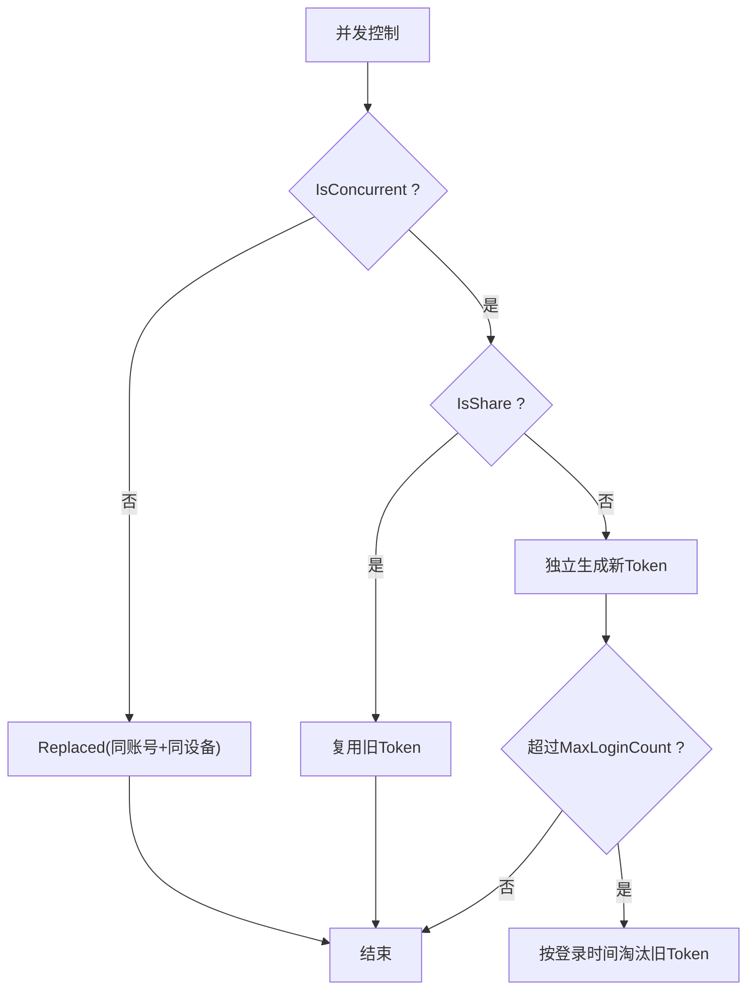
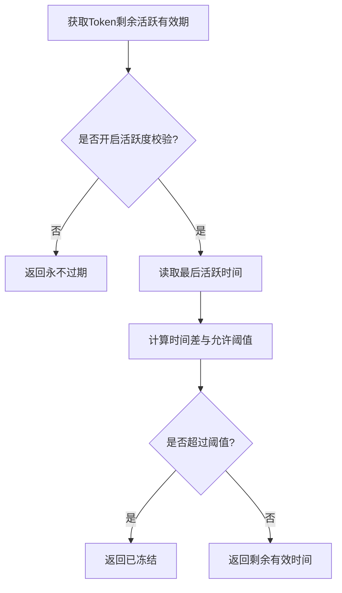
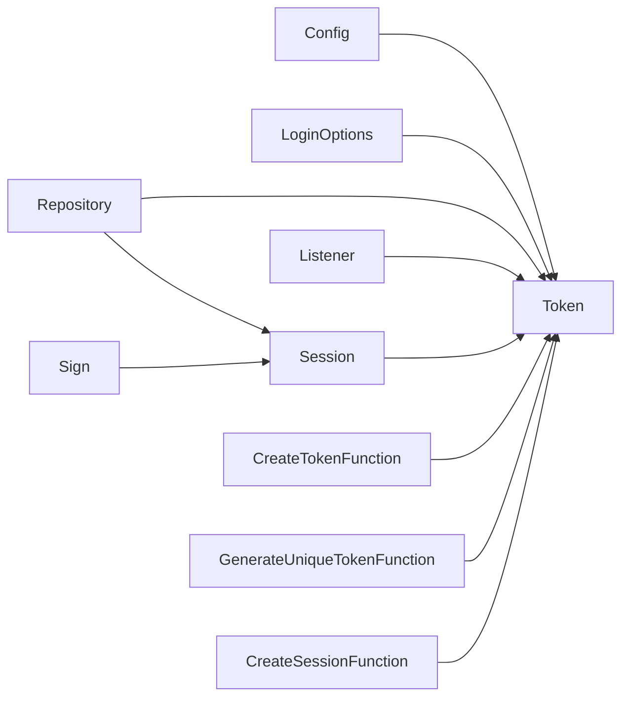

# 登录认证

<cite>
**本文引用的文件**
- [contrib/auth/token/token.go](file://contrib/auth/token/token.go)
- [contrib/auth/token/config.go](file://contrib/auth/token/config.go)
- [contrib/auth/token/options.go](file://contrib/auth/token/options.go)
- [contrib/auth/token/session.go](file://contrib/auth/token/session.go)
- [contrib/auth/token/strategy.go](file://contrib/auth/token/strategy.go)
- [contrib/auth/token/sign.go](file://contrib/auth/token/sign.go)
- [contrib/auth/token/value.go](file://contrib/auth/token/value.go)
- [contrib/auth/token/listener.go](file://contrib/auth/token/listener.go)
- [contrib/auth/token/repository.go](file://contrib/auth/token/repository.go)
- [contrib/auth/token/constant.go](file://contrib/auth/token/constant.go)
- [contrib/auth/token/errors.go](file://contrib/auth/token/errors.go)
</cite>

## 目录
1. [简介](#简介)
2. [项目结构](#项目结构)
3. [核心组件](#核心组件)
4. [架构总览](#架构总览)
5. [详细组件分析](#详细组件分析)
6. [依赖关系分析](#依赖关系分析)
7. [性能考量](#性能考量)
8. [故障排查指南](#故障排查指南)
9. [结论](#结论)
10. [附录：使用示例与最佳实践](#附录使用示例与最佳实践)

## 简介
本文件面向Go Fox中的登录认证模块，围绕Token登录能力提供系统化技术文档。重点覆盖以下方面：
- Login方法的完整实现流程：参数校验、Token分配算法、会话创建与维护
- 登录选项配置与使用：设备类型、有效期、活跃度冻结、并发控制、共享策略等
- 登录策略机制：单点登录、多点登录、共享登录的配置与行为差异
- Token生成与去重机制：样式选择、唯一性保障、冲突回退策略
- 使用示例与最佳实践：基础登录、带参数登录、自定义策略、常见问题与排障

## 项目结构
登录认证位于contrib/auth/token子目录，采用“接口+实现+策略+配置”的分层设计：
- 接口与实现：Token接口与token实现类，封装登录、登出、查询、封禁等能力
- 会话模型：Session接口与session实现，承载账号级与Token级会话状态
- 策略与算法：Token生成、唯一性保障、会话创建策略
- 配置与选项：全局配置Config与登录选项LoginOptions，支持灵活定制
- 存储与监听：Repository接口抽象存储，Listener接口提供事件回调
- 常量与错误：统一的错误类型与状态常量

**图示来源**
- [contrib/auth/token/token.go](file://contrib/auth/token/token.go#L15-L142)
- [contrib/auth/token/session.go](file://contrib/auth/token/session.go#L47-L64)
- [contrib/auth/token/strategy.go](file://contrib/auth/token/strategy.go#L12-L51)
- [contrib/auth/token/config.go](file://contrib/auth/token/config.go#L10-L49)
- [contrib/auth/token/options.go](file://contrib/auth/token/options.go#L42-L337)
- [contrib/auth/token/listener.go](file://contrib/auth/token/listener.go#L26-L58)
- [contrib/auth/token/repository.go](file://contrib/auth/token/repository.go#L31-L39)

**章节来源**
- [contrib/auth/token/token.go](file://contrib/auth/token/token.go#L15-L142)
- [contrib/auth/token/session.go](file://contrib/auth/token/session.go#L47-L64)
- [contrib/auth/token/strategy.go](file://contrib/auth/token/strategy.go#L12-L51)
- [contrib/auth/token/config.go](file://contrib/auth/token/config.go#L10-L49)
- [contrib/auth/token/options.go](file://contrib/auth/token/options.go#L42-L337)
- [contrib/auth/token/listener.go](file://contrib/auth/token/listener.go#L26-L58)
- [contrib/auth/token/repository.go](file://contrib/auth/token/repository.go#L31-L39)

## 核心组件
- Token接口与实现：提供Login、Logout、IsLogin、GetLoginId等能力；内部通过会话管理、存储仓库、监听器协同完成登录生命周期
- Session接口与实现：承载账号级会话状态，维护Token签名列表、TTL、扩展数据等
- 策略与算法：默认Token生成（UUID/随机）、唯一性保障（循环尝试+冲突检测）、会话创建策略
- 配置与选项：全局配置Config（登录类型、Token名称、并发、共享、有效期、活跃度、自动续签、最大尝试次数、最大登录数、样式、监听器、存储、日志等）；登录选项LoginOptions（设备、Token值、有效期、活跃度、额外数据）
- 存储与监听：Repository抽象存储；Listener提供登录、登出、顶下线、封禁事件回调
- 常量与错误：统一错误类型与状态常量，便于上层识别与处理

**章节来源**
- [contrib/auth/token/token.go](file://contrib/auth/token/token.go#L15-L142)
- [contrib/auth/token/session.go](file://contrib/auth/token/session.go#L47-L64)
- [contrib/auth/token/strategy.go](file://contrib/auth/token/strategy.go#L12-L71)
- [contrib/auth/token/config.go](file://contrib/auth/token/config.go#L10-L82)
- [contrib/auth/token/options.go](file://contrib/auth/token/options.go#L32-L337)
- [contrib/auth/token/listener.go](file://contrib/auth/token/listener.go#L26-L58)
- [contrib/auth/token/repository.go](file://contrib/auth/token/repository.go#L31-L39)
- [contrib/auth/token/constant.go](file://contrib/auth/token/constant.go#L26-L53)
- [contrib/auth/token/errors.go](file://contrib/auth/token/errors.go#L26-L93)

## 架构总览
登录认证的整体交互如下：

**图示来源**
- [contrib/auth/token/token.go](file://contrib/auth/token/token.go#L144-L207)
- [contrib/auth/token/token.go](file://contrib/auth/token/token.go#L535-L584)
- [contrib/auth/token/token.go](file://contrib/auth/token/token.go#L170-L183)
- [contrib/auth/token/token.go](file://contrib/auth/token/token.go#L184-L195)
- [contrib/auth/token/token.go](file://contrib/auth/token/token.go#L196-L205)

**章节来源**
- [contrib/auth/token/token.go](file://contrib/auth/token/token.go#L144-L207)

## 详细组件分析

### Login方法实现流程
- 参数装配与校验：收集登录选项，执行参数合法性检查（登录ID非空、类型合规、动态活跃度参数与全局配置一致性）
- 参数合并：将登录选项与全局配置合并，确定本次登录的有效期与活跃度阈值
- Token分配：
  - 若不允许并发登录，则先对同账号同设备执行“顶下线”
  - 若显式指定了Token值则直接复用
  - 在允许并发且共享模式下，优先复用同账号同设备的旧Token
  - 否则调用唯一性生成算法，循环生成并检测冲突，直至满足唯一性要求
- 会话与映射：
  - 获取或创建账号会话，按最小剩余存活时间策略续期
  - 在账号会话中记录Token签名（包含设备与额外数据）
  - 写入token->loginId映射，便于后续凭Token查询账号
  - 若开启活跃度校验，写入最后活跃时间
- 事件与清理：
  - 发布登录事件
  - 若超过最大登录数，按登录时间顺序淘汰旧Token
- 返回Token

**图示来源**
- [contrib/auth/token/token.go](file://contrib/auth/token/token.go#L144-L207)
- [contrib/auth/token/token.go](file://contrib/auth/token/token.go#L508-L533)
- [contrib/auth/token/token.go](file://contrib/auth/token/token.go#L535-L584)
- [contrib/auth/token/token.go](file://contrib/auth/token/token.go#L170-L205)

**章节来源**
- [contrib/auth/token/token.go](file://contrib/auth/token/token.go#L144-L207)
- [contrib/auth/token/token.go](file://contrib/auth/token/token.go#L508-L533)
- [contrib/auth/token/token.go](file://contrib/auth/token/token.go#L535-L584)

### 登录选项与配置
- 全局配置Config
  - 登录类型、Token名称、是否并发、是否共享、有效期、活跃度阈值、动态活跃度开关、最大尝试次数、最大登录数、Token样式、自动续签、监听器、存储、日志
- 登录选项LoginOptions
  - 设备、Token值、有效期、活跃度、额外数据
- 选项应用：登录时将登录选项与全局配置合并，若未设置则采用全局默认

**图示来源**
- [contrib/auth/token/config.go](file://contrib/auth/token/config.go#L10-L49)
- [contrib/auth/token/options.go](file://contrib/auth/token/options.go#L217-L324)

**章节来源**
- [contrib/auth/token/config.go](file://contrib/auth/token/config.go#L10-L82)
- [contrib/auth/token/options.go](file://contrib/auth/token/options.go#L217-L337)

### Token生成算法与去重机制
- Token样式：UUID、简UUID、随机32位、随机64位
- 去重策略：循环生成Token，调用检查函数确认唯一性；达到最大尝试次数仍未唯一则报错
- 生成函数：默认使用UUID或随机字符串；可替换为自定义生成逻辑
- 会话创建：默认构造session，包含ID、创建时间、签名列表、数据字典

**图示来源**
- [contrib/auth/token/strategy.go](file://contrib/auth/token/strategy.go#L51-L71)
- [contrib/auth/token/strategy.go](file://contrib/auth/token/strategy.go#L24-L38)
- [contrib/auth/token/strategy.go](file://contrib/auth/token/strategy.go#L40-L49)

**章节来源**
- [contrib/auth/token/strategy.go](file://contrib/auth/token/strategy.go#L12-L71)

### 会话模型与签名管理
- 会话类型：账号会话、Token会话、自定义会话
- 账号会话：维护登录签名列表（Token值、设备、额外数据）、TTL、扩展数据；支持按设备筛选Token值、按登录时间淘汰
- Token会话：绑定具体Token值与登录类型，用于凭Token查询账号

**图示来源**
- [contrib/auth/token/session.go](file://contrib/auth/token/session.go#L47-L64)
- [contrib/auth/token/session.go](file://contrib/auth/token/session.go#L142-L216)
- [contrib/auth/token/sign.go](file://contrib/auth/token/sign.go#L3-L25)

**章节来源**
- [contrib/auth/token/session.go](file://contrib/auth/token/session.go#L47-L216)
- [contrib/auth/token/sign.go](file://contrib/auth/token/sign.go#L3-L25)

### 登录策略与行为差异
- 单点登录（IsConcurrent=false）：同一账号在同设备的新登录会将旧登录“顶下线”，即旧Token被标记为失效
- 多点登录（IsConcurrent=true）：允许多个Token同时存在
  - 共享登录（IsShare=true）：同一账号在同设备复用旧Token，避免重复生成
  - 独立登录（IsShare=false）：每次登录生成新Token，受最大登录数限制
- 最大登录数（MaxLoginCount）：仅在并发且非共享时生效，按登录时间顺序淘汰最早登录的Token

**图示来源**
- [contrib/auth/token/token.go](file://contrib/auth/token/token.go#L535-L584)
- [contrib/auth/token/token.go](file://contrib/auth/token/token.go#L618-L672)

**章节来源**
- [contrib/auth/token/token.go](file://contrib/auth/token/token.go#L535-L584)
- [contrib/auth/token/token.go](file://contrib/auth/token/token.go#L618-L672)

### 活跃度冻结与自动续签
- 活跃度阈值：可通过全局或登录选项设置；支持动态活跃度开关以减少查询
- 冻结判定：基于最后活跃时间与允许的活跃间隔计算剩余有效时间，小于0则冻结
- 自动续签：若开启自动续签，在访问时刷新最后活跃时间

**图示来源**
- [contrib/auth/token/token.go](file://contrib/auth/token/token.go#L725-L790)
- [contrib/auth/token/value.go](file://contrib/auth/token/value.go#L14-L80)

**章节来源**
- [contrib/auth/token/token.go](file://contrib/auth/token/token.go#L696-L790)
- [contrib/auth/token/value.go](file://contrib/auth/token/value.go#L14-L80)

### 事件监听与扩展
- 监听器接口：提供登录、登出、顶下线、封禁事件回调
- 登录事件：在Token分配完成后异步发布
- 可通过选项注册或重置监听器，实现审计、统计、通知等功能

**章节来源**
- [contrib/auth/token/listener.go](file://contrib/auth/token/listener.go#L26-L58)
- [contrib/auth/token/config.go](file://contrib/auth/token/config.go#L48-L49)

## 依赖关系分析
- 组件耦合
  - Token实现依赖Config、LoginOptions、Repository、Listener、Session
  - Session实现依赖Repository与Sign列表
  - 策略函数作为可插拔组件注入Config
- 外部依赖
  - 存储抽象Repository由上层提供实现（如Redis）
  - 日志使用标准库slog
- 循环依赖
  - 未发现直接循环依赖；策略函数通过函数指针注入，避免编译期耦合

**图示来源**
- [contrib/auth/token/token.go](file://contrib/auth/token/token.go#L118-L142)
- [contrib/auth/token/session.go](file://contrib/auth/token/session.go#L54-L64)
- [contrib/auth/token/strategy.go](file://contrib/auth/token/strategy.go#L12-L22)
- [contrib/auth/token/config.go](file://contrib/auth/token/config.go#L22-L27)

**章节来源**
- [contrib/auth/token/token.go](file://contrib/auth/token/token.go#L118-L142)
- [contrib/auth/token/session.go](file://contrib/auth/token/session.go#L54-L64)
- [contrib/auth/token/strategy.go](file://contrib/auth/token/strategy.go#L12-L22)
- [contrib/auth/token/config.go](file://contrib/auth/token/config.go#L22-L27)

## 性能考量
- 并发与共享：合理设置IsConcurrent与IsShare可显著降低Token生成与存储压力
- 最大登录数：在并发场景下限制会话数量，避免无限增长
- 活跃度校验：动态活跃度可减少频繁查询，但需权衡准确性
- 唯一性尝试次数：MaxTryCount过高会增加CPU开销，建议结合Token样式与冲突概率评估
- 自动续签：频繁访问场景下可减少鉴权失败带来的重试成本

## 故障排查指南
- 常见错误类型
  - 无效Token、过期Token、被顶下线、被踢下线、被冻结
- 错误处理
  - 通过统一错误类型区分状态，便于上层分支处理
- 常见问题
  - Token为空或格式不正确：检查生成策略与存储键拼接
  - 登录后无法查询账号：确认token->loginId映射是否写入
  - 并发登录被挤掉：调整IsConcurrent或设备维度
  - 活跃度冻结频繁：提高活跃度阈值或关闭自动续签
  - 最大登录数不足：调高MaxLoginCount或允许共享

**章节来源**
- [contrib/auth/token/constant.go](file://contrib/auth/token/constant.go#L26-L42)
- [contrib/auth/token/errors.go](file://contrib/auth/token/errors.go#L26-L93)
- [contrib/auth/token/token.go](file://contrib/auth/token/token.go#L405-L447)

## 结论
Go Fox登录认证模块通过清晰的接口分层、可插拔的策略与完善的会话管理，提供了灵活、可扩展的Token登录能力。合理配置并发、共享、活跃度与最大登录数等参数，可在安全与性能之间取得平衡。结合事件监听与存储抽象，可快速适配多种运行环境。

## 附录：使用示例与最佳实践
- 基础登录
  - 创建Token实例，调用Login传入账号ID，返回Token
  - 可通过WithTimeout、WithActiveTimeout、WithDevice等选项微调
- 带参数登录
  - 指定有效期、活跃度阈值、设备类型、额外数据
  - 注意动态活跃度与全局配置的一致性
- 自定义策略
  - 替换Token生成函数、唯一性生成函数、会话创建函数
  - 注册监听器以接入审计与通知
- 最佳实践
  - 生产环境建议开启活跃度校验与自动续签
  - 并发场景下谨慎设置最大登录数，避免资源耗尽
  - 使用共享策略减少重复生成，提升吞吐
  - 对敏感操作使用短有效期与严格活跃度阈值

[本节为概念性内容，不直接分析具体文件，故无“章节来源”]