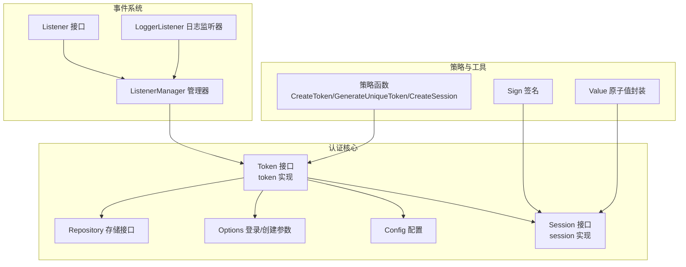
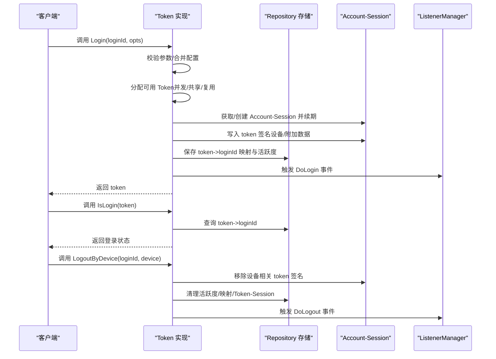
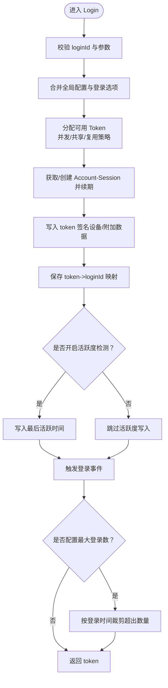
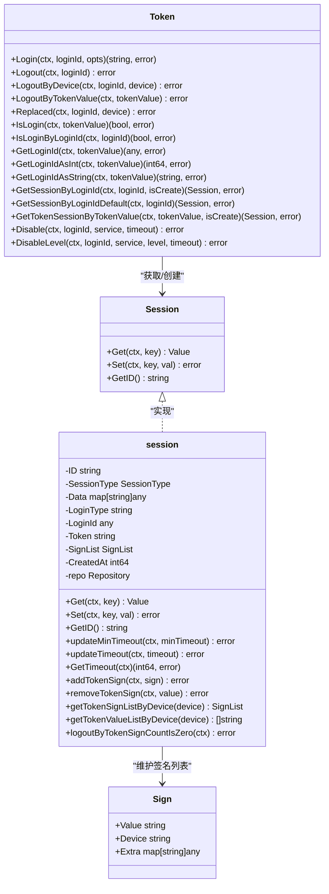
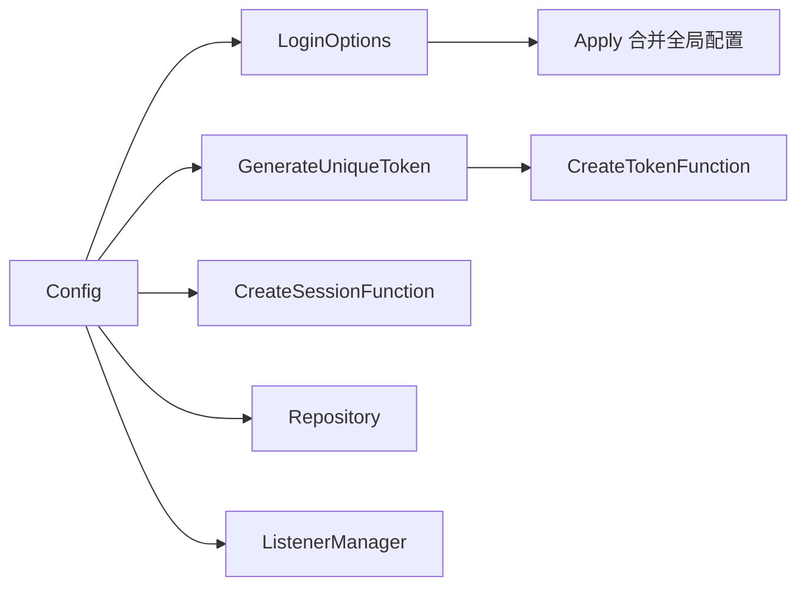
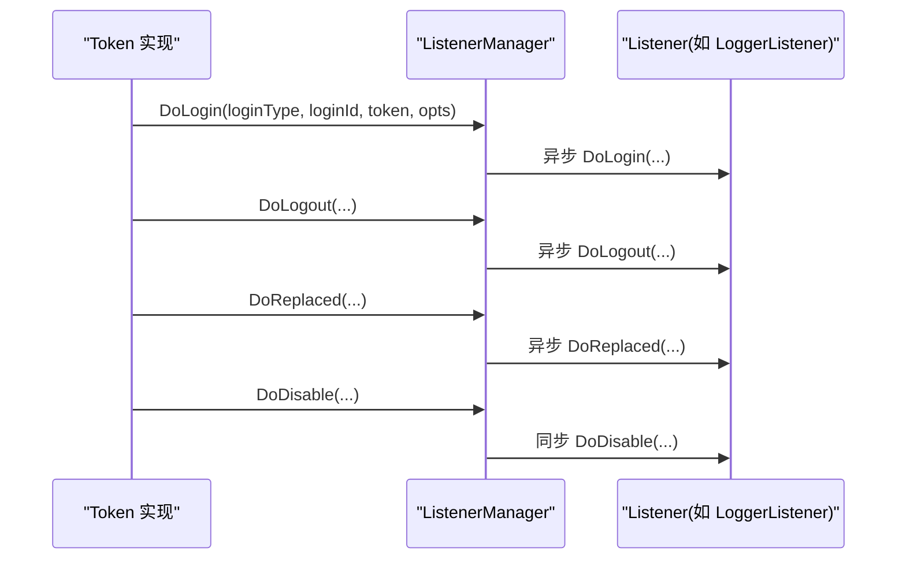
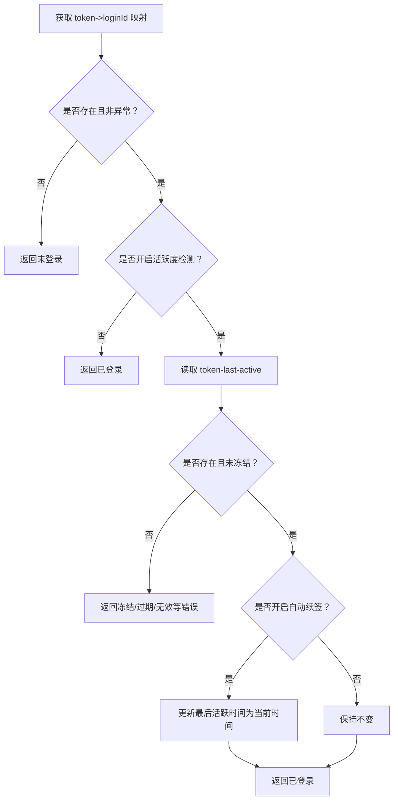
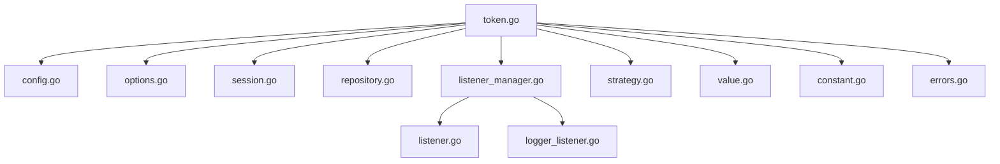

# 认证插件

<cite>
**本文引用的文件**
- [contrib/auth/token/token.go](file://contrib/auth/token/token.go)
- [contrib/auth/token/session.go](file://contrib/auth/token/session.go)
- [contrib/auth/token/config.go](file://contrib/auth/token/config.go)
- [contrib/auth/token/options.go](file://contrib/auth/token/options.go)
- [contrib/auth/token/strategy.go](file://contrib/auth/token/strategy.go)
- [contrib/auth/token/repository.go](file://contrib/auth/token/repository.go)
- [contrib/auth/token/sign.go](file://contrib/auth/token/sign.go)
- [contrib/auth/token/listener.go](file://contrib/auth/token/listener.go)
- [contrib/auth/token/listener_manager.go](file://contrib/auth/token/listener_manager.go)
- [contrib/auth/token/logger_listener.go](file://contrib/auth/token/logger_listener.go)
- [contrib/auth/token/value.go](file://contrib/auth/token/value.go)
- [contrib/auth/token/constant.go](file://contrib/auth/token/constant.go)
- [contrib/auth/token/errors.go](file://contrib/auth/token/errors.go)
- [contrib/auth/token/session_test.go](file://contrib/auth/token/session_test.go)
</cite>

## 目录
1. [简介](#简介)
2. [项目结构](#项目结构)
3. [核心组件](#核心组件)
4. [架构总览](#架构总览)
5. [详细组件分析](#详细组件分析)
6. [依赖关系分析](#依赖关系分析)
7. [性能与扩展性](#性能与扩展性)
8. [故障排查指南](#故障排查指南)
9. [结论](#结论)
10. [附录：配置与使用示例](#附录配置与使用示例)

## 简介
本文件为 Go Fox 认证插件的技术文档，聚焦于基于 Token 的认证机制实现，涵盖登录流程、会话管理、权限控制、事件监听、并发登录控制、设备管理、活跃度检测、封禁策略以及 Redis 存储等关键能力。读者可据此快速完成用户认证功能的集成与扩展。

## 项目结构
认证插件位于 contrib/auth/token 目录，采用“接口 + 策略 + 会话 + 存储”的分层设计：
- 接口与实现：Token 接口及其实现 token，提供 Login、Logout、IsLogin 等核心方法
- 会话模型：Session 接口与 session 结构体，区分 Account-Session 与 Token-Session
- 配置与策略：Config、Style、CreateTokenFunction、GenerateUniqueTokenFunction 等
- 存储抽象：Repository 接口，适配 Redis 等后端
- 事件系统：Listener 接口与 ListenerManager 管理器，支持登录、登出、顶下线、封禁事件
- 辅助模块：Sign 签名、活跃度时间值封装、常量与错误类型

**图表来源**
- [contrib/auth/token/token.go](file://contrib/auth/token/token.go#L15-L116)
- [contrib/auth/token/session.go](file://contrib/auth/token/session.go#L47-L64)
- [contrib/auth/token/config.go](file://contrib/auth/token/config.go#L9-L29)
- [contrib/auth/token/options.go](file://contrib/auth/token/options.go#L42-L338)
- [contrib/auth/token/strategy.go](file://contrib/auth/token/strategy.go#L12-L72)
- [contrib/auth/token/repository.go](file://contrib/auth/token/repository.go#L31-L39)
- [contrib/auth/token/sign.go](file://contrib/auth/token/sign.go#L3-L25)
- [contrib/auth/token/value.go](file://contrib/auth/token/value.go#L91-L105)
- [contrib/auth/token/listener.go](file://contrib/auth/token/listener.go#L26-L58)
- [contrib/auth/token/listener_manager.go](file://contrib/auth/token/listener_manager.go#L26-L43)

**章节来源**
- [contrib/auth/token/token.go](file://contrib/auth/token/token.go#L1-L1130)
- [contrib/auth/token/session.go](file://contrib/auth/token/session.go#L1-L578)
- [contrib/auth/token/config.go](file://contrib/auth/token/config.go#L1-L82)
- [contrib/auth/token/options.go](file://contrib/auth/token/options.go#L1-L338)
- [contrib/auth/token/strategy.go](file://contrib/auth/token/strategy.go#L1-L72)
- [contrib/auth/token/repository.go](file://contrib/auth/token/repository.go#L1-L40)
- [contrib/auth/token/sign.go](file://contrib/auth/token/sign.go#L1-L26)
- [contrib/auth/token/listener.go](file://contrib/auth/token/listener.go#L1-L59)
- [contrib/auth/token/listener_manager.go](file://contrib/auth/token/listener_manager.go#L1-L118)
- [contrib/auth/token/logger_listener.go](file://contrib/auth/token/logger_listener.go#L1-L62)
- [contrib/auth/token/value.go](file://contrib/auth/token/value.go#L1-L168)
- [contrib/auth/token/constant.go](file://contrib/auth/token/constant.go#L1-L53)
- [contrib/auth/token/errors.go](file://contrib/auth/token/errors.go#L1-L94)

## 核心组件
- Token 接口与实现
  - 提供 Login、Logout、LogoutByDevice、LogoutByTokenValue、Replaced、IsLogin、IsLoginByLoginId、GetLoginId/AsInt/AsString、GetSessionByLoginId/Default、GetTokenSessionByTokenValue、Disable/DisableLevel 等方法
  - 支持并发登录控制、设备维度登录、最大登录数限制、活跃度冻结、自动续签等特性
- Session 接口与实现
  - 区分 Account-Session（按账号维度）与 Token-Session（按 token 维度）
  - 支持会话 TTL 续期、签名列表维护、按设备筛选、空会话清理
- 配置与策略
  - Config：登录类型、Token 名称、并发策略、超时、活跃度、最大尝试次数、最大登录数、样式、自动续签、事件监听器、存储、日志
  - 策略函数：默认 UUID/随机字符串生成、唯一性生成、会话创建
- 存储抽象
  - Repository 接口：Get/Set/Update/TTL/UpdateTTL/Delete
- 事件系统
  - Listener 接口：DoLogin/DoLogout/DoReplaced/DoDisable
  - ListenerManager：注册/设置/执行监听器
  - LoggerListener：默认日志监听器

**章节来源**
- [contrib/auth/token/token.go](file://contrib/auth/token/token.go#L15-L116)
- [contrib/auth/token/session.go](file://contrib/auth/token/session.go#L47-L64)
- [contrib/auth/token/config.go](file://contrib/auth/token/config.go#L9-L29)
- [contrib/auth/token/strategy.go](file://contrib/auth/token/strategy.go#L12-L72)
- [contrib/auth/token/repository.go](file://contrib/auth/token/repository.go#L31-L39)
- [contrib/auth/token/listener.go](file://contrib/auth/token/listener.go#L26-L58)
- [contrib/auth/token/listener_manager.go](file://contrib/auth/token/listener_manager.go#L26-L43)

## 架构总览
认证插件通过 Token 实现串联登录、会话、存储与事件系统，形成“登录即会话、会话即状态”的统一模型。

**图表来源**
- [contrib/auth/token/token.go](file://contrib/auth/token/token.go#L144-L207)
- [contrib/auth/token/token.go](file://contrib/auth/token/token.go#L218-L265)
- [contrib/auth/token/token.go](file://contrib/auth/token/token.go#L361-L376)
- [contrib/auth/token/session.go](file://contrib/auth/token/session.go#L142-L158)
- [contrib/auth/token/listener_manager.go](file://contrib/auth/token/listener_manager.go#L69-L79)

## 详细组件分析

### Token 接口与登录流程
- 登录(Login)
  - 参数校验与配置合并
  - 并发策略：是否允许同一账号多地登录；是否共享同一 token
  - 唯一性生成：通过策略函数生成并校验唯一 token
  - Account-Session 续期与签名写入
  - 保存 token->loginId 映射与活跃度（可选）
  - 触发登录事件
  - 最大登录数控制（按设备维度）
- 会话查询(IsLogin/IsLoginByLoginId)
  - 通过 token 查询 loginId，结合活跃度冻结判定
- 退出(Logout/LogoutByDevice/LogoutByTokenValue/Replaced)
  - 按设备或 token 值清理签名、活跃度、映射与 Token-Session
  - Account-Session 在无签名时自动注销
- 账号封禁(Disable/DisableLevel)
  - 以 loginId + service 为键写入封禁等级与过期时间，触发封禁事件

**图表来源**
- [contrib/auth/token/token.go](file://contrib/auth/token/token.go#L144-L207)
- [contrib/auth/token/token.go](file://contrib/auth/token/token.go#L535-L584)
- [contrib/auth/token/token.go](file://contrib/auth/token/token.go#L618-L672)

**章节来源**
- [contrib/auth/token/token.go](file://contrib/auth/token/token.go#L144-L207)
- [contrib/auth/token/token.go](file://contrib/auth/token/token.go#L209-L326)
- [contrib/auth/token/token.go](file://contrib/auth/token/token.go#L361-L447)
- [contrib/auth/token/token.go](file://contrib/auth/token/token.go#L467-L506)

### 会话管理：Account-Session 与 Token-Session
- Account-Session
  - 以账号维度持有会话数据，维护 token 签名列表（含设备与附加数据）
  - 支持最小 TTL 续期、按设备筛选、空会话自动注销
- Token-Session
  - 以 token 维度持有会话数据，便于按 token 快速定位与清理
  - 由策略函数创建，与 Repository 协作持久化

**图表来源**
- [contrib/auth/token/token.go](file://contrib/auth/token/token.go#L15-L116)
- [contrib/auth/token/session.go](file://contrib/auth/token/session.go#L47-L64)
- [contrib/auth/token/session.go](file://contrib/auth/token/session.go#L142-L158)
- [contrib/auth/token/sign.go](file://contrib/auth/token/sign.go#L3-L25)

**章节来源**
- [contrib/auth/token/session.go](file://contrib/auth/token/session.go#L47-L64)
- [contrib/auth/token/session.go](file://contrib/auth/token/session.go#L142-L158)
- [contrib/auth/token/session.go](file://contrib/auth/token/session.go#L182-L216)
- [contrib/auth/token/session.go](file://contrib/auth/token/session.go#L243-L254)
- [contrib/auth/token/sign.go](file://contrib/auth/token/sign.go#L3-L25)

### 认证策略与配置
- 配置(Config)
  - 关键字段：登录类型、Token 名称、并发策略(IsConcurrent/IsShare)、超时(Timeout)、活跃度(ActiveTimeout/DynamicActiveTimeout)、最大尝试次数(MaxTryCount)、最大登录数(MaxLoginCount)、样式(Style)、自动续签(AutoRenew)、策略函数、监听器、存储、日志
- 策略函数(CreateTokenFunction/GenerateUniqueTokenFunction/CreateSessionFunction)
  - 默认实现：UUID、简单 UUID、随机 32/64 字符串；唯一性生成循环尝试；会话创建初始化
- 登录选项(LoginOptions/LoginOption)
  - 设备(Device)、预设 Token(Token)、有效期(Timeout)、活跃度(ActiveTimeout)、附加数据(ExtraData)，并支持 Apply 合并全局配置

**图表来源**
- [contrib/auth/token/config.go](file://contrib/auth/token/config.go#L9-L29)
- [contrib/auth/token/options.go](file://contrib/auth/token/options.go#L217-L324)
- [contrib/auth/token/strategy.go](file://contrib/auth/token/strategy.go#L24-L71)

**章节来源**
- [contrib/auth/token/config.go](file://contrib/auth/token/config.go#L9-L29)
- [contrib/auth/token/options.go](file://contrib/auth/token/options.go#L217-L324)
- [contrib/auth/token/strategy.go](file://contrib/auth/token/strategy.go#L24-L71)

### 事件监听与日志
- Listener 接口
  - DoLogin、DoLogout、DoReplaced、DoDisable 四类事件
- ListenerManager
  - 注册/设置监听器，异步触发 DoLogin/DoLogout/DoReplaced，同步触发 DoDisable
- LoggerListener
  - 默认日志监听器，输出登录、登出、顶下线、封禁等事件信息

**图表来源**
- [contrib/auth/token/listener.go](file://contrib/auth/token/listener.go#L26-L58)
- [contrib/auth/token/listener_manager.go](file://contrib/auth/token/listener_manager.go#L69-L117)
- [contrib/auth/token/logger_listener.go](file://contrib/auth/token/logger_listener.go#L23-L61)

**章节来源**
- [contrib/auth/token/listener.go](file://contrib/auth/token/listener.go#L26-L58)
- [contrib/auth/token/listener_manager.go](file://contrib/auth/token/listener_manager.go#L26-L43)
- [contrib/auth/token/listener_manager.go](file://contrib/auth/token/listener_manager.go#L69-L117)
- [contrib/auth/token/logger_listener.go](file://contrib/auth/token/logger_listener.go#L18-L61)

### 活跃度检测与冻结
- 活跃度键结构：token-last-active，值格式包含“最后活跃时间”和“活跃超时阈值”
- 判定逻辑：若当前时间与最后活跃时间之差超过阈值，则视为冻结
- 自动续签：若开启 AutoRenew，则每次访问更新最后活跃时间为当前时间

**图表来源**
- [contrib/auth/token/token.go](file://contrib/auth/token/token.go#L435-L446)
- [contrib/auth/token/token.go](file://contrib/auth/token/token.go#L725-L790)
- [contrib/auth/token/value.go](file://contrib/auth/token/value.go#L14-L81)

**章节来源**
- [contrib/auth/token/token.go](file://contrib/auth/token/token.go#L725-L790)
- [contrib/auth/token/value.go](file://contrib/auth/token/value.go#L14-L81)

### 封禁策略
- 封禁键：loginId + service
- 支持等级与过期时间，触发 DoDisable 事件
- 默认服务与等级常量定义

**章节来源**
- [contrib/auth/token/token.go](file://contrib/auth/token/token.go#L476-L506)
- [contrib/auth/token/constant.go](file://contrib/auth/token/constant.go#L48-L52)

## 依赖关系分析
- 组件耦合
  - Token 依赖 Config、Repository、ListenerManager、策略函数
  - Session 依赖 Repository 以持久化
  - ListenerManager 依赖 Listener 接口
- 外部依赖
  - Redis 缓存：通过 Repository 接口实现（见 Redis 实现文件）
  - 日志：slog
  - 工具库：lancet、google/uuid、github.com/duke-git/lancet/v2/random

**图表来源**
- [contrib/auth/token/token.go](file://contrib/auth/token/token.go#L1-L1130)
- [contrib/auth/token/config.go](file://contrib/auth/token/config.go#L1-L82)
- [contrib/auth/token/options.go](file://contrib/auth/token/options.go#L1-L338)
- [contrib/auth/token/session.go](file://contrib/auth/token/session.go#L1-L578)
- [contrib/auth/token/repository.go](file://contrib/auth/token/repository.go#L1-L40)
- [contrib/auth/token/listener.go](file://contrib/auth/token/listener.go#L1-L59)
- [contrib/auth/token/listener_manager.go](file://contrib/auth/token/listener_manager.go#L1-L118)
- [contrib/auth/token/logger_listener.go](file://contrib/auth/token/logger_listener.go#L1-L62)
- [contrib/auth/token/strategy.go](file://contrib/auth/token/strategy.go#L1-L72)
- [contrib/auth/token/value.go](file://contrib/auth/token/value.go#L1-L168)
- [contrib/auth/token/constant.go](file://contrib/auth/token/constant.go#L1-L53)
- [contrib/auth/token/errors.go](file://contrib/auth/token/errors.go#L1-L94)

**章节来源**
- [contrib/auth/token/token.go](file://contrib/auth/token/token.go#L1-L1130)
- [contrib/auth/token/session.go](file://contrib/auth/token/session.go#L1-L578)
- [contrib/auth/token/config.go](file://contrib/auth/token/config.go#L1-L82)
- [contrib/auth/token/options.go](file://contrib/auth/token/options.go#L1-L338)
- [contrib/auth/token/strategy.go](file://contrib/auth/token/strategy.go#L1-L72)
- [contrib/auth/token/repository.go](file://contrib/auth/token/repository.go#L1-L40)
- [contrib/auth/token/listener.go](file://contrib/auth/token/listener.go#L1-L59)
- [contrib/auth/token/listener_manager.go](file://contrib/auth/token/listener_manager.go#L1-L118)
- [contrib/auth/token/logger_listener.go](file://contrib/auth/token/logger_listener.go#L1-L62)
- [contrib/auth/token/value.go](file://contrib/auth/token/value.go#L1-L168)
- [contrib/auth/token/constant.go](file://contrib/auth/token/constant.go#L1-L53)
- [contrib/auth/token/errors.go](file://contrib/auth/token/errors.go#L1-L94)

## 性能与扩展性
- 唯一性生成
  - 默认策略循环尝试生成唯一 token，可通过 MaxTryCount 控制尝试上限
- 并发登录控制
  - IsConcurrent 与 IsShare 可减少重复查询与冲突
  - MaxLoginCount 限制同一账号登录数，按登录时间顺序裁剪
- 活跃度检测
  - DynamicActiveTimeout 可按需开启，避免频繁读取活跃度键
  - AutoRenew 在高并发场景下建议谨慎开启，避免频繁写入
- 存储层优化
  - Repository 接口抽象，可替换为 Redis 等高性能存储
  - TTL 与 UpdateTTL 操作应尽量批量或合并，降低网络往返

[本节为通用指导，不直接分析具体文件]

## 故障排查指南
- 常见错误类型
  - 无效 token、过期 token、被顶下线、被踢下线、被冻结
- 错误处理
  - GetLoginId 系列方法在不同异常状态下返回特定错误类型
  - 活跃度检测失败时返回冻结错误
- 日志与事件
  - 使用 LoggerListener 查看登录/登出/顶下线/封禁事件
  - 若未收到事件，检查 ListenerManager 的监听器注册与执行

**章节来源**
- [contrib/auth/token/constant.go](file://contrib/auth/token/constant.go#L26-L37)
- [contrib/auth/token/errors.go](file://contrib/auth/token/errors.go#L26-L94)
- [contrib/auth/token/token.go](file://contrib/auth/token/token.go#L412-L447)
- [contrib/auth/token/token.go](file://contrib/auth/token/token.go#L770-L790)
- [contrib/auth/token/logger_listener.go](file://contrib/auth/token/logger_listener.go#L23-L61)

## 结论
本认证插件提供了完善的 Token 认证能力：登录、会话、并发控制、设备管理、活跃度冻结、封禁策略与事件系统。通过 Config 与策略函数可灵活定制行为，配合 Repository 抽象可无缝对接 Redis 等存储。建议在生产环境中合理配置并发与活跃度策略，并结合事件系统完善审计与监控。

[本节为总结性内容，不直接分析具体文件]

## 附录：配置与使用示例

### 配置项概览
- 登录类型：LoginType
- Token 名称：TokenName
- 并发策略：IsConcurrent、IsShare
- 超时：Timeout（秒）、ActiveTimeout（秒，-1 表示永不过期）
- 动态活跃度：DynamicActiveTimeout
- 最大尝试次数：MaxTryCount
- 最大登录数：MaxLoginCount
- Token 样式：Style（uuid、simple-uuid、random-32、random-64）
- 自动续签：AutoRenew
- 策略函数：WithCreateTokenFunction、WithGenerateUniqueToken、WithCreateSessionFunction
- 监听器：WithAppendListener、WithSetListener
- 存储：WithRepository
- 日志：WithLogger

**章节来源**
- [contrib/auth/token/config.go](file://contrib/auth/token/config.go#L9-L29)
- [contrib/auth/token/options.go](file://contrib/auth/token/options.go#L42-L213)
- [contrib/auth/token/strategy.go](file://contrib/auth/token/strategy.go#L12-L22)

### 使用示例（步骤说明）
- 初始化 Token 实例
  - 通过 New 或 NewWithConfig 构造
  - 可通过 WithRepository 注入 Redis 存储
  - 可通过 WithAppendListener/WithSetListener 注入事件监听器
- 登录
  - 调用 Login(loginId, opts)，返回 token
  - 可通过 LoginWithDevice 指定设备
- 查询登录状态
  - 调用 IsLogin(token) 或 IsLoginByLoginId(loginId)
- 获取账号
  - 调用 GetLoginId/GetLoginIdAsInt/GetLoginIdAsString
- 退出
  - Logout(loginId)、LogoutByDevice(loginId, device)、LogoutByTokenValue(tokenValue)
  - Replaced(loginId, device) 用于顶人下线
- 会话管理
  - GetSessionByLoginId/GetSessionByLoginIdDefault 获取 Account-Session
  - GetTokenSessionByTokenValue 获取 Token-Session
- 封禁
  - Disable(loginId, service, timeout) 或 DisableLevel(loginId, service, level, timeout)

**章节来源**
- [contrib/auth/token/token.go](file://contrib/auth/token/token.go#L123-L142)
- [contrib/auth/token/token.go](file://contrib/auth/token/token.go#L144-L207)
- [contrib/auth/token/token.go](file://contrib/auth/token/token.go#L209-L326)
- [contrib/auth/token/token.go](file://contrib/auth/token/token.go#L361-L447)
- [contrib/auth/token/token.go](file://contrib/auth/token/token.go#L467-L506)
- [contrib/auth/token/options.go](file://contrib/auth/token/options.go#L326-L338)

### 集成指南（Redis 存储）
- 实现 Repository 接口
  - 使用 Redis 作为底层存储，实现 Get/Set/Update/TTL/UpdateTTL/Delete
- 注入存储
  - 通过 WithRepository 注入自定义 Repository 实例
- 验证
  - 登录后检查 Redis 中的 token->loginId 映射与活跃度键是否存在

**章节来源**
- [contrib/auth/token/repository.go](file://contrib/auth/token/repository.go#L31-L39)
- [contrib/auth/token/options.go](file://contrib/auth/token/options.go#L195-L203)

### 测试参考
- 会话签名添加测试
  - 参考 session_test.go 中的 AddTokenSign 测试用例

**章节来源**
- [contrib/auth/token/session_test.go](file://contrib/auth/token/session_test.go#L8-L61)