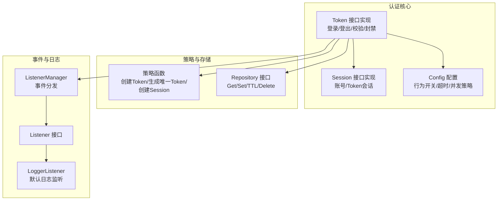
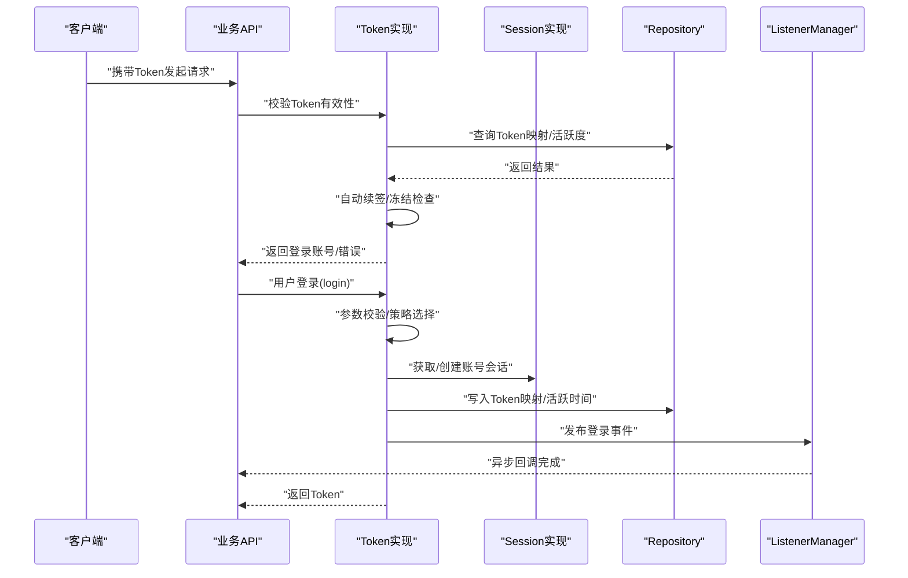
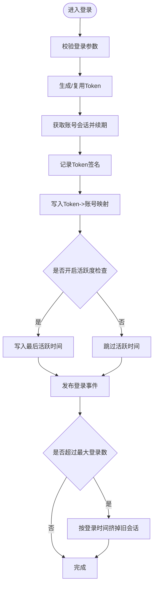
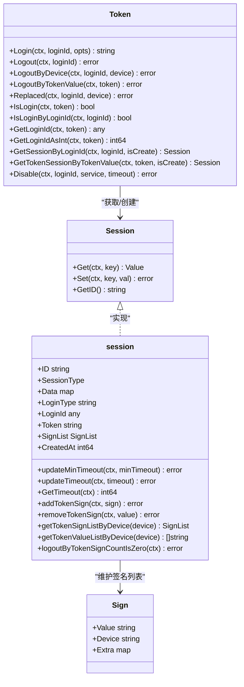
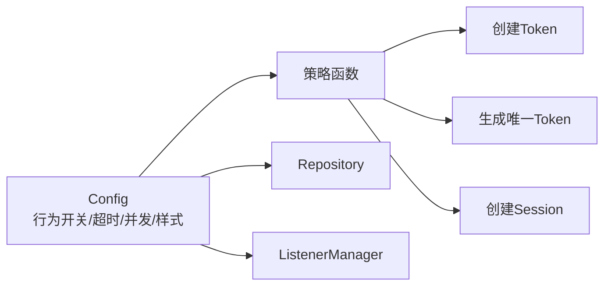
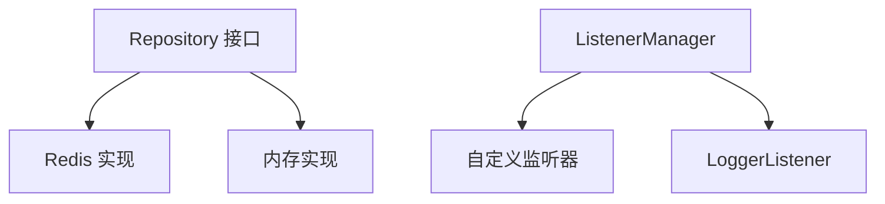
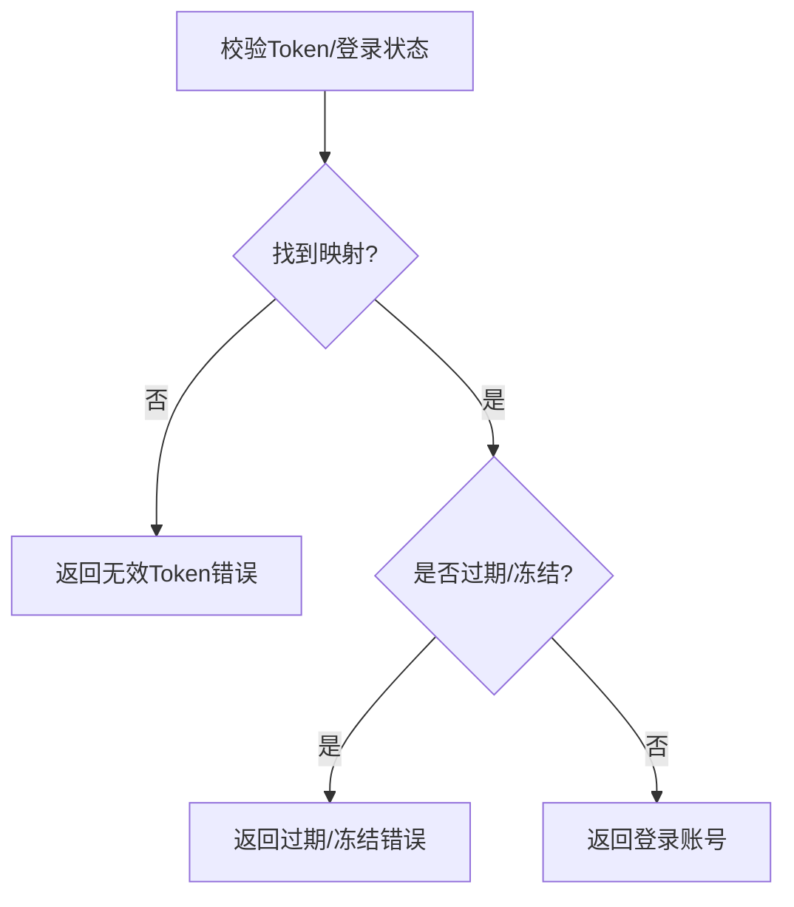
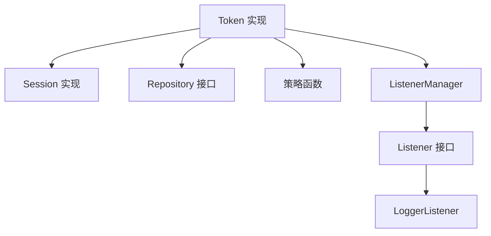

# 认证概述

<cite>
**本文档引用的文件**
- [contrib/auth/token/token.go](file://contrib/auth/token/token.go)
- [contrib/auth/token/config.go](file://contrib/auth/token/config.go)
- [contrib/auth/token/session.go](file://contrib/auth/token/session.go)
- [contrib/auth/token/options.go](file://contrib/auth/token/options.go)
- [contrib/auth/token/strategy.go](file://contrib/auth/token/strategy.go)
- [contrib/auth/token/sign.go](file://contrib/auth/token/sign.go)
- [contrib/auth/token/repository.go](file://contrib/auth/token/repository.go)
- [contrib/auth/token/listener.go](file://contrib/auth/token/listener.go)
- [contrib/auth/token/listener_manager.go](file://contrib/auth/token/listener_manager.go)
- [contrib/auth/token/logger_listener.go](file://contrib/auth/token/logger_listener.go)
- [contrib/auth/token/constant.go](file://contrib/auth/token/constant.go)
- [contrib/auth/token/value.go](file://contrib/auth/token/value.go)
- [contrib/auth/token/errors.go](file://contrib/auth/token/errors.go)
- [README.md](file://README.md)
</cite>

## 目录
1. [引言](#引言)
2. [项目结构](#项目结构)
3. [核心组件](#核心组件)
4. [架构总览](#架构总览)
5. [详细组件分析](#详细组件分析)
6. [依赖关系分析](#依赖关系分析)
7. [性能考量](#性能考量)
8. [故障排查指南](#故障排查指南)
9. [结论](#结论)
10. [附录](#附录)

## 引言
本文件面向Go Fox认证插件的综合性概述，重点阐述基于Token的认证机制与设计思想，涵盖认证接口定义、配置选项、认证流程与架构、与其他组件的交互关系、Token生成与验证、会话管理、使用场景与适用范围、性能与安全考量，以及生产部署建议。目标是帮助开发者快速理解并正确使用认证能力。

## 项目结构
认证插件位于贡献模块contrib/auth/token下，采用分层与职责分离的设计：
- 接口与实现：Token接口及其实现，负责登录、登出、顶替、校验、封禁等核心逻辑
- 会话模型：Session接口与具体实现，承载账号级与Token级会话状态
- 配置与策略：Config与策略函数（创建Token、生成唯一Token、创建Session）
- 存储抽象：Repository接口，屏蔽底层存储细节
- 监听与事件：Listener接口与ListenerManager，统一发布登录/登出/顶替/封禁事件
- 常量与工具：错误类型、常量、活跃时间值解析等

**图表来源**
- [contrib/auth/token/token.go](file://contrib/auth/token/token.go#L15-L142)
- [contrib/auth/token/session.go](file://contrib/auth/token/session.go#L47-L64)
- [contrib/auth/token/config.go](file://contrib/auth/token/config.go#L9-L29)
- [contrib/auth/token/strategy.go](file://contrib/auth/token/strategy.go#L12-L22)
- [contrib/auth/token/repository.go](file://contrib/auth/token/repository.go#L31-L39)
- [contrib/auth/token/listener.go](file://contrib/auth/token/listener.go#L26-L58)
- [contrib/auth/token/listener_manager.go](file://contrib/auth/token/listener_manager.go#L26-L43)
- [contrib/auth/token/logger_listener.go](file://contrib/auth/token/logger_listener.go#L18-L21)

**章节来源**
- [README.md](file://README.md#L1-L3)
- [contrib/auth/token/token.go](file://contrib/auth/token/token.go#L1-L142)
- [contrib/auth/token/session.go](file://contrib/auth/token/session.go#L1-L64)
- [contrib/auth/token/config.go](file://contrib/auth/token/config.go#L1-L82)

## 核心组件
- Token接口与实现：提供登录、登出、按设备/按Token值登出、顶替、登录状态校验、获取登录账号、会话获取、封禁等功能；贯穿登录生命周期的状态维护与事件发布
- Session接口与实现：抽象账号级与Token级会话，支持会话数据读写、TTL更新、令牌签名列表维护、按设备筛选等
- Config配置：集中控制登录类型、Token名称、并发策略、活跃度冻结、最大尝试次数、最大登录数、样式、自动续签、策略函数、监听器、存储与日志等
- 策略函数：默认的Token生成、唯一性保障、会话创建策略
- Repository接口：抽象存储读写、TTL、删除等能力，便于替换Redis、内存等实现
- 监听器体系：统一的事件发布机制，支持自定义扩展与默认日志监听

**章节来源**
- [contrib/auth/token/token.go](file://contrib/auth/token/token.go#L15-L142)
- [contrib/auth/token/session.go](file://contrib/auth/token/session.go#L47-L64)
- [contrib/auth/token/config.go](file://contrib/auth/token/config.go#L9-L82)
- [contrib/auth/token/strategy.go](file://contrib/auth/token/strategy.go#L12-L72)
- [contrib/auth/token/repository.go](file://contrib/auth/token/repository.go#L31-L39)
- [contrib/auth/token/listener.go](file://contrib/auth/token/listener.go#L26-L58)
- [contrib/auth/token/listener_manager.go](file://contrib/auth/token/listener_manager.go#L26-L43)
- [contrib/auth/token/logger_listener.go](file://contrib/auth/token/logger_listener.go#L18-L62)

## 架构总览
认证插件在微服务框架中的定位是“横切关注点”，通过统一的Token接口对外暴露认证能力，内部通过配置驱动策略与存储，通过监听器解耦事件通知。典型交互如下：

**图表来源**
- [contrib/auth/token/token.go](file://contrib/auth/token/token.go#L144-L207)
- [contrib/auth/token/session.go](file://contrib/auth/token/session.go#L70-L84)
- [contrib/auth/token/repository.go](file://contrib/auth/token/repository.go#L31-L39)
- [contrib/auth/token/listener_manager.go](file://contrib/auth/token/listener_manager.go#L69-L91)

## 详细组件分析

### 认证接口与登录流程
- 登录(Login)：参数校验 → 策略生成/复用Token → 获取账号会话并续期 → 记录Token签名 → 写入Token映射 → 可选写入活跃时间 → 发布登录事件 → 超额登录处理
- 登出(Logout/LogoutByDevice/LogoutByTokenValue)：按设备/按Token值清理签名、活跃时间、映射、Token会话，并在必要时注销账号会话
- 顶替(Replaced)：针对同一账号同设备的旧Token执行标记与事件发布
- 校验(IsLogin/IsLoginByLoginId/GetLoginId)：查询Token映射、异常标记、活跃度冻结、自动续签等

**图表来源**
- [contrib/auth/token/token.go](file://contrib/auth/token/token.go#L144-L207)
- [contrib/auth/token/token.go](file://contrib/auth/token/token.go#L535-L584)
- [contrib/auth/token/token.go](file://contrib/auth/token/token.go#L209-L265)

**章节来源**
- [contrib/auth/token/token.go](file://contrib/auth/token/token.go#L15-L207)
- [contrib/auth/token/token.go](file://contrib/auth/token/token.go#L209-L326)
- [contrib/auth/token/token.go](file://contrib/auth/token/token.go#L328-L391)

### 会话模型与签名管理
- Session接口：提供Get/Set、ID、类型、数据容器等能力
- 账号会话(AccountSession)：维护SignList（Token签名列表）、登录类型、登录ID、创建时间、TTL等
- Token会话(TokenSession)：与具体Token绑定，便于按Token维度管理
- 签名Sign：包含Token值、设备、额外数据，用于区分不同终端/设备的登录

**图表来源**
- [contrib/auth/token/token.go](file://contrib/auth/token/token.go#L15-L142)
- [contrib/auth/token/session.go](file://contrib/auth/token/session.go#L47-L64)
- [contrib/auth/token/session.go](file://contrib/auth/token/session.go#L142-L180)
- [contrib/auth/token/sign.go](file://contrib/auth/token/sign.go#L3-L25)

**章节来源**
- [contrib/auth/token/session.go](file://contrib/auth/token/session.go#L47-L180)
- [contrib/auth/token/sign.go](file://contrib/auth/token/sign.go#L3-L25)

### 配置与策略
- Config：登录类型、Token名称、并发策略(IsConcurrent/IsShare)、有效期(Timeout)、活跃度(ActiveTimeout/DynamicActiveTimeout)、最大尝试(MaxTryCount)、最大登录数(MaxLoginCount)、样式(Style)、自动续签(AutoRenew)、策略函数、监听器、存储与日志
- 策略函数：
  - 创建Token(defaultCreateTokenFunction)：支持UUID、简单UUID、随机32/64字符
  - 生成唯一Token(defaultGenerateUniqueToken)：循环尝试确保唯一性
  - 创建Session(defaultCreateSessionFunction)：初始化会话结构

**图表来源**
- [contrib/auth/token/config.go](file://contrib/auth/token/config.go#L9-L82)
- [contrib/auth/token/strategy.go](file://contrib/auth/token/strategy.go#L24-L71)

**章节来源**
- [contrib/auth/token/config.go](file://contrib/auth/token/config.go#L9-L82)
- [contrib/auth/token/strategy.go](file://contrib/auth/token/strategy.go#L12-L72)

### 存储抽象与事件监听
- Repository接口：Get/Set/TTL/Update/UpdateTTL/Delete，屏蔽底层存储差异
- Listener接口与ListenerManager：统一发布登录/登出/顶替/封禁事件，支持注册/重置/获取监听器，内置LoggerListener输出默认日志

**图表来源**
- [contrib/auth/token/repository.go](file://contrib/auth/token/repository.go#L31-L39)
- [contrib/auth/token/listener.go](file://contrib/auth/token/listener.go#L26-L58)
- [contrib/auth/token/listener_manager.go](file://contrib/auth/token/listener_manager.go#L26-L43)
- [contrib/auth/token/logger_listener.go](file://contrib/auth/token/logger_listener.go#L18-L62)

**章节来源**
- [contrib/auth/token/repository.go](file://contrib/auth/token/repository.go#L31-L39)
- [contrib/auth/token/listener.go](file://contrib/auth/token/listener.go#L26-L58)
- [contrib/auth/token/listener_manager.go](file://contrib/auth/token/listener_manager.go#L26-L118)
- [contrib/auth/token/logger_listener.go](file://contrib/auth/token/logger_listener.go#L18-L62)

### 错误处理与常量
- NotLoginError：封装错误类型、登录类型、消息与Token值，统一对外报告未登录相关问题
- 常量：无效Token、过期、被顶下线、被踢、被冻结、永不过期、不存在值等

**图表来源**
- [contrib/auth/token/token.go](file://contrib/auth/token/token.go#L412-L447)
- [contrib/auth/token/errors.go](file://contrib/auth/token/errors.go#L26-L94)
- [contrib/auth/token/constant.go](file://contrib/auth/token/constant.go#L26-L46)

**章节来源**
- [contrib/auth/token/errors.go](file://contrib/auth/token/errors.go#L26-L94)
- [contrib/auth/token/constant.go](file://contrib/auth/token/constant.go#L26-L53)

## 依赖关系分析
- 组件耦合与内聚：Token实现内聚于登录/会话/存储/事件等核心职责；Session与Sign解耦于具体存储；策略函数与配置解耦于实现细节
- 外部依赖：lancet(random/convertor)、google/uuid、slog等
- 监听器扩展：通过Listener接口与ListenerManager实现事件的可插拔扩展

**图表来源**
- [contrib/auth/token/token.go](file://contrib/auth/token/token.go#L15-L142)
- [contrib/auth/token/session.go](file://contrib/auth/token/session.go#L47-L64)
- [contrib/auth/token/listener_manager.go](file://contrib/auth/token/listener_manager.go#L26-L43)
- [contrib/auth/token/logger_listener.go](file://contrib/auth/token/logger_listener.go#L18-L62)

**章节来源**
- [contrib/auth/token/token.go](file://contrib/auth/token/token.go#L15-L142)
- [contrib/auth/token/session.go](file://contrib/auth/token/session.go#L47-L64)
- [contrib/auth/token/listener_manager.go](file://contrib/auth/token/listener_manager.go#L26-L118)

## 性能考量
- 并发与共享：IsConcurrent=true时允许多地登录；IsShare=true时可复用Token以减少存储查询与生成成本
- 唯一性与冲突：MaxTryCount控制生成唯一Token的尝试上限，避免无限循环
- 活跃度冻结：ActiveTimeout与DynamicActiveTimeout结合，按需检查与续签，平衡安全与性能
- 自动续签：AutoRenew在访问时自动更新活跃时间，降低频繁刷新带来的压力
- 存储TTL：通过Repository的TTL/UpdateTTL实现会话与Token的生命周期管理，避免全量扫描

[本节为通用性能指导，不直接分析具体文件]

## 故障排查指南
- 常见错误类型：无效Token、过期、被顶下线、被踢、被冻结
- 排查步骤：
  - 登录失败：确认Token是否存在、是否过期/冻结、是否被顶下线
  - 活跃度冻结：检查ActiveTimeout与DynamicActiveTimeout配置，确认是否触发冻结
  - 登出异常：核对Token映射、活跃时间、签名列表与会话是否清理干净
  - 事件未触发：检查ListenerManager与自定义监听器注册情况

**章节来源**
- [contrib/auth/token/constant.go](file://contrib/auth/token/constant.go#L26-L46)
- [contrib/auth/token/errors.go](file://contrib/auth/token/errors.go#L26-L94)
- [contrib/auth/token/token.go](file://contrib/auth/token/token.go#L435-L446)

## 结论
Go Fox认证插件以清晰的接口与可配置策略为核心，结合会话模型与事件机制，提供了高内聚、低耦合的Token认证能力。通过合理的配置（并发、共享、活跃度、自动续签、最大登录数）与存储抽象，既能满足多场景需求，又便于在生产环境中进行性能优化与安全加固。

## 附录
- 使用场景与适用范围：
  - Web/Mobile应用的用户态认证
  - 微服务间鉴权（携带Token访问受保护资源）
  - 多终端登录与设备隔离（按设备维度登出/顶替）
  - 会话生命周期管理与安全冻结
- 生产部署建议：
  - 选择可靠的Repository实现（如Redis），并合理设置TTL与过期策略
  - 根据业务安全要求启用活跃度冻结与动态活跃度
  - 启用事件监听以便审计与告警
  - 控制MaxTryCount与并发策略，平衡安全与性能

[本节为通用指导，不直接分析具体文件]