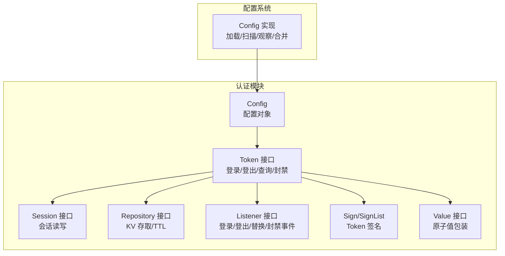
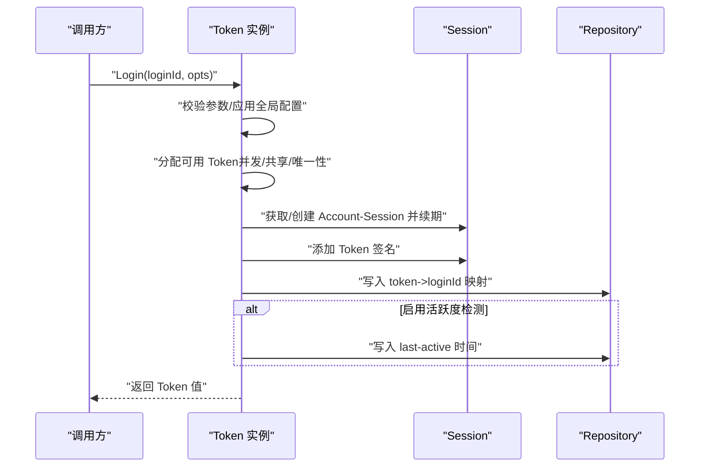
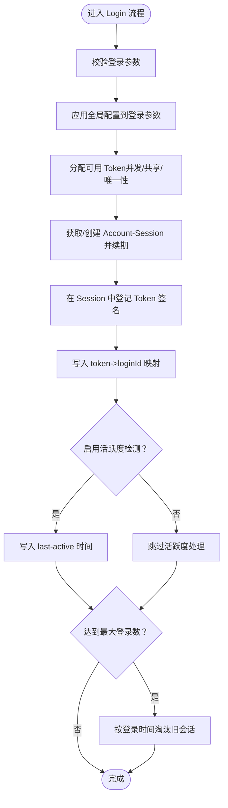
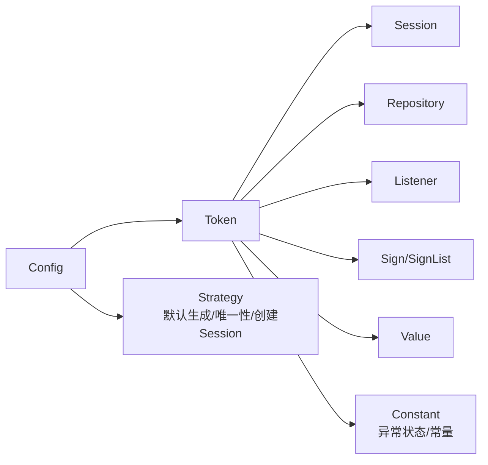

# 配置选项

<cite>
**本文引用的文件**
- [contrib/auth/token/config.go](file://contrib/auth/token/config.go)
- [contrib/auth/token/options.go](file://contrib/auth/token/options.go)
- [contrib/auth/token/token.go](file://contrib/auth/token/token.go)
- [contrib/auth/token/strategy.go](file://contrib/auth/token/strategy.go)
- [contrib/auth/token/session.go](file://contrib/auth/token/session.go)
- [contrib/auth/token/repository.go](file://contrib/auth/token/repository.go)
- [contrib/auth/token/listener.go](file://contrib/auth/token/listener.go)
- [contrib/auth/token/sign.go](file://contrib/auth/token/sign.go)
- [contrib/auth/token/constant.go](file://contrib/auth/token/constant.go)
- [contrib/auth/token/value.go](file://contrib/auth/token/value.go)
- [config/config.go](file://config/config.go)
</cite>

## 目录
1. [简介](#简介)
2. [项目结构](#项目结构)
3. [核心组件](#核心组件)
4. [架构总览](#架构总览)
5. [详细组件分析](#详细组件分析)
6. [依赖分析](#依赖分析)
7. [性能考量](#性能考量)
8. [故障排查指南](#故障排查指南)
9. [结论](#结论)
10. [附录](#附录)

## 简介
本文件面向 Go Fox 认证插件（基于 token 的会话与登录能力）的配置选项，提供从基础到高级的完整技术文档。内容覆盖：
- 登录类型、Token 名称、并发控制、共享策略、有效期、活跃度检测、动态活跃时间、最大尝试次数、最大登录数、Token 样式、自动续签等关键配置项的作用、取值范围与默认值
- 不同使用场景下的推荐配置与最佳实践
- 配置项之间的依赖关系与约束条件
- 动态配置的实现机制（热更新与运行时调整）
- 完整使用示例（基础、高级、定制化）
- 常见配置错误与排查方法

## 项目结构
认证模块位于 contrib/auth/token 下，围绕 Config、Token 接口、Session、Repository、Listener、Sign 等核心类型构建；配置读取由 config 包提供统一的加载、扫描、观察与合并能力。

图表来源
- [contrib/auth/token/config.go](file://contrib/auth/token/config.go#L10-L29)
- [contrib/auth/token/token.go](file://contrib/auth/token/token.go#L15-L116)
- [contrib/auth/token/session.go](file://contrib/auth/token/session.go#L47-L52)
- [contrib/auth/token/repository.go](file://contrib/auth/token/repository.go#L31-L39)
- [contrib/auth/token/listener.go](file://contrib/auth/token/listener.go#L26-L58)
- [contrib/auth/token/sign.go](file://contrib/auth/token/sign.go#L3-L11)
- [contrib/auth/token/value.go](file://contrib/auth/token/value.go#L91-L105)
- [config/config.go](file://config/config.go#L61-L86)

章节来源
- [contrib/auth/token/config.go](file://contrib/auth/token/config.go#L1-L82)
- [config/config.go](file://config/config.go#L1-L186)

## 核心组件
- Config：认证插件的全局配置对象，包含登录类型、Token 名称、并发策略、共享策略、有效期、活跃度、动态活跃时间、最大尝试次数、最大登录数、Token 样式、自动续签、回调函数、监听器、存储仓库、日志器等字段。
- Token：对外暴露的认证能力接口，涵盖登录、登出、查询、封禁等。
- Session：账户级会话，维护登录签名列表、扩展数据、TTL 等。
- Repository：抽象的 KV 存储接口，负责读取、写入、更新 TTL、删除等。
- Listener：事件监听器接口，提供登录、登出、被替换、封禁等事件回调。
- Sign/SignList：Token 签名模型，记录 token 值、设备、额外数据。
- Value：原子值包装接口，用于安全读写配置值。
- 配置系统 Config：提供统一的配置加载、扫描、观察与合并能力，支持热更新。

章节来源
- [contrib/auth/token/config.go](file://contrib/auth/token/config.go#L10-L29)
- [contrib/auth/token/token.go](file://contrib/auth/token/token.go#L15-L116)
- [contrib/auth/token/session.go](file://contrib/auth/token/session.go#L47-L52)
- [contrib/auth/token/repository.go](file://contrib/auth/token/repository.go#L31-L39)
- [contrib/auth/token/listener.go](file://contrib/auth/token/listener.go#L26-L58)
- [contrib/auth/token/sign.go](file://contrib/auth/token/sign.go#L3-L11)
- [contrib/auth/token/value.go](file://contrib/auth/token/value.go#L91-L105)
- [config/config.go](file://config/config.go#L61-L86)

## 架构总览
认证插件通过 Config 驱动 Token 的登录流程，Token 在登录时根据并发与共享策略决定复用旧 Token 或生成新 Token，并在 Session 中登记签名，同时维护 Token 到登录 ID 的映射、最后活跃时间（可选）、以及可选的自动续签与最大登录数控制。Repository 提供底层持久化能力，Listener 暴露事件钩子，Value 提供原子值封装。

图表来源
- [contrib/auth/token/token.go](file://contrib/auth/token/token.go#L144-L207)
- [contrib/auth/token/session.go](file://contrib/auth/token/session.go#L70-L84)
- [contrib/auth/token/repository.go](file://contrib/auth/token/repository.go#L31-L39)

## 详细组件分析

### 配置项总览与默认值
以下为认证插件的关键配置项、默认值、取值范围与行为说明。默认值来源于默认配置函数。

- 登录类型（LoginType）
  - 类型：字符串
  - 默认值：login
  - 说明：用于区分多登录体系（如 admin、user）
  - 取值范围：任意非空字符串
- Token 名称（TokenName）
  - 类型：字符串
  - 默认值：authorization
  - 说明：作为缓存键前缀的一部分，用于隔离不同业务或租户
  - 取值范围：任意非空字符串
- 是否允许多地并发登录（IsConcurrent）
  - 类型：布尔
  - 默认值：true
  - 说明：true 允许多设备/多地点同时登录；false 新登录会挤掉旧登录
- 是否共享同一 Token（IsShare）
  - 类型：布尔
  - 默认值：true
  - 说明：仅在 IsConcurrent=true 时有意义；true 表示复用同一 Token，false 表示每次登录新建 Token
- 有效期（Timeout）
  - 类型：整型（秒）
  - 默认值：30 天（秒）
  - 说明：单次登录的 Token 有效期；-1 表示永久有效
- 最低活跃时间（ActiveTimeout）
  - 类型：整型（秒）
  - 默认值：-1（不限制，永不冻结）
  - 说明：若超过此时间未访问系统，Token 将被冻结；-1 表示永不冻结
- 是否启用动态活跃时间（DynamicActiveTimeout）
  - 类型：布尔
  - 默认值：false
  - 说明：true 时允许按登录参数单独设置活跃时间；false 时忽略登录参数中的活跃时间
- 最大尝试次数（MaxTryCount）
  - 类型：整型
  - 默认值：3
  - 说明：生成唯一 Token 时的最大循环尝试次数；-1 表示不验证唯一性，直接使用
- 最大登录数（MaxLoginCount）
  - 类型：整型
  - 默认值：-1（不限制）
  - 说明：仅在 IsConcurrent=true 且 IsShare=false 时有意义；超过上限将按登录时间顺序淘汰旧会话
- Token 样式（Style）
  - 类型：枚举
  - 默认值：uuid
  - 取值范围：uuid、simple-uuid、random-32、random-64
- 自动续签（AutoRenew）
  - 类型：布尔
  - 默认值：true
  - 说明：在活跃度检测开启时，访问将自动更新最后活跃时间
- 回调函数与扩展
  - 创建 Token 函数（createTokenFunction）
  - 生成唯一 Token 函数（generateUniqueToken）
  - 创建 Session 策略（createSessionFunction）
  - 存储仓库（repository）
  - 事件监听器（listener）
  - 日志器（logger）

章节来源
- [contrib/auth/token/config.go](file://contrib/auth/token/config.go#L10-L29)
- [contrib/auth/token/config.go](file://contrib/auth/token/config.go#L31-L50)
- [contrib/auth/token/options.go](file://contrib/auth/token/options.go#L32-L40)
- [contrib/auth/token/strategy.go](file://contrib/auth/token/strategy.go#L12-L22)

### 配置项依赖关系与约束条件
- 并发与共享策略
  - IsConcurrent=false 时，新登录会将同账号历史会话标记为“被顶下线”
  - IsConcurrent=true 时，IsShare=true 可复用旧 Token，减少查询与写入
  - MaxLoginCount 仅在 IsConcurrent=true 且 IsShare=false 时生效
- 活跃度检测
  - DynamicActiveTimeout=false 时，登录参数中的活跃时间会被忽略
  - ActiveTimeout=-1 表示永不冻结；AutoRenew=true 时访问会自动更新最后活跃时间
- 唯一性与尝试次数
  - MaxTryCount=-1 时不进行唯一性校验；>0 时最多尝试 N 次
- 键空间与命名
  - TokenName 与 LoginType 共同决定缓存键前缀，避免跨业务冲突

章节来源
- [contrib/auth/token/token.go](file://contrib/auth/token/token.go#L544-L584)
- [contrib/auth/token/token.go](file://contrib/auth/token/token.go#L618-L672)
- [contrib/auth/token/token.go](file://contrib/auth/token/token.go#L696-L705)
- [contrib/auth/token/token.go](file://contrib/auth/token/token.go#L1086-L1119)

### 动态配置与热更新
- 配置系统支持多源加载、解析、合并与观察
- Watch 机制在配置变更时触发回调，实现热更新
- Token 内部通过 Config 读取配置，但未内置“重新构建 Token 实例”的逻辑；建议在应用层监听配置变化后重建 Token 实例以应用新配置

章节来源
- [config/config.go](file://config/config.go#L88-L115)
- [config/config.go](file://config/config.go#L136-L185)
- [contrib/auth/token/config.go](file://contrib/auth/token/config.go#L52-L68)

### 使用示例

- 基础配置
  - 场景：标准 Web 应用，允许多地登录、共享 Token、30 天有效期、永不冻结、自动续签
  - 关键配置：IsConcurrent=true、IsShare=true、Timeout=30天、ActiveTimeout=-1、AutoRenew=true
  - 参考路径：[DefaultConfig](file://contrib/auth/token/config.go#L31-L50)

- 高级配置
  - 场景：企业后台，禁止多地登录、共享 Token、1 小时活跃冻结、动态活跃时间、最大尝试 5 次
  - 关键配置：IsConcurrent=false、IsShare=true、ActiveTimeout=3600、DynamicActiveTimeout=true、MaxTryCount=5
  - 参考路径：[WithIsConcurrent](file://contrib/auth/token/options.go#L65-L73)、[WithActiveTimeout](file://contrib/auth/token/options.go#L85-L93)、[WithDynamicActiveTimeout](file://contrib/auth/token/options.go#L95-L103)、[WithMaxTryCount](file://contrib/auth/token/options.go#L105-L113)

- 定制化配置
  - 场景：移动端 App，允许多地登录、不共享 Token、自定义 Token 样式（random-64）、最大登录数 3、自动续签关闭
  - 关键配置：IsConcurrent=true、IsShare=false、Style=random-64、MaxLoginCount=3、AutoRenew=false
  - 参考路径：[WithStyle](file://contrib/auth/token/options.go#L125-L133)、[WithMaxLoginCount](file://contrib/auth/token/options.go#L115-L123)、[WithAutoRenew](file://contrib/auth/token/options.go#L135-L143)

- 通过配置中心热更新
  - 使用配置系统的 Watch 机制监听 key 变更，应用层在回调中重建 Token 实例
  - 参考路径：[Config.Watch](file://config/config.go#L136-L142)、[Config.Get](file://config/config.go#L125-L134)

章节来源
- [contrib/auth/token/config.go](file://contrib/auth/token/config.go#L31-L50)
- [contrib/auth/token/options.go](file://contrib/auth/token/options.go#L65-L73)
- [contrib/auth/token/options.go](file://contrib/auth/token/options.go#L85-L93)
- [contrib/auth/token/options.go](file://contrib/auth/token/options.go#L95-L103)
- [contrib/auth/token/options.go](file://contrib/auth/token/options.go#L105-L113)
- [contrib/auth/token/options.go](file://contrib/auth/token/options.go#L125-L133)
- [contrib/auth/token/options.go](file://contrib/auth/token/options.go#L115-L123)
- [contrib/auth/token/options.go](file://contrib/auth/token/options.go#L135-L143)
- [config/config.go](file://config/config.go#L136-L142)
- [config/config.go](file://config/config.go#L125-L134)

### 登录流程与配置联动

图表来源
- [contrib/auth/token/token.go](file://contrib/auth/token/token.go#L144-L207)
- [contrib/auth/token/token.go](file://contrib/auth/token/token.go#L535-L584)
- [contrib/auth/token/token.go](file://contrib/auth/token/token.go#L618-L672)

## 依赖分析
- Config 依赖配置系统 Config 实例，通过 Scan/Get 读取配置
- Token 依赖 Session、Repository、Listener、Sign、Value 等组件
- Session 依赖 Repository 进行持久化与 TTL 管理
- Strategy 定义了默认的 Token 生成、唯一性校验与 Session 创建策略
- Constant 定义了异常状态与常量（如永不过期、不存在值等）

图表来源
- [contrib/auth/token/config.go](file://contrib/auth/token/config.go#L10-L29)
- [contrib/auth/token/token.go](file://contrib/auth/token/token.go#L15-L116)
- [contrib/auth/token/session.go](file://contrib/auth/token/session.go#L47-L52)
- [contrib/auth/token/repository.go](file://contrib/auth/token/repository.go#L31-L39)
- [contrib/auth/token/listener.go](file://contrib/auth/token/listener.go#L26-L58)
- [contrib/auth/token/sign.go](file://contrib/auth/token/sign.go#L3-L11)
- [contrib/auth/token/value.go](file://contrib/auth/token/value.go#L91-L105)
- [contrib/auth/token/strategy.go](file://contrib/auth/token/strategy.go#L12-L22)
- [contrib/auth/token/constant.go](file://contrib/auth/token/constant.go#L26-L42)

章节来源
- [contrib/auth/token/config.go](file://contrib/auth/token/config.go#L10-L29)
- [contrib/auth/token/token.go](file://contrib/auth/token/token.go#L15-L116)
- [contrib/auth/token/session.go](file://contrib/auth/token/session.go#L47-L52)
- [contrib/auth/token/repository.go](file://contrib/auth/token/repository.go#L31-L39)
- [contrib/auth/token/listener.go](file://contrib/auth/token/listener.go#L26-L58)
- [contrib/auth/token/sign.go](file://contrib/auth/token/sign.go#L3-L11)
- [contrib/auth/token/value.go](file://contrib/auth/token/value.go#L91-L105)
- [contrib/auth/token/strategy.go](file://contrib/auth/token/strategy.go#L12-L22)
- [contrib/auth/token/constant.go](file://contrib/auth/token/constant.go#L26-L42)

## 性能考量
- 并发与共享
  - IsConcurrent=true 且 IsShare=true 可显著降低重复登录的写入与查询开销
- 唯一性尝试次数
  - MaxTryCount 过高会增加 CPU 开销；建议结合 Token 样式与存储容量合理设置
- 活跃度检测
  - DynamicActiveTimeout 与 AutoRenew 会带来额外的读写与更新成本；在高并发场景需评估存储压力
- 最大登录数淘汰
  - MaxLoginCount 会在登录时进行排序与批量淘汰，建议在高并发登录场景下配合限流或异步处理

## 故障排查指南
- 常见错误与定位
  - 登录参数为空或非法：检查 LoginId 是否为空、是否为异常标记值
    - 参考路径：[checkLoginArgs](file://contrib/auth/token/token.go#L508-L533)
  - Token 已过期/被冻结/被顶下线：根据返回的异常状态判断
    - 参考路径：[GetLoginId](file://contrib/auth/token/token.go#L412-L447)、[constant](file://contrib/auth/token/constant.go#L26-L37)
  - 动态活跃时间参数被忽略：确认 Global DynamicActiveTimeout=true
    - 参考路径：[checkLoginArgs](file://contrib/auth/token/token.go#L528-L531)
  - 唯一性冲突导致无法生成 Token：提高 MaxTryCount 或更换 Token 样式
    - 参考路径：[defaultGenerateUniqueToken](file://contrib/auth/token/strategy.go#L51-L71)
  - 配置热更新未生效：确认应用层在 Watch 回调中重建 Token 实例
    - 参考路径：[Config.Watch](file://config/config.go#L136-L142)

章节来源
- [contrib/auth/token/token.go](file://contrib/auth/token/token.go#L508-L533)
- [contrib/auth/token/token.go](file://contrib/auth/token/token.go#L412-L447)
- [contrib/auth/token/constant.go](file://contrib/auth/token/constant.go#L26-L37)
- [contrib/auth/token/strategy.go](file://contrib/auth/token/strategy.go#L51-L71)
- [config/config.go](file://config/config.go#L136-L142)

## 结论
认证插件的配置围绕“并发/共享策略、有效期、活跃度检测、唯一性与尝试次数、最大登录数、Token 样式与自动续签”展开。通过合理的组合可在安全性与性能之间取得平衡。建议在生产环境优先启用活跃度检测与自动续签，并根据业务场景选择合适的并发与共享策略；同时利用配置系统的热更新能力，在不重启服务的前提下平滑调整策略。

## 附录
- 配置项一览表（含默认值与取值范围）
  - LoginType：字符串，默认 login
  - TokenName：字符串，默认 authorization
  - IsConcurrent：布尔，默认 true
  - IsShare：布尔，默认 true
  - Timeout：整型（秒），默认 30 天，-1 表示永久
  - ActiveTimeout：整型（秒），默认 -1（永不冻结）
  - DynamicActiveTimeout：布尔，默认 false
  - MaxTryCount：整型，默认 3，-1 表示不校验唯一性
  - MaxLoginCount：整型，默认 -1（不限制）
  - Style：枚举，默认 uuid，可选 uuid/simple-uuid/random-32/random-64
  - AutoRenew：布尔，默认 true

章节来源
- [contrib/auth/token/config.go](file://contrib/auth/token/config.go#L31-L50)
- [contrib/auth/token/options.go](file://contrib/auth/token/options.go#L32-L40)