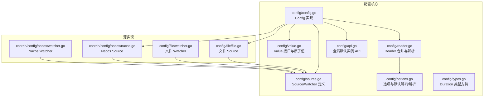
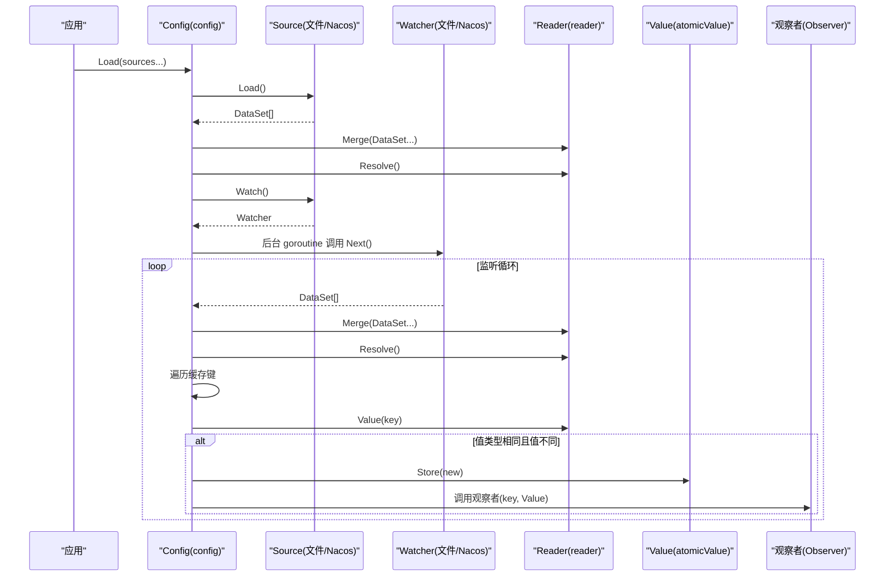
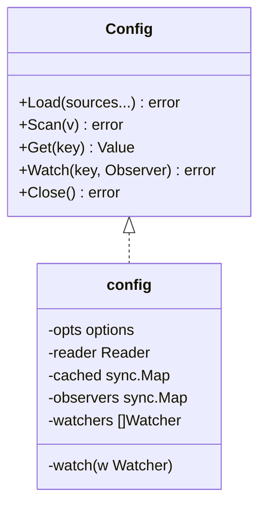
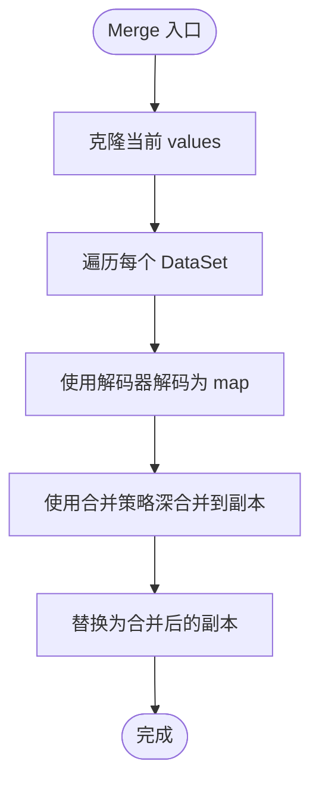
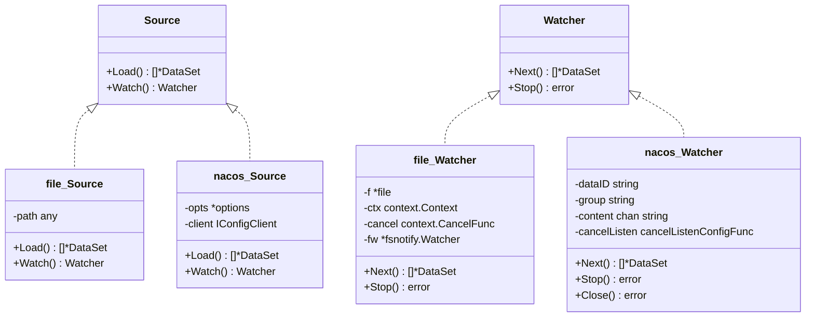
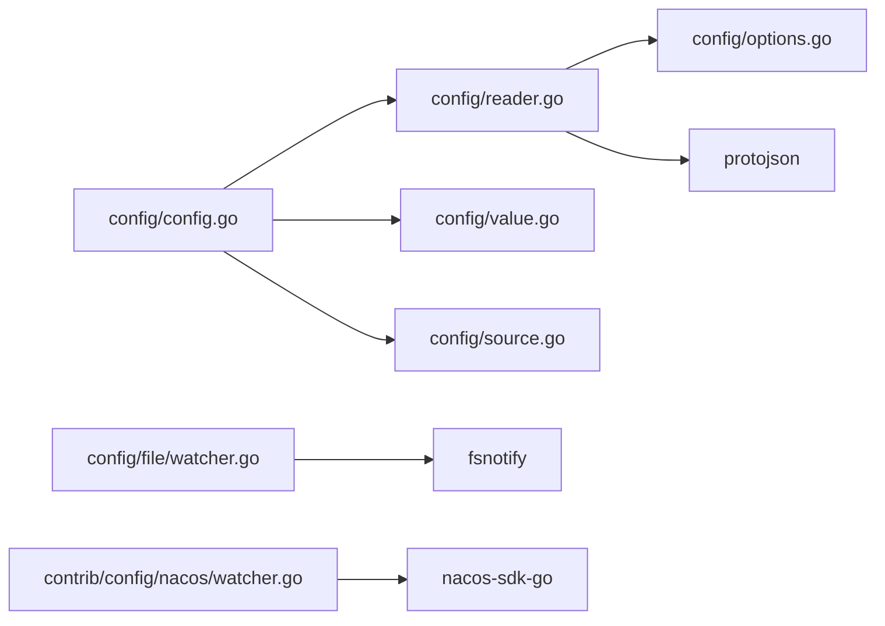

# 动态配置更新

<cite>
**本文引用的文件列表**
- [config.go](file://config/config.go)
- [value.go](file://config/value.go)
- [types.go](file://config/types.go)
- [source.go](file://config/source.go)
- [reader.go](file://config/reader.go)
- [options.go](file://config/options.go)
- [api.go](file://config/api.go)
- [file.go](file://config/file/file.go)
- [file_watcher.go](file://config/file/watcher.go)
- [nacos.go](file://contrib/config/nacos/nacos.go)
- [nacos_watcher.go](file://contrib/config/nacos/watcher.go)
- [config_test.go](file://config/config_test.go)
</cite>

## 目录
1. [简介](#简介)
2. [项目结构](#项目结构)
3. [核心组件](#核心组件)
4. [架构总览](#架构总览)
5. [组件详解](#组件详解)
6. [依赖关系分析](#依赖关系分析)
7. [性能与并发特性](#性能与并发特性)
8. [故障排查指南](#故障排查指南)
9. [结论](#结论)
10. [附录：最佳实践与优化建议](#附录最佳实践与优化建议)

## 简介
本文件系统性解析 Go Fox 的动态配置更新机制，重点覆盖以下方面：
- 配置监听与变更通知的实现原理（Watcher 接口、观察者模式）
- 配置缓存与读取路径（sync.Map 缓存、Reader 解析链）
- 变更检测算法（类型检查、反射对比、默认值占位解析）
- 热更新全流程（从变更检测到观察者回调）
- 配置值的存储与访问（类型安全访问、默认值处理、错误处理）
- 最佳实践与性能优化建议

## 项目结构
围绕“配置”主题，核心代码集中在 config 包及其子包，同时提供 file 与 nacos 两种 Source 实现，分别用于本地文件与 Nacos 远程配置中心。



图表来源
- [config.go](file://config/config.go#L1-L186)
- [source.go](file://config/source.go#L1-L51)
- [reader.go](file://config/reader.go#L1-L172)
- [options.go](file://config/options.go#L1-L158)
- [api.go](file://config/api.go#L1-L64)
- [types.go](file://config/types.go#L1-L63)
- [file.go](file://config/file/file.go#L1-L131)
- [file_watcher.go](file://config/file/watcher.go#L1-L107)
- [nacos.go](file://contrib/config/nacos/nacos.go#L1-L95)
- [nacos_watcher.go](file://contrib/config/nacos/watcher.go#L1-L67)

章节来源
- [config.go](file://config/config.go#L1-L186)
- [source.go](file://config/source.go#L1-L51)
- [reader.go](file://config/reader.go#L1-L172)
- [options.go](file://config/options.go#L1-L158)
- [api.go](file://config/api.go#L1-L64)
- [types.go](file://config/types.go#L1-L63)
- [file.go](file://config/file/file.go#L1-L131)
- [file_watcher.go](file://config/file/watcher.go#L1-L107)
- [nacos.go](file://contrib/config/nacos/nacos.go#L1-L95)
- [nacos_watcher.go](file://contrib/config/nacos/watcher.go#L1-L67)

## 核心组件
- Config 接口与实现：负责加载多个 Source、合并与解析、缓存、监听变更、通知观察者、关闭 Watcher。
- Reader 接口与实现：负责将多源数据合并为内存映射、按路径读取值、解析占位符、导出 JSON。
- Value 接口与实现：提供类型安全访问（Bool/Int/String/Float/Duration/Slice/Map/Bytes）、原子存储与加载。
- Source/Watcher：抽象配置源与变更监听器，file 与 nacos 提供具体实现。
- Options：可插拔的解码器、解析器、合并策略。
- 全局 API：通过默认 Config 实例提供便捷调用。

章节来源
- [config.go](file://config/config.go#L49-L186)
- [reader.go](file://config/reader.go#L40-L172)
- [value.go](file://config/value.go#L46-L124)
- [source.go](file://config/source.go#L28-L51)
- [options.go](file://config/options.go#L34-L158)
- [api.go](file://config/api.go#L26-L64)

## 架构总览
下图展示从配置加载、合并解析、到变更监听与通知的端到端流程。



图表来源
- [config.go](file://config/config.go#L88-L185)
- [reader.go](file://config/reader.go#L62-L97)
- [source.go](file://config/source.go#L36-L51)
- [file_watcher.go](file://config/file/watcher.go#L44-L79)
- [nacos_watcher.go](file://contrib/config/nacos/watcher.go#L36-L51)

## 组件详解

### Config 接口与实现
- 负责聚合多个 Source，逐个加载、合并、解析；为每个 Source 启动一个 Watcher 并在后台循环监听变更。
- 使用 sync.Map 缓存已解析的 Value，避免重复解析。
- 观察者注册通过 Watch(key, Observer) 完成，观察者在值发生“类型相同且内容不同”的变更时被触发。
- Close() 会逐一停止所有 Watcher。



图表来源
- [config.go](file://config/config.go#L52-L86)
- [config.go](file://config/config.go#L62-L86)

章节来源
- [config.go](file://config/config.go#L52-L186)

### Reader 接口与实现
- Merge：对每个 DataSet 使用指定解码器转为 map，再通过合并策略进行深合并，最终写入内部 values 映射。
- Value：按点分隔路径从 values 中提取值，返回 Value 封装。
- Resolve：对 values 执行占位符解析（如 ${key:default}）。
- Source：导出当前 values 为 JSON（支持 protobuf 消息）。
- cloneMap：并发安全地克隆当前 values，用于合并前的副本。



图表来源
- [reader.go](file://config/reader.go#L62-L79)

章节来源
- [reader.go](file://config/reader.go#L40-L172)

### Value 接口与实现
- Value 定义了类型安全访问方法（Bool/Int/String/Float/Duration/Slice/Map/Bytes/Scan），以及 Store/Load 原子存取。
- atomicValue 基于原子容器，保证并发安全的读写。
- errValue 在键不存在或类型不匹配时返回错误语义的 Value。

```mermaid
classDiagram
class Value {
+IsEmpty() bool
+Bool() (bool, error)
+Int() (int64, error)
+String() (string, error)
+Float() (float64, error)
+Duration() (time.Duration, error)
+Slice() ([]Value, error)
+Map() (map[string]Value, error)
+Scan(val) error
+Bytes() ([]byte, error)
+Store(interface{})
+Load() interface{}
}
class atomicValue {
-Value[any]
+Store(interface{})
+Load() interface{}
}
class errValue {
-err error
}
Value <|.. atomicValue
Value <|.. errValue
```

图表来源
- [value.go](file://config/value.go#L46-L124)

章节来源
- [value.go](file://config/value.go#L46-L124)

### Source/Watcher 抽象与实现
- Source：定义 Load 返回 DataSet 列表，Watch 返回 Watcher。
- Watcher：Next 返回变更的 DataSet 列表，Stop 停止监听。
- file.Source：支持字符串路径（文件或目录）与 fs.File；目录自动扫描非隐藏文件。
- file.Watcher：基于 fsnotify 监控文件系统事件，重命名事件自动重新 Add。
- nacos.Source：通过 SDK 获取/监听配置，将回调内容转换为 DataSet。
- nacos.Watcher：封装 SDK 的取消监听能力。



图表来源
- [source.go](file://config/source.go#L36-L51)
- [file.go](file://config/file/file.go#L36-L81)
- [file_watcher.go](file://config/file/watcher.go#L37-L106)
- [nacos.go](file://contrib/config/nacos/nacos.go#L17-L95)
- [nacos_watcher.go](file://contrib/config/nacos/watcher.go#L12-L67)

章节来源
- [source.go](file://config/source.go#L36-L51)
- [file.go](file://config/file/file.go#L36-L131)
- [file_watcher.go](file://config/file/watcher.go#L37-L107)
- [nacos.go](file://contrib/config/nacos/nacos.go#L17-L95)
- [nacos_watcher.go](file://contrib/config/nacos/watcher.go#L12-L67)

### Options 与默认策略
- Decoder：默认解码器根据 DataSet.Format 选择对应编解码器，若无格式则将键展开为嵌套 map。
- Resolver：默认解析器支持 ${key:default} 占位符，递归解析字符串、数组与嵌套 map。
- Merge：默认使用第三方库进行深合并，覆盖策略为 WithOverride。

章节来源
- [options.go](file://config/options.go#L81-L158)

### 全局 API 与默认配置
- 提供 SetDefault、Load、MustLoad、Get、Scan、Watch、Close 等便捷函数，底层委托给默认 Config 实例。

章节来源
- [api.go](file://config/api.go#L26-L64)

## 依赖关系分析
- config/config.go 依赖：
  - config/reader.go（Reader 合并与解析）
  - config/value.go（Value 接口与实现）
  - config/source.go（Source/Watcher 接口）
  - 多种编解码器初始化（codec/json 等）
- config/reader.go 依赖：
  - config/options.go（解码器、解析器、合并策略）
  - google.golang.org/protobuf/encoding/protojson（Proto 消息序列化）
- config/file/watcher.go 依赖：
  - github.com/fsnotify/fsnotify（文件系统事件）
- contrib/config/nacos/watcher.go 依赖：
  - github.com/nacos-group/nacos-sdk-go（Nacos SDK）



图表来源
- [config.go](file://config/config.go#L26-L42)
- [reader.go](file://config/reader.go#L26-L36)
- [file_watcher.go](file://config/file/watcher.go#L26-L35)
- [nacos_watcher.go](file://contrib/config/nacos/watcher.go#L3-L10)

章节来源
- [config.go](file://config/config.go#L26-L42)
- [reader.go](file://config/reader.go#L26-L36)
- [file_watcher.go](file://config/file/watcher.go#L26-L35)
- [nacos_watcher.go](file://contrib/config/nacos/watcher.go#L3-L10)

## 性能与并发特性
- 并发安全
  - Reader 内部使用互斥锁保护 values 的读写，Merge/Value/Source/Resolve 均加锁。
  - Config 的 cached 与 observers 使用 sync.Map，适合高并发读场景。
  - Value 的 atomicValue 基于原子容器，Store/Load 为 O(1)。
- 变更检测
  - 使用反射比较新旧值的类型与内容，仅在“类型相同且内容不同”时才触发更新与通知，避免无效抖动。
- 解析与合并
  - 默认合并策略为覆盖式深合并，减少重复键冲突。
  - 占位符解析递归处理，避免深层嵌套带来的额外开销。
- 文件监听
  - fsnotify 监听文件系统事件，重命名事件自动重新 Add，确保稳定性。
- Nacos 监听
  - 通过 SDK 回调驱动 Next，降低轮询成本。

章节来源
- [reader.go](file://config/reader.go#L48-L103)
- [config.go](file://config/config.go#L173-L183)
- [file_watcher.go](file://config/file/watcher.go#L44-L79)
- [nacos_watcher.go](file://contrib/config/nacos/watcher.go#L36-L51)

## 故障排查指南
- 加载失败
  - 检查 Source.Load 是否返回错误，确认路径或网络可达性。
  - 查看日志中“failed to merge config source”或“failed to resolve config source”。
- 监听异常
  - file.Watcher：关注 fsnotify 错误通道与 Rename 事件处理。
  - nacos.Watcher：确认 ListenConfig 成功注册与 CancelListenConfig 正常调用。
- 观察者未触发
  - 确认 Watch 注册的 key 存在且 Get() 能成功加载初始值。
  - 检查变更是否满足“类型相同且内容不同”的条件。
- 占位符解析
  - 确认 ${key:default} 语法正确，key 存在或提供默认值。
- 关闭资源
  - 调用 Close() 以停止所有 Watcher，避免 goroutine 泄漏。

章节来源
- [config.go](file://config/config.go#L88-L115)
- [config.go](file://config/config.go#L153-L185)
- [file_watcher.go](file://config/file/watcher.go#L74-L77)
- [nacos_watcher.go](file://contrib/config/nacos/watcher.go#L54-L66)

## 结论
Go Fox 的动态配置更新机制通过清晰的接口分层（Source/Watcher/Reader/Value）与稳健的并发设计，实现了从多源配置加载、合并解析、占位符替换，到变更检测与观察者通知的完整闭环。其默认策略兼顾易用性与扩展性，file 与 nacos 两种实现覆盖了本地与远程两大场景。遵循本文最佳实践与优化建议，可在复杂环境中获得稳定、高效的配置热更新体验。

## 附录：最佳实践与优化建议
- 选择合适的 Source
  - 本地开发优先使用 file.Source；生产环境推荐 nacos.Source 或其他集中式配置中心。
- 合理设置合并策略
  - 默认覆盖式深合并适用于大多数场景；如需保留旧值，自定义 Merge 函数。
- 占位符与默认值
  - 使用 ${key:default} 提升配置灵活性；确保 key 存在或提供合理默认值。
- 监听与通知
  - 仅对必要 key 注册 Watch，避免过度通知导致的性能损耗。
  - 在观察者中尽量做轻量级处理，避免阻塞通知链路。
- 并发与缓存
  - 利用 Config.Get 的缓存特性，减少重复解析；避免在高频路径上频繁调用 Get。
- 错误处理
  - 对 Load/Watch/Next 的错误进行分级处理，必要时重试或降级。
- 文件监听稳定性
  - 目录场景下注意 fsnotify 的 Rename 行为，确保自动 Add 新文件。
- Nacos 监听
  - 注意 CancelListenConfig 的调用时机，避免重复订阅与资源泄漏。