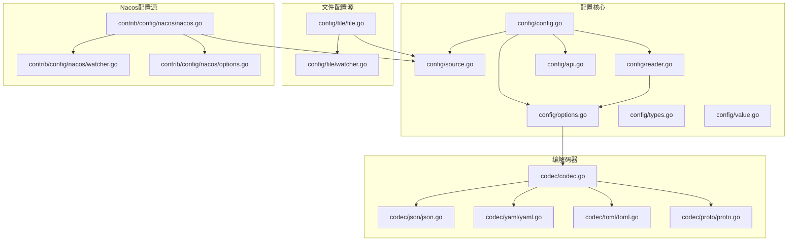
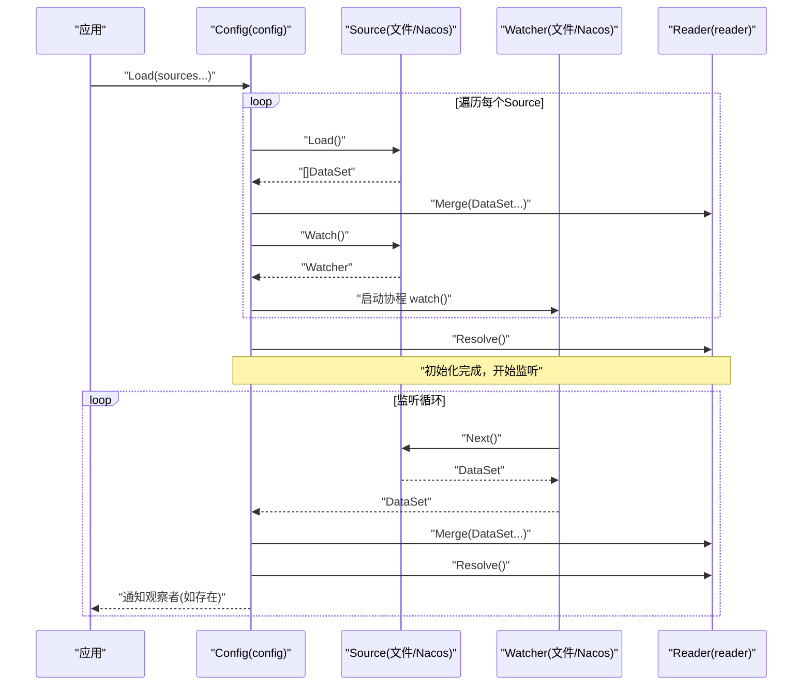
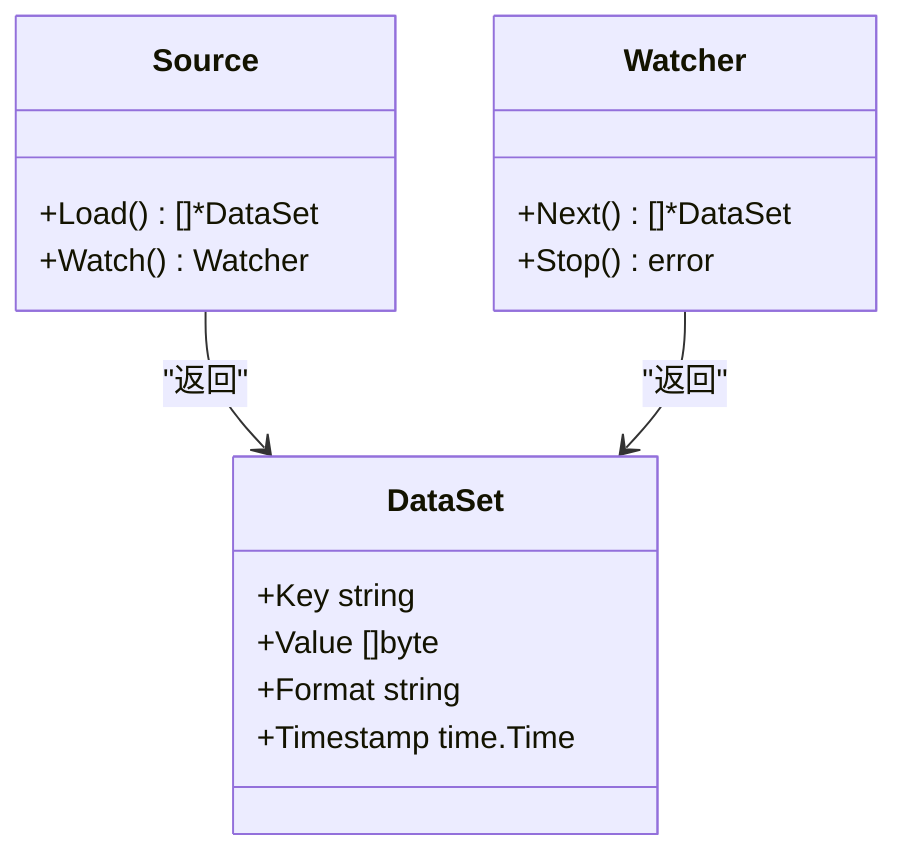
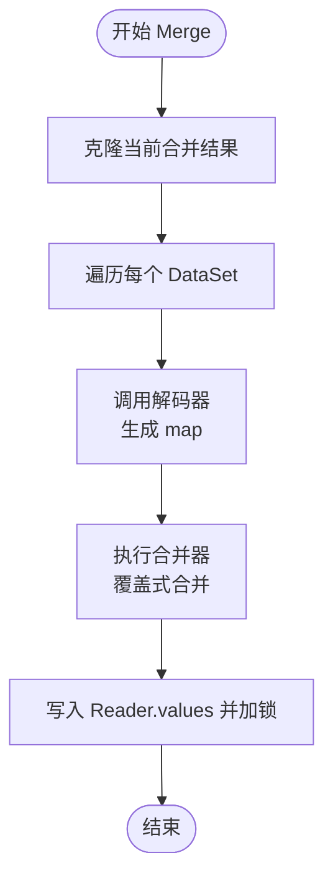
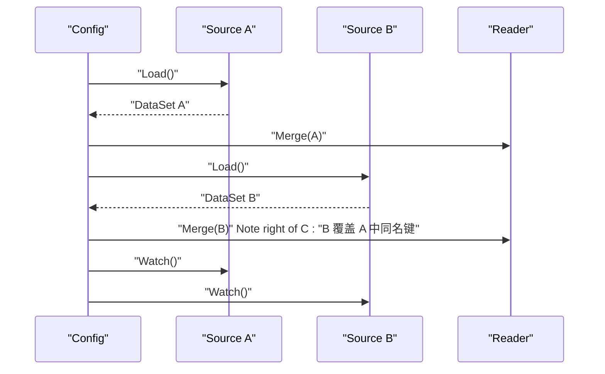
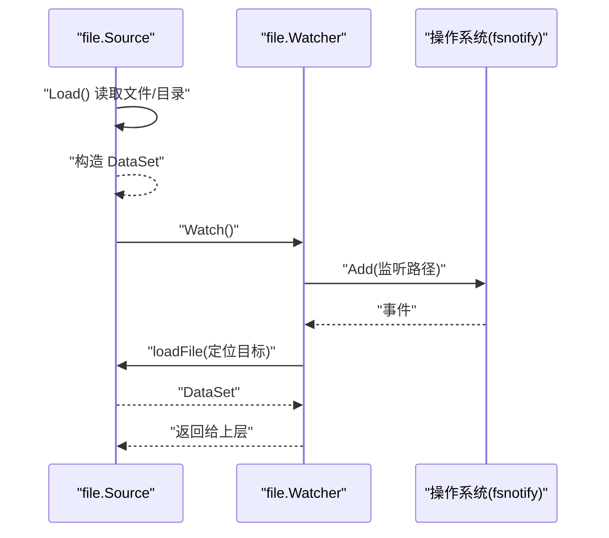
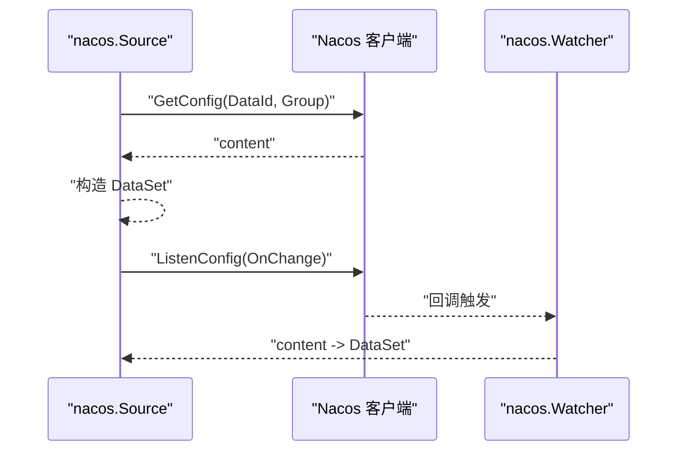
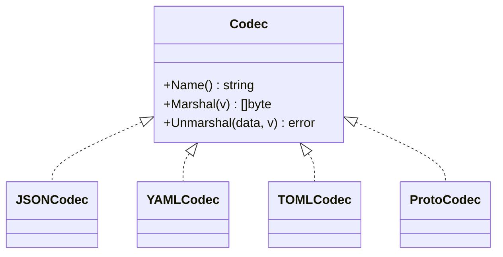
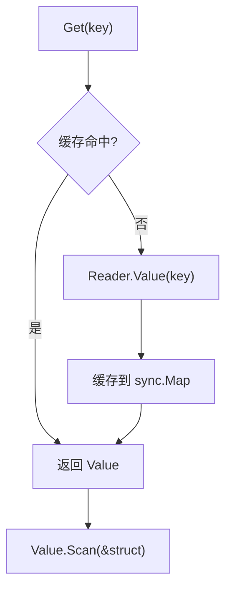
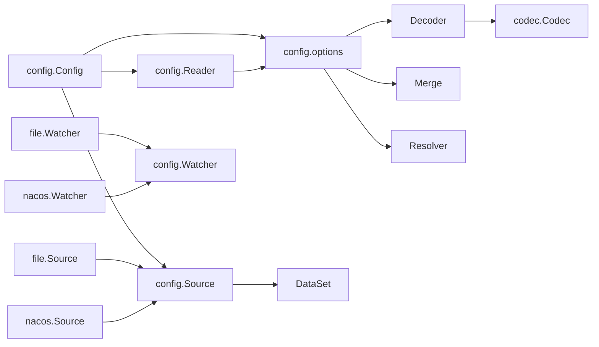

# 多源配置加载

<cite>
**本文引用的文件**
- [config.go](file://config/config.go)
- [source.go](file://config/source.go)
- [reader.go](file://config/reader.go)
- [options.go](file://config/options.go)
- [types.go](file://config/types.go)
- [value.go](file://config/value.go)
- [api.go](file://config/api.go)
- [file.go](file://config/file/file.go)
- [watcher.go](file://config/file/watcher.go)
- [nacos.go](file://contrib/config/nacos/nacos.go)
- [nacos_options.go](file://contrib/config/nacos/options.go)
- [nacos_watcher.go](file://contrib/config/nacos/watcher.go)
- [codec.go](file://codec/codec.go)
- [json.go](file://codec/json/json.go)
- [yaml.go](file://codec/yaml/yaml.go)
- [toml.go](file://codec/toml/toml.go)
- [proto.go](file://codec/proto/proto.go)
- [config_test.go](file://config/config_test.go)
</cite>

## 目录
1. [引言](#引言)
2. [项目结构](#项目结构)
3. [核心组件](#核心组件)
4. [架构总览](#架构总览)
5. [组件详解](#组件详解)
6. [依赖关系分析](#依赖关系分析)
7. [性能与并发特性](#性能与并发特性)
8. [故障排查指南](#故障排查指南)
9. [结论](#结论)
10. [附录：最佳实践与示例路径](#附录最佳实践与示例路径)

## 引言
本技术文档围绕 Go Fox 的多源配置加载机制展开，系统性阐述 Source 接口设计、文件与 Nacos 等配置源实现、Reader 的数据合并与解析流程、占位符解析器、加载顺序与优先级策略、以及文件监控与 Nacos 集成方案。同时提供最佳实践与常见问题排查建议，帮助开发者在复杂环境中稳定地管理配置。

## 项目结构
本节聚焦配置子系统的核心目录与文件组织，展示“接口-实现-读取-编解码”的层次化结构。

**图表来源**
- [config.go](file://config/config.go#L24-L186)
- [source.go](file://config/source.go#L24-L51)
- [reader.go](file://config/reader.go#L24-L172)
- [options.go](file://config/options.go#L24-L158)
- [file.go](file://config/file/file.go#L24-L131)
- [watcher.go](file://config/file/watcher.go#L24-L107)
- [nacos.go](file://contrib/config/nacos/nacos.go#L1-L95)
- [nacos_watcher.go](file://contrib/config/nacos/watcher.go#L1-L67)
- [nacos_options.go](file://contrib/config/nacos/options.go#L1-L115)
- [codec.go](file://codec/codec.go#L24-L38)
- [json.go](file://codec/json/json.go#L24-L38)
- [yaml.go](file://codec/yaml/yaml.go#L24-L61)
- [toml.go](file://codec/toml/toml.go#L24-L64)
- [proto.go](file://codec/proto/proto.go#L24-L61)

**章节来源**
- [config.go](file://config/config.go#L24-L186)
- [source.go](file://config/source.go#L24-L51)
- [file.go](file://config/file/file.go#L24-L131)
- [nacos.go](file://contrib/config/nacos/nacos.go#L1-L95)

## 核心组件
- Source 接口：统一抽象“加载配置集”和“监听变更”的能力，支持任意配置源（文件、Nacos 等）。
- Watcher 接口：统一抽象“等待下一次变更并返回增量配置集”的能力。
- Reader 接口与实现：负责将多个配置源的数据进行解码、合并、占位符解析，并提供按路径读取值的能力。
- Options 与默认策略：包含解码器、合并器、占位符解析器的可插拔配置，默认采用覆盖式合并。
- Value 接口：线程安全的原子值包装，支持类型转换与结构体扫描。
- 文件配置源与 Nacos 配置源：分别实现 Source/Wather，提供本地文件与远程配置中心的统一接入。
- 编解码器：通过注册表支持 JSON/YAML/TOML/PROTO 等格式。

**章节来源**
- [source.go](file://config/source.go#L28-L51)
- [reader.go](file://config/reader.go#L40-L97)
- [options.go](file://config/options.go#L34-L79)
- [value.go](file://config/value.go#L46-L64)
- [file.go](file://config/file/file.go#L36-L81)
- [nacos.go](file://contrib/config/nacos/nacos.go#L17-L95)
- [codec.go](file://codec/codec.go#L31-L38)

## 架构总览
下图展示了从应用到配置源、再到 Reader 的整体调用链与数据流。

**图表来源**
- [config.go](file://config/config.go#L88-L185)
- [reader.go](file://config/reader.go#L62-L97)
- [file.go](file://config/file/file.go#L51-L81)
- [watcher.go](file://config/file/watcher.go#L44-L79)
- [nacos.go](file://contrib/config/nacos/nacos.go#L58-L94)
- [nacos_watcher.go](file://contrib/config/nacos/watcher.go#L36-L51)

## 组件详解

### Source 接口与 Watcher 接口
- Source：定义 Load 返回配置集 DataSet 列表；定义 Watch 返回 Watcher。
- Watcher：定义 Next 返回下一批配置集；定义 Stop 停止监听。
- DataSet：包含键名、原始字节、格式、时间戳等元信息。

**图表来源**
- [source.go](file://config/source.go#L36-L51)

**章节来源**
- [source.go](file://config/source.go#L28-L51)

### Reader 工作原理：解码、合并、解析与取值
- 解码：defaultDecoder 支持无格式键名（点号展开）与带格式的编解码器（由 codec 注册表提供），默认回退到 JSON。
- 合并：默认采用覆盖式合并（WithOverride），后加载的源覆盖先前的同名键。
- 占位符解析：defaultResolver 支持形如 ${key:default} 的占位符替换，递归遍历 map 与数组。
- 取值：Value 接口提供线程安全的原子值封装，支持布尔、整数、字符串、浮点、时长、切片、映射、扫描到结构体等。

**图表来源**
- [reader.go](file://config/reader.go#L62-L79)
- [options.go](file://config/options.go#L81-L103)
- [options.go](file://config/options.go#L105-L146)

**章节来源**
- [reader.go](file://config/reader.go#L40-L172)
- [options.go](file://config/options.go#L34-L158)
- [value.go](file://config/value.go#L46-L124)

### 配置源加载顺序与优先级
- 加载顺序：Config.Load 按传入顺序依次加载各 Source，先加载的键值被后加载的覆盖（默认合并策略为覆盖式）。
- 优先级策略：可通过自定义 WithMerge 覆盖默认合并行为；若需保留历史值或深度合并，可在构建 Config 时注入自定义合并器。
- 初始化完成后，所有 Watcher 启动监听，后续变更同样遵循“后到覆盖”的原则。

**图表来源**
- [config.go](file://config/config.go#L88-L115)
- [options.go](file://config/options.go#L74-L79)

**章节来源**
- [config.go](file://config/config.go#L88-L115)
- [options.go](file://config/options.go#L74-L79)

### 文件配置源（本地文件/目录）
- 支持单文件与目录两种模式：目录会递归加载非隐藏文件。
- 编解码格式由文件扩展名决定；未指定格式时按无格式键名处理。
- 监控机制：基于 fsnotify 实时监听文件事件；对重命名事件做动态 Add/Remove 处理；目录模式下根据事件定位具体文件重新加载。

**图表来源**
- [file.go](file://config/file/file.go#L51-L131)
- [watcher.go](file://config/file/watcher.go#L44-L84)

**章节来源**
- [file.go](file://config/file/file.go#L36-L131)
- [watcher.go](file://config/file/watcher.go#L37-L107)

### Nacos 配置源与监听
- 连接与参数：通过 options 提供服务端、命名空间、鉴权、日志、缓存等配置项。
- 加载：使用 DataId + Group 获取配置内容，按扩展名推断格式。
- 监听：注册 ListenConfig 回调，收到变更后通过内部通道推送新内容，Next 返回新的 DataSet。

**图表来源**
- [nacos.go](file://contrib/config/nacos/nacos.go#L58-L95)
- [nacos_watcher.go](file://contrib/config/nacos/watcher.go#L36-L61)
- [nacos_options.go](file://contrib/config/nacos/options.go#L19-L115)

**章节来源**
- [nacos.go](file://contrib/config/nacos/nacos.go#L17-L95)
- [nacos_watcher.go](file://contrib/config/nacos/watcher.go#L12-L67)
- [nacos_options.go](file://contrib/config/nacos/options.go#L10-L115)

### 编解码器与格式支持
- 注册表：codec.RegisterCodec 将各格式编解码器注册到全局表。
- 默认解码：若 DataSet.Format 为空，则按点号展开为嵌套 map；否则使用对应编解码器反序列化。
- 支持格式：JSON、YAML、TOML、PROTO（用于 protobuf 消息）。

**图表来源**
- [codec.go](file://codec/codec.go#L33-L38)
- [json.go](file://codec/json/json.go#L37-L38)
- [yaml.go](file://codec/yaml/yaml.go#L45-L61)
- [toml.go](file://codec/toml/toml.go#L40-L64)
- [proto.go](file://codec/proto/proto.go#L45-L61)

**章节来源**
- [options.go](file://config/options.go#L81-L103)
- [codec.go](file://codec/codec.go#L31-L38)
- [json.go](file://codec/json/json.go#L24-L38)
- [yaml.go](file://codec/yaml/yaml.go#L24-L61)
- [toml.go](file://codec/toml/toml.go#L24-L64)
- [proto.go](file://codec/proto/proto.go#L24-L61)

### 值读取与结构体扫描
- Value 接口：提供类型转换与结构体扫描能力；内部以原子值存储，保证并发安全。
- Scan：将 Reader 输出的最终 map 序列化为 JSON 后反序列化到目标结构体。

**图表来源**
- [config.go](file://config/config.go#L125-L134)
- [value.go](file://config/value.go#L94-L102)
- [reader.go](file://config/reader.go#L87-L91)

**章节来源**
- [config.go](file://config/config.go#L125-L134)
- [value.go](file://config/value.go#L46-L124)
- [reader.go](file://config/reader.go#L87-L91)

## 依赖关系分析
- Config 依赖 Source/Watcher/Reader/Options，形成“加载-合并-解析-监听”的闭环。
- Reader 依赖 Options 的解码器、合并器与解析器。
- 文件与 Nacos 源分别实现 Source/Watcher 接口，向 Reader 提供 DataSet。
- 编解码器通过注册表被默认解码器选择使用。

**图表来源**
- [config.go](file://config/config.go#L62-L86)
- [reader.go](file://config/reader.go#L48-L59)
- [options.go](file://config/options.go#L43-L48)
- [file.go](file://config/file/file.go#L36-L49)
- [nacos.go](file://contrib/config/nacos/nacos.go#L22-L56)
- [codec.go](file://codec/codec.go#L31-L38)

**章节来源**
- [config.go](file://config/config.go#L62-L86)
- [reader.go](file://config/reader.go#L48-L59)
- [options.go](file://config/options.go#L43-L48)
- [file.go](file://config/file/file.go#L36-L49)
- [nacos.go](file://contrib/config/nacos/nacos.go#L22-L56)
- [codec.go](file://codec/codec.go#L31-L38)

## 性能与并发特性
- 并发安全：Reader 内部使用互斥锁保护合并过程；Value 使用原子值封装，Get/Scan/Watch 全流程线程安全。
- 合并策略：默认覆盖式合并，复杂场景可自定义合并器以避免全量覆盖。
- 监听开销：文件源基于 fsnotify，Nacos 源基于客户端回调；变更时仅对受影响的键进行缓存更新与观察者通知。
- 解析成本：占位符解析递归遍历 map/数组，建议控制配置层级与占位符数量。

[本节为通用性能讨论，不直接分析特定文件]

## 故障排查指南
- 加载失败
  - 检查 Source.Load 是否正确返回 DataSet；确认格式扩展名与内容匹配。
  - 查看 Reader.Merge 的错误日志，定位解码或合并阶段的问题。
- 监听异常
  - 文件源：确认监听路径有效且权限允许；重命名事件是否正确 Add/Remove。
  - Nacos 源：确认 DataId/Group 正确；ListenConfig 回调是否触发；必要时检查网络与认证配置。
- 占位符未生效
  - 检查占位符格式 ${key:default}；确认 key 存在于已合并的配置中。
- 观察者未触发
  - 确认 Watch(key, observer) 前已成功 Get(key)；检查类型与值是否发生变化。
- 结构体扫描失败
  - 确认目标结构体字段与最终配置键名一致；必要时调整字段标签或使用默认解码器。

**章节来源**
- [config.go](file://config/config.go#L153-L185)
- [reader.go](file://config/reader.go#L62-L97)
- [options.go](file://config/options.go#L105-L146)
- [watcher.go](file://config/file/watcher.go#L44-L79)
- [nacos_watcher.go](file://contrib/config/nacos/watcher.go#L36-L61)

## 结论
Go Fox 的多源配置加载机制通过清晰的接口抽象与可插拔的编解码器、合并器、解析器，实现了对文件与 Nacos 等多种配置源的统一接入。默认覆盖式合并策略简单可靠，适合大多数场景；复杂场景可通过自定义合并器与解析器满足深度合并与占位符替换需求。配合文件监控与 Nacos 客户端回调，系统能够实时响应配置变化并通知观察者，具备良好的可维护性与扩展性。

[本节为总结性内容，不直接分析特定文件]

## 附录：最佳实践与示例路径
- 最佳实践
  - 明确加载顺序：将“基础配置”放在前面，“环境/实例特有配置”放在后面，利用默认覆盖策略实现差异化。
  - 合并策略：若需要保留历史字段，自定义合并器以避免全量覆盖。
  - 占位符：集中管理共享配置，减少重复；合理设置默认值，提升容错能力。
  - 监控：生产环境启用文件与 Nacos 的变更监听，结合观察者模式实现热更新。
  - 编解码：确保扩展名与实际格式一致；必要时显式指定格式避免回退到 JSON。
- 示例路径
  - 文件配置源使用示例：[config_test.go](file://config/config_test.go#L87-L105)
  - Nacos 配置源参数配置示例：[nacos_options.go](file://contrib/config/nacos/options.go#L19-L115)
  - Reader 默认解码与解析示例：[options.go](file://config/options.go#L81-L146)
  - Value 类型转换与 Scan 示例：[value.go](file://config/value.go#L94-L102)

**章节来源**
- [config_test.go](file://config/config_test.go#L87-L105)
- [nacos_options.go](file://contrib/config/nacos/options.go#L19-L115)
- [options.go](file://config/options.go#L81-L146)
- [value.go](file://config/value.go#L94-L102)