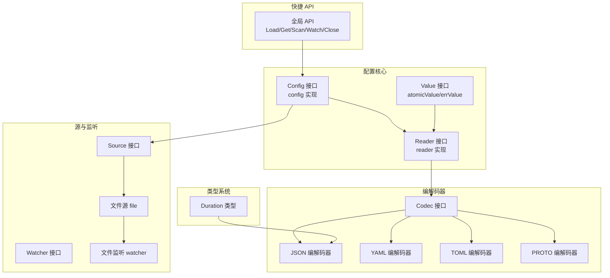
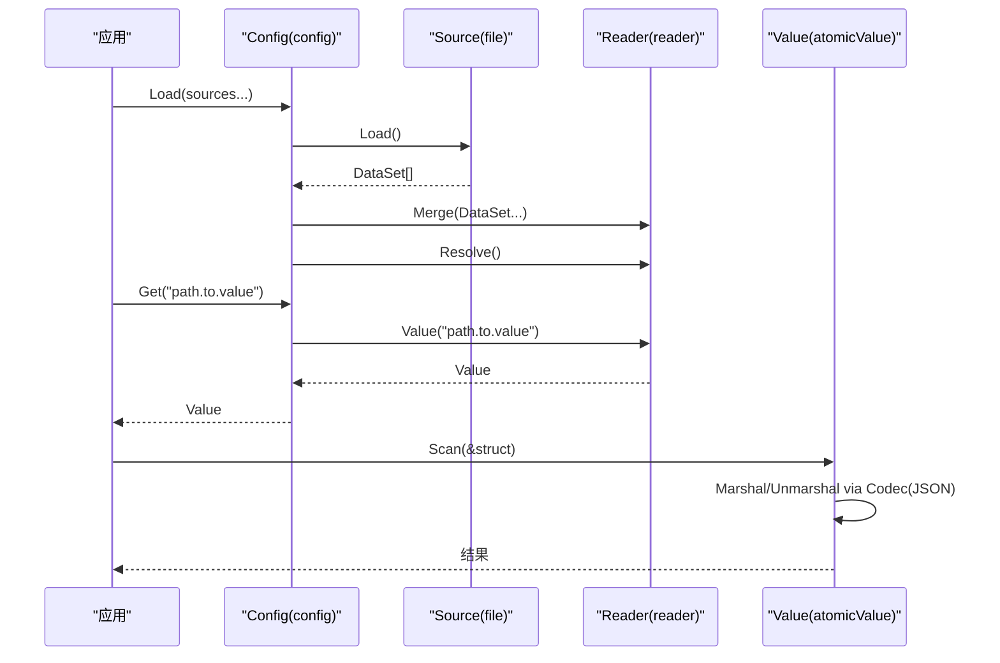
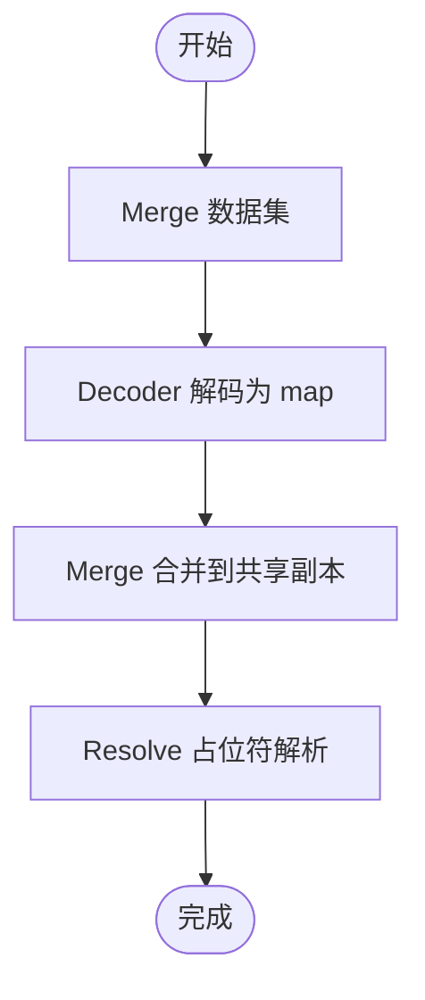
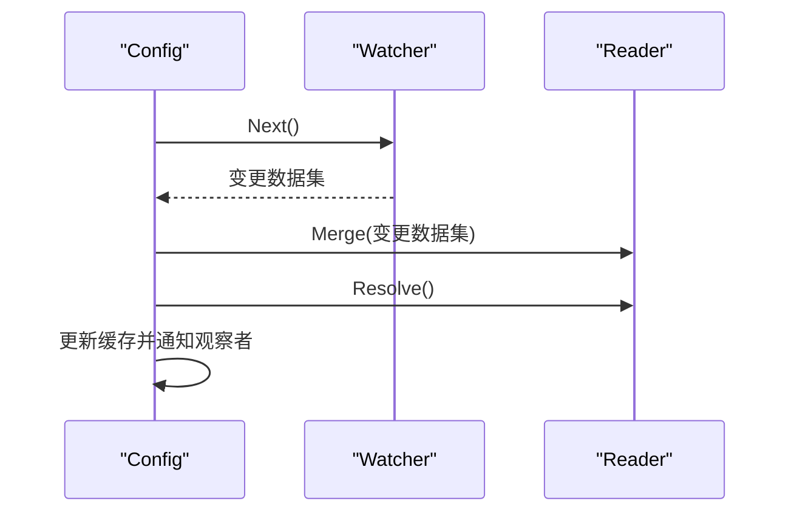
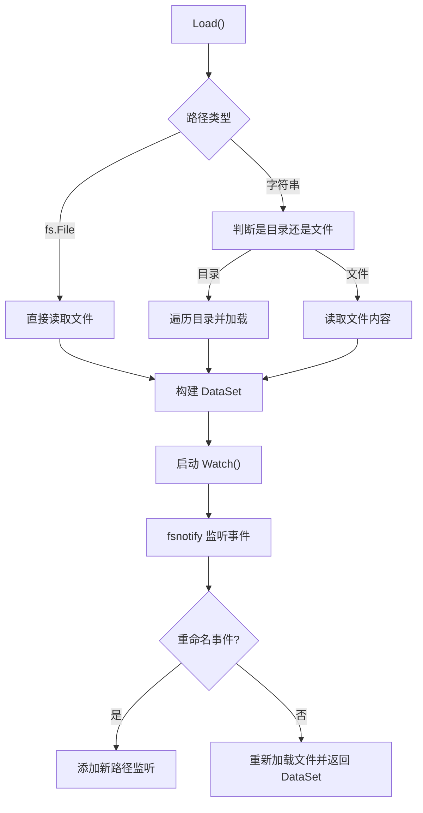
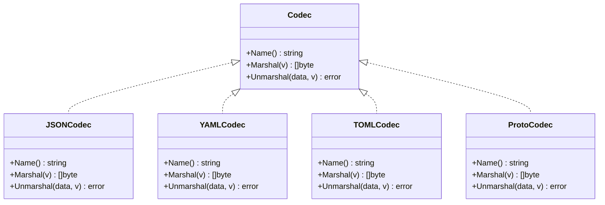
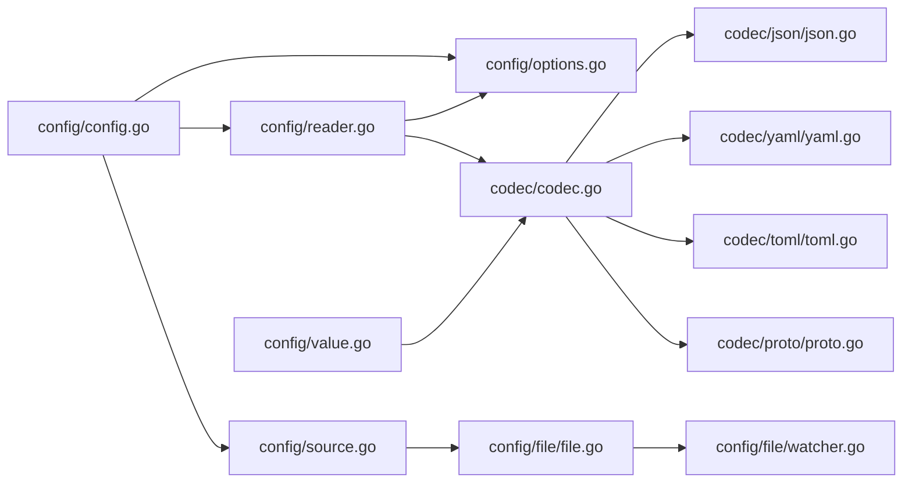

# 配置值访问系统

<cite>
**本文档引用的文件**
- [config/value.go](file://config/value.go)
- [config/types.go](file://config/types.go)
- [config/config.go](file://config/config.go)
- [config/options.go](file://config/options.go)
- [config/reader.go](file://config/reader.go)
- [config/source.go](file://config/source.go)
- [config/api.go](file://config/api.go)
- [config/file/file.go](file://config/file/file.go)
- [config/file/watcher.go](file://config/file/watcher.go)
- [codec/codec.go](file://codec/codec.go)
- [codec/json/json.go](file://codec/json/json.go)
- [codec/yaml/yaml.go](file://codec/yaml/yaml.go)
- [codec/toml/toml.go](file://codec/toml/toml.go)
- [codec/proto/proto.go](file://codec/proto/proto.go)
- [config/config_test.go](file://config/config_test.go)
</cite>

## 目录
1. [简介](#简介)
2. [项目结构](#项目结构)
3. [核心组件](#核心组件)
4. [架构总览](#架构总览)
5. [详细组件分析](#详细组件分析)
6. [依赖关系分析](#依赖关系分析)
7. [性能考虑](#性能考虑)
8. [故障排查指南](#故障排查指南)
9. [结论](#结论)
10. [附录](#附录)

## 简介
本文件面向 Go Fox 配置值访问系统，围绕 Value 接口的设计与实现展开，系统性阐述配置值的存储、获取、类型转换、安全访问、序列化与反序列化、以及与多种编解码器的集成方式。同时给出最佳实践与常见问题的解决方案，帮助开发者在复杂场景下稳定地使用配置值访问能力。

## 项目结构
配置值访问系统主要由以下模块构成：
- 核心接口与实现：Value 接口、原子值实现 atomicValue、错误值实现 errValue
- 配置读取与合并：Reader 接口及其实现 reader，负责合并多源数据、解析占位符、导出 JSON
- 配置聚合与观察：Config 接口及其实现 config，负责加载来源、缓存值、监听变更、通知观察者
- 源与监听：Source 接口、Watcher 接口及其文件实现 file、watcher
- 类型系统：Duration 类型的 JSON 序列化/反序列化
- 编解码器：统一 Codec 接口与 JSON/YAML/TOML/Proto 实现
- 快捷 API：全局默认配置实例的封装



**图表来源**
- [config/config.go](file://config/config.go#L52-L86)
- [config/reader.go](file://config/reader.go#L40-L60)
- [config/source.go](file://config/source.go#L36-L50)
- [config/file/file.go](file://config/file/file.go#L36-L50)
- [config/file/watcher.go](file://config/file/watcher.go#L37-L42)
- [codec/codec.go](file://codec/codec.go#L33-L60)
- [codec/json/json.go](file://codec/json/json.go#L63-L103)
- [codec/yaml/yaml.go](file://codec/yaml/yaml.go#L45-L61)
- [codec/toml/toml.go](file://codec/toml/toml.go#L40-L64)
- [codec/proto/proto.go](file://codec/proto/proto.go#L45-L61)
- [config/types.go](file://config/types.go#L32-L62)
- [config/api.go](file://config/api.go#L26-L63)

**章节来源**
- [config/config.go](file://config/config.go#L24-L86)
- [config/reader.go](file://config/reader.go#L24-L60)
- [config/source.go](file://config/source.go#L24-L50)
- [config/file/file.go](file://config/file/file.go#L24-L50)
- [config/file/watcher.go](file://config/file/watcher.go#L24-L42)
- [codec/codec.go](file://codec/codec.go#L24-L60)
- [codec/json/json.go](file://codec/json/json.go#L24-L61)
- [codec/yaml/yaml.go](file://codec/yaml/yaml.go#L24-L43)
- [codec/toml/toml.go](file://codec/toml/toml.go#L24-L47)
- [codec/proto/proto.go](file://codec/proto/proto.go#L24-L43)
- [config/types.go](file://config/types.go#L24-L62)
- [config/api.go](file://config/api.go#L24-L63)

## 核心组件
- Value 接口：定义了配置值的统一访问能力，包括布尔、整数、字符串、浮点、时长、切片、映射、扫描到结构体、字节、以及原子存储/加载等方法。
- atomicValue：基于原子容器的 Value 实现，保证并发安全；支持将任意值包装为 Value 并进行类型断言与转换。
- errValue：错误值实现，所有操作均返回错误，用于兜底“键不存在”等异常情况。
- Reader：负责合并多个数据集、解析占位符、导出 JSON、按路径读取 Value。
- config：配置聚合器，负责加载来源、合并数据、解析、缓存、监听变更并通知观察者。
- Source/Watcher：抽象配置来源与监听器，文件源 file 提供本地文件/目录加载与 fsnotify 监听。
- Codec：统一编解码器接口，内置 JSON/YAML/TOML/Proto 实现，支持 proto.Message 的特殊处理。
- Duration：自定义时长类型，支持字符串与数值两种 JSON 表示形式的互转。

**章节来源**
- [config/value.go](file://config/value.go#L46-L124)
- [config/reader.go](file://config/reader.go#L40-L97)
- [config/config.go](file://config/config.go#L52-L151)
- [config/source.go](file://config/source.go#L36-L50)
- [config/file/file.go](file://config/file/file.go#L36-L81)
- [config/file/watcher.go](file://config/file/watcher.go#L37-L106)
- [codec/codec.go](file://codec/codec.go#L33-L60)
- [codec/json/json.go](file://codec/json/json.go#L63-L103)
- [codec/yaml/yaml.go](file://codec/yaml/yaml.go#L45-L61)
- [codec/toml/toml.go](file://codec/toml/toml.go#L40-L64)
- [codec/proto/proto.go](file://codec/proto/proto.go#L45-L61)
- [config/types.go](file://config/types.go#L32-L62)

## 架构总览
配置值访问系统采用“多源合并 + 占位符解析 + 原子值访问”的架构模式。数据从 Source 加载，经 Reader 合并与解析后，以 map[string]interface{} 形式保存；通过路径解析生成 Value，Value 再通过原子容器保证并发安全访问。当配置源发生变化时，Watcher 将增量数据合并并触发观察者回调。



**图表来源**
- [config/config.go](file://config/config.go#L88-L134)
- [config/reader.go](file://config/reader.go#L62-L97)
- [config/file/file.go](file://config/file/file.go#L52-L76)
- [config/value.go](file://config/value.go#L94-L102)
- [codec/json/json.go](file://codec/json/json.go#L71-L103)

**章节来源**
- [config/config.go](file://config/config.go#L88-L151)
- [config/reader.go](file://config/reader.go#L62-L97)
- [config/file/file.go](file://config/file/file.go#L52-L81)
- [config/value.go](file://config/value.go#L94-L102)
- [codec/json/json.go](file://codec/json/json.go#L71-L103)

## 详细组件分析

### Value 接口与实现
Value 接口定义了配置值的统一访问能力，atomicValue 使用原子容器承载任意值，提供类型断言与转换方法；errValue 则在键不存在或错误场景下返回一致的错误语义。

```mermaid
classDiagram
class Value {
+IsEmpty() bool
+Bool() (bool, error)
+Int() (int64, error)
+String() (string, error)
+Float() (float64, error)
+Duration() (time.Duration, error)
+Slice() ([]Value, error)
+Map() (map[string]Value, error)
+Scan(val) error
+Bytes() ([]byte, error)
+Store(interface{})
+Load() interface{}
}
class atomicValue {
+Store(interface{})
+Load() interface{}
+Slice() ([]Value, error)
+Map() (map[string]Value, error)
+Scan(val) error
}
class errValue {
-err error
+IsEmpty() bool
+Bool() (bool, error)
+Int() (int64, error)
+Float() (float64, error)
+Duration() (time.Duration, error)
+String() (string, error)
+Bytes() ([]byte, error)
+Scan(val) error
+Slice() ([]Value, error)
+Map() (map[string]Value, error)
+Store(interface{})
+Load() interface{}
}
Value <|.. atomicValue
Value <|.. errValue
```

**图表来源**
- [config/value.go](file://config/value.go#L46-L124)

**章节来源**
- [config/value.go](file://config/value.go#L46-L124)

### Reader 合并与解析
Reader 负责：
- Merge：逐个数据集调用 Decoder（默认基于格式选择编解码器）转换为 map，再通过 Merge 函数（默认覆盖合并）合并到共享副本
- Resolve：递归解析字符串中的占位符 ${key:default}，支持嵌套 map 与数组
- Value：按点分路径解析，返回原子 Value
- Source：导出当前配置为 JSON，优先使用 protojson 处理 proto.Message



**图表来源**
- [config/reader.go](file://config/reader.go#L62-L97)
- [config/options.go](file://config/options.go#L81-L103)
- [config/options.go](file://config/options.go#L105-L146)

**章节来源**
- [config/reader.go](file://config/reader.go#L62-L172)
- [config/options.go](file://config/options.go#L81-L158)

### 配置聚合与观察
Config 聚合多个 Source，启动 Watcher 异步监听变更，合并增量数据并触发观察者回调；Get 支持缓存命中与兜底错误值。



**图表来源**
- [config/config.go](file://config/config.go#L136-L185)
- [config/reader.go](file://config/reader.go#L62-L97)

**章节来源**
- [config/config.go](file://config/config.go#L88-L185)

### 文件源与监听
文件源 file 支持单文件与目录加载，自动过滤隐藏文件；watcher 基于 fsnotify 监听文件事件，重命名事件会动态添加新路径监听。



**图表来源**
- [config/file/file.go](file://config/file/file.go#L52-L130)
- [config/file/watcher.go](file://config/file/watcher.go#L44-L77)

**章节来源**
- [config/file/file.go](file://config/file/file.go#L52-L131)
- [config/file/watcher.go](file://config/file/watcher.go#L44-L107)

### 编解码器与序列化
系统通过 Codec 接口统一注册与获取编解码器，默认初始化 JSON/YAML/TOML/Proto 四种实现。Reader 在解析时根据 DataSet.Format 获取对应 Codec，Value 的 Scan 也通过 JSON 编解码器将内部值序列化后再反序列化到目标结构体。



**图表来源**
- [codec/codec.go](file://codec/codec.go#L33-L60)
- [codec/json/json.go](file://codec/json/json.go#L63-L103)
- [codec/yaml/yaml.go](file://codec/yaml/yaml.go#L45-L61)
- [codec/toml/toml.go](file://codec/toml/toml.go#L40-L64)
- [codec/proto/proto.go](file://codec/proto/proto.go#L45-L61)

**章节来源**
- [codec/codec.go](file://codec/codec.go#L33-L60)
- [codec/json/json.go](file://codec/json/json.go#L57-L103)
- [codec/yaml/yaml.go](file://codec/yaml/yaml.go#L39-L61)
- [codec/toml/toml.go](file://codec/toml/toml.go#L40-L64)
- [codec/proto/proto.go](file://codec/proto/proto.go#L39-L61)

### 类型系统：Duration
Duration 包装 time.Duration，实现 JSON 的字符串与数值两种表示形式的互转，便于配置文件中灵活表达时间间隔。

**章节来源**
- [config/types.go](file://config/types.go#L32-L62)

### 快捷 API
全局默认配置实例提供 Load/Get/Scan/Watch/Close 等便捷方法，简化常用场景下的使用。

**章节来源**
- [config/api.go](file://config/api.go#L26-L63)

## 依赖关系分析
- 组件耦合
  - config 依赖 reader、Source、Watcher、options
  - reader 依赖 options(decoder/resolver/merge)、codec
  - file 源依赖 fsnotify 进行文件监听
  - Value 依赖 codec 进行 Scan 的编解码
- 外部依赖
  - 编解码：标准库 json、gopkg.in/yaml.v3、BurntSushi/toml、google.golang.org/protobuf
  - 并发工具：go-fox/sugar 的 satomic.Value[any]
  - 合并工具：dario.cat/mergo
- 循环依赖
  - 未发现直接循环依赖；编解码器通过 codec.RegisterCodec 注册，避免运行期循环导入



**图表来源**
- [config/config.go](file://config/config.go#L26-L42)
- [config/reader.go](file://config/reader.go#L26-L36)
- [codec/codec.go](file://codec/codec.go#L26-L35)
- [codec/json/json.go](file://codec/json/json.go#L26-L35)
- [codec/yaml/yaml.go](file://codec/yaml/yaml.go#L26-L32)
- [codec/toml/toml.go](file://codec/toml/toml.go#L26-L33)
- [codec/proto/proto.go](file://codec/proto/proto.go#L26-L32)
- [config/file/file.go](file://config/file/file.go#L26-L34)
- [config/file/watcher.go](file://config/file/watcher.go#L26-L35)
- [config/value.go](file://config/value.go#L31-L35)

**章节来源**
- [config/config.go](file://config/config.go#L26-L42)
- [config/reader.go](file://config/reader.go#L26-L36)
- [codec/codec.go](file://codec/codec.go#L26-L35)
- [codec/json/json.go](file://codec/json/json.go#L26-L35)
- [codec/yaml/yaml.go](file://codec/yaml/yaml.go#L26-L32)
- [codec/toml/toml.go](file://codec/toml/toml.go#L26-L33)
- [codec/proto/proto.go](file://codec/proto/proto.go#L26-L32)
- [config/file/file.go](file://config/file/file.go#L26-L34)
- [config/file/watcher.go](file://config/file/watcher.go#L26-L35)
- [config/value.go](file://config/value.go#L31-L35)

## 性能考虑
- 原子值访问：atomicValue 使用原子容器承载值，避免锁竞争，适合高并发读取场景
- 缓存策略：Config 对已解析的 Value 进行缓存，减少重复解析与断言开销
- 合并策略：默认使用覆盖合并，避免深层结构复杂度；如需深度合并，可替换 Merge 函数
- 编解码优化：JSON 编解码器优先使用 protojson 处理 proto.Message，减少反射成本
- 监听退避：Watcher 在 Next 失败时进行短暂休眠，降低轮询压力

[本节为通用指导，不直接分析具体文件]

## 故障排查指南
- 键不存在
  - 现象：Get 返回的 Value 为空且后续操作返回错误
  - 处理：检查键路径是否正确，确认 Source 是否包含该键；必要时提供默认值占位符
- 类型断言失败
  - 现象：Slice()/Map() 或类型转换方法返回类型断言错误
  - 处理：确认配置值的实际类型与期望一致；必要时在解析前进行预处理
- 占位符解析异常
  - 现象：Resolve 后字符串仍包含未解析的占位符
  - 处理：检查占位符格式 ${key:default}，确保 key 存在或提供默认值
- 编解码错误
  - 现象：Decode/Marshal/Unmarshal 抛错
  - 处理：确认 DataSet.Format 与实际内容一致；检查编解码器是否正确注册
- 文件监听失效
  - 现象：文件变更未触发更新
  - 处理：检查 fsnotify 权限与路径；关注重命名事件的处理逻辑

**章节来源**
- [config/config.go](file://config/config.go#L136-L151)
- [config/reader.go](file://config/reader.go#L93-L97)
- [config/options.go](file://config/options.go#L105-L146)
- [config/file/watcher.go](file://config/file/watcher.go#L44-L77)

## 结论
配置值访问系统通过清晰的接口设计与模块化实现，提供了高性能、可扩展、易维护的配置访问能力。Value 接口统一了类型转换与安全访问，Reader 负责多源合并与占位符解析，Config 提供观察与缓存机制，Codec 支持多种格式与 proto.Message 特殊处理。结合最佳实践与故障排查建议，可在生产环境中稳定地使用该系统。

[本节为总结性内容，不直接分析具体文件]

## 附录

### 最佳实践
- 使用点分路径访问嵌套配置，避免深层 map 断言
- 在配置文件中为关键键提供默认占位符，提升健壮性
- 对需要强类型的字段，优先使用 Duration 等自定义类型
- 在高频读取场景下，充分利用缓存；对写入频繁的配置启用 Watch 观察
- 自定义编解码器时，遵循 Codec 接口规范并注册到全局注册表

### 常见问题与解决方案
- 如何处理嵌套结构的默认值？使用占位符 ${parent.child:default}，并在解析前确保父级存在
- 如何在结构体中注入配置？使用 Value.Scan 将内部值序列化后再反序列化到目标结构体
- 如何切换合并策略？通过 WithMerge 注入自定义合并函数，实现深度合并或保留策略
- 如何扩展新的配置格式？实现 Codec 接口并通过 RegisterCodec 注册，Reader 将自动识别

**章节来源**
- [config/options.go](file://config/options.go#L74-L79)
- [config/options.go](file://config/options.go#L105-L146)
- [config/value.go](file://config/value.go#L94-L102)
- [codec/codec.go](file://codec/codec.go#L40-L50)