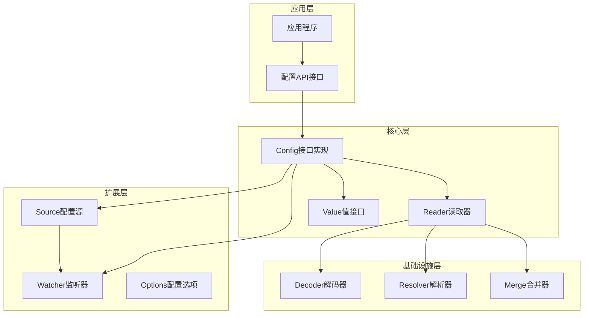
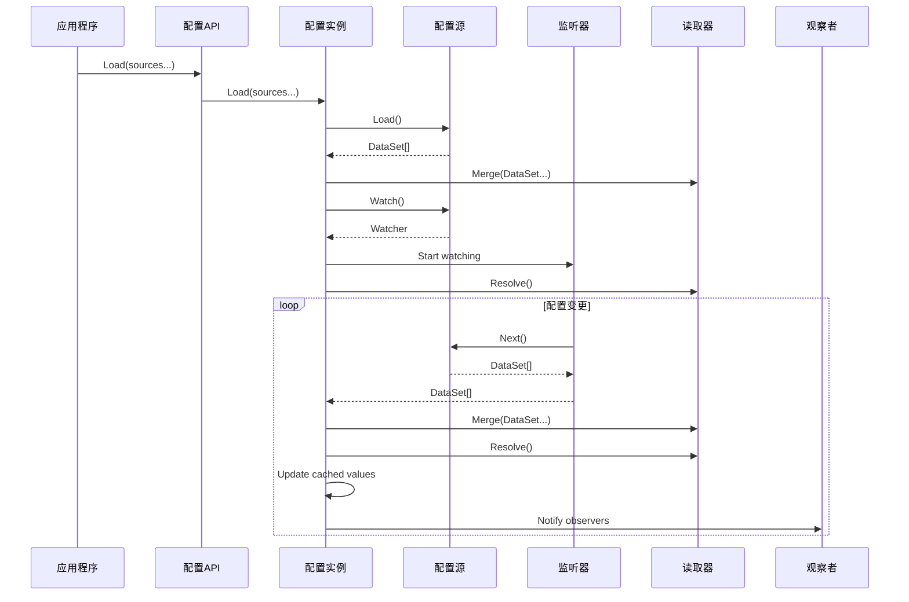
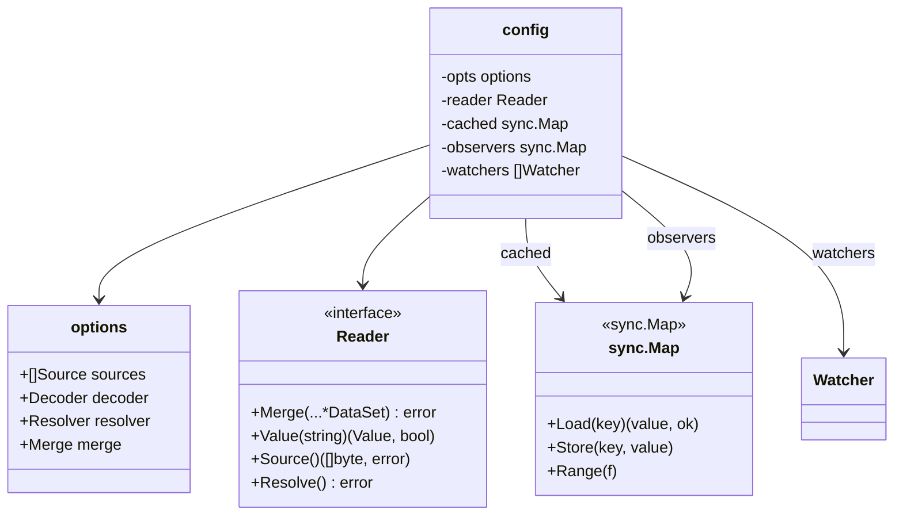
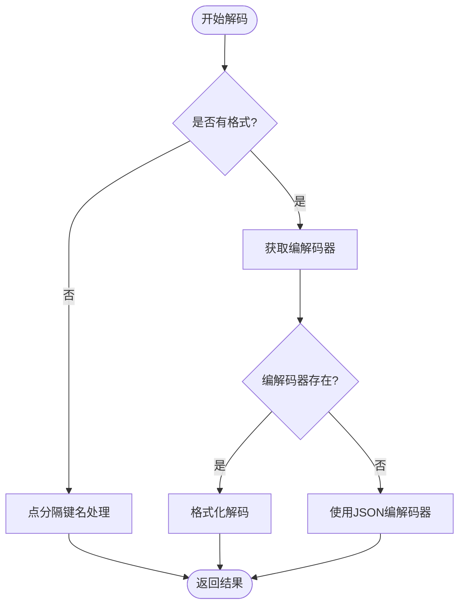
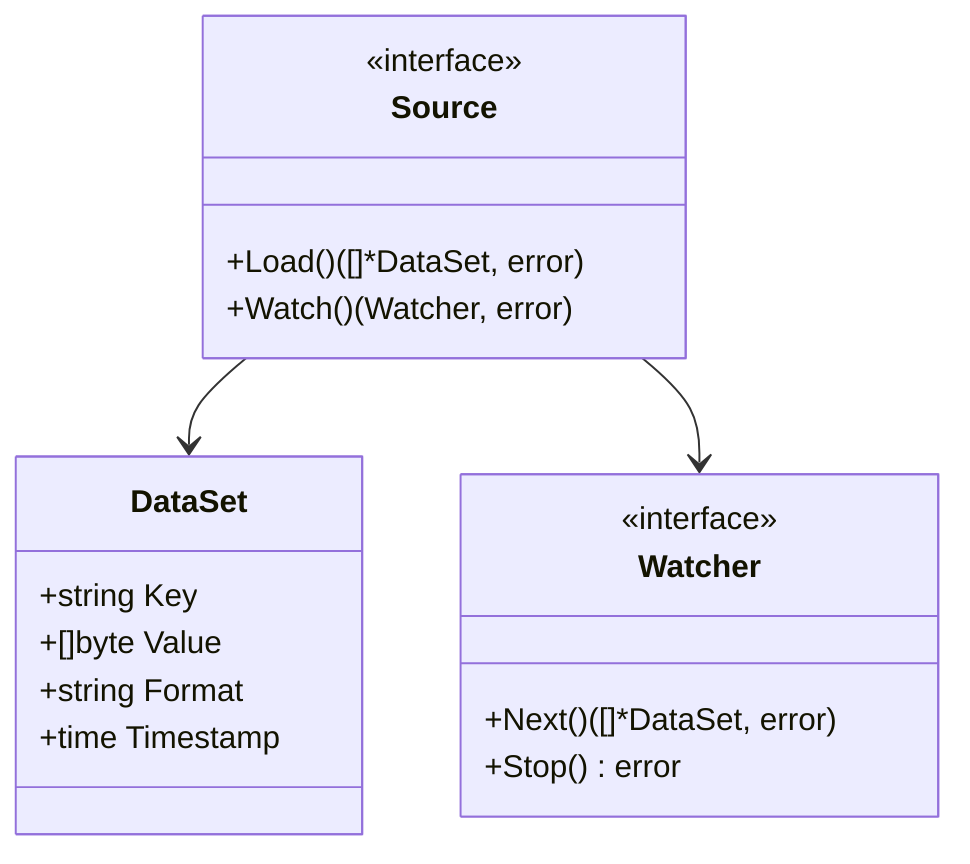
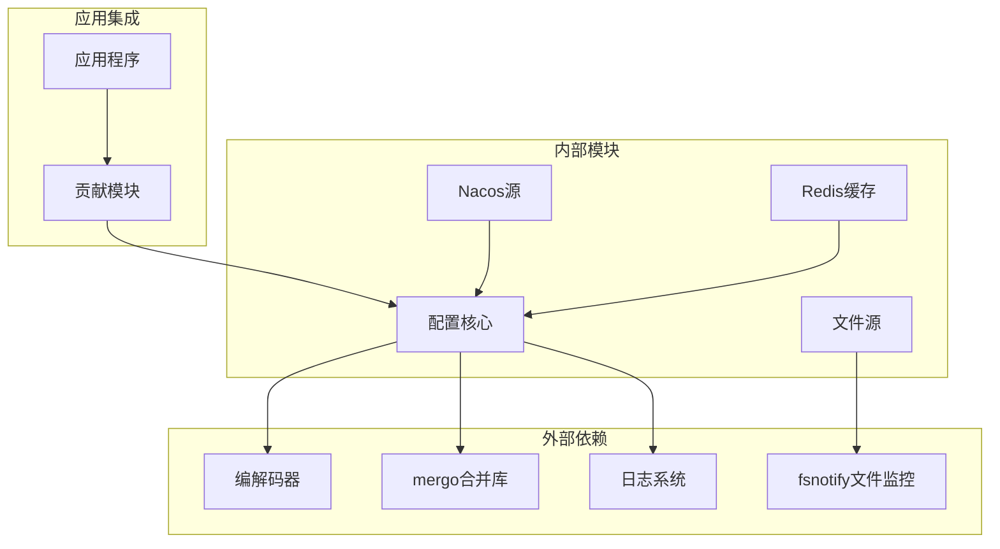

# 配置接口设计

<cite>
**本文档引用的文件**
- [config/api.go](file://config/api.go)
- [config/config.go](file://config/config.go)
- [config/options.go](file://config/options.go)
- [config/types.go](file://config/types.go)
- [config/value.go](file://config/value.go)
- [config/reader.go](file://config/reader.go)
- [config/source.go](file://config/source.go)
- [config/file/file.go](file://config/file/file.go)
- [config/file/watcher.go](file://config/file/watcher.go)
- [config/config_test.go](file://config/config_test.go)
- [contrib/config/nacos/nacos.go](file://contrib/config/nacos/nacos.go)
- [contrib/cache/redis/config.go](file://contrib/cache/redis/config.go)
</cite>

## 目录
1. [简介](#简介)
2. [项目结构](#项目结构)
3. [核心组件](#核心组件)
4. [架构概览](#架构概览)
5. [详细组件分析](#详细组件分析)
6. [依赖关系分析](#依赖关系分析)
7. [性能考虑](#性能考虑)
8. [故障排除指南](#故障排除指南)
9. [结论](#结论)
10. [附录](#附录)

## 简介

Go Fox配置接口设计是一个高度模块化、可扩展的配置管理系统。该系统提供了统一的配置访问接口，支持多种配置源（文件、远程配置中心等），具备热更新能力，并通过观察者模式实现配置变更通知。

本系统的核心设计理念是：
- **接口抽象**：通过Config接口定义统一的配置访问标准
- **插件化架构**：支持多种配置源和编码格式
- **线程安全**：内置并发安全的数据结构和同步机制
- **观察者模式**：提供配置变更的实时通知机制
- **可扩展性**：允许用户自定义解码器、解析器和合并策略

## 项目结构

配置系统采用分层架构设计，主要包含以下层次：



**图表来源**
- [config/api.go](file://config/api.go#L24-L63)
- [config/config.go](file://config/config.go#L24-L86)
- [config/options.go](file://config/options.go#L24-L48)

**章节来源**
- [config/api.go](file://config/api.go#L24-L63)
- [config/config.go](file://config/config.go#L24-L86)
- [config/options.go](file://config/options.go#L24-L48)

## 核心组件

### Config接口设计

Config接口定义了配置系统的核心功能，包含以下方法：

```mermaid
classDiagram
class Config {
<<interface>>
+Load(sources...): error
+Scan(v: interface{}): error
+Get(key: string): Value
+Watch(key: string, o: Observer): error
+Close(): error
}
class config {
-opts: options
-reader: Reader
-cached: sync.Map
-observers: sync.Map
-watchers: []Watcher
+Load(sources...): error
+Scan(v: interface{}): error
+Get(key: string): Value
+Watch(key: string, o: Observer): error
+Close(): error
-watch(w: Watcher): void
}
class Observer {
<<function>>
+func(string, Value): void
}
Config <|.. config
config --> Observer
```

**图表来源**
- [config/config.go](file://config/config.go#L52-L59)
- [config/config.go](file://config/config.go#L62-L68)

### Value接口设计

Value接口提供了类型安全的配置值访问能力：

```mermaid
classDiagram
class Value {
<<interface>>
+IsEmpty() bool
+Bool() (bool, error)
+Int() (int64, error)
+String() (string, error)
+Float() (float64, error)
+Duration() (time.Duration, error)
+Slice() ([]Value, error)
+Map() (map[string]Value, error)
+Scan(val interface{}) error
+Bytes() ([]byte, error)
+Store(interface{}) void
+Load() interface{}
}
class atomicValue {
-Value: any
+Slice() ([]Value, error)
+Map() (map[string]Value, error)
+Scan(val interface{}) error
}
class errValue {
-error: error
+IsEmpty() bool
+Bool() (bool, error)
+Int() (int64, error)
+Float() (float64, error)
+Duration() (time.Duration, error)
+String() (string, error)
+Bytes() ([]byte, error)
+Scan(val interface{}) error
+Load() interface{}
+Store(interface{}) void
+Slice() ([]Value, error)
+Map() (map[string]Value, error)
}
Value <|-- atomicValue
Value <|-- errValue
```

**图表来源**
- [config/value.go](file://config/value.go#L46-L60)
- [config/value.go](file://config/value.go#L62-L64)
- [config/value.go](file://config/value.go#L104-L124)

**章节来源**
- [config/config.go](file://config/config.go#L52-L59)
- [config/value.go](file://config/value.go#L46-L60)

## 架构概览

配置系统采用事件驱动的架构模式，通过监听器机制实现实时配置更新：



**图表来源**
- [config/config.go](file://config/config.go#L88-L115)
- [config/config.go](file://config/config.go#L153-L185)

**章节来源**
- [config/config.go](file://config/config.go#L88-L115)
- [config/config.go](file://config/config.go#L153-L185)

## 详细组件分析

### 配置实现类config

config类是配置系统的核心实现，包含了以下关键组件：

#### 内部结构分析



**图表来源**
- [config/config.go](file://config/config.go#L62-L68)
- [config/options.go](file://config/options.go#L43-L48)

#### 缓存机制设计

config实现了两级缓存机制：

1. **内存缓存**：使用sync.Map存储已解析的配置值
2. **原子值缓存**：每个配置值都封装在atomicValue中，确保线程安全

缓存策略：
- 首次访问时从Reader读取并缓存
- 配置更新时只更新变化的值
- 支持类型检查和深度比较

#### 观察者模式实现

观察者模式通过以下组件实现：

- **observers存储**：sync.Map存储键到观察者的映射
- **通知机制**：配置变更时遍历所有观察者并触发回调
- **类型安全**：观察者接收的Value对象包含最新的配置值

**章节来源**
- [config/config.go](file://config/config.go#L62-L68)
- [config/config.go](file://config/config.go#L125-L142)

### 配置选项系统

配置选项系统提供了高度可定制的配置处理能力：

#### 解码器(Decoder)设计

默认解码器支持两种模式：

1. **无格式解码**：将点分隔的键名转换为嵌套map结构
2. **格式化解码**：使用对应的编解码器处理特定格式的数据



**图表来源**
- [config/options.go](file://config/options.go#L83-L103)

#### 解析器(Resolver)设计

解析器负责处理配置中的占位符替换：

占位符格式：`${key:default}`

解析流程：
1. 正则表达式匹配所有占位符
2. 查找对应的配置值
3. 如果找不到，使用默认值
4. 递归处理嵌套结构

#### 合并器(Merge)设计

默认合并器使用mergo库实现深度合并：

- 支持覆盖现有值
- 保持原有结构不变
- 处理复杂嵌套结构

**章节来源**
- [config/options.go](file://config/options.go#L83-L158)

### 数据源和监听器

#### Source接口设计

Source接口定义了配置源的标准行为：



**图表来源**
- [config/source.go](file://config/source.go#L36-L50)

#### 文件源实现

文件源提供了本地文件和目录的配置加载能力：

- **单文件加载**：支持字符串路径和fs.File接口
- **目录加载**：递归加载目录中的所有配置文件
- **自动过滤**：忽略隐藏文件和特殊文件
- **格式识别**：根据文件扩展名自动识别格式

#### 文件监听器实现

文件监听器基于fsnotify实现：

- **事件处理**：处理文件创建、修改、删除等事件
- **重命名处理**：自动重新注册监听
- **上下文管理**：支持取消和清理
- **错误恢复**：网络错误时自动重试

**章节来源**
- [config/source.go](file://config/source.go#L28-L50)
- [config/file/file.go](file://config/file/file.go#L36-L131)
- [config/file/watcher.go](file://config/file/watcher.go#L37-L107)

### Reader实现

Reader负责配置数据的合并、解析和查询：

#### 并发安全设计

Reader使用互斥锁确保线程安全：

- **写操作锁定**：Merge、Resolve、Source等写操作使用锁
- **读操作优化**：Value查询不持有锁，提高读性能
- **深拷贝机制**：避免并发修改问题

#### 数据转换机制

Reader实现了复杂的类型转换：

- **map[string]interface{}**：标准Go配置格式
- **map[interface{}]interface{}**：支持非字符串键的map
- **[]interface{}**：切片类型的处理
- **[]byte**：字节数据转换为字符串

**章节来源**
- [config/reader.go](file://config/reader.go#L48-L103)
- [config/reader.go](file://config/reader.go#L105-L131)

## 依赖关系分析

配置系统采用了清晰的依赖层次结构：



**图表来源**
- [config/config.go](file://config/config.go#L35-L42)
- [config/file/watcher.go](file://config/file/watcher.go#L32-L35)

**章节来源**
- [config/config.go](file://config/config.go#L35-L42)
- [config/file/watcher.go](file://config/file/watcher.go#L32-L35)

## 性能考虑

### 缓存策略优化

1. **原子值缓存**：使用原子操作减少锁竞争
2. **懒加载机制**：只在需要时解析和缓存配置值
3. **增量更新**：只更新发生变化的配置项

### 并发性能

1. **读写分离**：读操作不持有锁，写操作使用互斥锁
2. **批量处理**：配置合并和解析采用批量处理
3. **异步监听**：监听器运行在独立goroutine中

### 内存管理

1. **对象池**：复用DataSet和Value对象
2. **及时释放**：监听器停止时及时释放资源
3. **垃圾回收**：合理使用指针避免内存泄漏

## 故障排除指南

### 常见问题诊断

#### 配置加载失败

可能原因：
- 源文件不存在或权限不足
- 配置格式不正确
- 编解码器不支持的格式

解决方法：
- 检查文件路径和权限
- 验证配置格式
- 确认编解码器可用性

#### 配置更新不生效

可能原因：
- 监听器未正确启动
- 配置合并策略冲突
- 观察者未正确注册

解决方法：
- 检查监听器状态
- 调整合并策略
- 重新注册观察者

#### 类型转换错误

可能原因：
- 配置值类型与期望类型不匹配
- JSON解析错误
- 占位符解析失败

解决方法：
- 检查配置值类型
- 验证JSON格式
- 检查占位符语法

**章节来源**
- [config/config.go](file://config/config.go#L96-L113)
- [config/options.go](file://config/options.go#L107-L146)

## 结论

Go Fox配置接口设计展现了优秀的软件工程实践：

1. **接口设计优雅**：Config接口简洁明了，职责单一
2. **扩展性强**：通过Options模式支持高度定制
3. **并发安全**：内置完善的并发控制机制
4. **可观测性好**：完整的日志记录和错误处理
5. **生态完善**：支持多种配置源和格式

该系统为Go Fox框架提供了坚实的基础配置能力，开发者可以基于此接口轻松扩展新的配置源和处理逻辑。

## 附录

### 最佳实践指南

#### 使用建议

1. **初始化配置**：始终使用New()函数创建配置实例
2. **注册观察者**：在应用启动时注册必要的观察者
3. **错误处理**：妥善处理配置加载和解析错误
4. **资源清理**：应用退出时调用Close()清理资源

#### 扩展开发

1. **自定义解码器**：实现Decoder接口处理特殊格式
2. **自定义解析器**：实现Resolver接口处理占位符
3. **自定义合并器**：实现Merge接口控制合并策略
4. **新配置源**：实现Source和Watcher接口

#### 性能优化

1. **合理使用缓存**：利用内置缓存减少重复解析
2. **批量操作**：尽量批量加载和更新配置
3. **异步处理**：配置更新采用异步处理避免阻塞
4. **监控告警**：建立配置系统的监控和告警机制