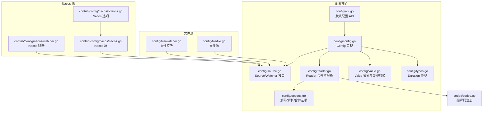
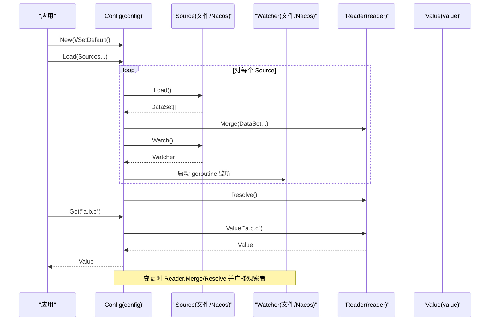
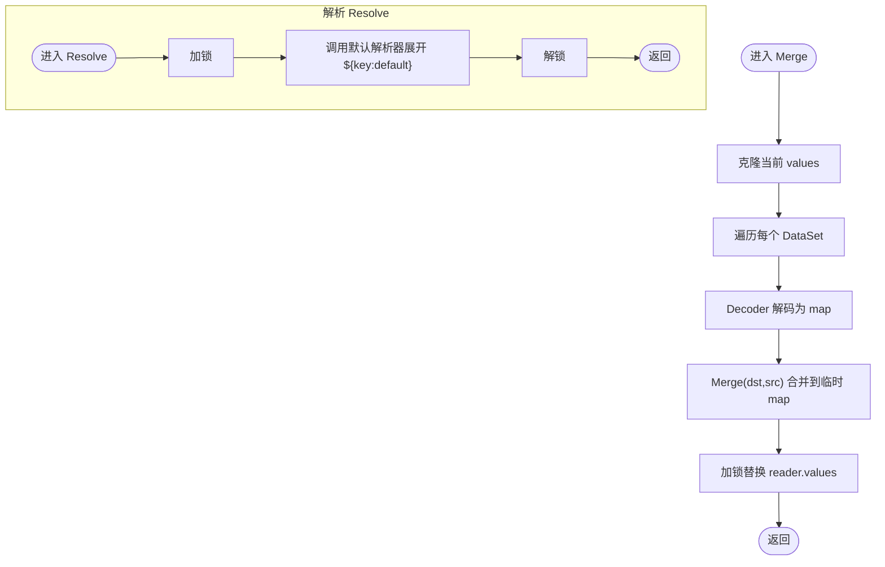
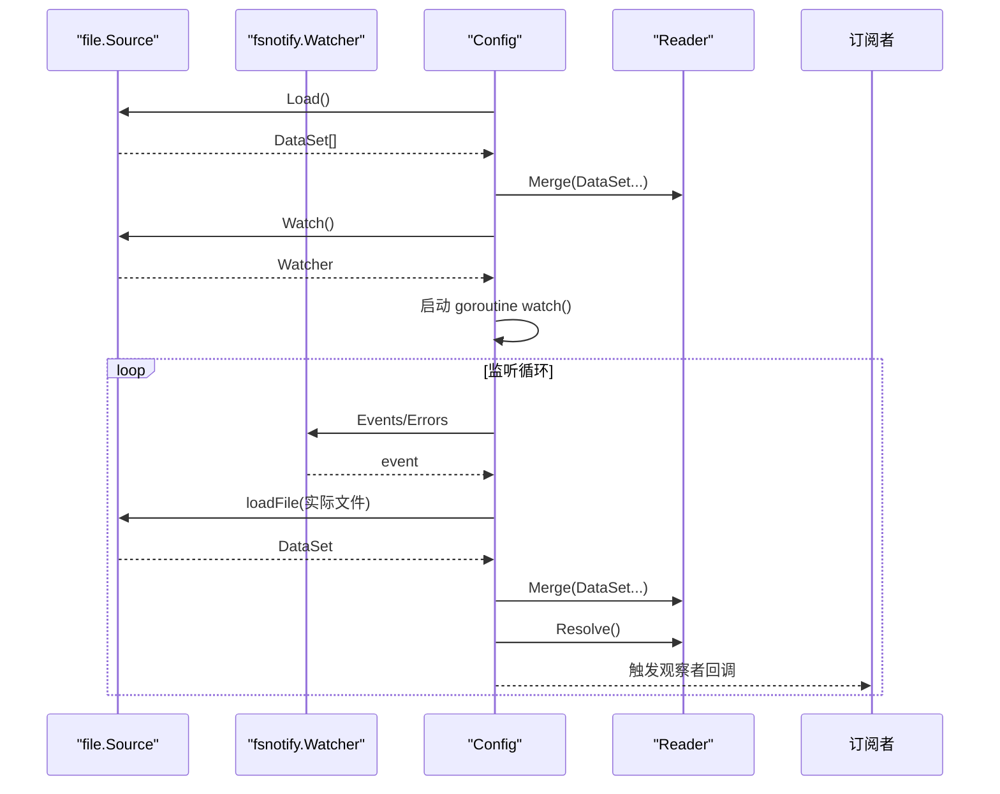
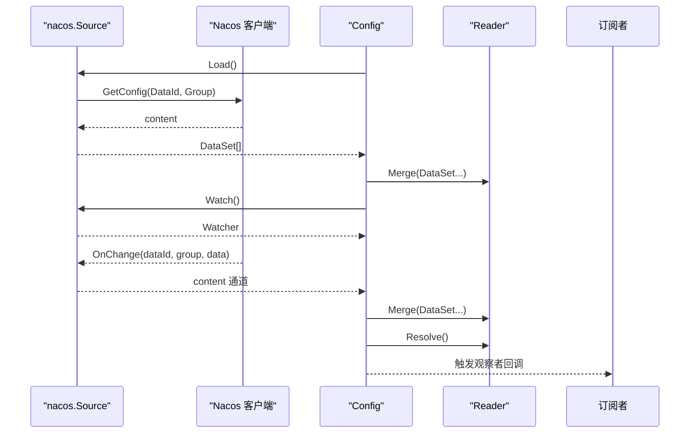
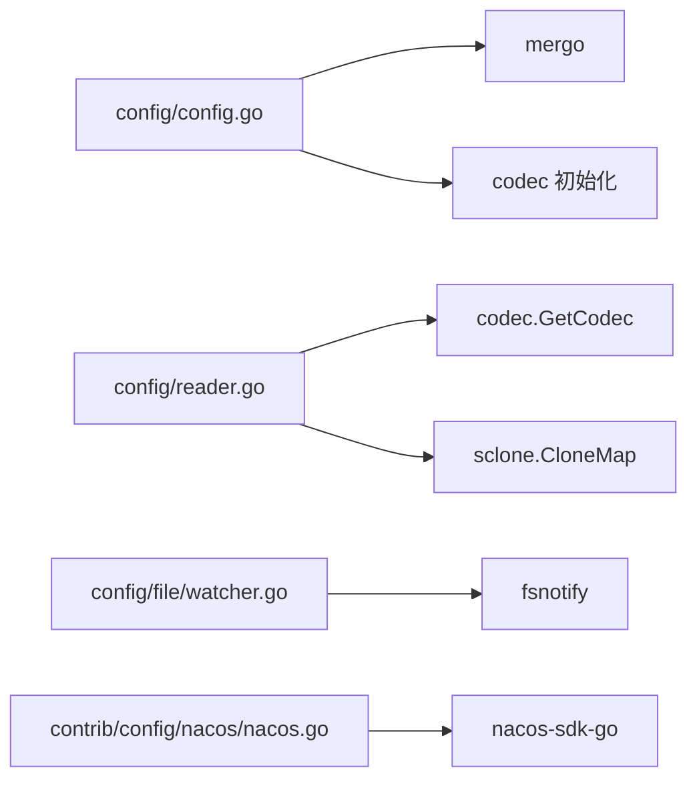
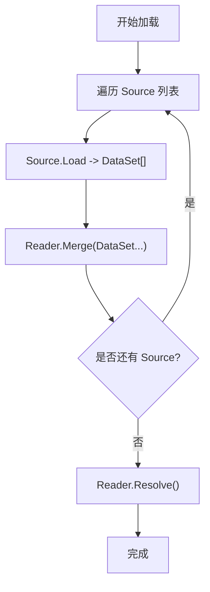
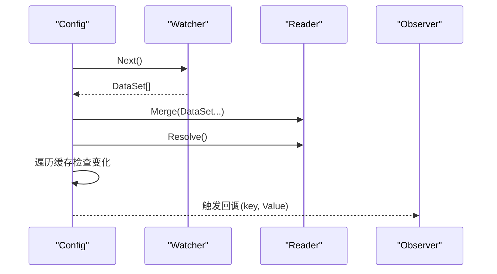

# 配置管理系统

<cite>
**本文引用的文件**
- [config.go](file://config/config.go)
- [api.go](file://config/api.go)
- [source.go](file://config/source.go)
- [options.go](file://config/options.go)
- [reader.go](file://config/reader.go)
- [value.go](file://config/value.go)
- [types.go](file://config/types.go)
- [file.go](file://config/file/file.go)
- [watcher.go](file://config/file/watcher.go)
- [nacos.go](file://contrib/config/nacos/nacos.go)
- [options.go](file://contrib/config/nacos/options.go)
- [watcher.go](file://contrib/config/nacos/watcher.go)
- [codec.go](file://codec/codec.go)
- [config_test.go](file://config/config_test.go)
</cite>

## 目录
1. [简介](#简介)
2. [项目结构](#项目结构)
3. [核心组件](#核心组件)
4. [架构总览](#架构总览)
5. [详细组件分析](#详细组件分析)
6. [依赖关系分析](#依赖关系分析)
7. [性能与并发特性](#性能与并发特性)
8. [安全与类型转换](#安全与类型转换)
9. [多源配置加载与合并策略](#多源配置加载与合并策略)
10. [动态配置更新与热更新](#动态配置更新与热更新)
11. [文件配置源实现与监控](#文件配置源实现与监控)
12. [Nacos 集成方案](#nacos-集成方案)
13. [最佳实践](#最佳实践)
14. [故障排查指南](#故障排查指南)
15. [结论](#结论)

## 简介
本技术文档围绕 Go Fox 的配置管理系统，系统性阐述配置接口设计理念与实现机制，覆盖配置加载、解析、缓存、合并策略、动态更新、类型安全访问、文件源监控以及 Nacos 集成等内容。文档面向从入门到进阶的读者，既提供高层架构视图，也给出代码级的类图、时序图与流程图，帮助快速理解与落地。

## 项目结构
配置子系统位于 config 包，并通过 contrib 子模块扩展了 Nacos 等外部配置中心。核心文件职责如下：
- config/config.go：配置接口与实现，负责加载、合并、解析、缓存、观察者与关闭
- config/api.go：默认实例封装，提供全局便捷 API
- config/source.go：Source/Watcher 接口定义
- config/options.go：解码器、解析器、合并器选项与默认实现
- config/reader.go：读取器，负责合并、解析、路径读取、序列化
- config/value.go：值抽象与原子化访问，提供类型转换与扫描
- config/types.go：Duration 类型的 JSON 序列化/反序列化
- config/file/file.go：文件源实现（单文件/目录）
- config/file/watcher.go：文件变更监听（基于 fsnotify）
- contrib/config/nacos/nacos.go：Nacos 配置源实现
- contrib/config/nacos/options.go：Nacos 客户端与参数选项
- contrib/config/nacos/watcher.go：Nacos 变更监听
- codec/codec.go：编解码注册与获取



**图表来源**
- [config.go](file://config/config.go#L62-L186)
- [api.go](file://config/api.go#L26-L64)
- [source.go](file://config/source.go#L36-L51)
- [options.go](file://config/options.go#L43-L158)
- [reader.go](file://config/reader.go#L48-L172)
- [value.go](file://config/value.go#L46-L124)
- [types.go](file://config/types.go#L32-L63)
- [file.go](file://config/file/file.go#L36-L131)
- [watcher.go](file://config/file/watcher.go#L37-L107)
- [nacos.go](file://contrib/config/nacos/nacos.go#L17-L95)
- [options.go](file://contrib/config/nacos/options.go#L10-L115)
- [watcher.go](file://contrib/config/nacos/watcher.go#L12-L67)
- [codec.go](file://codec/codec.go#L31-L61)

**章节来源**
- [config.go](file://config/config.go#L62-L186)
- [api.go](file://config/api.go#L26-L64)
- [source.go](file://config/source.go#L36-L51)
- [options.go](file://config/options.go#L43-L158)
- [reader.go](file://config/reader.go#L48-L172)
- [value.go](file://config/value.go#L46-L124)
- [types.go](file://config/types.go#L32-L63)
- [file.go](file://config/file/file.go#L36-L131)
- [watcher.go](file://config/file/watcher.go#L37-L107)
- [nacos.go](file://contrib/config/nacos/nacos.go#L17-L95)
- [options.go](file://contrib/config/nacos/options.go#L10-L115)
- [watcher.go](file://contrib/config/nacos/watcher.go#L12-L67)
- [codec.go](file://codec/codec.go#L31-L61)

## 核心组件
- Config 接口与实现
  - 负责加载多个 Source，合并为统一内存树，解析占位符，提供键值访问，支持观察者与关闭
  - 关键方法：Load、Scan、Get、Watch、Close
- Reader 接口与实现
  - 负责将 DataSet 合并为 map，按点号路径读取值，解析占位符，序列化输出
- Value 接口与实现
  - 提供布尔、整数、字符串、浮点、Duration、切片、映射、字节、扫描等类型转换与原子存储
- Source/Watcher 接口
  - Source 负责加载初始数据集与启动 Watcher；Watcher 负责返回变更的数据集
- Options 与默认策略
  - 默认解码器根据格式选择编解码器或展开“a.b.c”键；默认解析器支持 ${key:default} 占位符展开
- 编解码器注册
  - 通过 codec.RegisterCodec 注册，codec.GetCodec 获取对应编解码器

**章节来源**
- [config.go](file://config/config.go#L52-L186)
- [reader.go](file://config/reader.go#L40-L172)
- [value.go](file://config/value.go#L46-L124)
- [source.go](file://config/source.go#L36-L51)
- [options.go](file://config/options.go#L34-L158)
- [codec.go](file://codec/codec.go#L31-L61)

## 架构总览
下图展示配置系统从初始化、加载、解析、缓存到动态监听的整体流程。



**图表来源**
- [config.go](file://config/config.go#L88-L186)
- [reader.go](file://config/reader.go#L62-L97)
- [value.go](file://config/value.go#L133-L157)
- [file.go](file://config/file/file.go#L51-L81)
- [watcher.go](file://config/file/watcher.go#L44-L79)
- [nacos.go](file://contrib/config/nacos/nacos.go#L58-L95)
- [watcher.go](file://contrib/config/nacos/watcher.go#L36-L51)

## 详细组件分析

### Config 实现与生命周期
- 初始化：New 收集 Option，构造 Reader，默认合并策略使用 mergo.WithOverride
- 加载：逐个 Source.Load，合并到 Reader，随后 Reader.Resolve；同时为每个 Source 启动 Watcher 并在独立 goroutine 中消费变更
- 访问：Get 先查本地缓存，未命中则从 Reader.Value 读取并写入缓存
- 观察：Watch 注册观察者，当 Reader.Resolve 后发现值变化，触发回调
- 关闭：依次停止所有 Watcher

```mermaid
classDiagram
class Config {
+Load(sources...) error
+Scan(v) error
+Get(key) Value
+Watch(key, o) error
+Close() error
}
class config {
-opts options
-reader Reader
-cached sync.Map
-observers sync.Map
-watchers []Watcher
-watch(w Watcher)
}
class Reader {
+Merge(...DataSet) error
+Value(path) (Value,bool)
+Source() ([]byte,error)
+Resolve() error
}
class reader {
-opts options
-values map[string]interface{}
-lock Mutex
}
class Value {
+IsEmpty() bool
+Bool() (bool,error)
+Int() (int64,error)
+String() (string,error)
+Float() (float64,error)
+Duration() (time.Duration,error)
+Slice() ([]Value,error)
+Map() (map[string]Value,error)
+Scan(v) error
+Bytes() ([]byte,error)
+Store(interface{})
+Load() interface{}
}
class atomicValue
class errValue
Config <|.. config
config --> Reader : "持有"
Reader <|.. reader
Value <|.. atomicValue
Value <|.. errValue
```

**图表来源**
- [config.go](file://config/config.go#L52-L186)
- [reader.go](file://config/reader.go#L40-L97)
- [value.go](file://config/value.go#L46-L124)

**章节来源**
- [config.go](file://config/config.go#L70-L186)
- [reader.go](file://config/reader.go#L48-L97)
- [value.go](file://config/value.go#L40-L124)

### Reader 合并与解析
- Merge：对每个 DataSet 使用 Decoder 解码为 map，再用 Merge 函数（默认 mergo.WithOverride）合并到只读副本，最后加锁替换内部 values
- Value：按“.”分割路径，逐层定位，最终以原子值包装返回
- Resolve：对 values 执行默认解析器，支持 ${key:default} 展开
- Source：将当前 values 序列化为 JSON 或 Protobuf（若目标为 proto.Message）



**图表来源**
- [reader.go](file://config/reader.go#L62-L97)
- [options.go](file://config/options.go#L81-L146)

**章节来源**
- [reader.go](file://config/reader.go#L62-L172)
- [options.go](file://config/options.go#L81-L146)

### Value 抽象与类型转换
- atomicValue：基于原子值，提供 Store/Load 与类型转换方法（Bool/Int/String/Float/Duration/Slice/Map/Scan/Bytes）
- errValue：用于表示键不存在或错误状态，所有方法返回错误
- Duration：自定义 JSON 序列化/反序列化，支持字符串与数值两种输入

```mermaid
classDiagram
class Value {
+IsEmpty() bool
+Bool() (bool,error)
+Int() (int64,error)
+String() (string,error)
+Float() (float64,error)
+Duration() (time.Duration,error)
+Slice() ([]Value,error)
+Map() (map[string]Value,error)
+Scan(v) error
+Bytes() ([]byte,error)
+Store(interface{})
+Load() interface{}
}
class atomicValue {
+Store(interface{})
+Load() interface{}
+Bool() (bool,error)
+Int() (int64,error)
+String() (string,error)
+Float() (float64,error)
+Duration() (time.Duration,error)
+Slice() ([]Value,error)
+Map() (map[string]Value,error)
+Scan(v) error
+Bytes() ([]byte,error)
}
class errValue {
+IsEmpty() bool
+Bool() (bool,error)
+Int() (int64,error)
+String() (string,error)
+Float() (float64,error)
+Duration() (time.Duration,error)
+Slice() ([]Value,error)
+Map() (map[string]Value,error)
+Scan(v) error
+Bytes() ([]byte,error)
+Store(interface{})
+Load() interface{}
}
Value <|.. atomicValue
Value <|.. errValue
```

**图表来源**
- [value.go](file://config/value.go#L46-L124)
- [types.go](file://config/types.go#L32-L63)

**章节来源**
- [value.go](file://config/value.go#L40-L124)
- [types.go](file://config/types.go#L32-L63)

### 文件配置源与监控
- NewSource：支持字符串路径（文件或目录）或 fs.File
- Load：若为目录，递归加载非隐藏文件；若为文件，读取二进制内容与修改时间
- Watch：基于 fsnotify 监听事件；重命名事件尝试重新 Add；目录场景按事件文件名拼接真实路径
- Next：返回单个 DataSet，格式由文件扩展名决定



**图表来源**
- [file.go](file://config/file/file.go#L51-L131)
- [watcher.go](file://config/file/watcher.go#L44-L107)
- [config.go](file://config/config.go#L153-L185)

**章节来源**
- [file.go](file://config/file/file.go#L36-L131)
- [watcher.go](file://config/file/watcher.go#L37-L107)

### Nacos 配置源与监听
- NewSource：构建客户端配置与服务端列表，创建配置客户端
- Load：根据 DataId/Group 拉取配置内容，返回 DataSet
- Watch：注册 ListenConfig 回调，收到变更后向内部通道推送内容，Next 返回 DataSet
- Options：支持设置服务地址、命名空间、超时、日志/缓存目录、分组、DataId、认证信息等



**图表来源**
- [nacos.go](file://contrib/config/nacos/nacos.go#L58-L95)
- [watcher.go](file://contrib/config/nacos/watcher.go#L36-L67)
- [options.go](file://contrib/config/nacos/options.go#L19-L115)

**章节来源**
- [nacos.go](file://contrib/config/nacos/nacos.go#L17-L95)
- [watcher.go](file://contrib/config/nacos/watcher.go#L12-L67)
- [options.go](file://contrib/config/nacos/options.go#L10-L115)

## 依赖关系分析
- 组件耦合
  - config/config.go 依赖 codec 初始化（引入多种编解码器），依赖 mergo 进行合并
  - config/reader.go 依赖 codec 获取编解码器，依赖 sclone 进行深拷贝
  - contrib/config/nacos/* 依赖 nacos-sdk-go
- 外部依赖
  - fsnotify：文件监听
  - dario.cat/mergo：深度合并
  - github.com/go-fox/sugar/util/sclone：map 深拷贝
  - google.golang.org/protobuf：Protobuf JSON 序列化/反序列化



**图表来源**
- [config.go](file://config/config.go#L35-L42)
- [reader.go](file://config/reader.go#L33-L36)
- [watcher.go](file://config/file/watcher.go#L32-L35)
- [nacos.go](file://contrib/config/nacos/nacos.go#L6-L15)

**章节来源**
- [config.go](file://config/config.go#L35-L42)
- [reader.go](file://config/reader.go#L33-L36)
- [watcher.go](file://config/file/watcher.go#L32-L35)
- [nacos.go](file://contrib/config/nacos/nacos.go#L6-L15)

## 性能与并发特性
- 并发模型
  - Reader 内部使用互斥锁保护 values 的读写
  - Config 在 Merge/Resolve 时加锁，避免竞态
  - 观察者回调在变更后同步触发，建议在回调中避免阻塞
- 缓存策略
  - Get 首先查询本地缓存，减少 Reader 锁竞争与路径解析成本
- 合并策略
  - 默认使用 mergo.WithOverride，深层 map 会覆盖同名键
- 解析成本
  - Resolve 会对整个 values 树进行占位符展开，建议合理设计占位符层级，避免过深嵌套

[本节为通用性能讨论，不直接分析具体文件]

## 安全与类型转换
- 类型转换
  - Value 提供强类型的转换方法，失败时返回错误
  - Duration 支持字符串与数值两种输入，字符串采用标准时长解析
- 默认值与占位符
  - 默认解析器支持 ${key:default}，当 key 不存在时回退到默认值
- 错误处理
  - 未找到键返回特定错误；errValue 将所有操作转为错误
- 原子访问
  - atomicValue 确保多协程下的读取一致性

**章节来源**
- [value.go](file://config/value.go#L46-L124)
- [types.go](file://config/types.go#L32-L63)
- [options.go](file://config/options.go#L105-L146)

## 多源配置加载与合并策略
- 数据来源
  - 文件源：支持单文件与目录，自动过滤隐藏文件
  - Nacos 源：按 DataId/Group 拉取配置
  - 可扩展：任意实现 Source/Watcher 接口的第三方源
- 加载流程
  - 每个 Source.Load 返回一组 DataSet，Reader.Merge 逐步合并
  - Reader.Resolve 对合并后的 values 展开占位符
- 合并策略
  - 默认使用 mergo.WithOverride，深层覆盖
  - 可通过 WithMerge 自定义合并逻辑



**图表来源**
- [config.go](file://config/config.go#L88-L115)
- [reader.go](file://config/reader.go#L62-L97)
- [options.go](file://config/options.go#L74-L79)

**章节来源**
- [config.go](file://config/config.go#L88-L115)
- [reader.go](file://config/reader.go#L62-L97)
- [options.go](file://config/options.go#L74-L79)

## 动态配置更新与热更新
- 监听机制
  - 每个 Source.Watch 返回一个 Watcher，Config 在独立 goroutine 中循环调用 Next
  - Next 返回变更的 DataSet，Reader.Merge/Resolve 更新内存树并触发观察者
- 观察者
  - Watch(key, Observer) 注册观察者；当缓存中的值类型不变且值变化时触发回调
- 热更新注意
  - 建议在回调中做幂等处理，避免重复初始化
  - 对于复杂结构，建议使用 Scan 将配置整体注入结构体，减少细粒度回调



**图表来源**
- [config.go](file://config/config.go#L153-L185)
- [reader.go](file://config/reader.go#L62-L97)

**章节来源**
- [config.go](file://config/config.go#L136-L185)
- [reader.go](file://config/reader.go#L62-L97)

## 文件配置源实现与监控
- 文件路径校验：仅允许字符串路径或 fs.File
- 目录加载：递归读取目录，忽略隐藏文件
- 变更处理：重命名事件尝试重新 Add；目录场景按事件文件名拼接真实路径
- 时间戳：DataSet.Timestamp 记录文件修改时间

**章节来源**
- [file.go](file://config/file/file.go#L40-L131)
- [watcher.go](file://config/file/watcher.go#L44-L107)

## Nacos 集成方案
- 快速接入
  - 使用 NewSource 构造 Source，传入 WithServer/WithDataID/WithGroup 等选项
  - 通过 Load 获取初始配置，Watch 启动监听
- 高可用与参数
  - 支持设置超时、命名空间、日志/缓存目录、认证信息
  - 支持多服务端配置与 gRPC 端口参数
- 注意事项
  - 监听回调可能并发触发，需保证内部处理的线程安全
  - 建议在回调中避免长时间阻塞，必要时异步处理

**章节来源**
- [nacos.go](file://contrib/config/nacos/nacos.go#L22-L95)
- [options.go](file://contrib/config/nacos/options.go#L19-L115)
- [watcher.go](file://contrib/config/nacos/watcher.go#L23-L67)

## 最佳实践
- 初始化顺序
  - 优先设置默认配置 SetDefault，再执行 MustLoad 或 Load
- 多源合并
  - 将低优先级源（如默认配置）放在前面，高优先级源（如环境/命令行/Nacos）放在后面
- 占位符设计
  - 合理拆分占位符层级，避免过深嵌套导致解析成本上升
- 观察者模式
  - 在 Watch 中仅做轻量级处理，复杂逻辑放入后台任务
- 类型安全
  - 使用 Value 的类型转换方法，避免断言失败
  - 对外暴露配置时使用 Scan 将整体注入结构体
- 文件源
  - 目录配置按扩展名区分格式，避免冲突
- Nacos
  - 正确设置 DataId/Group/命名空间，确保唯一性
  - 监听回调中避免阻塞，必要时缓冲队列异步处理

[本节为通用最佳实践总结，不直接分析具体文件]

## 故障排查指南
- 常见问题
  - 键不存在：Get 返回错误值，检查键路径与大小写
  - 解码失败：检查 DataSet.Format 与内容格式是否匹配
  - 占位符未展开：确认占位符格式为 ${key:default}，且 key 存在
  - 文件监听无效：确认路径存在且可读；目录监听需正确处理重命名事件
  - Nacos 监听无回调：检查 DataId/Group 是否一致，网络连通性
- 调试建议
  - 启用 Debug 日志级别，观察加载与解析过程
  - 使用 Scan 输出完整配置树，定位异常字段
  - 在观察者回调中记录变更前后的值，便于对比

**章节来源**
- [config_test.go](file://config/config_test.go#L87-L105)
- [config.go](file://config/config.go#L96-L114)
- [reader.go](file://config/reader.go#L66-L96)

## 结论
Go Fox 配置管理系统以清晰的接口分层与可插拔的 Source/Watcher 设计，实现了从多源加载、解析、缓存到动态监听的完整闭环。通过默认的解码/解析/合并策略与强大的类型转换能力，开发者可以快速构建稳定可靠的配置体系。结合文件源与 Nacos 源，既能满足本地开发与生产部署的多样化需求，又能平滑演进到集中式配置中心。