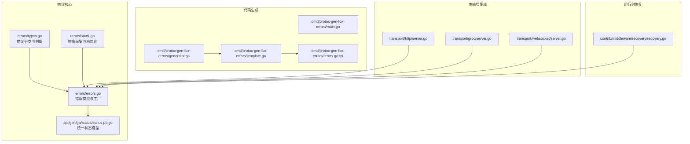
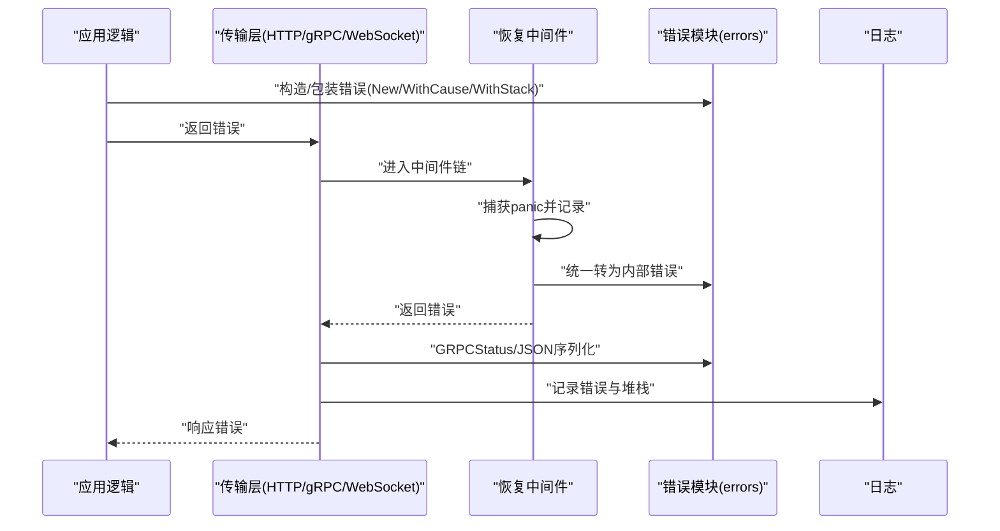
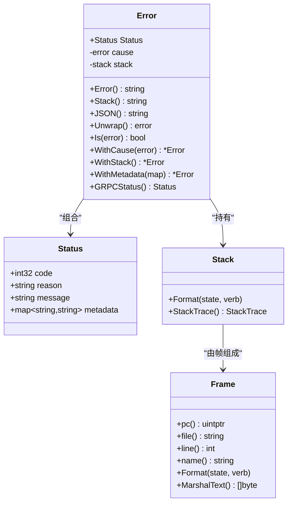
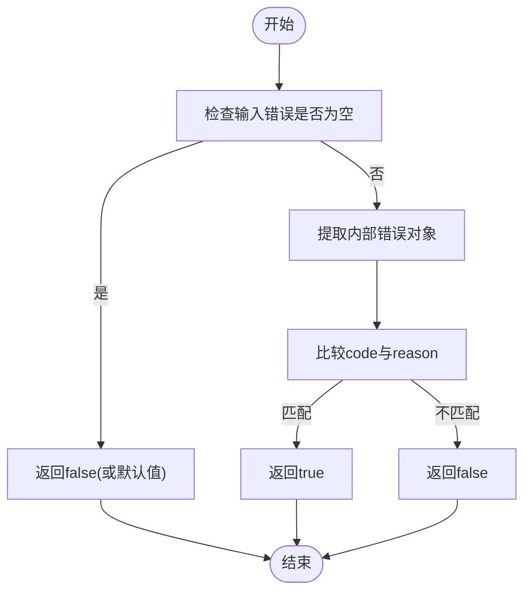
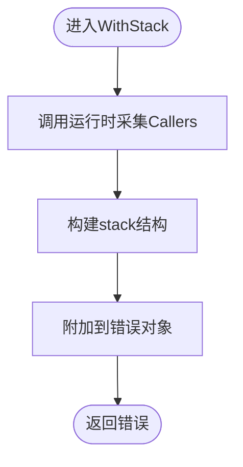
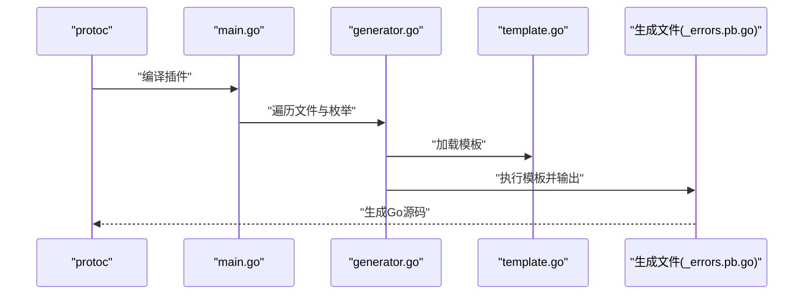
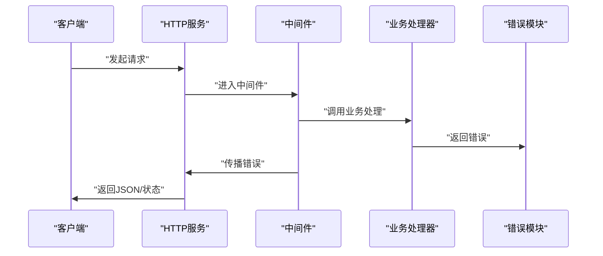
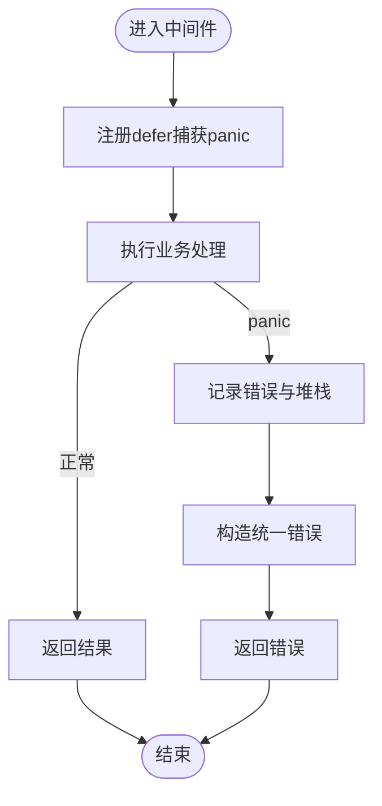
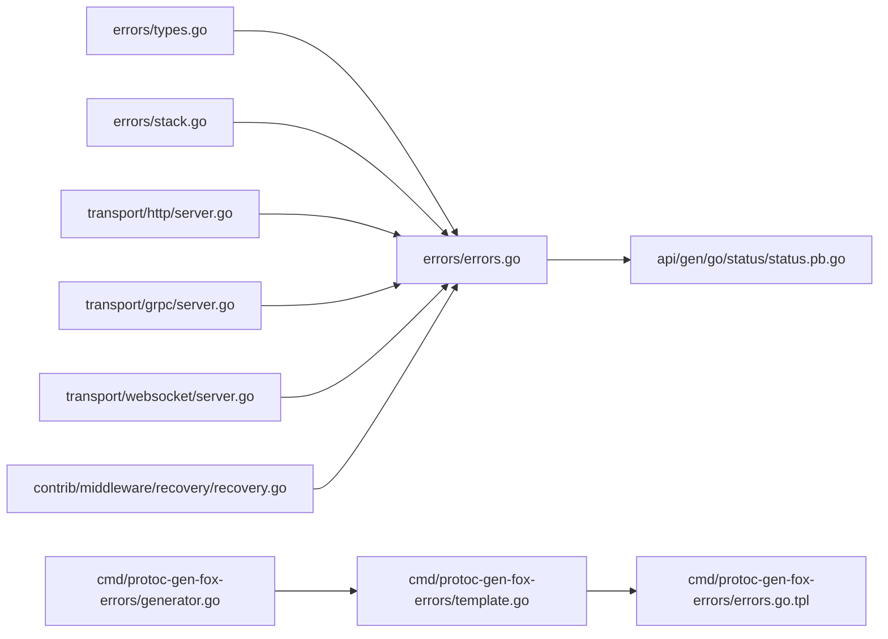

# 错误处理机制

<cite>
**本文引用的文件**   
- [errors/errors.go](file://errors/errors.go)
- [errors/types.go](file://errors/types.go)
- [errors/stack.go](file://errors/stack.go)
- [api/gen/go/status/status.pb.go](file://api/gen/go/status/status.pb.go)
- [cmd/protoc-gen-fox-errors/main.go](file://cmd/protoc-gen-fox-errors/main.go)
- [cmd/protoc-gen-fox-errors/generator.go](file://cmd/protoc-gen-fox-errors/generator.go)
- [cmd/protoc-gen-fox-errors/template.go](file://cmd/protoc-gen-fox-errors/template.go)
- [cmd/protoc-gen-fox-errors/errors.go.tpl](file://cmd/protoc-gen-fox-errors/errors.go.tpl)
- [contrib/middleware/recovery/recovery.go](file://contrib/middleware/recovery/recovery.go)
- [transport/http/server.go](file://transport/http/server.go)
- [transport/grpc/server.go](file://transport/grpc/server.go)
- [transport/websocket/server.go](file://transport/websocket/server.go)
</cite>

## 目录
1. [引言](#引言)
2. [项目结构](#项目结构)
3. [核心组件](#核心组件)
4. [架构总览](#架构总览)
5. [详细组件分析](#详细组件分析)
6. [依赖关系分析](#依赖关系分析)
7. [性能考量](#性能考量)
8. [故障排查指南](#故障排查指南)
9. [结论](#结论)
10. [附录](#附录)

## 引言
本文件系统性梳理 Go Fox 的错误处理机制，覆盖错误类型设计、错误包装与传播、错误分类与匹配、堆栈跟踪采集与格式化、错误码与状态模型、以及在 HTTP/gRPC/WebSocket 等传输层的集成方式。同时给出最佳实践、性能优化与内存管理建议，并提供可操作的故障排查步骤。

## 项目结构
围绕错误处理的关键目录与文件如下：
- errors：错误类型定义、错误工厂函数、错误分类判断、堆栈跟踪采集与格式化
- api/gen/go/status：统一的状态消息模型（含扩展字段用于错误码映射）
- cmd/protoc-gen-fox-errors：基于枚举生成错误常量与判断函数的代码生成器
- contrib/middleware/recovery：全局恢复中间件，捕获 panic 并返回统一错误
- transport/*：HTTP/gRPC/WebSocket 服务侧对错误的使用与传播

**图表来源**
- [errors/errors.go](file://errors/errors.go#L1-L175)
- [errors/types.go](file://errors/types.go#L1-L176)
- [errors/stack.go](file://errors/stack.go#L1-L203)
- [api/gen/go/status/status.pb.go](file://api/gen/go/status/status.pb.go#L1-L214)
- [cmd/protoc-gen-fox-errors/main.go](file://cmd/protoc-gen-fox-errors/main.go#L1-L57)
- [cmd/protoc-gen-fox-errors/generator.go](file://cmd/protoc-gen-fox-errors/generator.go#L1-L161)
- [cmd/protoc-gen-fox-errors/template.go](file://cmd/protoc-gen-fox-errors/template.go#L1-L60)
- [cmd/protoc-gen-fox-errors/errors.go.tpl](file://cmd/protoc-gen-fox-errors/errors.go.tpl#L1-L17)
- [contrib/middleware/recovery/recovery.go](file://contrib/middleware/recovery/recovery.go#L1-L80)
- [transport/http/server.go](file://transport/http/server.go#L1-L235)
- [transport/grpc/server.go](file://transport/grpc/server.go#L1-L175)
- [transport/websocket/server.go](file://transport/websocket/server.go#L1-L200)

**章节来源**
- [errors/errors.go](file://errors/errors.go#L1-L175)
- [errors/types.go](file://errors/types.go#L1-L176)
- [errors/stack.go](file://errors/stack.go#L1-L203)
- [api/gen/go/status/status.pb.go](file://api/gen/go/status/status.pb.go#L1-L214)
- [cmd/protoc-gen-fox-errors/main.go](file://cmd/protoc-gen-fox-errors/main.go#L1-L57)
- [cmd/protoc-gen-fox-errors/generator.go](file://cmd/protoc-gen-fox-errors/generator.go#L1-L161)
- [cmd/protoc-gen-fox-errors/template.go](file://cmd/protoc-gen-fox-errors/template.go#L1-L60)
- [cmd/protoc-gen-fox-errors/errors.go.tpl](file://cmd/protoc-gen-fox-errors/errors.go.tpl#L1-L17)
- [contrib/middleware/recovery/recovery.go](file://contrib/middleware/recovery/recovery.go#L1-L80)
- [transport/http/server.go](file://transport/http/server.go#L1-L235)
- [transport/grpc/server.go](file://transport/grpc/server.go#L1-L175)
- [transport/websocket/server.go](file://transport/websocket/server.go#L1-L200)

## 核心组件
- 统一错误类型与工厂
  - 错误类型承载状态码、原因、消息与元数据，并可携带底层 cause 与堆栈
  - 工厂函数负责自动采集堆栈并返回带栈的错误实例
  - 提供 JSON 序列化、GRPCStatus 映射、错误克隆与解包能力
- 错误分类与匹配
  - 针对常见 HTTP 错误码提供便捷构造与判断函数
  - 提供统一的错误匹配与类型断言封装
- 堆栈跟踪
  - 自定义帧与堆栈结构，支持多种格式化输出
  - 通过运行时采集当前调用栈，便于定位问题
- 状态模型与代码生成
  - 使用 Protobuf 扩展在枚举层面声明默认错误码与单值错误码
  - 通过代码生成器为每个枚举值生成 Is/Error 函数，保证强类型与一致性
- 中间件恢复
  - 全局捕获 panic，记录请求上下文与堆栈，返回统一错误

**章节来源**
- [errors/errors.go](file://errors/errors.go#L27-L175)
- [errors/types.go](file://errors/types.go#L28-L176)
- [errors/stack.go](file://errors/stack.go#L35-L203)
- [api/gen/go/status/status.pb.go](file://api/gen/go/status/status.pb.go#L93-L122)
- [cmd/protoc-gen-fox-errors/generator.go](file://cmd/protoc-gen-fox-errors/generator.go#L87-L133)
- [contrib/middleware/recovery/recovery.go](file://contrib/middleware/recovery/recovery.go#L54-L79)

## 架构总览
下图展示错误处理在系统中的关键流转：应用层抛出或转换错误 → 传输层接收并映射 → 中间件捕获异常 → 最终以统一格式返回给客户端。

**图表来源**
- [errors/errors.go](file://errors/errors.go#L94-L175)
- [transport/http/server.go](file://transport/http/server.go#L109-L125)
- [transport/grpc/server.go](file://transport/grpc/server.go#L91-L113)
- [transport/websocket/server.go](file://transport/websocket/server.go#L169-L197)
- [contrib/middleware/recovery/recovery.go](file://contrib/middleware/recovery/recovery.go#L64-L78)

## 详细组件分析

### 组件A：统一错误类型与工厂
- 设计要点
  - 将状态抽象为统一的消息模型，包含 code、reason、message、metadata
  - 支持 cause 与堆栈字段，满足错误包装与溯源
  - 提供 JSON 序列化与 gRPC 状态映射，便于多协议一致呈现
- 关键方法
  - New/WithStack：创建并附带堆栈
  - WithCause/Unwrap：设置与提取底层 cause
  - Is/As：统一的错误匹配与类型断言
  - GRPCStatus/JSON：跨协议输出
- 复杂度与性能
  - 堆栈采集为 O(n)（n 为调用栈帧数），建议仅在必要时启用
  - 克隆错误为浅拷贝元数据副本，避免共享写入带来的竞争

**图表来源**
- [errors/errors.go](file://errors/errors.go#L27-L92)
- [errors/stack.go](file://errors/stack.go#L26-L194)
- [api/gen/go/status/status.pb.go](file://api/gen/go/status/status.pb.go#L25-L91)

**章节来源**
- [errors/errors.go](file://errors/errors.go#L27-L175)
- [errors/stack.go](file://errors/stack.go#L35-L203)
- [api/gen/go/status/status.pb.go](file://api/gen/go/status/status.pb.go#L25-L91)

### 组件B：错误分类与匹配
- 设计要点
  - 针对常见 HTTP 错误码提供构造与判断函数，简化业务分支
  - 提供 Is/As 封装，兼容标准库 errors.Is/errors.As 语义
- 使用建议
  - 在业务层优先使用分类函数进行错误判断，避免直接比较字符串
  - 对于自定义错误，结合枚举与代码生成器保证一致性

**图表来源**
- [errors/types.go](file://errors/types.go#L160-L176)

**章节来源**
- [errors/types.go](file://errors/types.go#L28-L176)

### 组件C：堆栈跟踪机制
- 实现原理
  - 通过运行时采集程序计数器，构建帧列表，支持多种格式化输出
  - 提供 +v、+s、n、d 等格式化标志，便于灵活打印
- 性能与内存
  - 采集深度固定，避免无限增长
  - 建议仅在需要定位问题时开启堆栈，生产环境可按需开关

**图表来源**
- [errors/errors.go](file://errors/errors.go#L71-L75)
- [errors/stack.go](file://errors/stack.go#L188-L194)

**章节来源**
- [errors/stack.go](file://errors/stack.go#L35-L203)
- [errors/errors.go](file://errors/errors.go#L71-L75)

### 组件D：状态模型与代码生成
- 状态模型
  - 通过 Protobuf 扩展在枚举层面声明默认错误码与单值错误码
  - 生成文件包含版本兼容性断言，确保与错误模块版本一致
- 代码生成流程
  - 解析枚举与扩展，生成 Is/Error 函数，保证强类型与一致性
  - 模板驱动输出，减少手写错误

**图表来源**
- [cmd/protoc-gen-fox-errors/main.go](file://cmd/protoc-gen-fox-errors/main.go#L36-L56)
- [cmd/protoc-gen-fox-errors/generator.go](file://cmd/protoc-gen-fox-errors/generator.go#L48-L133)
- [cmd/protoc-gen-fox-errors/template.go](file://cmd/protoc-gen-fox-errors/template.go#L49-L59)
- [cmd/protoc-gen-fox-errors/errors.go.tpl](file://cmd/protoc-gen-fox-errors/errors.go.tpl#L1-L17)
- [api/gen/go/status/status.pb.go](file://api/gen/go/status/status.pb.go#L93-L122)

**章节来源**
- [api/gen/go/status/status.pb.go](file://api/gen/go/status/status.pb.go#L93-L122)
- [cmd/protoc-gen-fox-errors/generator.go](file://cmd/protoc-gen-fox-errors/generator.go#L48-L133)
- [cmd/protoc-gen-fox-errors/template.go](file://cmd/protoc-gen-fox-errors/template.go#L33-L59)
- [cmd/protoc-gen-fox-errors/errors.go.tpl](file://cmd/protoc-gen-fox-errors/errors.go.tpl#L1-L17)

### 组件E：传输层集成与错误传播
- HTTP
  - 服务初始化时注入错误处理器，统一拦截与转换
  - 通过中间件链路传递错误，最终以 JSON 或 gRPC 状态返回
- gRPC
  - 通过拦截器链路传播错误，自动映射为 gRPC 状态
- WebSocket
  - 在连接与消息处理阶段捕获错误，记录堆栈并区分“客户端关闭”等特殊场景

**图表来源**
- [transport/http/server.go](file://transport/http/server.go#L109-L125)
- [transport/grpc/server.go](file://transport/grpc/server.go#L91-L113)
- [transport/websocket/server.go](file://transport/websocket/server.go#L169-L197)
- [errors/errors.go](file://errors/errors.go#L84-L92)

**章节来源**
- [transport/http/server.go](file://transport/http/server.go#L101-L133)
- [transport/grpc/server.go](file://transport/grpc/server.go#L91-L113)
- [transport/websocket/server.go](file://transport/websocket/server.go#L169-L197)
- [errors/errors.go](file://errors/errors.go#L84-L92)

### 组件F：全局恢复中间件
- 功能
  - 捕获 panic，记录请求与堆栈，返回统一内部错误
  - 可配置回调函数，定制化错误处理策略
- 注意事项
  - 记录堆栈会带来额外开销，建议仅在开发与测试环境开启
  - 回调中不要再次抛出 panic，避免二次捕获

**图表来源**
- [contrib/middleware/recovery/recovery.go](file://contrib/middleware/recovery/recovery.go#L64-L78)

**章节来源**
- [contrib/middleware/recovery/recovery.go](file://contrib/middleware/recovery/recovery.go#L54-L79)

## 依赖关系分析
- 错误模块依赖状态模型（Status）以统一错误载体
- 代码生成器依赖 Protobuf 扩展与模板引擎
- 传输层依赖错误模块进行错误映射与输出
- 恢复中间件依赖错误模块进行统一错误构造

**图表来源**
- [errors/errors.go](file://errors/errors.go#L1-L175)
- [errors/types.go](file://errors/types.go#L1-L176)
- [errors/stack.go](file://errors/stack.go#L1-L203)
- [api/gen/go/status/status.pb.go](file://api/gen/go/status/status.pb.go#L1-L214)
- [cmd/protoc-gen-fox-errors/generator.go](file://cmd/protoc-gen-fox-errors/generator.go#L1-L161)
- [cmd/protoc-gen-fox-errors/template.go](file://cmd/protoc-gen-fox-errors/template.go#L1-L60)
- [cmd/protoc-gen-fox-errors/errors.go.tpl](file://cmd/protoc-gen-fox-errors/errors.go.tpl#L1-L17)
- [transport/http/server.go](file://transport/http/server.go#L1-L235)
- [transport/grpc/server.go](file://transport/grpc/server.go#L1-L175)
- [transport/websocket/server.go](file://transport/websocket/server.go#L1-L200)
- [contrib/middleware/recovery/recovery.go](file://contrib/middleware/recovery/recovery.go#L1-L80)

**章节来源**
- [errors/errors.go](file://errors/errors.go#L1-L175)
- [errors/types.go](file://errors/types.go#L1-L176)
- [errors/stack.go](file://errors/stack.go#L1-L203)
- [api/gen/go/status/status.pb.go](file://api/gen/go/status/status.pb.go#L1-L214)
- [cmd/protoc-gen-fox-errors/generator.go](file://cmd/protoc-gen-fox-errors/generator.go#L1-L161)
- [cmd/protoc-gen-fox-errors/template.go](file://cmd/protoc-gen-fox-errors/template.go#L1-L60)
- [cmd/protoc-gen-fox-errors/errors.go.tpl](file://cmd/protoc-gen-fox-errors/errors.go.tpl#L1-L17)
- [transport/http/server.go](file://transport/http/server.go#L1-L235)
- [transport/grpc/server.go](file://transport/grpc/server.go#L1-L175)
- [transport/websocket/server.go](file://transport/websocket/server.go#L1-L200)
- [contrib/middleware/recovery/recovery.go](file://contrib/middleware/recovery/recovery.go#L1-L80)

## 性能考量
- 堆栈采集
  - 仅在需要定位问题时启用 WithStack，生产环境可通过配置控制
  - 控制采集深度，避免过深调用栈导致内存与 CPU 开销上升
- 错误克隆
  - 元数据复制为浅拷贝，避免频繁分配；如需并发安全，应在上层加锁或使用只读共享
- 日志与中间件
  - 恢复中间件记录堆栈会增加 IO 与 CPU，建议在高并发场景下降低采样率或关闭
- 传输层
  - HTTP/gRPC/WebSocket 在错误路径尽量避免重复序列化，优先复用已有的 JSON/gRPC 状态

[本节为通用指导，无需列出具体文件来源]

## 故障排查指南
- 如何查看堆栈
  - 在错误对象上调用堆栈输出方法，获取完整调用链
  - 结合恢复中间件记录的请求上下文，快速定位问题发生点
- 如何区分错误类型
  - 使用分类判断函数快速识别错误类别
  - 对于自定义错误，使用代码生成器提供的 Is/Error 函数
- 如何统一错误输出
  - 在传输层将错误映射为 JSON 或 gRPC 状态，保持对外一致
- 常见问题
  - 未启用堆栈导致难以定位：在开发与测试环境开启 WithStack
  - panic 导致服务崩溃：启用恢复中间件并配置回调
  - 错误码不一致：使用代码生成器确保枚举与错误码一致

**章节来源**
- [errors/errors.go](file://errors/errors.go#L42-L51)
- [errors/types.go](file://errors/types.go#L160-L176)
- [contrib/middleware/recovery/recovery.go](file://contrib/middleware/recovery/recovery.go#L64-L78)
- [transport/http/server.go](file://transport/http/server.go#L109-L125)
- [transport/grpc/server.go](file://transport/grpc/server.go#L91-L113)
- [transport/websocket/server.go](file://transport/websocket/server.go#L169-L197)

## 结论
Go Fox 的错误处理机制通过统一的状态模型、完善的错误分类与匹配、可选的堆栈跟踪、以及代码生成器与传输层的紧密集成，构建了清晰、一致且可扩展的错误体系。遵循本文的最佳实践与性能建议，可在保证可观测性的同时兼顾运行效率。

[本节为总结性内容，无需列出具体文件来源]

## 附录
- 最佳实践清单
  - 优先使用分类函数与代码生成器提供的错误常量
  - 在关键路径保留堆栈，在非关键路径关闭堆栈
  - 统一错误输出格式，确保对外一致
  - 在中间件中捕获 panic 并返回统一错误
- 错误处理示例（路径指引）
  - 创建错误并附带堆栈：[errors/errors.go](file://errors/errors.go#L94-L104)
  - 包装底层错误：[errors/errors.go](file://errors/errors.go#L64-L69)
  - 判断错误类型：[errors/types.go](file://errors/types.go#L33-L36)
  - 生成错误常量与判断函数：[cmd/protoc-gen-fox-errors/generator.go](file://cmd/protoc-gen-fox-errors/generator.go#L87-L133)
  - 恢复中间件捕获 panic：[contrib/middleware/recovery/recovery.go](file://contrib/middleware/recovery/recovery.go#L64-L78)

[本节为补充内容，无需列出具体文件来源]