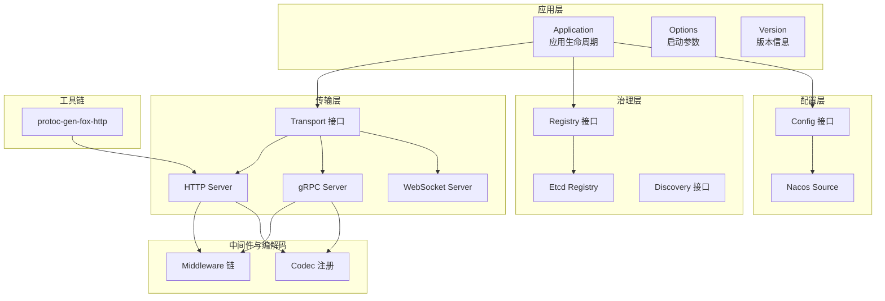
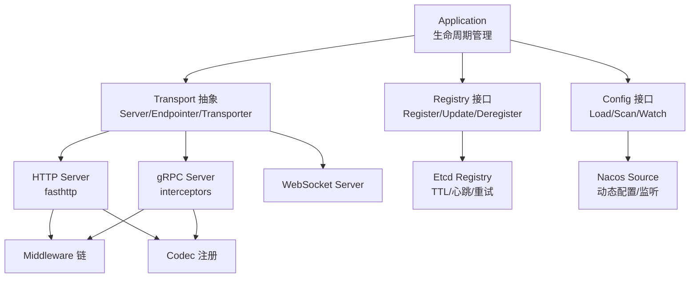
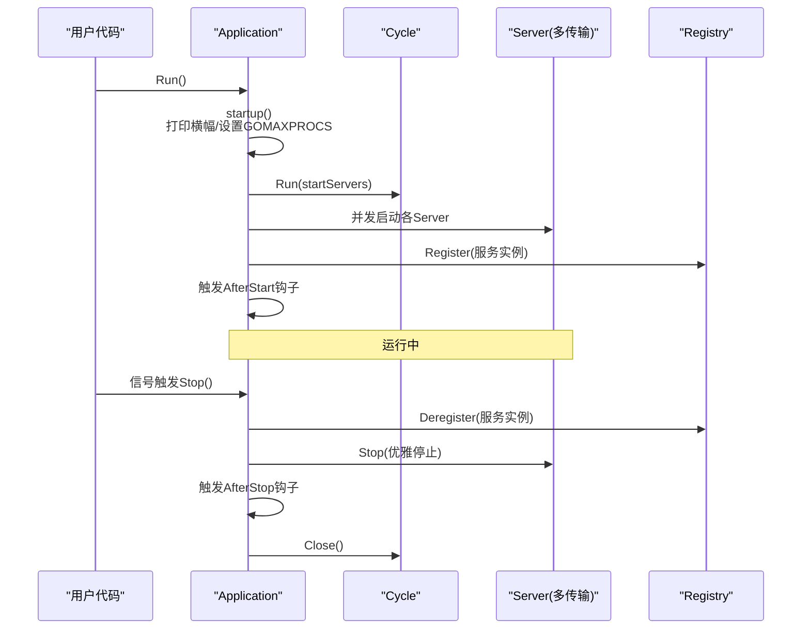
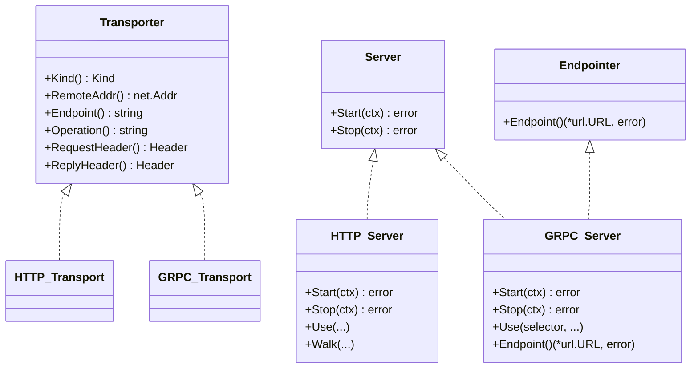
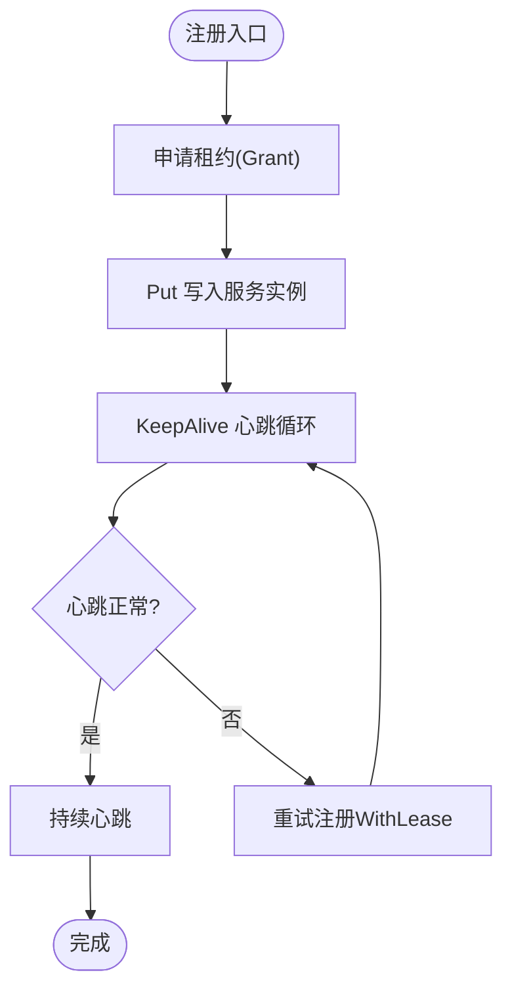
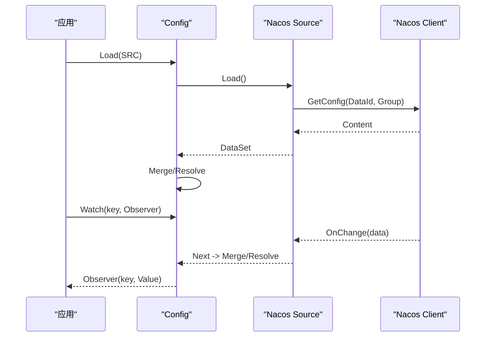
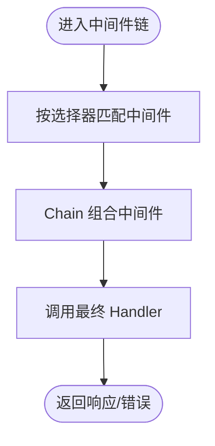
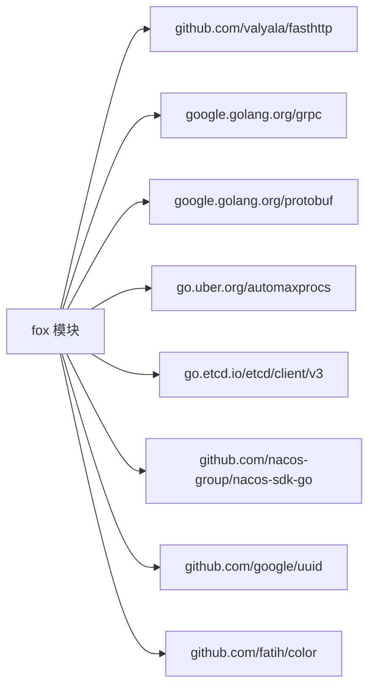

# 项目概述

<cite>
**本文引用的文件**
- [README.md](file://README.md)
- [app.go](file://app.go)
- [options.go](file://options.go)
- [version.go](file://version.go)
- [transport/transport.go](file://transport/transport.go)
- [transport/http/server.go](file://transport/http/server.go)
- [transport/grpc/server.go](file://transport/grpc/server.go)
- [registry/registry.go](file://registry/registry.go)
- [contrib/registry/etcd/registry.go](file://contrib/registry/etcd/registry.go)
- [contrib/config/nacos/nacos.go](file://contrib/config/nacos/nacos.go)
- [config/config.go](file://config/config.go)
- [middleware/middleware.go](file://middleware/middleware.go)
- [codec/codec.go](file://codec/codec.go)
- [cmd/protoc-gen-fox-http/main.go](file://cmd/protoc-gen-fox-http/main.go)
- [go.mod](file://go.mod)
</cite>

## 目录
1. [引言](#引言)
2. [项目结构](#项目结构)
3. [核心组件](#核心组件)
4. [架构总览](#架构总览)
5. [详细组件分析](#详细组件分析)
6. [依赖关系分析](#依赖关系分析)
7. [性能考量](#性能考量)
8. [故障排查指南](#故障排查指南)
9. [结论](#结论)
10. [附录](#附录)

## 引言
本项目“Go Fox”是一个面向云原生与微服务场景的通用框架，强调以统一的应用生命周期管理为核心，围绕传输层抽象、服务注册与发现、中间件体系、配置中心以及协议编解码能力，提供可扩展、高性能且易集成的基础设施。框架通过统一的 Application 入口组织多种传输协议（HTTP、gRPC、WebSocket）与治理能力（注册中心、负载均衡、健康检查），并提供插件化的代码生成工具链（protoc-gen-fox-*）以提升开发效率。

- 框架定位：提供“开箱即用”的微服务基础能力，降低服务拆分、通信与治理的复杂度。
- 设计理念：以“传输无关、协议中立”的方式抽象服务端与客户端，通过中间件与拦截器实现横切关注点；通过配置中心与注册中心实现动态治理。
- 主要特性：
  - 统一应用生命周期管理与信号处理
  - 多传输协议支持（HTTP、gRPC、WebSocket）
  - 中间件链式编排与选择器匹配
  - 服务注册与发现（Etcd/Nacos）
  - 动态配置加载与监听（Nacos）
  - 协议编解码扩展（JSON/Proto/TOML/XML/YAML）
  - 代码生成工具链（protoc-gen-fox-http 等）

## 项目结构
仓库采用按功能域划分的模块化组织方式，核心目录职责如下：
- 根目录：应用入口、选项与版本信息
- transport：传输层抽象与具体实现（HTTP、gRPC、WebSocket）
- registry：服务注册与发现接口及 Etcd 实现
- config：配置中心接口与 Nacos 实现
- middleware：中间件定义与链式组合
- codec：编解码器注册与扩展
- contrib：第三方集成（认证、缓存、客户端、注册中心、国际化、中间件恢复等）
- cmd：代码生成插件（protoc-gen-fox-*）
- api：Protocol Buffers 定义与生成代码

图表来源
- [app.go](file://app.go#L52-L312)
- [options.go](file://options.go#L50-L208)
- [version.go](file://version.go#L38-L174)
- [transport/transport.go](file://transport/transport.go#L44-L125)
- [transport/http/server.go](file://transport/http/server.go#L53-L235)
- [transport/grpc/server.go](file://transport/grpc/server.go#L50-L175)
- [registry/registry.go](file://registry/registry.go#L17-L113)
- [contrib/registry/etcd/registry.go](file://contrib/registry/etcd/registry.go#L46-L243)
- [config/config.go](file://config/config.go#L52-L186)
- [contrib/config/nacos/nacos.go](file://contrib/config/nacos/nacos.go#L17-L95)
- [middleware/middleware.go](file://middleware/middleware.go#L28-L67)
- [codec/codec.go](file://codec/codec.go#L33-L61)
- [cmd/protoc-gen-fox-http/main.go](file://cmd/protoc-gen-fox-http/main.go#L17-L36)

章节来源
- [README.md](file://README.md#L1-L3)
- [go.mod](file://go.mod#L1-L39)

## 核心组件
- Application：统一的应用生命周期管理器，负责启动前初始化、并发安全的启动与停止、信号监听、钩子执行、服务注册与注销、资源清理等。
- Options：应用启动参数与默认值，包括应用标识、名称、版本、元数据、区域/可用区、日志、最大处理器数、注册/停止超时、服务器集合、注册中心、钩子等。
- Transport 抽象：定义 Server、Endpointer、Transporter 等接口，屏蔽不同传输协议的差异，提供上下文传递与选择器绑定能力。
- Registry：服务注册与发现接口，Etcd 实现提供 TTL 心跳、租约续期与异常重试机制。
- Config：配置中心接口，Nacos 实现提供动态拉取与监听变更的能力。
- Middleware：中间件定义与链式组合，支持基于选择器的路由级中间件。
- Codec：编解码器注册与查找，支持 JSON/Proto/TOML/XML/YAML 等格式。
- Protobuf 工具链：protoc-gen-fox-http 等插件，用于根据 .proto 生成 HTTP 映射代码。

章节来源
- [app.go](file://app.go#L52-L312)
- [options.go](file://options.go#L50-L208)
- [transport/transport.go](file://transport/transport.go#L44-L125)
- [registry/registry.go](file://registry/registry.go#L17-L113)
- [contrib/registry/etcd/registry.go](file://contrib/registry/etcd/registry.go#L112-L132)
- [config/config.go](file://config/config.go#L52-L186)
- [contrib/config/nacos/nacos.go](file://contrib/config/nacos/nacos.go#L58-L95)
- [middleware/middleware.go](file://middleware/middleware.go#L28-L67)
- [codec/codec.go](file://codec/codec.go#L33-L61)
- [cmd/protoc-gen-fox-http/main.go](file://cmd/protoc-gen-fox-http/main.go#L17-L36)

## 架构总览
下图展示了 Go Fox 的高层架构：应用层通过 Application 组织传输层、治理层与配置层；传输层对 HTTP、gRPC、WebSocket 提供统一抽象；治理层通过注册中心与发现接口实现服务注册与动态发现；配置层通过 Nacos 实现配置的集中管理与热更新；中间件与编解码器贯穿于请求处理链路。

图表来源
- [app.go](file://app.go#L158-L221)
- [transport/transport.go](file://transport/transport.go#L44-L125)
- [transport/http/server.go](file://transport/http/server.go#L211-L235)
- [transport/grpc/server.go](file://transport/grpc/server.go#L138-L175)
- [registry/registry.go](file://registry/registry.go#L17-L71)
- [contrib/registry/etcd/registry.go](file://contrib/registry/etcd/registry.go#L112-L132)
- [config/config.go](file://config/config.go#L88-L151)
- [contrib/config/nacos/nacos.go](file://contrib/config/nacos/nacos.go#L78-L95)
- [middleware/middleware.go](file://middleware/middleware.go#L54-L67)
- [codec/codec.go](file://codec/codec.go#L33-L61)

## 详细组件分析

### 应用生命周期与启动流程
- 启动阶段：打印横幅、设置 GOMAXPROCS、串行执行初始化任务；启动所有传输服务器；注册服务到注册中心；触发 AfterStart 钩子。
- 停止阶段：触发 BeforeStop 钩子；注销服务；优雅停止各传输服务器；触发 AfterStop 钩子；关闭生命周期管理器。
- 信号处理：等待系统信号，触发优雅停机。

图表来源
- [app.go](file://app.go#L105-L175)
- [app.go](file://app.go#L184-L221)
- [app.go](file://app.go#L253-L282)

章节来源
- [app.go](file://app.go#L105-L175)
- [app.go](file://app.go#L184-L221)
- [app.go](file://app.go#L253-L282)

### 传输层抽象与多协议支持
- Transport 接口：统一 Server、Endpointer、Transporter 能力，支持在上下文中传递传输信息与远端地址。
- HTTP Server：基于 fasthttp，支持 TLS、中间件注册、静态资源、路由树等。
- gRPC Server：内置健康检查、TLS、拦截器链、服务端点解析。
- WebSocket Server：作为传输层补充，提供长连接能力。

图表来源
- [transport/transport.go](file://transport/transport.go#L44-L125)
- [transport/http/server.go](file://transport/http/server.go#L53-L235)
- [transport/grpc/server.go](file://transport/grpc/server.go#L50-L175)

章节来源
- [transport/transport.go](file://transport/transport.go#L44-L125)
- [transport/http/server.go](file://transport/http/server.go#L53-L235)
- [transport/grpc/server.go](file://transport/grpc/server.go#L50-L175)

### 服务注册与发现（Etcd）
- 注册：将服务实例序列化后写入 Etcd，使用租约（Lease）实现 TTL 与心跳。
- 发现：通过前缀查询与 Watch 监听服务列表变化。
- 心跳：租约失效或通道关闭时自动重试注册并重建心跳。

图表来源
- [contrib/registry/etcd/registry.go](file://contrib/registry/etcd/registry.go#L112-L132)
- [contrib/registry/etcd/registry.go](file://contrib/registry/etcd/registry.go#L165-L175)
- [contrib/registry/etcd/registry.go](file://contrib/registry/etcd/registry.go#L177-L242)

章节来源
- [registry/registry.go](file://registry/registry.go#L17-L71)
- [contrib/registry/etcd/registry.go](file://contrib/registry/etcd/registry.go#L112-L132)
- [contrib/registry/etcd/registry.go](file://contrib/registry/etcd/registry.go#L177-L242)

### 配置中心（Nacos）
- 加载：根据 DataId/Group 拉取配置内容，识别格式并解析。
- 监听：注册监听回调，收到变更后合并并重新解析，触发观察者回调。
- 关闭：停止所有 Watcher。

图表来源
- [config/config.go](file://config/config.go#L88-L151)
- [contrib/config/nacos/nacos.go](file://contrib/config/nacos/nacos.go#L58-L95)

章节来源
- [config/config.go](file://config/config.go#L88-L151)
- [contrib/config/nacos/nacos.go](file://contrib/config/nacos/nacos.go#L58-L95)

### 中间件与编解码
- 中间件：定义 Handler 与 Middleware 类型，支持链式组合与选择器匹配。
- 编解码：注册与查找编解码器，支持 JSON/Proto/TOML/XML/YAML 等。

图表来源
- [middleware/middleware.go](file://middleware/middleware.go#L28-L67)
- [codec/codec.go](file://codec/codec.go#L33-L61)

章节来源
- [middleware/middleware.go](file://middleware/middleware.go#L28-L67)
- [codec/codec.go](file://codec/codec.go#L33-L61)

### Protobuf 工具链
- protoc-gen-fox-http：根据 .proto 文件生成 HTTP 映射代码，支持 omitempty 与前缀控制。

章节来源
- [cmd/protoc-gen-fox-http/main.go](file://cmd/protoc-gen-fox-http/main.go#L17-L36)

## 依赖关系分析
- 核心依赖：fasthttp、gRPC、Protocol Buffers、automaxprocs、slog 等。
- 第三方集成：Etcd 客户端、Nacos SDK、颜色输出、UUID、并发池等。

图表来源
- [go.mod](file://go.mod#L5-L22)

章节来源
- [go.mod](file://go.mod#L1-L39)

## 性能考量
- 传输层性能：HTTP 使用 fasthttp，具备零 GC、高并发与低内存占用特性；gRPC 通过拦截器链与健康检查保障稳定性。
- 资源管理：Application 在启动阶段设置 GOMAXPROCS，避免 CPU 调度抖动；生命周期管理器确保并发安全的启动/停止。
- 配置与注册中心：Nacos 与 Etcd 的异步监听与合并策略减少阻塞；Etcd 心跳与租约机制保证服务状态一致性。
- 中间件与编解码：中间件链按需匹配，编解码器注册表按名称查找，避免重复初始化。

## 故障排查指南
- 启动失败
  - 检查监听地址与端口是否被占用（HTTP/gRPC 启动阶段）。
  - 查看日志输出与错误返回，确认注册中心连接与认证配置。
- 停止异常
  - 确认 Stop 超时配置是否合理，避免优雅停机阻塞。
  - 检查注册中心注销是否成功，必要时手动清理 Etcd 中的服务键。
- 配置不生效
  - 确认 Nacos 的 DataId/Group 是否正确，监听回调是否触发。
  - 检查配置合并与解析过程中的错误日志。
- 中间件未生效
  - 确认中间件选择器匹配规则与路由路径一致。
  - 检查中间件链顺序与组合逻辑。

章节来源
- [transport/http/server.go](file://transport/http/server.go#L211-L235)
- [transport/grpc/server.go](file://transport/grpc/server.go#L138-L175)
- [app.go](file://app.go#L253-L282)
- [config/config.go](file://config/config.go#L153-L185)
- [contrib/registry/etcd/registry.go](file://contrib/registry/etcd/registry.go#L148-L163)

## 结论
Go Fox 以“传输无关、协议中立”的设计思想，提供了统一的应用生命周期管理与多传输协议支持，并通过注册中心、配置中心、中间件与编解码器形成完整的微服务基础设施。其技术优势体现在高性能传输层、灵活的中间件系统、完善的配置管理与可观测的工具链。适用于需要快速搭建微服务、强调性能与可运维性的团队与场景。

## 附录
- 适用场景
  - 微服务拆分与治理：服务注册、发现与健康检查。
  - 多协议接入：HTTP、gRPC、WebSocket 场景统一处理。
  - 动态配置：集中化配置与热更新。
  - 快速开发：Protobuf 工具链与中间件生态。
- 目标用户
  - 微服务架构工程师、平台工程团队、SRE 与运维人员。
- 对比优势
  - 传输层以 fasthttp 为主，兼顾 HTTP 与 gRPC 的高性能需求。
  - 中间件链式组合与选择器匹配，满足细粒度控制。
  - 配置中心与注册中心插件化，便于替换与扩展。
  - 版本与构建信息内建，便于追踪与审计。