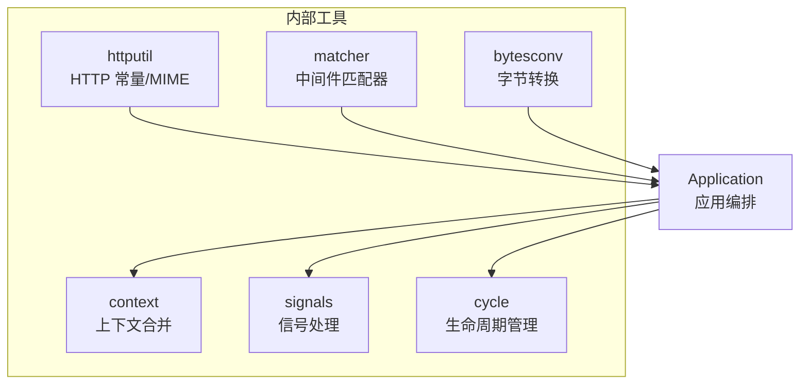
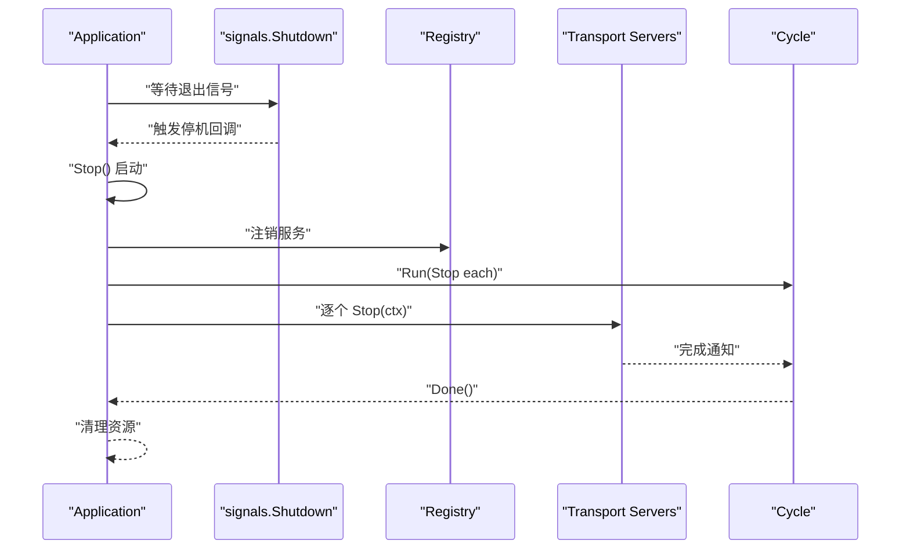
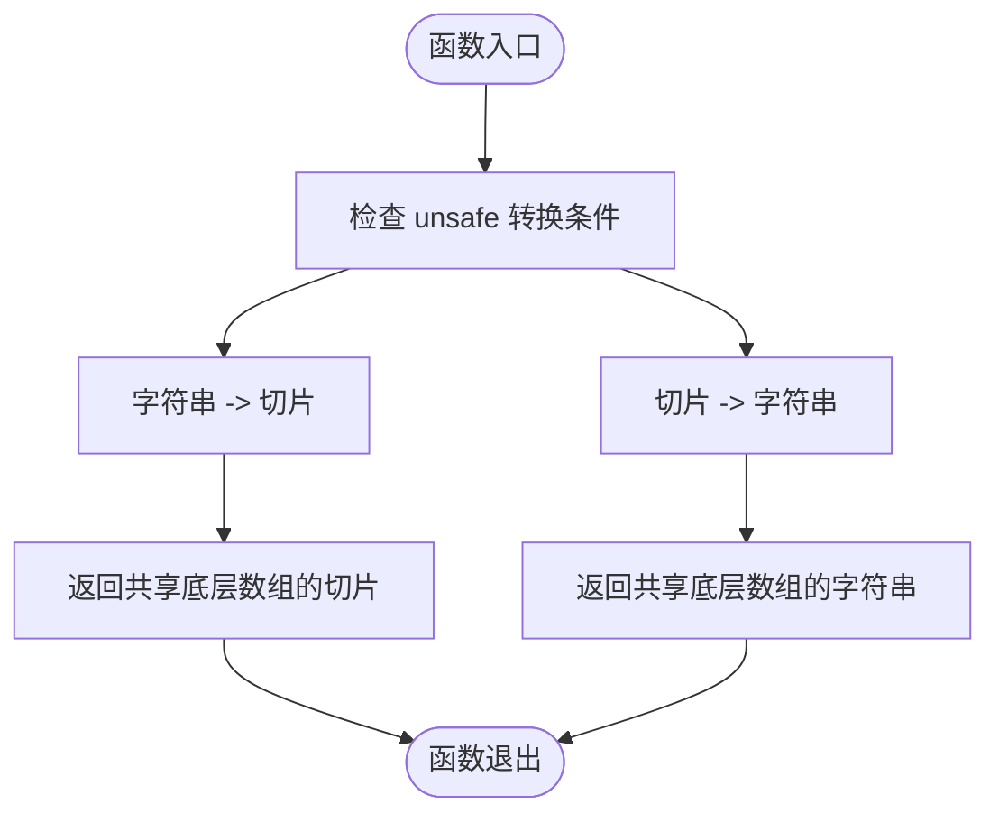
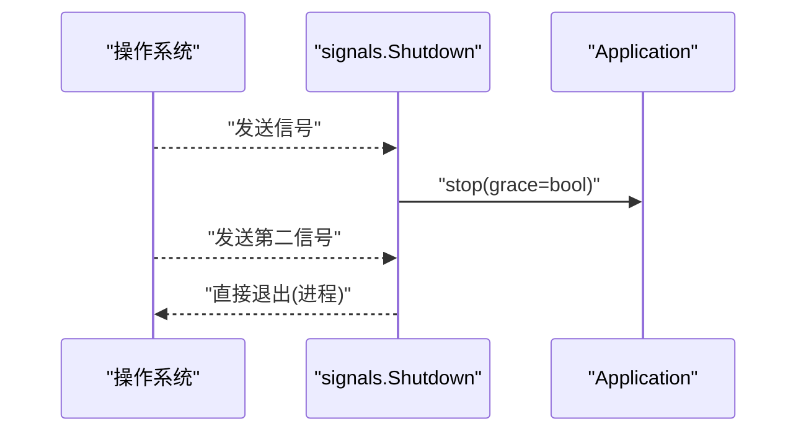
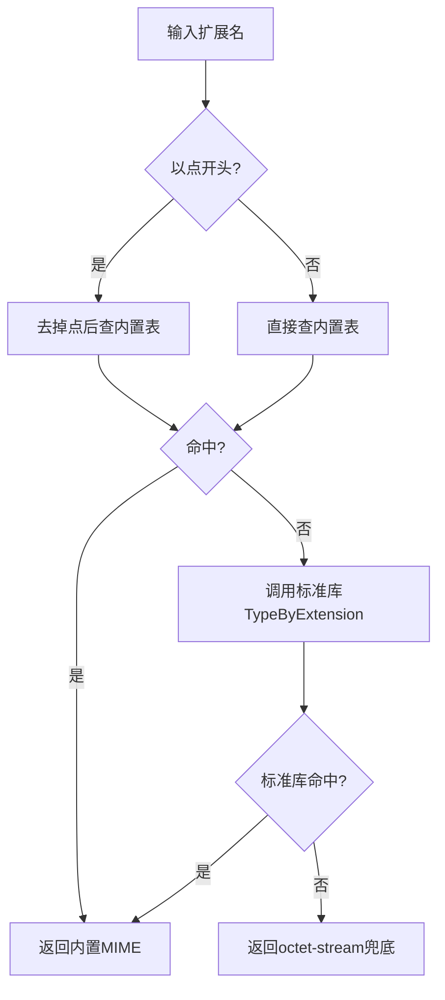
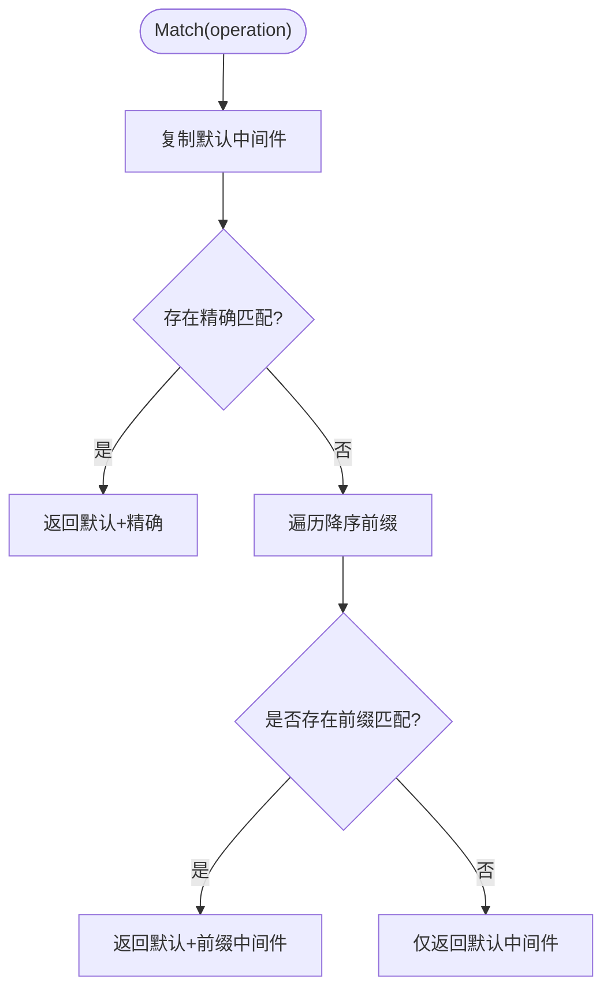
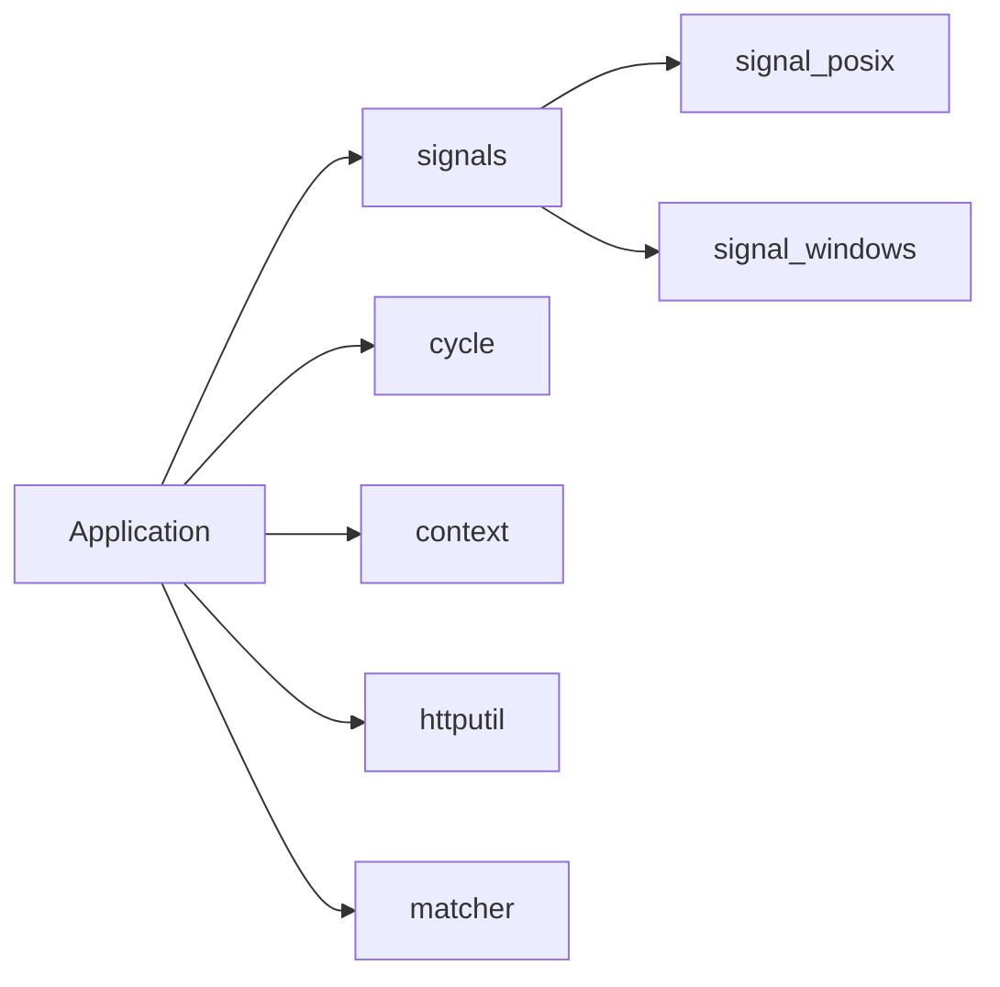

# 内部工具类

<cite>
**本文引用的文件**
- [internal/bytesconv/bytesconv.go](file://internal/bytesconv/bytesconv.go)
- [internal/context/context.go](file://internal/context/context.go)
- [internal/signals/signals.go](file://internal/signals/signals.go)
- [internal/signals/signal_posix.go](file://internal/signals/signal_posix.go)
- [internal/signals/signal_windows.go](file://internal/signals/signal_windows.go)
- [internal/httputil/http.go](file://internal/httputil/http.go)
- [internal/matcher/matcher.go](file://internal/matcher/matcher.go)
- [internal/cycle/cycle.go](file://internal/cycle/cycle.go)
- [app.go](file://app.go)
- [options.go](file://options.go)
</cite>

## 目录
1. [简介](#简介)
2. [项目结构](#项目结构)
3. [核心组件](#核心组件)
4. [架构总览](#架构总览)
5. [详细组件分析](#详细组件分析)
6. [依赖分析](#依赖分析)
7. [性能考量](#性能考量)
8. [故障排查指南](#故障排查指南)
9. [结论](#结论)
10. [附录](#附录)

## 简介
本文件面向 Go Fox 框架内部工具类，系统化梳理与说明以下工具模块的设计目标、实现原理、接口规范、使用方式与最佳实践：字节转换工具、上下文合并工具、信号处理工具、HTTP 工具、中间件匹配器、生命周期管理工具。文档同时给出关键流程图与时序图，帮助读者在不深入源码的前提下理解这些工具如何支撑框架运行、如何进行扩展与定制，并规避常见陷阱。

## 项目结构
内部工具类主要分布在 internal 子目录中，围绕“零拷贝转换”“上下文语义”“优雅停机”“HTTP 常量与 MIME 推断”“中间件选择器”“并发生命周期管理”等主题组织。应用入口通过 Application 统一编排，将工具类能力注入到传输层、注册中心、钩子链路与信号监听中。



图表来源
- [app.go](file://app.go#L158-L182)
- [internal/signals/signals.go](file://internal/signals/signals.go#L32-L45)
- [internal/cycle/cycle.go](file://internal/cycle/cycle.go#L41-L51)
- [internal/context/context.go](file://internal/context/context.go#L45-L62)
- [internal/httputil/http.go](file://internal/httputil/http.go#L32-L40)
- [internal/matcher/matcher.go](file://internal/matcher/matcher.go#L40-L48)

章节来源
- [app.go](file://app.go#L158-L182)
- [options.go](file://options.go#L54-L89)

## 核心组件
- 字节转换工具（internal/bytesconv）：提供字符串与字节切片的零分配互转，用于高性能场景下的数据桥接。
- 上下文合并工具（internal/context）：将两个 context 合并为一个，统一完成事件与取消信号，便于多源控制。
- 信号处理工具（internal/signals）：跨平台监听优雅停机信号，支持 POSIX 与 Windows 的差异信号集。
- HTTP 工具（internal/httputil）：提供标准 MIME 常量、内容类型拼装与扩展名到 MIME 的映射。
- 中间件匹配器（internal/matcher）：基于操作路径前缀与默认中间件，动态选择中间件链。
- 生命周期管理（internal/cycle）：轻量级并发生命周期管理器，支持并发任务提交、等待结束与错误传播。

章节来源
- [internal/bytesconv/bytesconv.go](file://internal/bytesconv/bytesconv.go#L11-L24)
- [internal/context/context.go](file://internal/context/context.go#L45-L139)
- [internal/signals/signals.go](file://internal/signals/signals.go#L32-L45)
- [internal/signals/signal_posix.go](file://internal/signals/signal_posix.go#L35-L35)
- [internal/signals/signal_windows.go](file://internal/signals/signal_windows.go#L35-L35)
- [internal/httputil/http.go](file://internal/httputil/http.go#L32-L204)
- [internal/matcher/matcher.go](file://internal/matcher/matcher.go#L33-L89)
- [internal/cycle/cycle.go](file://internal/cycle/cycle.go#L31-L98)

## 架构总览
应用启动时，先初始化 Banner 与 GOMAXPROCS，随后等待信号；收到信号后进入优雅停机流程，注销服务、停止各传输层服务并等待全部协程结束。期间，工具类分别承担信号监听、生命周期管理、上下文合并与 HTTP 常量/MIME 支撑。



图表来源
- [app.go](file://app.go#L177-L282)
- [internal/signals/signals.go](file://internal/signals/signals.go#L32-L45)
- [internal/cycle/cycle.go](file://internal/cycle/cycle.go#L53-L97)

章节来源
- [app.go](file://app.go#L158-L282)

## 详细组件分析

### 字节转换工具（internal/bytesconv）
- 设计目的
  - 在高性能网络与序列化场景中，避免字符串与字节切片之间的内存复制，降低 GC 压力。
- 核心函数
  - 字符串转字节切片：无额外分配，直接复用底层存储。
  - 字节切片转字符串：无额外分配，直接复用底层存储。
- 使用注意
  - 返回的切片/字符串与原数据共享底层数组，避免对外部写入或修改。
  - 仅在可确保数据生命周期与只读语义的场景使用。
- 典型使用场景
  - HTTP 请求头/响应头键值访问、静态文件发送、协议编解码。
- 性能特性
  - O(1) 时间复杂度，零分配；但需谨慎保证数据安全与生命周期。



图表来源
- [internal/bytesconv/bytesconv.go](file://internal/bytesconv/bytesconv.go#L11-L24)

章节来源
- [internal/bytesconv/bytesconv.go](file://internal/bytesconv/bytesconv.go#L11-L24)

### 上下文合并工具（internal/context）
- 设计目的
  - 将两个 context 合并为一个新 context，任一父级取消或超时都会触发新 context 的取消；保留 Value 查询优先级。
- 核心行为
  - Done/Err：任一父级完成或取消时，新 context 完成并携带错误。
  - Deadline：取两个父级截止时间的最早者。
  - Value：优先返回第一个父级的值，否则返回第二个父级的值。
- 使用注意
  - 合并后的 context 取消会关闭内部 cancelCh，建议仅在需要“任一触发即取消”的场景使用。
- 典型使用场景
  - 多源控制（如用户请求 + 超时）的统一取消信号。

```mermaid
classDiagram
class mergeCtx {
-parent1 : Context
-parent2 : Context
-done : chan struct{}
-doneMark : uint32
-doneErr : error
-cancelCh : chan struct{}
-doneOnce : Once
-cancelOnce : Once
+Done() <-chan struct{}
+Err() error
+Deadline() (time.Time,bool)
+Value(key) interface{}
-finish(err) error
-wait() void
+cancel() void
}
mergeCtx --> mergeCtx : "合并两个父级"
```

图表来源
- [internal/context/context.go](file://internal/context/context.go#L33-L139)

章节来源
- [internal/context/context.go](file://internal/context/context.go#L45-L139)

### 信号处理工具（internal/signals）
- 设计目的
  - 提供跨平台的优雅停机信号监听，区分首次与二次信号，支持 SIGQUIT 直接退出策略。
- 平台差异
  - POSIX：监听 SIGQUIT、Interrupt、SIGTERM。
  - Windows：监听 SIGQUIT、Interrupt。
- 核心流程
  - 注册信号通知，接收首个信号后调用传入的 stop 回调（区分是否为 SIGQUIT），等待第二个信号后直接退出进程。



图表来源
- [internal/signals/signals.go](file://internal/signals/signals.go#L32-L45)
- [internal/signals/signal_posix.go](file://internal/signals/signal_posix.go#L35-L35)
- [internal/signals/signal_windows.go](file://internal/signals/signal_windows.go#L35-L35)

章节来源
- [internal/signals/signals.go](file://internal/signals/signals.go#L32-L45)
- [internal/signals/signal_posix.go](file://internal/signals/signal_posix.go#L35-L35)
- [internal/signals/signal_windows.go](file://internal/signals/signal_windows.go#L35-L35)

### HTTP 工具（internal/httputil）
- 设计目的
  - 提供 HTTP 内容类型常量与派生函数、文件扩展名到 MIME 类型的映射，减少重复计算与外部依赖。
- 核心函数
  - ContentType：拼接基础类型与子类型。
  - ContentSubtype：解析内容类型的子类型（忽略参数）。
  - GetMIME：根据扩展名查找 MIME，未命中时回退标准库并兜底 octet-stream。
- 性能特性
  - 内置大表映射，避免频繁系统调用；对常见扩展名 O(1) 命中。



图表来源
- [internal/httputil/http.go](file://internal/httputil/http.go#L62-L86)
- [internal/httputil/http.go](file://internal/httputil/http.go#L91-L203)

章节来源
- [internal/httputil/http.go](file://internal/httputil/http.go#L32-L204)

### 中间件匹配器（internal/matcher）
- 设计目的
  - 基于操作路径前缀与默认中间件，按规则动态选择中间件链，支持通配前缀排序与精确匹配。
- 核心行为
  - Use：设置默认中间件。
  - Add：添加选择器与中间件；通配符自动去尾并按前缀长度降序排序。
  - Match：优先返回默认中间件，再叠加精确匹配或前缀匹配结果。
- 使用注意
  - 通配前缀排序确保更具体的前缀优先匹配，避免误伤。



图表来源
- [internal/matcher/matcher.go](file://internal/matcher/matcher.go#L74-L88)

章节来源
- [internal/matcher/matcher.go](file://internal/matcher/matcher.go#L33-L89)

### 生命周期管理（internal/cycle）
- 设计目的
  - 管理一组并发任务的生命周期：提交、等待完成、关闭与错误传播。
- 核心字段与方法
  - Run(fn)：提交任务并等待其完成。
  - Done()/DoneAndClose()：一次性等待全部任务完成并关闭。
  - Close()：主动关闭，后续任务不再接受。
  - Wait()：阻塞等待第一个错误或正常退出。
- 使用注意
  - Done() 采用 CAS 仅初始化一次等待逻辑，避免重复 goroutine。
  - quit 通道用于错误传播，done 通道用于完成通知。

```mermaid
classDiagram
class Cycle {
-locker : Mutex
-wg : WaitGroup
-done : chan struct{}
-quit : chan error
-closing : uint32
-waiting : uint32
+Run(fn) void
+Done() <-chan struct{}
+Close() void
+DoneAndClose() void
+Wait() <-chan error
}
```

图表来源
- [internal/cycle/cycle.go](file://internal/cycle/cycle.go#L31-L98)

章节来源
- [internal/cycle/cycle.go](file://internal/cycle/cycle.go#L41-L98)

## 依赖分析
- 应用层依赖
  - Application 在启动阶段依赖 signals 与 cycle；在停止阶段依赖 cycle 与注册中心。
  - HTTP/GRPC 等传输层在运行期可能间接依赖 bytesconv、httputil。
- 工具类耦合
  - signals 与 platform 文件通过构建标签分离平台差异。
  - matcher 与 middleware 接口配合，形成可插拔的中间件选择机制。
  - context 与 cycle 在并发控制与取消信号上形成互补。



图表来源
- [app.go](file://app.go#L177-L282)
- [internal/signals/signals.go](file://internal/signals/signals.go#L32-L45)
- [internal/signals/signal_posix.go](file://internal/signals/signal_posix.go#L35-L35)
- [internal/signals/signal_windows.go](file://internal/signals/signal_windows.go#L35-L35)
- [internal/cycle/cycle.go](file://internal/cycle/cycle.go#L41-L51)
- [internal/context/context.go](file://internal/context/context.go#L45-L62)
- [internal/httputil/http.go](file://internal/httputil/http.go#L32-L40)
- [internal/matcher/matcher.go](file://internal/matcher/matcher.go#L40-L48)

章节来源
- [app.go](file://app.go#L158-L282)

## 性能考量
- 零分配转换
  - bytesconv 通过 unsafe 实现字符串/字节切片互转，避免额外内存分配；适合高频路径（如 header 键值、路由参数）。
- 并发生命周期
  - cycle 使用 WaitGroup 与通道组合，避免锁竞争与频繁创建 goroutine；Done() 的一次性等待逻辑减少重复开销。
- HTTP MIME 映射
  - 内置大表映射，GetMIME 对常见扩展名 O(1) 命中，显著降低系统调用与字符串解析成本。
- 信号处理
  - 信号通道容量为 2，避免阻塞；平台差异通过构建标签隔离，减少分支判断。

[本节为通用性能讨论，无需列出具体文件来源]

## 故障排查指南
- 字节转换相关
  - 症状：并发写入导致数据被意外修改或崩溃。
  - 排查：确认共享底层数组的只读语义是否满足；必要时复制生成独立副本。
  - 参考：bytesconv 的设计注释与使用范围。
- 上下文合并相关
  - 症状：取消信号过早或过晚触发。
  - 排查：确认父级 context 的取消来源与 deadline 设置；合并后的 Err 会在任一父级完成后返回。
- 信号停机相关
  - 症状：优雅停机无效或进程直接退出。
  - 排查：确认平台信号集是否正确；二次信号会直接退出，避免长时间卡死。
- 生命周期管理相关
  - 症状：Wait() 不返回或阻塞。
  - 排查：确保 Run(fn) 正常返回错误或正常退出；Close() 后不再接受新任务。
- HTTP MIME 相关
  - 症状：未知扩展名导致错误的 Content-Type。
  - 排查：确认扩展名格式（是否带点）；GetMIME 会回退标准库并兜底 octet-stream。

章节来源
- [internal/bytesconv/bytesconv.go](file://internal/bytesconv/bytesconv.go#L11-L24)
- [internal/context/context.go](file://internal/context/context.go#L92-L139)
- [internal/signals/signals.go](file://internal/signals/signals.go#L32-L45)
- [internal/cycle/cycle.go](file://internal/cycle/cycle.go#L53-L98)
- [internal/httputil/http.go](file://internal/httputil/http.go#L62-L86)

## 结论
上述内部工具类以“高性能、低耦合、易扩展”为目标，覆盖了框架运行的关键基础设施：零分配的数据桥接、统一的取消与超时控制、跨平台的优雅停机、稳定的 HTTP 常量与 MIME 支撑、灵活的中间件选择以及可靠的生命周期管理。它们共同构成了 Go Fox 的运行时基石，既保证了性能与稳定性，也为扩展与定制提供了清晰的接口与模式。

[本节为总结性内容，无需列出具体文件来源]

## 附录

### 工具类使用示例与最佳实践（路径指引）
- 字节转换
  - 场景：HTTP 头部键值互转、静态文件发送。
  - 参考路径：[internal/bytesconv/bytesconv.go](file://internal/bytesconv/bytesconv.go#L11-L24)
- 上下文合并
  - 场景：请求上下文 + 超时上下文合并。
  - 参考路径：[internal/context/context.go](file://internal/context/context.go#L45-L62)
- 信号停机
  - 场景：应用优雅停机与二次信号直接退出。
  - 参考路径：[internal/signals/signals.go](file://internal/signals/signals.go#L32-L45)
- HTTP 常量与 MIME
  - 场景：内容类型拼装、扩展名到 MIME 解析。
  - 参考路径：[internal/httputil/http.go](file://internal/httputil/http.go#L32-L86)
- 中间件匹配器
  - 场景：按路径前缀选择中间件链。
  - 参考路径：[internal/matcher/matcher.go](file://internal/matcher/matcher.go#L40-L89)
- 生命周期管理
  - 场景：服务启动/停止的并发控制与错误传播。
  - 参考路径：[internal/cycle/cycle.go](file://internal/cycle/cycle.go#L41-L98)

### 扩展与定制指南
- 自定义工具类开发
  - 建议遵循现有工具类的命名与注释风格，明确“零分配/并发安全/平台差异”等约束。
  - 对于高性能需求，优先考虑复用 bytesconv 的 unsafe 思想或 httputil 的内置映射模式。
- 工具类组合使用
  - signals + cycle：在收到信号后统一关闭并等待任务完成。
  - context + cycle：在合并上下文后，通过 cycle 管理任务生命周期。
  - matcher + middleware：通过 matcher 动态选择中间件链，结合 bytesconv/httputil 提升中间件处理效率。

[本节为通用指导，无需列出具体文件来源]