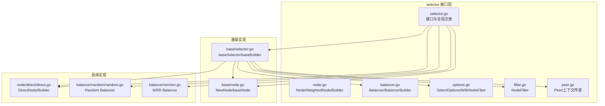
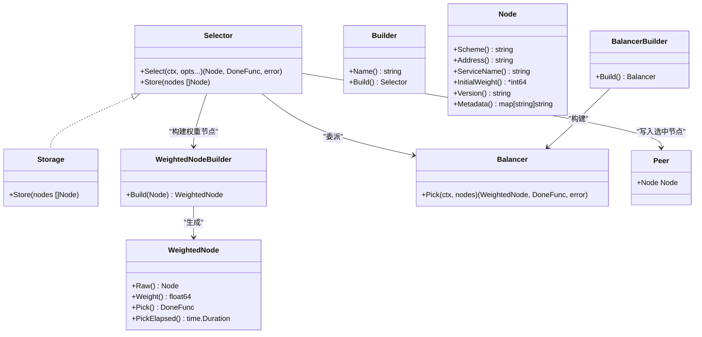
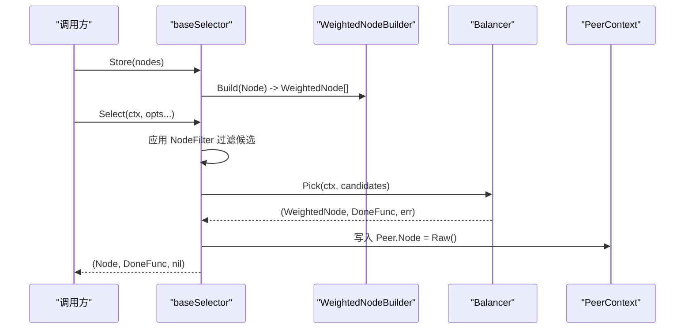
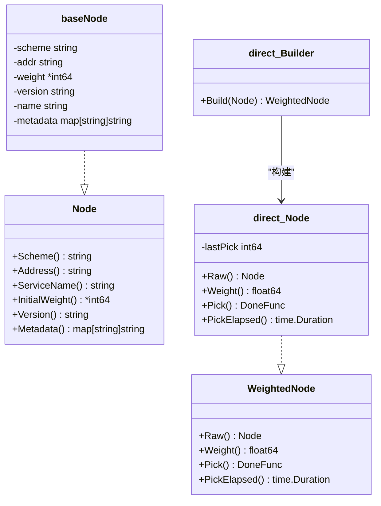
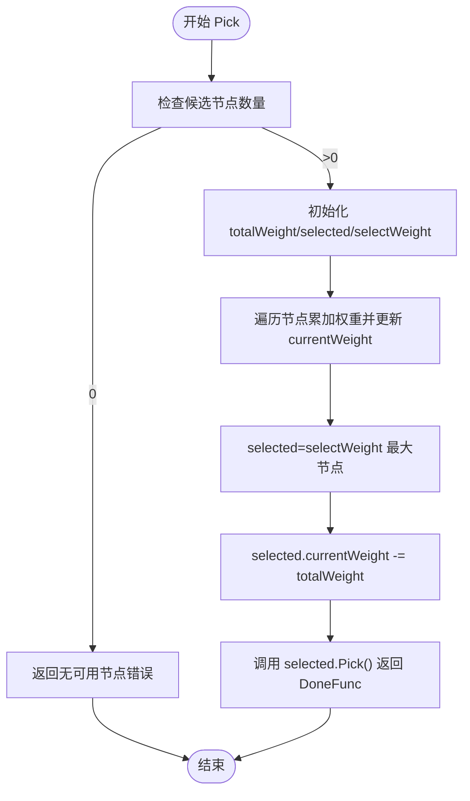
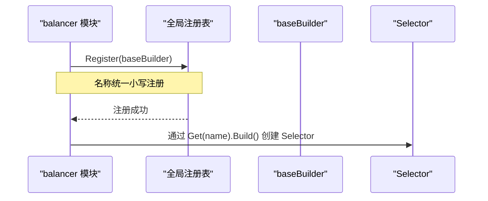
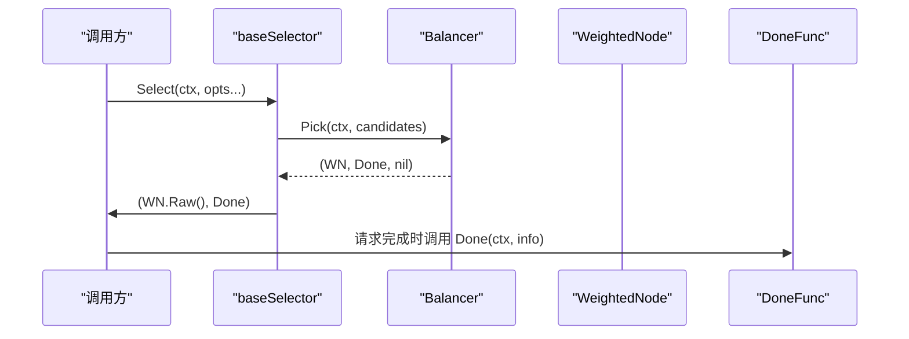
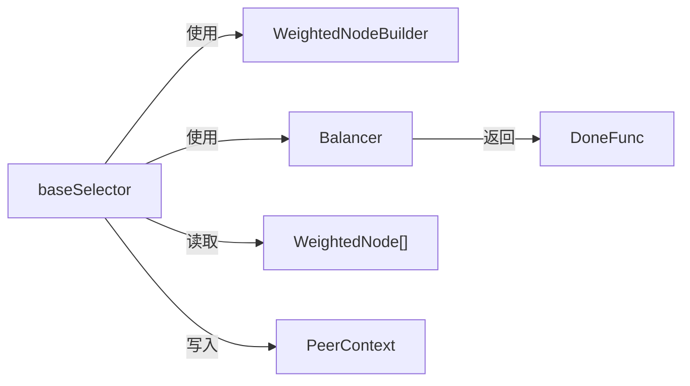

# 服务选择器

<cite>
**本文引用的文件**
- [selector.go](file://selector/selector.go)
- [node.go](file://selector/node.go)
- [balancer.go](file://selector/balancer.go)
- [options.go](file://selector/options.go)
- [filter.go](file://selector/filter.go)
- [peer.go](file://selector/peer.go)
- [base/selector.go](file://selector/base/selector.go)
- [base/node.go](file://selector/base/node.go)
- [node/direct/direct.go](file://selector/node/direct/direct.go)
- [balancer/random/random.go](file://selector/balancer/random/random.go)
- [balancer/wrr/wrr.go](file://selector/balancer/wrr/wrr.go)
- [README.md](file://README.md)
</cite>

## 目录
1. [引言](#引言)
2. [项目结构](#项目结构)
3. [核心组件](#核心组件)
4. [架构总览](#架构总览)
5. [详细组件分析](#详细组件分析)
6. [依赖分析](#依赖分析)
7. [性能考虑](#性能考虑)
8. [故障排查指南](#故障排查指南)
9. [结论](#结论)
10. [附录：使用示例与最佳实践](#附录使用示例与最佳实践)

## 引言
本技术文档围绕 Go Fox 的服务选择器子系统展开，系统性阐述其接口设计、构建器模式、生命周期管理、负载均衡策略以及在微服务架构中的应用。重点包括：
- 核心接口：Selector、Builder、Storage、Node、WeightedNode、Balancer 等
- 选择器构建器模式：Register 注册、Get 获取、Builder 接口设计
- 生命周期管理：节点存储、选择算法、回调处理 DoneFunc
- 实战示例：自定义选择器实现、选择器配置、错误处理
- 微服务场景：服务发现、负载均衡、故障转移

## 项目结构
服务选择器位于 selector 目录下，采用分层与功能模块化组织：
- 接口与通用类型：selector.go、node.go、balancer.go、options.go、filter.go、peer.go
- 基础实现：base/selector.go、base/node.go
- 节点实现：node/direct/direct.go
- 负载均衡实现：balancer/random/random.go、balancer/wrr/wrr.go

图表来源
- [selector.go](file://selector/selector.go#L84-L96)
- [node.go](file://selector/node.go#L28-L72)
- [balancer.go](file://selector/balancer.go#L28-L37)
- [options.go](file://selector/options.go#L26-L40)
- [filter.go](file://selector/filter.go#L28-L30)
- [peer.go](file://selector/peer.go#L30-L49)
- [base/selector.go](file://selector/base/selector.go#L34-L111)
- [base/node.go](file://selector/base/node.go#L33-L88)
- [node/direct/direct.go](file://selector/node/direct/direct.go#L34-L82)
- [balancer/random/random.go](file://selector/balancer/random/random.go#L35-L68)
- [balancer/wrr/wrr.go](file://selector/balancer/wrr/wrr.go#L12-L69)

章节来源
- [README.md](file://README.md#L1-L3)
- [selector.go](file://selector/selector.go#L24-L96)
- [base/selector.go](file://selector/base/selector.go#L24-L111)

## 核心组件
本节聚焦服务选择器的关键接口与职责边界。

- Selector 接口
  - 职责：接收节点集合，按策略选择一个节点，并返回回调 DoneFunc
  - 关键方法：Select(ctx, opts...) -> (Node, DoneFunc, error)
  - 继承：Storage（用于更新节点集合）

- Builder 接口
  - 职责：根据名称创建 Selector 实例
  - 关键方法：Name() string、Build() Selector

- Storage 接口
  - 职责：接收一组 Node 并转换为 WeightedNode 存储
  - 关键方法：Store(nodes []Node)

- Node/WeightedNode
  - Node：服务实例抽象，包含 Scheme、Address、ServiceName、InitialWeight、Version、Metadata 等
  - WeightedNode：带权重的节点，扩展 Raw()、Weight()、Pick()、PickElapsed()

- Balancer/BalancerBuilder
  - Balancer：Pick(ctx, nodes) -> (WeightedNode, DoneFunc, error)
  - BalancerBuilder：Build() Balancer

- DoneFunc 回调
  - 在 RPC 完成时被调用，携带错误、元数据、字节数统计等信息

- 全局注册与获取
  - Register(builder)：以名称注册选择器构建器
  - Get(name)：按名称获取构建器
  - GetAll()：获取所有构建器

章节来源
- [selector.go](file://selector/selector.go#L35-L96)
- [node.go](file://selector/node.go#L28-L72)
- [balancer.go](file://selector/balancer.go#L28-L37)
- [options.go](file://selector/options.go#L26-L40)
- [filter.go](file://selector/filter.go#L26-L30)
- [peer.go](file://selector/peer.go#L30-L49)

## 架构总览
服务选择器采用“构建器 + 基础选择器 + 节点权重 + 负载均衡器”的分层架构。基础选择器负责：
- 将 Node 转换为 WeightedNode
- 应用 NodeFilter 过滤候选节点
- 委派 Balancer 执行 Pick
- 通过 Peer 上下文回填选中节点
- 返回 DoneFunc 供上层在请求完成后回调

图表来源
- [selector.go](file://selector/selector.go#L84-L96)
- [node.go](file://selector/node.go#L28-L72)
- [balancer.go](file://selector/balancer.go#L28-L37)
- [peer.go](file://selector/peer.go#L30-L49)
- [base/selector.go](file://selector/base/selector.go#L34-L111)

## 详细组件分析

### 基础选择器与构建器
- baseSelector
  - Store：将传入的 Node 列表转换为 WeightedNode 并原子存储
  - Select：
    - 解析 SelectOptions，依次应用 NodeFilter 过滤候选集
    - 若候选为空，返回“无可用节点”错误
    - 调用 Balancer.Pick 获取 WeightedNode 及 DoneFunc
    - 通过 Peer 上下文回填选中 Node
    - 返回原始 Node 与 DoneFunc

- baseBuilder
  - Name：返回选择器名称
  - Build：创建 baseSelector，注入 WeightedNodeBuilder 与 BalancerBuilder

图表来源
- [base/selector.go](file://selector/base/selector.go#L46-L91)
- [node.go](file://selector/node.go#L68-L72)
- [balancer.go](file://selector/balancer.go#L28-L37)
- [peer.go](file://selector/peer.go#L39-L48)

章节来源
- [base/selector.go](file://selector/base/selector.go#L34-L111)
- [node.go](file://selector/node.go#L28-L72)
- [balancer.go](file://selector/balancer.go#L28-L37)
- [peer.go](file://selector/peer.go#L30-L49)

### 节点与权重节点
- baseNode/NewNode：从服务实例构造 Node，解析初始权重
- direct.Node：默认权重节点实现，记录最近一次 Pick 时间戳，提供 PickElapsed 计算
- direct.Builder：将 Node 包装为 direct.Node

图表来源
- [base/node.go](file://selector/base/node.go#L33-L88)
- [node/direct/direct.go](file://selector/node/direct/direct.go#L34-L82)
- [node.go](file://selector/node.go#L28-L72)

章节来源
- [base/node.go](file://selector/base/node.go#L33-L88)
- [node/direct/direct.go](file://selector/node/direct/direct.go#L34-L82)
- [node.go](file://selector/node.go#L28-L72)

### 负载均衡器与构建器
- Random Balancer：随机选择一个 WeightedNode，调用其 Pick() 返回 DoneFunc
- WRR Balancer：基于 nginx 公平调度思想，维护每个节点当前权重，选择最大者并重置其权重

图表来源
- [balancer/wrr/wrr.go](file://selector/balancer/wrr/wrr.go#L33-L59)
- [balancer/random/random.go](file://selector/balancer/random/random.go#L53-L61)

章节来源
- [balancer/random/random.go](file://selector/balancer/random/random.go#L35-L68)
- [balancer/wrr/wrr.go](file://selector/balancer/wrr/wrr.go#L12-L69)

### 选择器构建器模式与注册
- 全局注册表：以名称为键的构建器映射
- Register：将构建器按名称注册（小写）
- Get/GetAll：按名称检索或获取全部构建器
- 初始化：各具体 Balancer 在 init 中注册到全局

图表来源
- [selector.go](file://selector/selector.go#L61-L77)
- [balancer/random/random.go](file://selector/balancer/random/random.go#L41-L48)
- [balancer/wrr/wrr.go](file://selector/balancer/wrr/wrr.go#L18-L26)

章节来源
- [selector.go](file://selector/selector.go#L38-L77)
- [balancer/random/random.go](file://selector/balancer/random/random.go#L35-L68)
- [balancer/wrr/wrr.go](file://selector/balancer/wrr/wrr.go#L12-L69)

### 选择流程与回调处理
- 选择流程：过滤候选 -> 委派 Balancer -> 写入 Peer -> 返回 Node 与 DoneFunc
- DoneFunc：在 RPC 完成时调用，携带错误、元数据、字节统计等信息

图表来源
- [base/selector.go](file://selector/base/selector.go#L54-L91)
- [balancer.go](file://selector/balancer.go#L28-L37)
- [selector.go](file://selector/selector.go#L40-L60)

章节来源
- [base/selector.go](file://selector/base/selector.go#L54-L91)
- [selector.go](file://selector/selector.go#L40-L60)

## 依赖分析
- 组件内聚与耦合
  - baseSelector 对 WeightedNodeBuilder 与 BalancerBuilder 松耦合，通过接口注入
  - NodeFilter 作为可插拔过滤器，支持多阶段过滤
  - DoneFunc 与 PeerContext 解耦了选择结果与上层回调逻辑
- 外部依赖
  - 原子容器用于节点列表的并发安全存储
  - 错误类型封装用于统一“无可用节点”语义

图表来源
- [base/selector.go](file://selector/base/selector.go#L34-L111)
- [balancer.go](file://selector/balancer.go#L28-L37)
- [peer.go](file://selector/peer.go#L30-L49)

章节来源
- [base/selector.go](file://selector/base/selector.go#L34-L111)
- [balancer.go](file://selector/balancer.go#L28-L37)
- [peer.go](file://selector/peer.go#L30-L49)

## 性能考虑
- 原子存储：使用原子值保存节点列表，避免锁竞争，提升高并发下的选择性能
- 过滤链：NodeFilter 支持多阶段过滤，建议在保证正确性的前提下尽量减少过滤成本
- 权重计算：WeightedNode 的 Weight() 与 PickElapsed() 为动态指标，应避免在热路径做昂贵计算
- 随机选择：random 选择器开销低，适合简单场景；WRR 适合需要更公平调度的场景
- 回调开销：DoneFunc 通常为空操作，若需统计可在外层包装

## 故障排查指南
- 无可用节点
  - 现象：Select 返回“无可用节点”错误
  - 原因：节点列表为空或所有节点被 NodeFilter 过滤掉
  - 排查：确认 Storage 是否正确更新、过滤器是否过于严格
- 回调未触发
  - 现象：RPC 已完成但未统计
  - 原因：未在调用链中调用返回的 DoneFunc
  - 排查：确保在请求完成时调用 DoneFunc(ctx, info)
- Peer 未回填
  - 现象：上游无法获取选中节点
  - 原因：未正确传递 PeerContext 或未启用相关中间件
  - 排查：确认上下文传递链路与中间件配置

章节来源
- [selector.go](file://selector/selector.go#L35-L36)
- [base/selector.go](file://selector/base/selector.go#L86-L90)
- [peer.go](file://selector/peer.go#L39-L48)

## 结论
Go Fox 服务选择器通过清晰的接口分层与构建器模式，提供了可扩展、可组合的选择能力。基础选择器统一了节点存储、过滤、调度与回调处理，具体 Balancer 与 WeightedNode 实现则满足不同场景需求。结合服务发现与传输层集成，可在微服务中实现高效的服务选择与负载均衡。

## 附录：使用示例与最佳实践
以下为常见使用场景与实践建议（以路径代替代码片段）：

- 自定义选择器实现
  - 实现 WeightedNodeBuilder 与 BalancerBuilder，参考现有 direct 与 random/wrr 的实现方式
  - 在 init 中通过 Register 注册构建器
  - 参考路径：
    - [node/direct/direct.go](file://selector/node/direct/direct.go#L75-L82)
    - [balancer/random/random.go](file://selector/balancer/random/random.go#L63-L68)
    - [balancer/wrr/wrr.go](file://selector/balancer/wrr/wrr.go#L61-L69)
    - [selector.go](file://selector/selector.go#L61-L77)

- 选择器配置与获取
  - 使用 Get(name) 获取构建器后 Build 出 Selector
  - 参考路径：
    - [selector.go](file://selector/selector.go#L66-L72)

- 选择选项与过滤
  - 使用 WithNodeFilter 添加过滤器，支持多阶段过滤
  - 参考路径：
    - [options.go](file://selector/options.go#L34-L39)
    - [filter.go](file://selector/filter.go#L28-L30)

- 生命周期管理
  - 通过 Storage.Store 更新节点列表
  - 通过 Select 获取 Node 与 DoneFunc，在请求完成后调用 DoneFunc
  - 参考路径：
    - [selector.go](file://selector/selector.go#L79-L89)
    - [base/selector.go](file://selector/base/selector.go#L46-L91)

- 微服务场景
  - 服务发现：将服务发现结果转换为 Node 并通过 Storage.Store 更新
  - 负载均衡：根据业务选择 random 或 wrr
  - 故障转移：在 DoneFunc 中统计失败并配合过滤器剔除异常节点
  - 参考路径：
    - [base/node.go](file://selector/base/node.go#L37-L54)
    - [balancer/wrr/wrr.go](file://selector/balancer/wrr/wrr.go#L33-L59)
    - [balancer/random/random.go](file://selector/balancer/random/random.go#L53-L61)