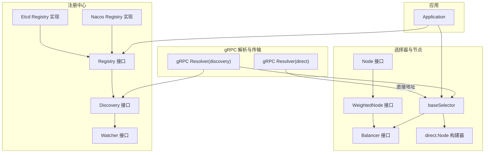
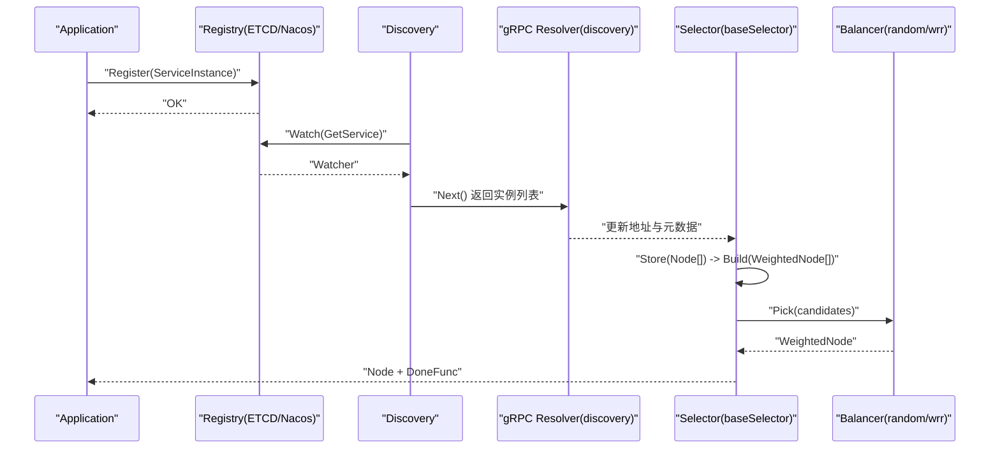
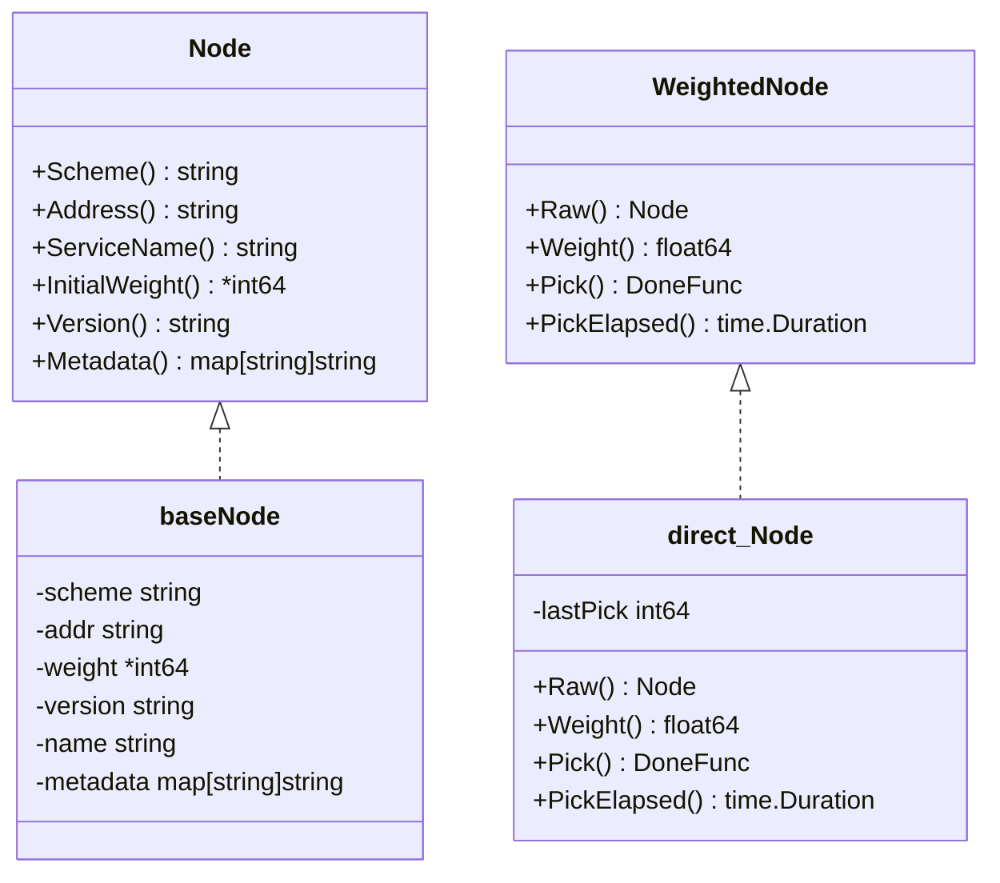
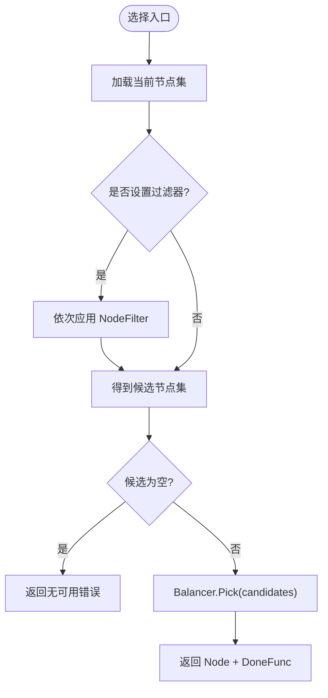
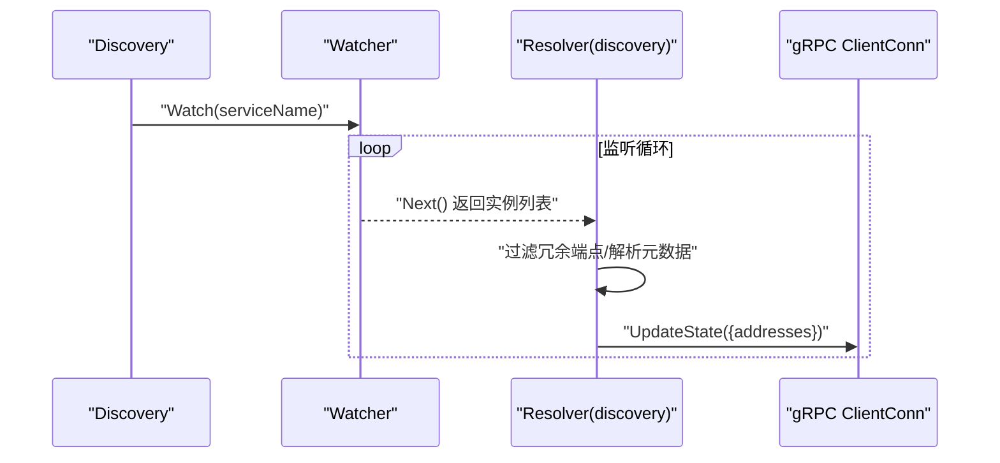
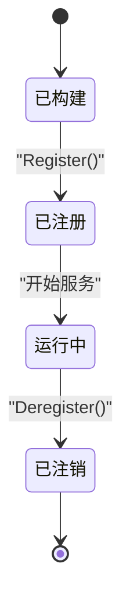
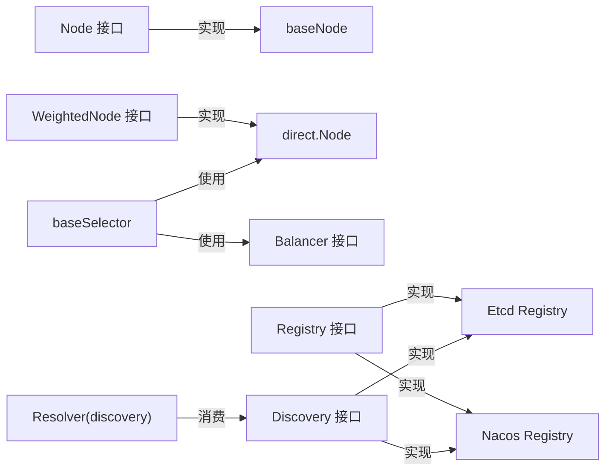

# 节点管理

<cite>
**本文引用的文件**
- [selector/node.go](file://selector/node.go)
- [selector/base/node.go](file://selector/base/node.go)
- [selector/base/selector.go](file://selector/base/selector.go)
- [selector/balancer/random/random.go](file://selector/balancer/random/random.go)
- [selector/balancer/wrr/wrr.go](file://selector/balancer/wrr/wrr.go)
- [selector/node/direct/direct.go](file://selector/node/direct/direct.go)
- [selector/options.go](file://selector/options.go)
- [registry/registry.go](file://registry/registry.go)
- [transport/grpc/resolver/discovery/resolver.go](file://transport/grpc/resolver/discovery/resolver.go)
- [transport/grpc/resolver/direct/builder.go](file://transport/grpc/resolver/direct/builder.go)
- [contrib/registry/etcd/registry.go](file://contrib/registry/etcd/registry.go)
- [contrib/registry/nacos/registry.go](file://contrib/registry/nacos/registry.go)
- [app.go](file://app.go)
</cite>

## 目录
1. [简介](#简介)
2. [项目结构](#项目结构)
3. [核心组件](#核心组件)
4. [架构总览](#架构总览)
5. [详细组件分析](#详细组件分析)
6. [依赖关系分析](#依赖关系分析)
7. [性能考量](#性能考量)
8. [故障排查指南](#故障排查指南)
9. [结论](#结论)
10. [附录：使用示例与最佳实践](#附录使用示例与最佳实践)

## 简介
本技术文档围绕 Go Fox 的“节点管理”能力展开，系统性阐述节点抽象设计、基础节点实现、节点在服务治理中的角色（注册、发现、状态监控）、与选择器/注册中心/负载均衡器的协作关系，并提供可操作的使用示例与性能优化建议。读者无需深入源码即可理解如何在工程中正确地创建、配置与维护节点。

## 项目结构
节点管理涉及以下关键模块：
- 接口层：定义节点与加权节点的统一抽象，以及选择器、过滤器等扩展点
- 基础实现：将注册中心的服务实例转换为基础节点，并提供默认加权节点构建器
- 选择器与负载均衡：基于权重节点进行挑选，支持随机与加权轮询两种策略
- 注册中心：提供服务注册、更新、注销与监听能力
- gRPC 解析器：将注册中心的实例映射为 gRPC 地址并注入元数据
- 应用生命周期：负责服务实例构建、注册与注销

图表来源
- [selector/node.go](file://selector/node.go#L28-L71)
- [selector/base/selector.go](file://selector/base/selector.go#L34-L110)
- [selector/node/direct/direct.go](file://selector/node/direct/direct.go#L34-L81)
- [registry/registry.go](file://registry/registry.go#L17-L112)
- [contrib/registry/etcd/registry.go](file://contrib/registry/etcd/registry.go#L40-L82)
- [contrib/registry/nacos/registry.go](file://contrib/registry/nacos/registry.go#L39-L74)
- [transport/grpc/resolver/discovery/resolver.go](file://transport/grpc/resolver/discovery/resolver.go#L41-L138)
- [transport/grpc/resolver/direct/builder.go](file://transport/grpc/resolver/direct/builder.go#L32-L63)
- [app.go](file://app.go#L223-L251)

章节来源
- [selector/node.go](file://selector/node.go#L28-L71)
- [selector/base/selector.go](file://selector/base/selector.go#L34-L110)
- [registry/registry.go](file://registry/registry.go#L17-L112)

## 核心组件
- 节点接口 Node：统一描述服务节点的标识、地址、服务名、初始权重、版本与元数据
- 加权节点接口 WeightedNode：在 Node 基础上增加运行时权重、挑选回调与挑选耗时统计
- 选择器 Selector：接收 Node 列表，通过过滤器与负载均衡策略挑选目标节点
- 负载均衡 Balancer：提供 Pick 策略（随机、加权轮询）
- 注册中心 Registry/Discovery：提供注册、更新、注销与监听服务实例变更
- gRPC 解析器：将服务实例映射为 gRPC 地址，注入元数据供客户端连接使用
- 应用 Application：构建服务实例、注册/注销服务、管理生命周期

章节来源
- [selector/node.go](file://selector/node.go#L28-L71)
- [selector/base/selector.go](file://selector/base/selector.go#L34-L110)
- [selector/balancer/random/random.go](file://selector/balancer/random/random.go#L35-L67)
- [selector/balancer/wrr/wrr.go](file://selector/balancer/wrr/wrr.go#L12-L68)
- [registry/registry.go](file://registry/registry.go#L17-L112)
- [transport/grpc/resolver/discovery/resolver.go](file://transport/grpc/resolver/discovery/resolver.go#L41-L138)
- [app.go](file://app.go#L223-L251)

## 架构总览
下图展示从应用启动到 gRPC 客户端连接的关键流程：应用构建服务实例并注册至注册中心；解析器监听变更并将地址与元数据下发给 gRPC 客户端；选择器根据策略挑选节点并返回给上游调用方。

图表来源
- [app.go](file://app.go#L208-L221)
- [contrib/registry/etcd/registry.go](file://contrib/registry/etcd/registry.go#L106-L110)
- [contrib/registry/nacos/registry.go](file://contrib/registry/nacos/registry.go#L105-L108)
- [transport/grpc/resolver/discovery/resolver.go](file://transport/grpc/resolver/discovery/resolver.go#L66-L130)
- [selector/base/selector.go](file://selector/base/selector.go#L46-L91)
- [selector/balancer/random/random.go](file://selector/balancer/random/random.go#L53-L61)
- [selector/balancer/wrr/wrr.go](file://selector/balancer/wrr/wrr.go#L33-L58)

## 详细组件分析

### 节点抽象与基础实现
- Node 接口定义了节点的核心属性：协议方案、唯一地址、服务名、初始权重、版本、元数据键值对
- baseNode 是 Node 的默认实现，从注册中心的服务实例构造节点，解析权重、版本与元数据
- direct.Node 是 WeightedNode 的默认实现，提供运行时权重与挑选回调，支持挑选耗时统计

图表来源
- [selector/node.go](file://selector/node.go#L28-L71)
- [selector/base/node.go](file://selector/base/node.go#L37-L87)
- [selector/node/direct/direct.go](file://selector/node/direct/direct.go#L43-L81)

章节来源
- [selector/node.go](file://selector/node.go#L28-L71)
- [selector/base/node.go](file://selector/base/node.go#L37-L87)
- [selector/node/direct/direct.go](file://selector/node/direct/direct.go#L34-L81)

### 选择器与负载均衡
- baseSelector 维护当前节点集，支持通过 NodeFilter 进行候选过滤，再交由 Balancer 挑选
- random 与 wrr 提供两种负载均衡策略，默认注册到全局选择器注册表
- direct.Builder 将 Node 包装为 WeightedNode，提供默认权重与挑选记录

图表来源
- [selector/base/selector.go](file://selector/base/selector.go#L46-L91)
- [selector/balancer/random/random.go](file://selector/balancer/random/random.go#L53-L61)
- [selector/balancer/wrr/wrr.go](file://selector/balancer/wrr/wrr.go#L33-L58)
- [selector/node/direct/direct.go](file://selector/node/direct/direct.go#L75-L81)

章节来源
- [selector/base/selector.go](file://selector/base/selector.go#L39-L110)
- [selector/balancer/random/random.go](file://selector/balancer/random/random.go#L35-L67)
- [selector/balancer/wrr/wrr.go](file://selector/balancer/wrr/wrr.go#L12-L68)
- [selector/node/direct/direct.go](file://selector/node/direct/direct.go#L34-L81)

### 注册中心与服务发现
- Registry 提供 Register/Update/Deregister；Discovery 提供 GetService/Watch；Watcher 支持 Next/Stop
- Etcd 与 Nacos 分别实现上述接口，前者使用 KV+租约保活，后者通过 SDK 注册/更新/注销
- 解析器监听服务变更，过滤冗余端点，生成 gRPC 地址并注入元数据

图表来源
- [registry/registry.go](file://registry/registry.go#L17-L112)
- [contrib/registry/etcd/registry.go](file://contrib/registry/etcd/registry.go#L106-L110)
- [contrib/registry/nacos/registry.go](file://contrib/registry/nacos/registry.go#L105-L108)
- [transport/grpc/resolver/discovery/resolver.go](file://transport/grpc/resolver/discovery/resolver.go#L66-L130)

章节来源
- [registry/registry.go](file://registry/registry.go#L17-L112)
- [contrib/registry/etcd/registry.go](file://contrib/registry/etcd/registry.go#L40-L82)
- [contrib/registry/nacos/registry.go](file://contrib/registry/nacos/registry.go#L39-L74)
- [transport/grpc/resolver/discovery/resolver.go](file://transport/grpc/resolver/discovery/resolver.go#L66-L130)

### 应用生命周期与节点状态
- Application 在启动阶段构建 ServiceInstance 并注册到注册中心；停止时注销
- 服务实例包含 ID、名称、版本、区域/可用区元数据与多个端点
- 注册中心实现（如 Etcd）通过租约保活维持节点健康状态

图表来源
- [app.go](file://app.go#L208-L221)
- [app.go](file://app.go#L253-L282)
- [contrib/registry/etcd/registry.go](file://contrib/registry/etcd/registry.go#L112-L132)
- [contrib/registry/etcd/registry.go](file://contrib/registry/etcd/registry.go#L177-L242)

章节来源
- [app.go](file://app.go#L223-L251)
- [app.go](file://app.go#L208-L221)
- [contrib/registry/etcd/registry.go](file://contrib/registry/etcd/registry.go#L112-L132)

## 依赖关系分析
- 低耦合：Node/WeightedNode/Balancer/Selector 以接口解耦，便于替换与扩展
- 可插拔：选择器通过 Builder 注册，负载均衡策略按需启用
- 外部依赖：注册中心（Etcd/Nacos）与 gRPC 解析器作为外部集成点

图表来源
- [selector/node.go](file://selector/node.go#L28-L71)
- [selector/base/node.go](file://selector/base/node.go#L37-L87)
- [selector/node/direct/direct.go](file://selector/node/direct/direct.go#L43-L81)
- [selector/base/selector.go](file://selector/base/selector.go#L39-L110)
- [registry/registry.go](file://registry/registry.go#L17-L112)
- [contrib/registry/etcd/registry.go](file://contrib/registry/etcd/registry.go#L40-L82)
- [contrib/registry/nacos/registry.go](file://contrib/registry/nacos/registry.go#L39-L74)
- [transport/grpc/resolver/discovery/resolver.go](file://transport/grpc/resolver/discovery/resolver.go#L41-L138)

章节来源
- [selector/base/selector.go](file://selector/base/selector.go#L39-L110)
- [registry/registry.go](file://registry/registry.go#L17-L112)

## 性能考量
- 节点构建与切换：优先在解析器层面做端点去重与元数据注入，减少下游处理开销
- 权重计算：若业务需要动态权重，可在 WeightedNode 层扩展，避免频繁重建节点
- 选择器缓存：baseSelector 使用原子存储保存节点集，降低并发读写成本
- 注册中心保活：Etcd 使用租约保活，合理设置 TTL 与重试退避，平衡网络抖动与资源占用
- 负载均衡：wrr 在 Pick 时维护 per-node 当前权重，注意锁粒度与热点节点的公平性

## 故障排查指南
- 无可用节点：检查 NodeFilter 是否过度过滤或候选集为空
- gRPC 连接失败：确认解析器已更新地址且端点与安全模式匹配
- 注册中心异常：查看 Watch/Next 错误日志，确认服务名与前缀配置一致
- 节点不健康：关注注册中心的租约保活与心跳重试逻辑

章节来源
- [selector/base/selector.go](file://selector/base/selector.go#L79-L81)
- [transport/grpc/resolver/discovery/resolver.go](file://transport/grpc/resolver/discovery/resolver.go#L73-L83)
- [contrib/registry/etcd/registry.go](file://contrib/registry/etcd/registry.go#L177-L242)

## 结论
Go Fox 的节点管理以清晰的接口抽象与可插拔的实现为核心，结合注册中心与 gRPC 解析器，实现了从节点注册、发现到选择与负载均衡的完整链路。通过基础节点与加权节点的分层设计，既能满足通用场景，又为动态权重与自定义策略预留空间。

## 附录：使用示例与最佳实践

- 节点创建与配置
  - 使用基础节点工厂从注册中心实例创建 Node，并传入选择器
  - 若需要动态权重，可通过 WeightedNodeBuilder 自定义构建器
  - 示例路径参考：[selector/base/node.go](file://selector/base/node.go#L37-L54)，[selector/node/direct/direct.go](file://selector/node/direct/direct.go#L75-L81)

- 节点状态更新
  - 通过注册中心的 Update 接口更新服务实例元数据或权重字段
  - 解析器监听变更后自动刷新 gRPC 地址
  - 示例路径参考：[registry/registry.go](file://registry/registry.go#L24-L36)，[transport/grpc/resolver/discovery/resolver.go](file://transport/grpc/resolver/discovery/resolver.go#L86-L130)

- 选择器与过滤器
  - 使用 WithNodeFilter 设置过滤条件，如按元数据筛选
  - 选择器内部先过滤再交给负载均衡器挑选
  - 示例路径参考：[selector/options.go](file://selector/options.go#L26-L39)，[selector/base/selector.go](file://selector/base/selector.go#L54-L91)

- 与注册中心协作
  - 应用启动时构建 ServiceInstance 并注册；停止时注销
  - 注册中心实现（Etcd/Nacos）负责保活与变更通知
  - 示例路径参考：[app.go](file://app.go#L208-L221)，[contrib/registry/etcd/registry.go](file://contrib/registry/etcd/registry.go#L112-L132)，[contrib/registry/nacos/registry.go](file://contrib/registry/nacos/registry.go#L110-L161)

- 最佳实践
  - 明确节点元数据键规范（如 region、zone、version），便于过滤与路由
  - 合理设置权重与负载均衡策略，避免热点节点过载
  - 在高并发场景下，优先使用 wrr 并配合节点健康状态过滤
  - 对注册中心的 TTL 与重试策略进行压测验证，确保稳定性