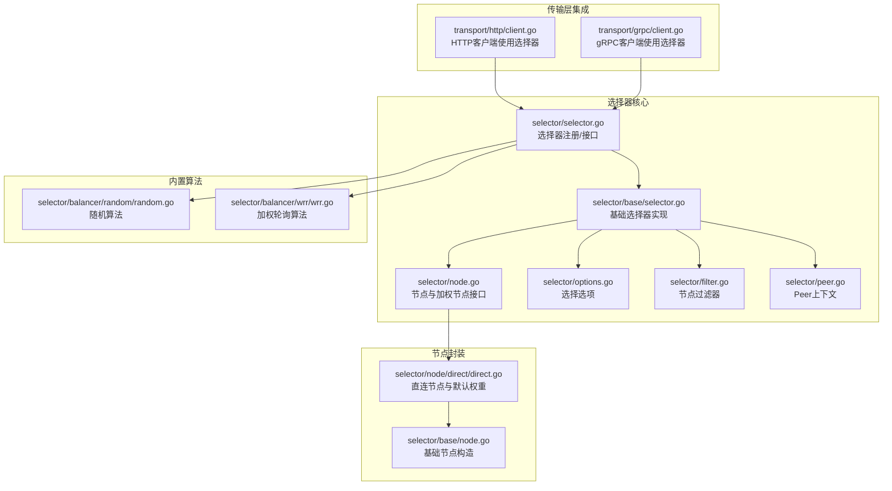
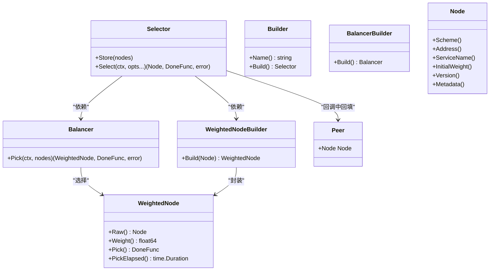
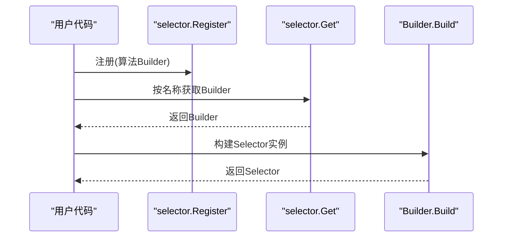
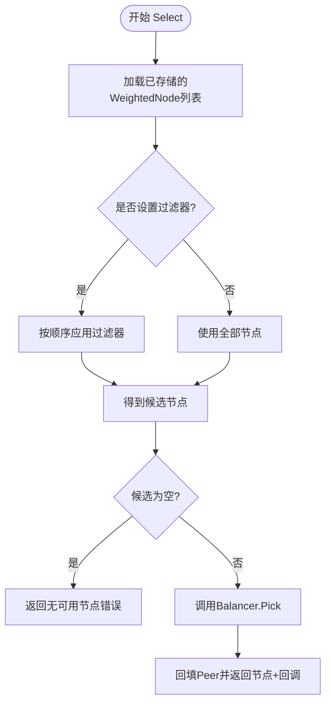
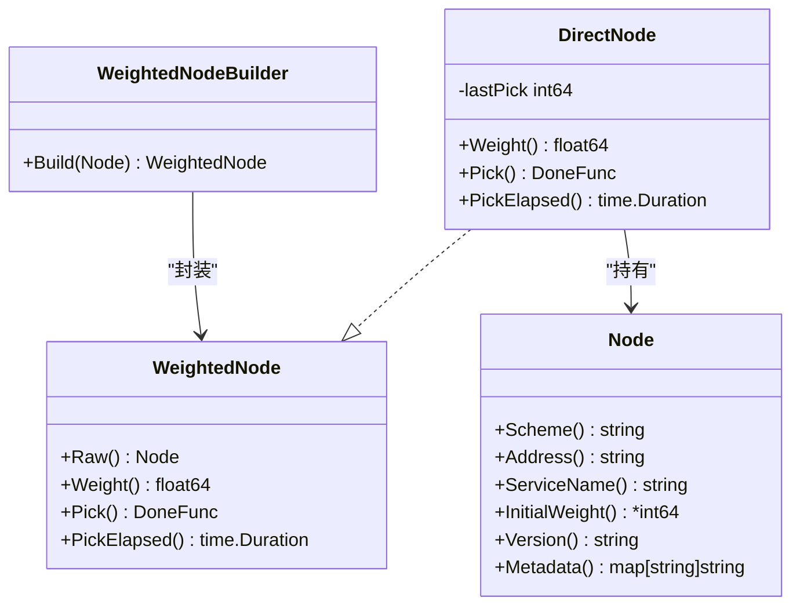
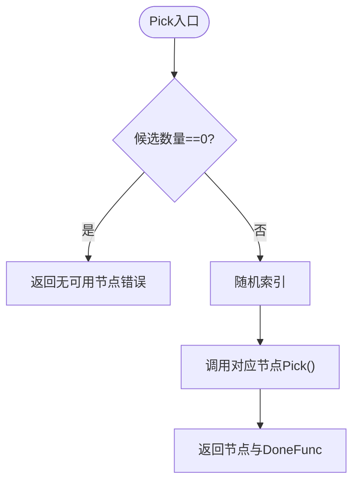
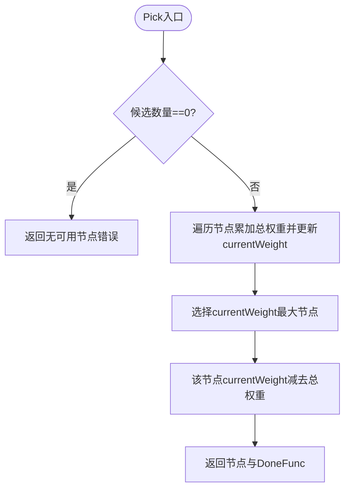
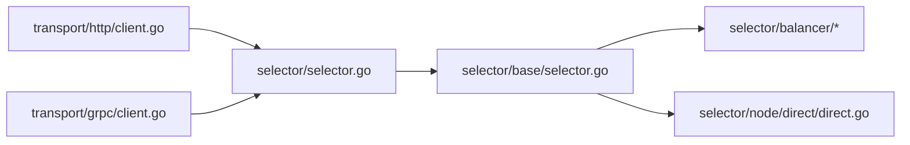

# 负载均衡器

<cite>
**本文引用的文件**
- [balancer.go](file://selector/balancer.go)
- [selector.go](file://selector/selector.go)
- [selector.go（基础选择器）](file://selector/base/selector.go)
- [node.go](file://selector/node.go)
- [options.go](file://selector/options.go)
- [filter.go](file://selector/filter.go)
- [peer.go](file://selector/peer.go)
- [direct.go](file://selector/node/direct/direct.go)
- [random.go](file://selector/balancer/random/random.go)
- [wrr.go](file://selector/balancer/wrr/wrr.go)
- [client.go（HTTP）](file://transport/http/client.go)
- [client.go（gRPC）](file://transport/grpc/client.go)
- [base.go](file://selector/base/base.go)
- [node.go（基础节点）](file://selector/base/node.go)
- [app.go](file://app.go)
- [options.go（应用选项）](file://options.go)
</cite>

## 目录
1. [简介](#简介)
2. [项目结构](#项目结构)
3. [核心组件](#核心组件)
4. [架构总览](#架构总览)
5. [组件详解](#组件详解)
6. [依赖关系分析](#依赖关系分析)
7. [性能与适用场景](#性能与适用场景)
8. [使用示例与最佳实践](#使用示例与最佳实践)
9. [故障排查指南](#故障排查指南)
10. [结论](#结论)

## 简介
本技术文档围绕 Go Fox 的负载均衡器进行系统化梳理，重点覆盖以下方面：
- 接口设计：Balance 接口、Selector 接口、WeightedNode 接口及其构建器
- 节点选择算法：随机选择、加权轮询（WRR）
- 权重计算与节点封装：基于初始权重与运行时权重
- 扩展机制：自定义算法实现、算法注册、算法配置
- 实战示例：算法选择、权重设置、性能监控
- 场景与性能：算法比较、选型建议、优化策略
- 高并发与故障处理：最佳实践与排障

## 项目结构
与负载均衡器直接相关的模块主要位于 selector 及其子包，同时在传输层（HTTP/gRPC）中通过选择器完成节点挑选。

图表来源
- [selector.go](file://selector/selector.go#L61-L77)
- [selector.go（基础选择器）](file://selector/base/selector.go#L54-L91)
- [node.go](file://selector/node.go#L28-L71)
- [options.go](file://selector/options.go#L26-L39)
- [filter.go](file://selector/filter.go#L28-L29)
- [peer.go](file://selector/peer.go#L30-L48)
- [direct.go](file://selector/node/direct/direct.go#L34-L81)
- [node.go（基础节点）](file://selector/base/node.go#L37-L54)
- [random.go](file://selector/balancer/random/random.go#L35-L67)
- [wrr.go](file://selector/balancer/wrr/wrr.go#L12-L68)
- [client.go（HTTP）](file://transport/http/client.go#L83-L83)
- [client.go（gRPC）](file://transport/grpc/client.go#L44-L44)

章节来源
- [selector.go](file://selector/selector.go#L61-L77)
- [selector.go（基础选择器）](file://selector/base/selector.go#L54-L91)
- [node.go](file://selector/node.go#L28-L71)
- [options.go](file://selector/options.go#L26-L39)
- [filter.go](file://selector/filter.go#L28-L29)
- [peer.go](file://selector/peer.go#L30-L48)
- [direct.go](file://selector/node/direct/direct.go#L34-L81)
- [node.go（基础节点）](file://selector/base/node.go#L37-L54)
- [random.go](file://selector/balancer/random/random.go#L35-L67)
- [wrr.go](file://selector/balancer/wrr/wrr.go#L12-L68)
- [client.go（HTTP）](file://transport/http/client.go#L83-L83)
- [client.go（gRPC）](file://transport/grpc/client.go#L44-L44)

## 核心组件
- Balancer 接口：定义 Pick(ctx, nodes) 选择节点并返回 DoneFunc 的能力
- BalancerBuilder 接口：用于构建具体 Balancer 实例
- Selector 接口：封装存储节点与选择节点的能力；支持过滤器与 Done 回调
- Builder 接口：注册名与构建 Selector 的能力
- WeightedNode 接口：在 Node 基础上提供运行时权重、Pick、PickElapsed 等
- WeightedNodeBuilder：将普通 Node 封装为 WeightedNode，默认权重策略由 direct 包提供
- 选择选项 SelectOptions：支持 NodeFilter 过滤链
- Peer 上下文：在 RPC 完成回调中回填所选节点信息

章节来源
- [balancer.go](file://selector/balancer.go#L28-L36)
- [selector.go](file://selector/selector.go#L84-L95)
- [node.go](file://selector/node.go#L28-L71)
- [options.go](file://selector/options.go#L26-L39)
- [peer.go](file://selector/peer.go#L30-L48)

## 架构总览
负载均衡器采用“选择器 + 算法 + 节点封装”的分层设计：
- 选择器层：负责节点存储、过滤、调用算法、回调
- 算法层：内置随机与 WRR 算法，可扩展自定义算法
- 节点层：Node → WeightedNode，默认权重来自初始权重或默认值
- 传输层：HTTP/gRPC 在发起请求前通过选择器挑选节点

图表来源
- [selector.go](file://selector/selector.go#L84-L95)
- [balancer.go](file://selector/balancer.go#L28-L36)
- [node.go](file://selector/node.go#L28-L71)
- [direct.go](file://selector/node/direct/direct.go#L34-L81)
- [peer.go](file://selector/peer.go#L30-L48)

## 组件详解

### 接口与注册机制
- 选择器注册：通过 Register(builder) 将算法以名称注册到全局表中
- 获取与构建：Get(name).Build() 返回对应 Selector 实例
- 全局列表：GetAll() 提供所有已注册选择器的快照

图表来源
- [selector.go](file://selector/selector.go#L61-L77)
- [random.go](file://selector/balancer/random/random.go#L41-L48)
- [wrr.go](file://selector/balancer/wrr/wrr.go#L18-L25)

章节来源
- [selector.go](file://selector/selector.go#L61-L77)
- [random.go](file://selector/balancer/random/random.go#L41-L48)
- [wrr.go](file://selector/balancer/wrr/wrr.go#L18-L25)

### 基础选择器与节点封装
- 基础选择器 baseSelector
  - Store：将 Node 列表转换为 WeightedNode 并原子保存
  - Select：应用 NodeFilter 过滤候选集，调用 Balancer.Pick，回填 Peer 上下文
- WeightedNodeBuilder（direct）
  - 默认权重：若未设置初始权重则使用固定默认值
  - Pick：记录最近一次选择时间，返回空回调
  - PickElapsed：计算距离上次选择的时间

图表来源
- [selector.go（基础选择器）](file://selector/base/selector.go#L54-L91)
- [direct.go](file://selector/node/direct/direct.go#L55-L73)

章节来源
- [selector.go（基础选择器）](file://selector/base/selector.go#L46-L91)
- [direct.go](file://selector/node/direct/direct.go#L34-L81)

### 节点与权重模型
- Node：抽象服务节点，包含 Scheme、Address、ServiceName、InitialWeight、Version、Metadata
- WeightedNode：在 Node 基础上提供 Weight、Pick、PickElapsed
- WeightedNodeBuilder：将 Node 封装为 WeightedNode，默认权重策略由 direct 包提供

图表来源
- [node.go](file://selector/node.go#L28-L71)
- [direct.go](file://selector/node/direct/direct.go#L43-L81)

章节来源
- [node.go](file://selector/node.go#L28-L71)
- [direct.go](file://selector/node/direct/direct.go#L34-L81)

### 内置算法：随机选择
- 算法要点：从候选节点中等概率随机选择一个
- 错误处理：候选为空返回无可用节点错误
- 回调：调用被选节点的 Pick 返回 DoneFunc

图表来源
- [random.go](file://selector/balancer/random/random.go#L53-L61)

章节来源
- [random.go](file://selector/balancer/random/random.go#L35-L67)

### 内置算法：加权轮询（WRR）
- 算法要点：基于 Nginx WRR 思路，维护每个节点的 currentWeight，每次选择 currentWeight 最大的节点，并在选择后减去总权重
- 线程安全：使用互斥锁保护 currentWeight 映射
- 回调：同样返回节点与 DoneFunc

图表来源
- [wrr.go](file://selector/balancer/wrr/wrr.go#L33-L59)

章节来源
- [wrr.go](file://selector/balancer/wrr/wrr.go#L12-L68)

### 传输层集成与使用
- HTTP 客户端：根据配置获取选择器名称，通过 selector.Get(name).Build() 构建选择器
- gRPC 客户端：通过 selector.GetAll() 获取所有已注册选择器

章节来源
- [client.go（HTTP）](file://transport/http/client.go#L83-L83)
- [client.go（gRPC）](file://transport/grpc/client.go#L44-L44)

## 依赖关系分析
- 低耦合：选择器仅依赖 Balancer 与 WeightedNodeBuilder，算法与节点封装解耦
- 可扩展：通过 Register/Get/Build 机制实现算法注册与替换
- 传输层透明：HTTP/gRPC 仅依赖选择器接口，不感知具体算法

图表来源
- [client.go（HTTP）](file://transport/http/client.go#L83-L83)
- [client.go（gRPC）](file://transport/grpc/client.go#L44-L44)
- [selector.go](file://selector/selector.go#L61-L77)
- [selector.go（基础选择器）](file://selector/base/selector.go#L54-L91)
- [direct.go](file://selector/node/direct/direct.go#L34-L81)
- [random.go](file://selector/balancer/random/random.go#L35-L67)
- [wrr.go](file://selector/balancer/wrr/wrr.go#L12-L68)

章节来源
- [client.go（HTTP）](file://transport/http/client.go#L83-L83)
- [client.go（gRPC）](file://transport/grpc/client.go#L44-L44)
- [selector.go](file://selector/selector.go#L61-L77)
- [selector.go（基础选择器）](file://selector/base/selector.go#L54-L91)
- [direct.go](file://selector/node/direct/direct.go#L34-L81)
- [random.go](file://selector/balancer/random/random.go#L35-L67)
- [wrr.go](file://selector/balancer/wrr/wrr.go#L12-L68)

## 性能与适用场景
- 随机选择
  - 时间复杂度：O(1)，空间复杂度：O(1)
  - 特点：简单、公平、无状态
  - 适用：节点性能相近、对延迟敏感但无需精确权重分配
- 加权轮询（WRR）
  - 时间复杂度：O(n)，空间复杂度：O(k)（k 为节点数）
  - 特点：按权重近似均摊流量，适合节点性能差异较大
  - 注意：需要互斥锁保护，高并发下存在锁竞争
- 选择建议
  - 节点性能一致：优先随机
  - 节点性能差异明显：优先 WRR
  - 对延迟极敏感且节点多：可评估随机 + 过滤器组合
- 优化策略
  - 使用 NodeFilter 在选择前缩小候选集
  - 通过 Peer 回调统计节点命中与耗时，辅助动态权重
  - 在高并发场景下，考虑减少锁粒度或引入更细粒度的并发控制

[本节为通用性能讨论，不直接分析具体文件]

## 使用示例与最佳实践
- 算法选择
  - HTTP 客户端：通过配置指定 BalancerName，内部通过 selector.Get(name).Build() 获取选择器
  - gRPC 客户端：通过 selector.GetAll() 获取所有已注册选择器
- 权重设置
  - 通过节点元数据携带权重键值（例如 metadata["weight"]），基础节点构造会解析为初始权重
  - 若未设置，则使用默认权重
- 性能监控
  - 通过 DoneFunc 回调收集响应错误、字节数、是否收到响应等信息
  - 通过 PickElapsed 计算节点最近一次被选中的时间间隔，辅助健康检查与动态调度
- 高并发最佳实践
  - 合理设置 NodeFilter，减少候选节点规模
  - 在节点层面实现更细粒度的并发控制（如按节点加锁）
  - 结合 Peer 上下文记录所选节点，便于日志与追踪

章节来源
- [client.go（HTTP）](file://transport/http/client.go#L83-L83)
- [client.go（gRPC）](file://transport/grpc/client.go#L44-L44)
- [node.go（基础节点）](file://selector/base/node.go#L37-L54)
- [direct.go](file://selector/node/direct/direct.go#L55-L73)
- [peer.go](file://selector/peer.go#L30-L48)

## 故障排查指南
- 无可用节点
  - 现象：Select 返回无可用节点错误
  - 排查：确认节点是否已正确 Store；检查 NodeFilter 是否过度过滤；确认 WeightedNodeBuilder 是否正常封装
- 选择器未注册
  - 现象：Get(name) 返回空
  - 排查：确认算法包的 init 已执行并调用 Register；确认名称大小写
- 回调未触发
  - 现象：无法统计响应信息
  - 排查：确认调用方是否保留并调用 DoneFunc；确认 DoneInfo 字段是否被正确填充
- 高并发锁争用
  - 现象：WRR Pick 性能下降
  - 排查：评估节点数量与并发量；考虑减少锁范围或采用无锁结构

章节来源
- [selector.go](file://selector/selector.go#L35-L36)
- [selector.go（基础选择器）](file://selector/base/selector.go#L79-L85)
- [wrr.go](file://selector/balancer/wrr/wrr.go#L28-L31)

## 结论
Go Fox 负载均衡器通过清晰的接口分层与可插拔的注册机制，提供了简洁而强大的节点选择能力。内置随机与 WRR 算法满足常见场景需求，结合节点过滤、Peer 回调与传输层集成，可在高并发与复杂环境中稳定运行。通过合理的权重设置与过滤策略，可进一步提升系统的公平性与稳定性。