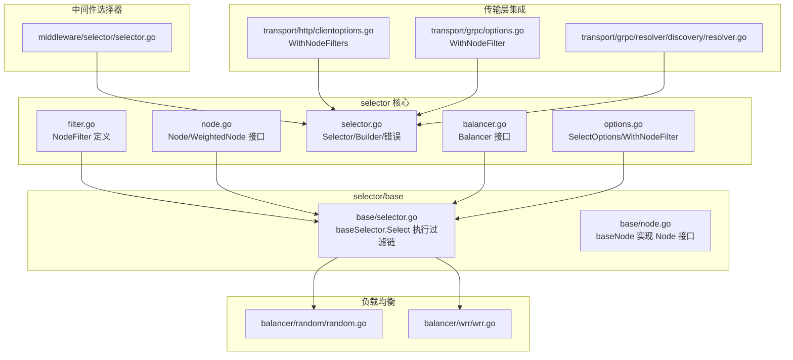
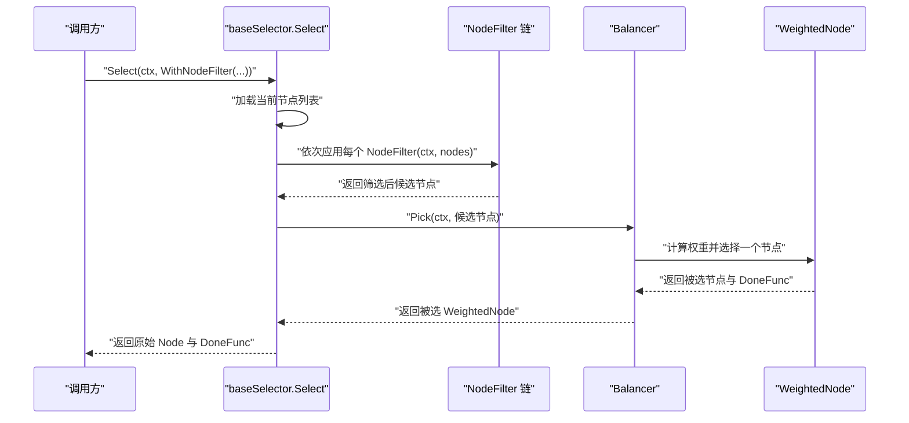
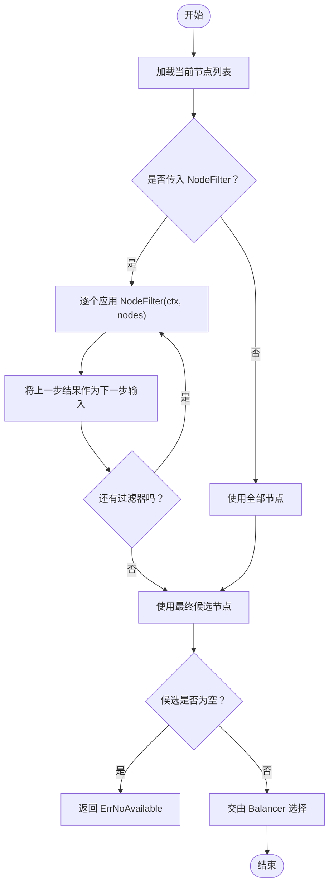
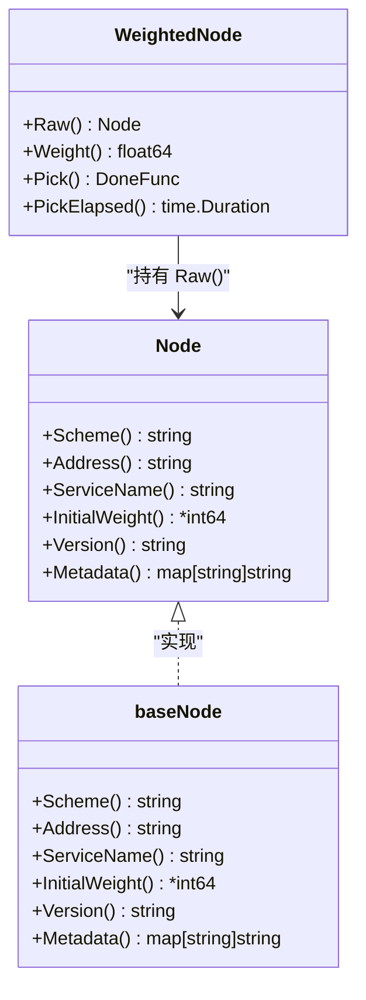
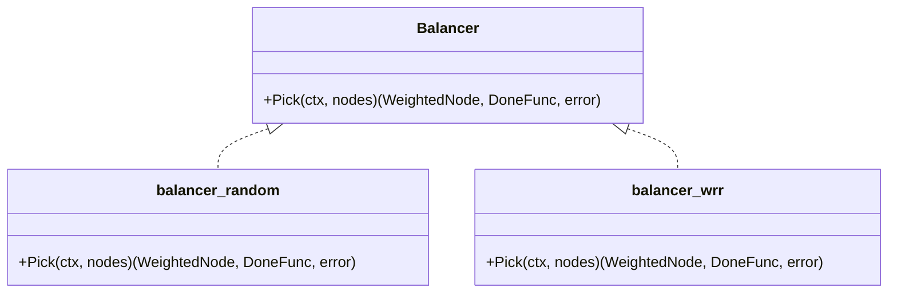
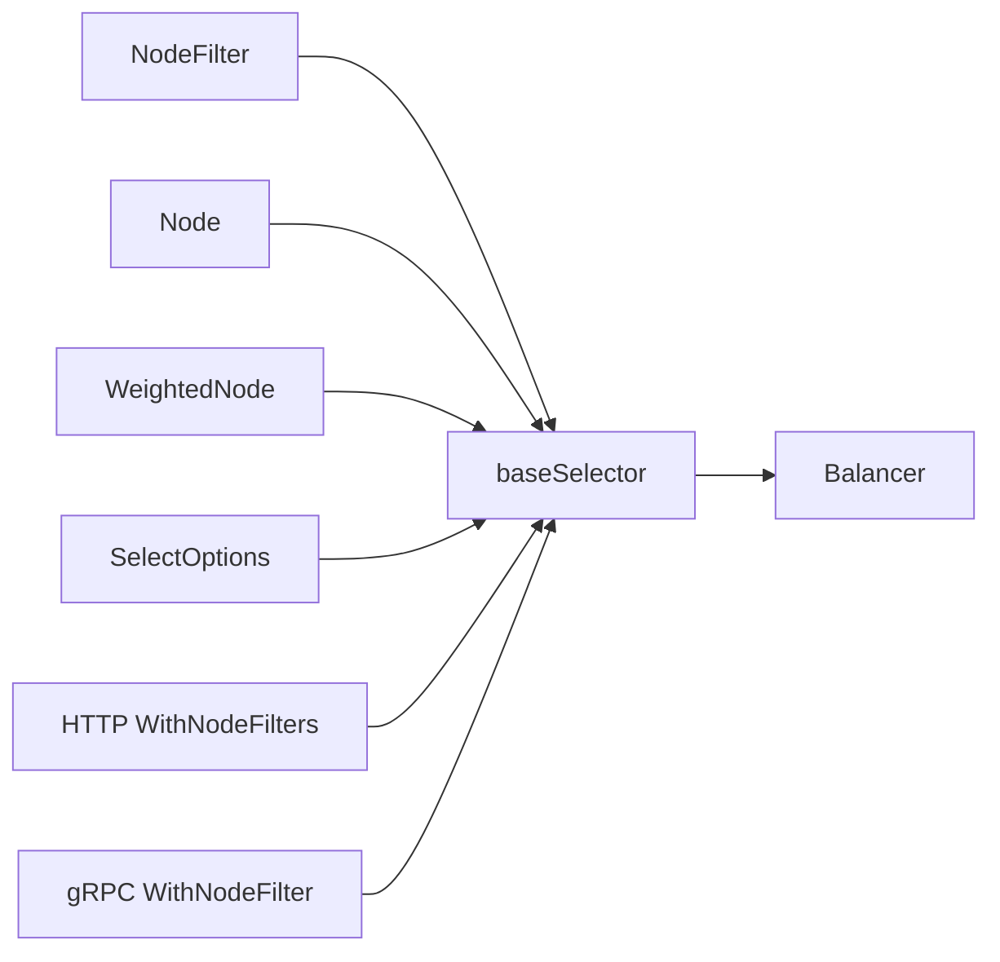

# 过滤器机制

<cite>
**本文引用的文件**
- [filter.go](file://selector/filter.go)
- [selector.go](file://selector/selector.go)
- [node.go](file://selector/node.go)
- [options.go](file://selector/options.go)
- [selector.go](file://selector/base/selector.go)
- [node.go](file://selector/base/node.go)
- [balancer.go](file://selector/balancer.go)
- [random.go](file://selector/balancer/random/random.go)
- [wrr.go](file://selector/balancer/wrr/wrr.go)
- [selector.go](file://middleware/selector/selector.go)
- [clientoptions.go](file://transport/http/clientoptions.go)
- [options.go](file://transport/grpc/options.go)
- [resolver.go](file://transport/grpc/resolver/discovery/resolver.go)
</cite>

## 目录
1. [简介](#简介)
2. [项目结构](#项目结构)
3. [核心组件](#核心组件)
4. [架构总览](#架构总览)
5. [组件详解](#组件详解)
6. [依赖关系分析](#依赖关系分析)
7. [性能考量](#性能考量)
8. [故障排查指南](#故障排查指南)
9. [结论](#结论)
10. [附录：使用示例与最佳实践](#附录使用示例与最佳实践)

## 简介
本文件系统化阐述 Go Fox 的“过滤器机制”，聚焦于服务选择过程中的节点筛选与过滤链处理。内容涵盖：
- 过滤器接口定义与过滤条件判断
- 过滤链的组合与执行顺序
- 在服务发现、负载均衡、节点筛选中的应用
- 实际使用示例路径（以文件路径+行号形式给出）
- 微服务场景下的典型用法（灰度发布、区域亲和、服务分组）与最佳实践

## 项目结构
围绕“过滤器”的关键目录与文件如下：
- selector 包：定义 Node、NodeFilter、Selector、Balancer 等核心类型与接口
- selector/base：提供通用的 baseSelector 与 baseNode 实现
- selector/balancer：内置随机与加权轮询两种负载均衡策略
- middleware/selector：基于传输层上下文的中间件选择器（匹配规则）
- transport/http 与 transport/grpc：客户端选项中注入 NodeFilter 与 Discovery

图表来源
- [filter.go](file://selector/filter.go#L28-L29)
- [node.go](file://selector/node.go#L28-L49)
- [selector.go](file://selector/selector.go#L84-L95)
- [options.go](file://selector/options.go#L26-L39)
- [balancer.go](file://selector/balancer.go#L28-L36)
- [selector.go](file://selector/base/selector.go#L54-L91)
- [node.go](file://selector/base/node.go#L37-L54)
- [random.go](file://selector/balancer/random/random.go#L53-L61)
- [wrr.go](file://selector/balancer/wrr/wrr.go#L33-L59)
- [selector.go](file://middleware/selector/selector.go#L118-L127)
- [clientoptions.go](file://transport/http/clientoptions.go#L172-L177)
- [options.go](file://transport/grpc/options.go#L314-L319)
- [resolver.go](file://transport/grpc/resolver/discovery/resolver.go#L107-L130)

章节来源
- [filter.go](file://selector/filter.go#L28-L29)
- [selector.go](file://selector/selector.go#L84-L95)
- [options.go](file://selector/options.go#L26-L39)
- [selector.go](file://selector/base/selector.go#L54-L91)
- [balancer.go](file://selector/balancer.go#L28-L36)
- [random.go](file://selector/balancer/random/random.go#L53-L61)
- [wrr.go](file://selector/balancer/wrr/wrr.go#L33-L59)
- [clientoptions.go](file://transport/http/clientoptions.go#L172-L177)
- [options.go](file://transport/grpc/options.go#L314-L319)
- [resolver.go](file://transport/grpc/resolver/discovery/resolver.go#L107-L130)

## 核心组件
- NodeFilter：函数签名定义为接收上下文与节点切片，返回筛选后的节点切片。该函数用于在选择前对候选节点进行过滤。
- Node/WeightedNode：描述服务实例的基本信息与权重相关能力；WeightedNode 提供 Pick 能力与运行时权重。
- Selector/Builder：抽象出选择器的构建与选择流程；baseSelector 提供默认实现，负责将 Node 转换为 WeightedNode，并按过滤链与负载均衡策略选取节点。
- Balancer/BalancerBuilder：定义负载均衡策略接口及构建器，如随机与加权轮询。
- SelectOptions/WithNodeFilter：通过可变参数将多个 NodeFilter 组合到一次选择流程中。

章节来源
- [filter.go](file://selector/filter.go#L28-L29)
- [node.go](file://selector/node.go#L28-L49)
- [node.go](file://selector/node.go#L51-L71)
- [selector.go](file://selector/selector.go#L84-L95)
- [balancer.go](file://selector/balancer.go#L28-L36)
- [options.go](file://selector/options.go#L26-L39)

## 架构总览
下图展示从“选择请求”到“节点返回”的完整链路，重点体现过滤链与负载均衡的协作：

图表来源
- [selector.go](file://selector/base/selector.go#L54-L91)
- [balancer.go](file://selector/balancer.go#L28-L36)
- [filter.go](file://selector/filter.go#L28-L29)

## 组件详解

### 过滤器接口与过滤链
- NodeFilter 定义：接收上下文与节点数组，返回过滤后的节点数组。返回空则表示全部剔除。
- 过滤链执行：baseSelector.Select 将传入的多个 NodeFilter 按顺序依次应用，形成“链式过滤”。每一步的输出作为下一步的输入，最终得到候选节点集合。
- 错误处理：若过滤后候选为空，直接返回“无可选节点”的错误。

图表来源
- [selector.go](file://selector/base/selector.go#L54-L91)
- [options.go](file://selector/options.go#L26-L39)
- [selector.go](file://selector/selector.go#L35-L36)

章节来源
- [filter.go](file://selector/filter.go#L28-L29)
- [selector.go](file://selector/base/selector.go#L54-L91)
- [options.go](file://selector/options.go#L26-L39)
- [selector.go](file://selector/selector.go#L35-L36)

### 节点模型与权重
- Node：描述服务实例的 Scheme、Address、ServiceName、InitialWeight、Version、Metadata 等。
- WeightedNode：在 Node 基础上增加运行时权重、Pick 能力与 PickElapsed 记录。
- baseNode：将注册中心的服务实例映射为 Node，支持从元数据解析初始权重。

图表来源
- [node.go](file://selector/node.go#L28-L49)
- [node.go](file://selector/node.go#L51-L71)
- [node.go](file://selector/base/node.go#L37-L54)

章节来源
- [node.go](file://selector/node.go#L28-L49)
- [node.go](file://selector/node.go#L51-L71)
- [node.go](file://selector/base/node.go#L37-L54)

### 负载均衡策略
- Balancer 接口：定义 Pick(ctx, nodes) 返回被选 WeightedNode 与 DoneFunc。
- 随机策略：从候选节点中随机挑选一个。
- 加权轮询策略：维护每个节点的当前权重，按权重累加与回退算法选择节点。

图表来源
- [balancer.go](file://selector/balancer.go#L28-L36)
- [random.go](file://selector/balancer/random/random.go#L53-L61)
- [wrr.go](file://selector/balancer/wrr/wrr.go#L33-L59)

章节来源
- [balancer.go](file://selector/balancer.go#L28-L36)
- [random.go](file://selector/balancer/random/random.go#L53-L61)
- [wrr.go](file://selector/balancer/wrr/wrr.go#L33-L59)

### 中间件选择器（按操作名匹配）
middleware/selector 提供基于传输层上下文的操作名匹配能力，可用于在特定路由或操作上启用选择器中间件。虽然与“节点过滤”不是同一层面，但可与 NodeFilter 协同工作，实现“按操作名触发不同过滤策略”。

章节来源
- [selector.go](file://middleware/selector/selector.go#L118-L127)

### 传输层集成与过滤注入
- HTTP 客户端：WithNodeFilters(...) 将 NodeFilter 注入 HTTP 客户端配置，随后在选择节点时生效。
- gRPC 客户端：WithNodeFilter(...) 将 NodeFilter 注入 gRPC 客户端配置，同样参与选择流程。
- 服务发现：在 gRPC 解析器中，会先根据元数据与端点过滤后再生成地址列表，这与 NodeFilter 的思想一致（均属于“节点筛选”）。

章节来源
- [clientoptions.go](file://transport/http/clientoptions.go#L172-L177)
- [options.go](file://transport/grpc/options.go#L314-L319)
- [resolver.go](file://transport/grpc/resolver/discovery/resolver.go#L107-L130)

## 依赖关系分析
- baseSelector 对 NodeFilter 的依赖：通过 SelectOptions.NodeFilters 传入，按序执行。
- baseSelector 对 Balancer 的依赖：在过滤完成后调用 Pick 选择节点。
- NodeFilter 与 Node/WeightedNode 的依赖：过滤函数操作的是 Node 切片，返回的也是 Node 切片（内部转换为 WeightedNode 参与负载均衡）。
- 传输层客户端选项与过滤器的耦合：HTTP/gRPC 客户端选项提供注入过滤器的入口，使过滤逻辑贯穿到调用链。

图表来源
- [selector.go](file://selector/base/selector.go#L54-L91)
- [options.go](file://selector/options.go#L26-L39)
- [clientoptions.go](file://transport/http/clientoptions.go#L172-L177)
- [options.go](file://transport/grpc/options.go#L314-L319)

章节来源
- [selector.go](file://selector/base/selector.go#L54-L91)
- [options.go](file://selector/options.go#L26-L39)
- [clientoptions.go](file://transport/http/clientoptions.go#L172-L177)
- [options.go](file://transport/grpc/options.go#L314-L319)

## 性能考量
- 过滤链长度与复杂度：过滤器数量越多、每次过滤的计算越复杂，整体选择耗时越高。建议：
  - 合理拆分过滤器职责，避免单个过滤器承担过多逻辑
  - 使用缓存或预计算（如元数据键值缓存）减少重复解析
- 负载均衡开销：随机策略常数级开销；加权轮询涉及状态更新与锁竞争，建议在高并发场景评估锁粒度与状态规模
- 传输层过滤时机：在服务发现阶段尽早过滤可减少后续负载均衡压力

## 故障排查指南
- 无可用节点：当过滤链将所有节点剔除时，选择器返回“无可选节点”的错误。排查要点：
  - 检查过滤器条件是否过于严格
  - 核对元数据键值是否存在且格式正确
- 权重未生效：确认 Node 的元数据中权重键存在且可解析为整数，以及 WeightedNodeBuilder 是否正确读取
- 过滤器顺序问题：多个过滤器的先后顺序会影响结果，建议明确各过滤器的边界与依赖关系
- 传输层未注入过滤器：检查 HTTP/gRPC 客户端选项是否正确设置过滤器

章节来源
- [selector.go](file://selector/selector.go#L35-L36)
- [node.go](file://selector/base/node.go#L37-L54)
- [clientoptions.go](file://transport/http/clientoptions.go#L172-L177)
- [options.go](file://transport/grpc/options.go#L314-L319)

## 结论
Go Fox 的过滤器机制通过 NodeFilter 将“节点筛选”与“负载均衡”解耦，形成可组合、可扩展的选择链路。结合传输层的过滤注入与服务发现阶段的早期过滤，可在微服务架构中灵活实现灰度发布、区域亲和、服务分组等场景需求。建议在实践中遵循“单一职责、顺序清晰、性能可控”的原则，确保过滤链既易维护又高效稳定。

## 附录：使用示例与最佳实践

### 自定义过滤器实现（步骤说明）
- 定义过滤器函数：接收上下文与节点切片，返回筛选后的节点切片
- 将过滤器注入选择流程：
  - HTTP 客户端：通过 WithNodeFilters(...) 注入
  - gRPC 客户端：通过 WithNodeFilter(...) 注入
- 在服务发现阶段也可配合使用（例如在解析器中先按元数据过滤）

章节来源
- [filter.go](file://selector/filter.go#L28-L29)
- [clientoptions.go](file://transport/http/clientoptions.go#L172-L177)
- [options.go](file://transport/grpc/options.go#L314-L319)
- [resolver.go](file://transport/grpc/resolver/discovery/resolver.go#L107-L130)

### 过滤条件配置（示例路径）
- 元数据键值过滤：利用 Node.Metadata() 读取键值，按版本、区域、命名空间等字段筛选
- 版本过滤：通过 Node.Version() 或 Metadata["version"] 判断
- 权重过滤：结合 InitialWeight() 与 WeightedNode.Weight() 进行阈值控制

章节来源
- [node.go](file://selector/node.go#L46-L48)
- [node.go](file://selector/base/node.go#L37-L54)

### 过滤链组合与优先级
- 多个过滤器以传入顺序依次执行，建议将“粗筛”前置（如按区域/版本），将“细筛”靠后（如健康状态）
- 若需动态切换策略，可通过中间件选择器按操作名匹配启用不同的过滤器组合

章节来源
- [selector.go](file://selector/base/selector.go#L63-L70)
- [selector.go](file://middleware/selector/selector.go#L118-L127)

### 微服务应用场景
- 灰度发布：按版本或元数据键值筛选目标节点
- 区域亲和：按区域元数据筛选本地或近邻节点
- 服务分组：按标签或协议元数据进行隔离

章节来源
- [node.go](file://selector/node.go#L46-L48)
- [resolver.go](file://transport/grpc/resolver/discovery/resolver.go#L107-L130)

### 性能优化建议
- 减少过滤器数量与单次过滤成本
- 对频繁访问的元数据键进行缓存
- 在服务发现阶段尽早过滤，降低后续负载均衡压力