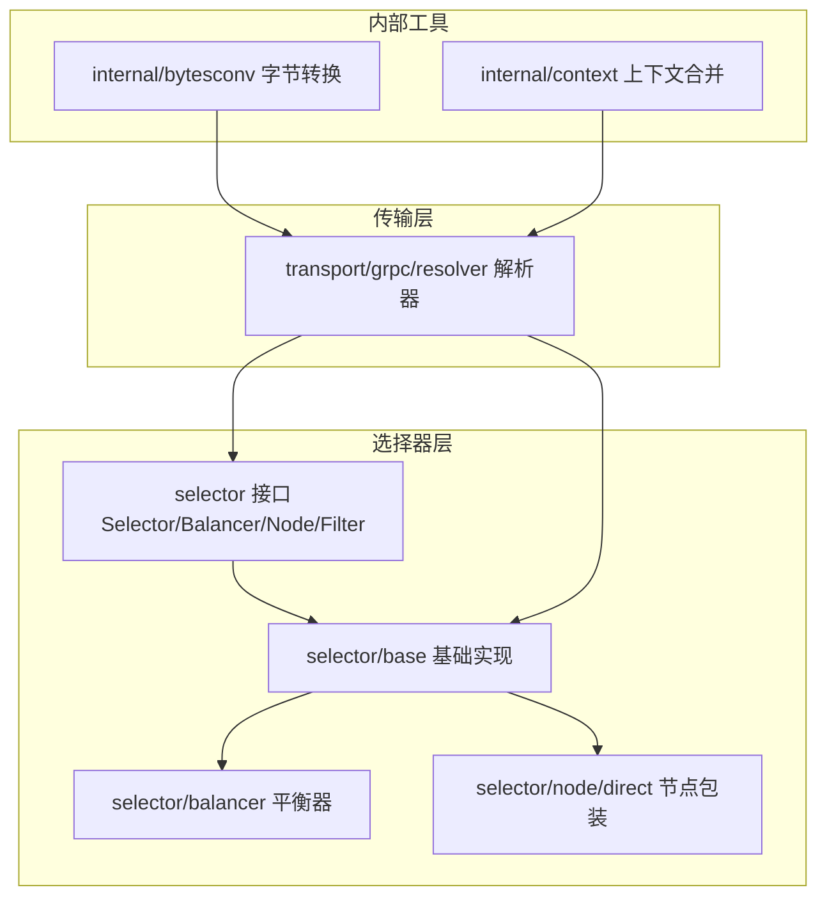
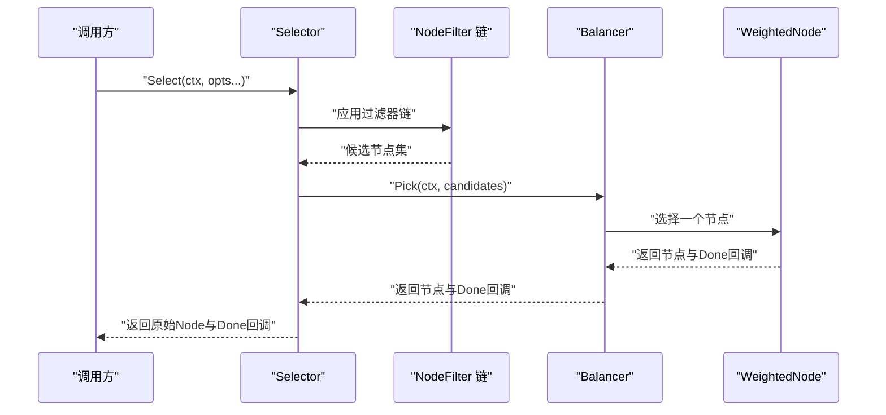
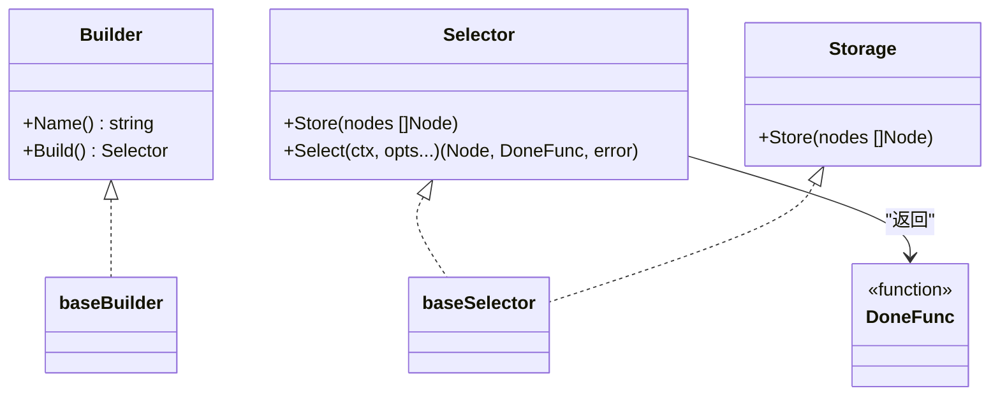
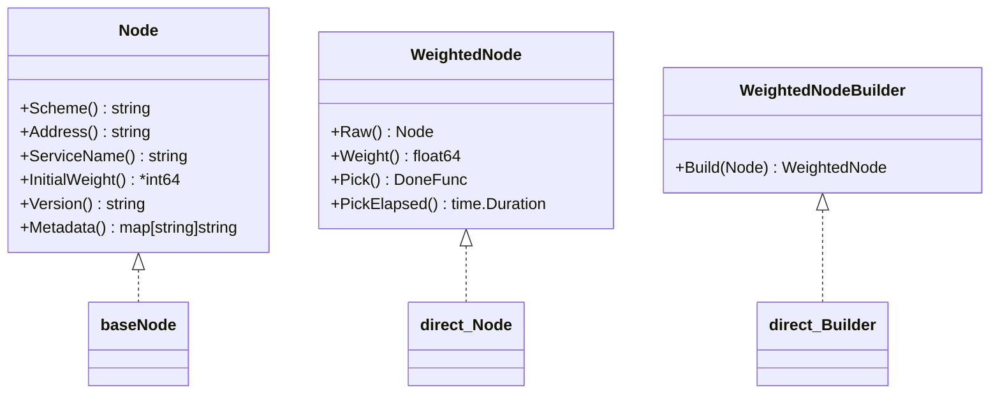
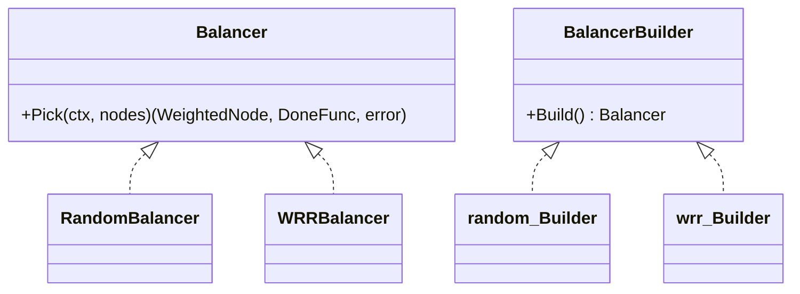
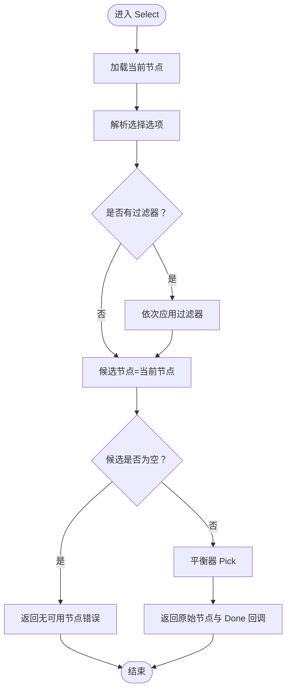
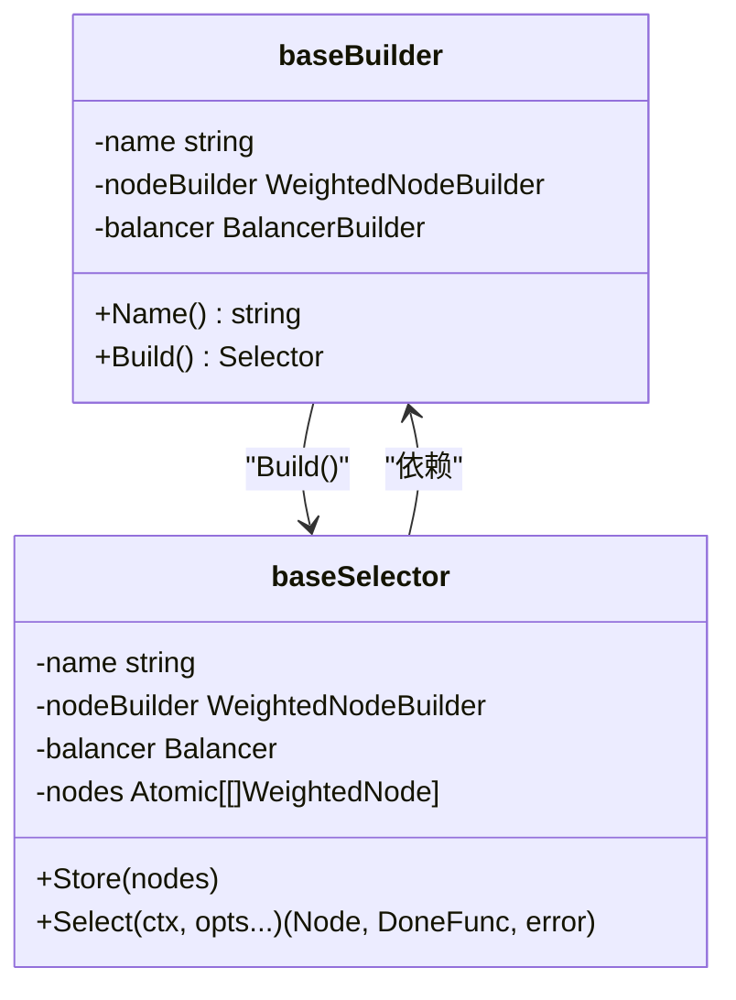
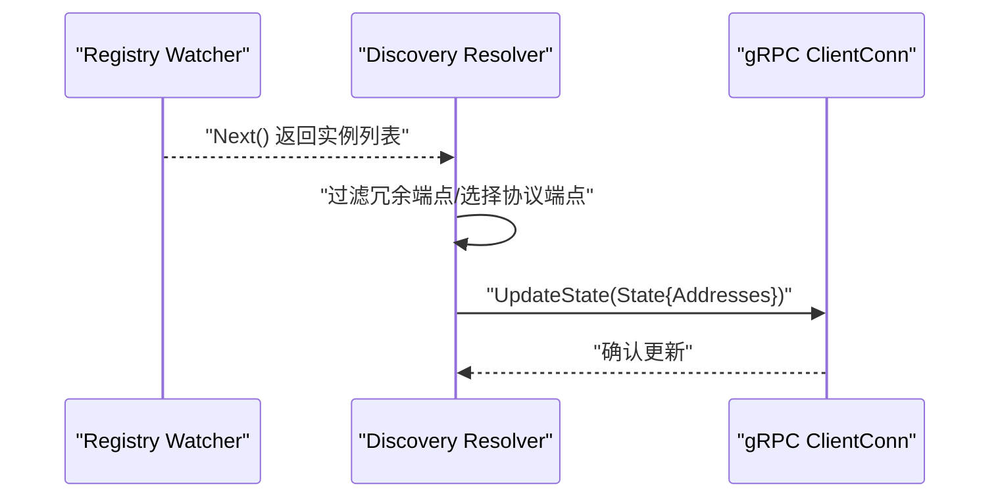
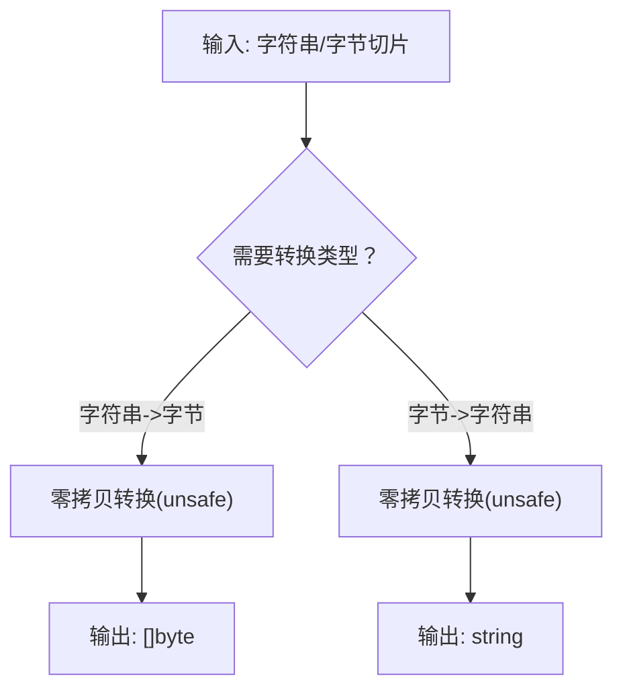
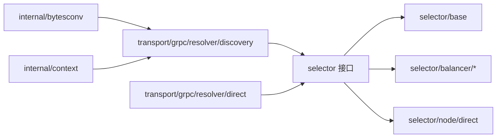

# 高级特性

<cite>
**本文引用的文件**
- [selector.go](file://selector/selector.go)
- [options.go](file://selector/options.go)
- [node.go](file://selector/node.go)
- [filter.go](file://selector/filter.go)
- [balancer.go](file://selector/balancer.go)
- [base/selector.go](file://selector/base/selector.go)
- [base/node.go](file://selector/base/node.go)
- [base/base.go](file://selector/base/base.go)
- [balancer/random/random.go](file://selector/balancer/random/random.go)
- [balancer/wrr/wrr.go](file://selector/balancer/wrr/wrr.go)
- [node/direct/direct.go](file://selector/node/direct/direct.go)
- [resolver.go](file://transport/grpc/resolver/discovery/resolver.go)
- [direct.go](file://transport/grpc/resolver/direct/direct.go)
- [bytesconv.go](file://internal/bytesconv/bytesconv.go)
- [context.go](file://internal/context/context.go)
</cite>

## 目录
1. [简介](#简介)
2. [项目结构](#项目结构)
3. [核心组件](#核心组件)
4. [架构总览](#架构总览)
5. [详细组件分析](#详细组件分析)
6. [依赖分析](#依赖分析)
7. [性能考虑](#性能考虑)
8. [故障排查指南](#故障排查指南)
9. [结论](#结论)
10. [附录](#附录)

## 简介
本篇“高级特性”文档聚焦于 Go Fox 的服务选择与负载均衡子系统，系统性阐述以下主题：
- 服务选择器的复杂机制：选择器算法、节点过滤、权重计算与运行时调度
- 节点管理：节点状态维护、健康检查与故障转移的集成方式
- 平衡器策略：随机选择、加权轮询（WRR）等算法实现与适用场景
- 过滤器机制：服务发现过滤、负载均衡过滤的组合使用
- 基础组件设计：基础选择器、节点抽象、选择器选项
- 内部工具类：字节转换、上下文合并、信号处理与字符串处理的使用要点
- 高级使用场景与性能优化建议

## 项目结构
围绕“选择器/负载均衡/节点管理”的核心目录如下：
- selector：对外接口与通用抽象（选择器、节点、过滤器、平衡器）
- selector/base：基础实现（基础选择器、基础节点、构建器工厂）
- selector/balancer：平衡器实现（random、wrr）
- selector/node/direct：节点包装与权重计算
- transport/grpc/resolver：gRPC 解析器（服务发现与地址更新）
- internal：内部工具（bytesconv、context）

**图示来源**
- [selector.go](file://selector/selector.go#L84-L96)
- [base/selector.go](file://selector/base/selector.go#L39-L111)
- [balancer/random/random.go](file://selector/balancer/random/random.go#L35-L68)
- [balancer/wrr/wrr.go](file://selector/balancer/wrr/wrr.go#L12-L69)
- [node/direct/direct.go](file://selector/node/direct/direct.go#L34-L82)
- [resolver.go](file://transport/grpc/resolver/discovery/resolver.go#L43-L139)
- [bytesconv.go](file://internal/bytesconv/bytesconv.go#L11-L24)
- [context.go](file://internal/context/context.go#L45-L139)

**章节来源**
- [selector.go](file://selector/selector.go#L26-L96)
- [base/selector.go](file://selector/base/selector.go#L26-L111)
- [balancer/random/random.go](file://selector/balancer/random/random.go#L26-L68)
- [balancer/wrr/wrr.go](file://selector/balancer/wrr/wrr.go#L3-L69)
- [node/direct/direct.go](file://selector/node/direct/direct.go#L26-L82)
- [resolver.go](file://transport/grpc/resolver/discovery/resolver.go#L26-L139)
- [bytesconv.go](file://internal/bytesconv/bytesconv.go#L7-L24)
- [context.go](file://internal/context/context.go#L26-L139)

## 核心组件
- 选择器接口与注册：通过注册表集中管理选择器构建器，支持按名称检索与全量列举
- 节点抽象：统一的服务实例抽象，支持初始权重、版本、元数据等
- 权重节点：在初始权重基础上提供运行时权重与选中回调（Pick/Done）
- 平衡器：面向 WeightedNode 的 Pick 策略接口，封装具体算法
- 选择选项：支持节点过滤器链，便于在选择前进行多维过滤
- 过滤器：函数式过滤器，接收候选节点集合并返回过滤后的结果

**章节来源**
- [selector.go](file://selector/selector.go#L35-L96)
- [node.go](file://selector/node.go#L28-L72)
- [balancer.go](file://selector/balancer.go#L28-L37)
- [options.go](file://selector/options.go#L26-L40)
- [filter.go](file://selector/filter.go#L28-L30)

## 架构总览
选择器的整体调用链从“选择器.Select”开始，经过可选的节点过滤，再交由平衡器执行 Pick，最终返回原始节点与完成回调。

**图示来源**
- [base/selector.go](file://selector/base/selector.go#L54-L91)
- [balancer.go](file://selector/balancer.go#L28-L37)
- [filter.go](file://selector/filter.go#L28-L30)

## 详细组件分析

### 选择器与注册机制
- 注册表：以名称为键存储选择器构建器，大小写不敏感
- 获取与列举：按名称检索或返回全部构建器
- 选择器接口：包含存储（节点列表更新）与选择（带过滤与平衡器）能力
- 选择器构建器：负责产出具体 Selector 实例

**图示来源**
- [selector.go](file://selector/selector.go#L61-L96)
- [base/selector.go](file://selector/base/selector.go#L93-L111)

**章节来源**
- [selector.go](file://selector/selector.go#L35-L96)
- [base/selector.go](file://selector/base/selector.go#L39-L111)

### 节点与权重节点
- Node：抽象服务实例，提供 Scheme、Address、ServiceName、InitialWeight、Version、Metadata 等
- WeightedNode：在 Node 基础上增加 Weight、Pick、PickElapsed 等运行时能力
- WeightedNodeBuilder：将普通 Node 包装为 WeightedNode，默认权重来源于初始权重，否则采用默认值

**图示来源**
- [node.go](file://selector/node.go#L28-L72)
- [node/direct/direct.go](file://selector/node/direct/direct.go#L43-L82)
- [base/node.go](file://selector/base/node.go#L37-L88)

**章节来源**
- [node.go](file://selector/node.go#L28-L72)
- [node/direct/direct.go](file://selector/node/direct/direct.go#L34-L82)
- [base/node.go](file://selector/base/node.go#L37-L88)

### 平衡器策略
- 接口：Pick(ctx, nodes) 返回选中的 WeightedNode 与 DoneFunc
- 随机策略：对候选节点集合做等概率随机选择
- 加权轮询（WRR）：基于有效权重的 Nginx 风格算法，维护每个节点的当前权重并在每次选择后调整

**图示来源**
- [balancer.go](file://selector/balancer.go#L28-L37)
- [balancer/random/random.go](file://selector/balancer/random/random.go#L51-L68)
- [balancer/wrr/wrr.go](file://selector/balancer/wrr/wrr.go#L28-L69)

**章节来源**
- [balancer.go](file://selector/balancer.go#L28-L37)
- [balancer/random/random.go](file://selector/balancer/random/random.go#L35-L68)
- [balancer/wrr/wrr.go](file://selector/balancer/wrr/wrr.go#L12-L69)

### 选择流程与过滤器链
- 选择流程：加载当前节点 -> 应用过滤器链 -> 若为空则返回“无可用节点”错误 -> 交由平衡器 Pick -> 返回原始节点与 Done 回调
- 过滤器链：按序应用多个 NodeFilter，每个过滤器接收候选节点集合并返回过滤后的结果

**图示来源**
- [base/selector.go](file://selector/base/selector.go#L54-L91)
- [options.go](file://selector/options.go#L26-L40)
- [filter.go](file://selector/filter.go#L28-L30)

**章节来源**
- [base/selector.go](file://selector/base/selector.go#L54-L91)
- [options.go](file://selector/options.go#L26-L40)
- [filter.go](file://selector/filter.go#L28-L30)

### 基础选择器与构建器工厂
- 基础选择器：持有名称、节点构建器、平衡器与原子存储的节点列表；Select 时先过滤再平衡
- 构建器工厂：通过 NewSelectorBuilder 组合名称、节点构建器与平衡器构建 Selector

**图示来源**
- [base/base.go](file://selector/base/base.go#L28-L40)
- [base/selector.go](file://selector/base/selector.go#L39-L111)

**章节来源**
- [base/base.go](file://selector/base/base.go#L28-L40)
- [base/selector.go](file://selector/base/selector.go#L39-L111)

### gRPC 解析器与服务发现
- 发现解析器：监听服务实例变更，过滤冗余端点，构造 resolver.Address 并更新连接状态
- 直连解析器：空实现，用于直连场景
- 与选择器的衔接：解析器将服务实例转换为地址列表，选择器在此基础上进行过滤与负载均衡

**图示来源**
- [resolver.go](file://transport/grpc/resolver/discovery/resolver.go#L66-L130)
- [direct.go](file://transport/grpc/resolver/direct/direct.go#L28-L39)

**章节来源**
- [resolver.go](file://transport/grpc/resolver/discovery/resolver.go#L43-L139)
- [direct.go](file://transport/grpc/resolver/direct/direct.go#L28-L39)

### 内部工具类使用指南
- 字节转换：提供字符串与字节切片的零拷贝互转，适用于高性能编码/解码场景
- 上下文合并：将两个上下文合并为一个，按最早完成者触发 Done，并保留 Deadline 与 Value 查询

**图示来源**
- [bytesconv.go](file://internal/bytesconv/bytesconv.go#L11-L24)

**章节来源**
- [bytesconv.go](file://internal/bytesconv/bytesconv.go#L11-L24)
- [context.go](file://internal/context/context.go#L45-L139)

## 依赖分析
- 选择器层依赖：selector 接口被 base 与 balancer 实现；balancer 依赖 WeightedNode；direct 节点包装依赖 Node
- 传输层依赖：gRPC 解析器依赖 registry Watcher 与 resolver.ClientConn；与选择器通过地址列表衔接
- 工具类依赖：bytesconv 与 context 在传输层广泛使用

**图示来源**
- [selector.go](file://selector/selector.go#L26-L96)
- [base/selector.go](file://selector/base/selector.go#L26-L111)
- [balancer/random/random.go](file://selector/balancer/random/random.go#L26-L68)
- [balancer/wrr/wrr.go](file://selector/balancer/wrr/wrr.go#L3-L69)
- [node/direct/direct.go](file://selector/node/direct/direct.go#L26-L82)
- [resolver.go](file://transport/grpc/resolver/discovery/resolver.go#L26-L139)
- [direct.go](file://transport/grpc/resolver/direct/direct.go#L26-L39)
- [bytesconv.go](file://internal/bytesconv/bytesconv.go#L7-L24)
- [context.go](file://internal/context/context.go#L26-L139)

**章节来源**
- [selector.go](file://selector/selector.go#L26-L96)
- [resolver.go](file://transport/grpc/resolver/discovery/resolver.go#L26-L139)

## 性能考虑
- 选择器选择路径
  - 过滤器链：尽量在上游减少候选节点数量，避免在平衡器阶段做昂贵过滤
  - 平衡器：随机策略常数开销低；WRR 需维护 per-node 当前权重，锁粒度较小但有同步成本
- 节点权重
  - 默认权重与初始权重：合理设置初始权重可提升 WRR 的公平性；避免过小导致频繁切换
  - PickElapsed：可用于自定义策略（如冷启动期限），但需谨慎避免额外锁竞争
- gRPC 解析器
  - 过滤冗余端点与协议端点，减少地址列表规模，降低连接与选择压力
- 字节转换与上下文
  - 零拷贝转换适合高频编解码；上下文合并避免重复创建 goroutine，降低 GC 压力

[本节为通用性能建议，不直接分析特定文件]

## 故障排查指南
- 无可用节点
  - 现象：选择器返回“无可用节点”错误
  - 可能原因：过滤器链过于严格导致候选为空；服务实例未正确下发到解析器
  - 处理建议：检查过滤器逻辑与服务发现配置，确认解析器已更新地址列表
- 平衡器异常
  - 现象：Pick 返回错误或节点为空
  - 可能原因：候选节点为空；平衡器实现异常
  - 处理建议：在 Select 前打印候选数量与过滤器链日志；验证节点权重与平衡器初始化
- gRPC 地址更新失败
  - 现象：客户端无法连接或连接不稳定
  - 可能原因：解析器未收到实例变更；端点协议不匹配；冗余端点过多被过滤
  - 处理建议：开启调试日志查看解析器输出；核对端点协议与安全模式；减少冗余端点

**章节来源**
- [selector.go](file://selector/selector.go#L35-L36)
- [base/selector.go](file://selector/base/selector.go#L79-L85)
- [resolver.go](file://transport/grpc/resolver/discovery/resolver.go#L86-L130)

## 结论
Go Fox 的选择器体系以清晰的接口分层与可插拔的实现为核心，结合服务发现与 gRPC 解析器，形成从“实例发现—节点包装—过滤—平衡—调用”的完整链路。通过基础选择器与构建器工厂，用户可以快速组合不同策略；通过过滤器链与权重节点，满足复杂业务场景下的精细化调度需求。配合内部工具类，可在保证性能的同时提升可维护性。

[本节为总结性内容，不直接分析特定文件]

## 附录
- 高级使用场景示例（思路）
  - 多维过滤：结合服务发现过滤（按区域/版本）与负载均衡过滤（按健康状态/延迟阈值）形成双重保障
  - 动态权重：在 WeightedNode 中引入运行时指标（如 CPU/连接数）作为权重来源，替代静态权重
  - 自定义平衡器：基于 PickElapsed 实现“冷启动保护”，避免新节点在初期被过度调度
- 性能优化建议（实践要点）
  - 减少过滤器链长度与复杂度，优先在上游裁剪
  - 使用 WRR 时保持节点数量适中，避免锁竞争放大
  - 对高频路径启用零拷贝转换与上下文合并，降低内存分配与 GC 压力

[本节为概念性内容，不直接分析特定文件]